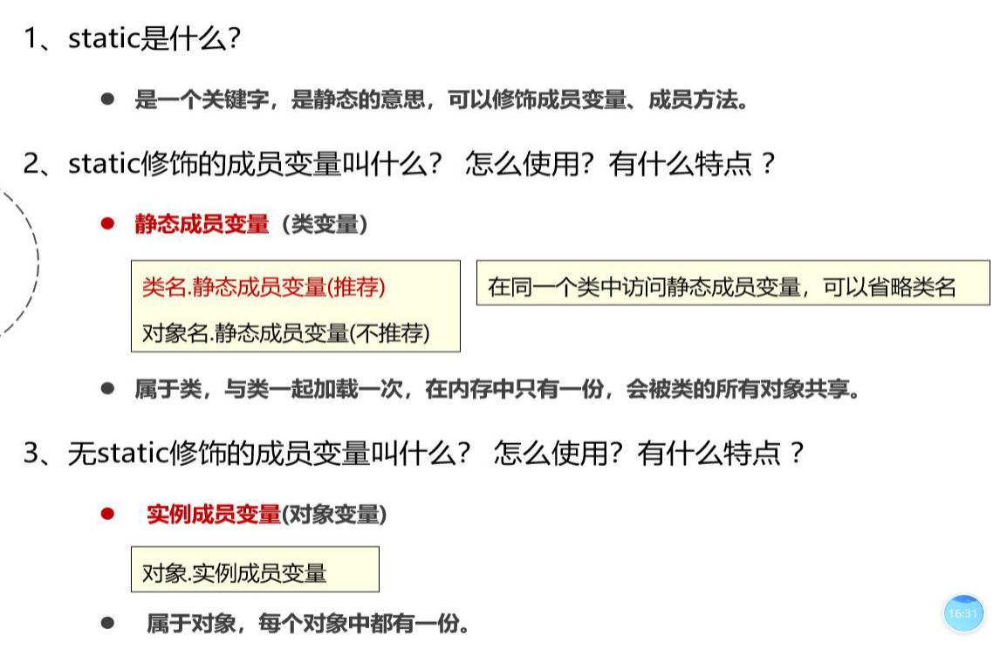
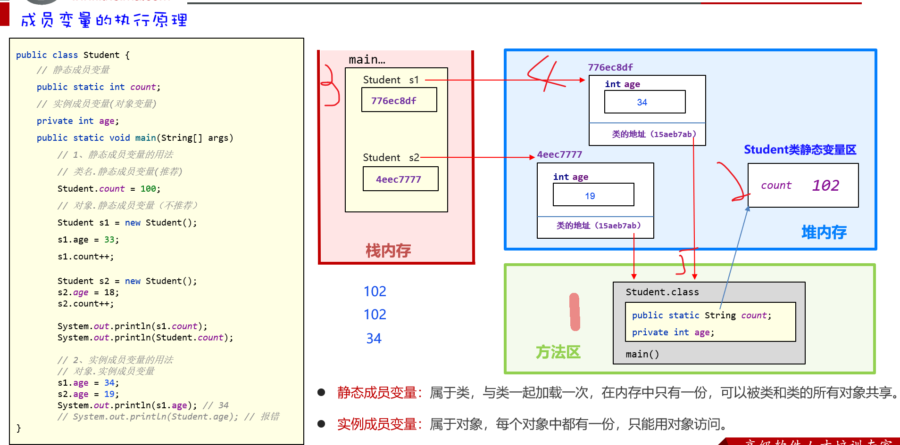
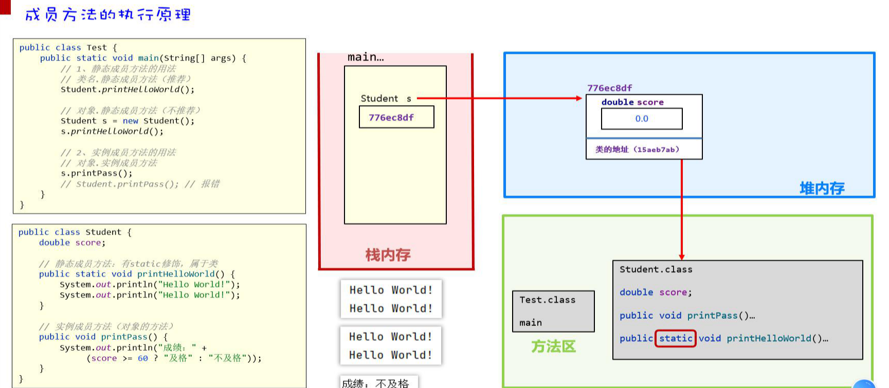
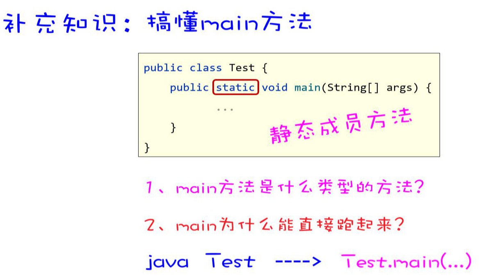
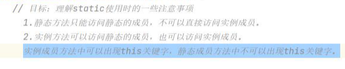
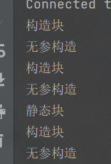
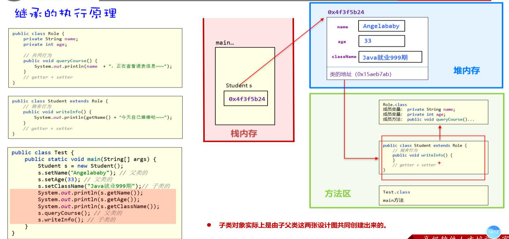
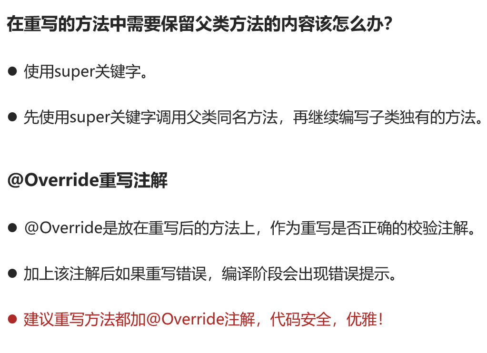
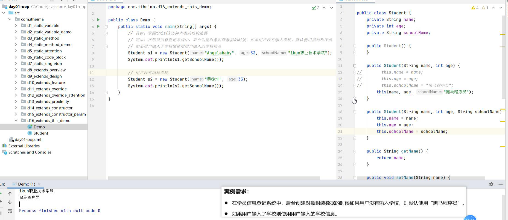

[TOC]


# 面向对象

### 一、static关键字

##### 1、static修饰成员变量

static修饰的成员变量，叫静态成员变量，又叫做类变量

实例成员变量（对象变量）



##### 2、static修饰成员变量内存中执行原理



方法区开辟一块空间加载student字节码文件，student中的类静态变量加载，并在堆内存开辟一块静态变量区域，默认初始值为0；main方法进入栈内存，加载实例变量，，堆内存开辟一块空间存放类的信息产生一个地址值返回给实例化，除方法外（存的是地址）；，堆内存加载实例变量，去方法区寻找，指向方法区地址，并赋值。

#### 3、成员方法的执行原理



方法区加载test字节码文件，main返回发进去占内存，调用Student.方法，方法区加载Student字节码文件，执行静态方法，printHelloworld();栈中加载student 变量 将实例化赋给他，同时在堆内存开辟一块空间，加载对象属性初始化，并返回给栈中地址，同时堆内存中方法地址指向方法区prinntHelloWorld调用方法，输出结果值；printpass方法同理。



mian方法String[] args;接收参数 java 文件名字 紧跟 参数


#### 4、工具类

里边的方法都是静态方法，（不建议实例化方法）==需要私有化，防止外界实例化==

#### 5、静态关键字注意事项



#### 6、代码块

（1）静态代码块：类加载而加载，自动触发只执行一次

```java
static{}
```

（2）实例代码块（构造代码块）：每次创建对象，调用构造器时候调用，构造器之前执行。

作用：初始化构造资源；

```
{}
```

**==注意：==**

# java静态代码块，构造方法，构造代码块的执行先后顺序

#### 1、执行顺序

==**静态代码块>构造代码块>构造方法**==

原因：

静态代码块（static{}）在类加载的时候执行一次，是最早被执行的。
构造代码块（{}内的部分）在每一次创建对象时执行，始终在构造方法前执行。
构造方法在新建对象时调用（ 就是new的时候 ）。
注意：

静态代码块在类加载的时候就执行，所以它的优先级高于入口main()方法。
当三种形式不止一次出现，同优先级是按照先后顺序执行。
程序代码示例：

```java
package com.shizian.test;

/**
 * @author 施子安
 * @version 1.0
 * @date 2023/2/20 16:29
 * @Description 静态代码块，构造代码块执行先后顺序
 */
public class StaticTest {
    public static StaticTest t1 = new StaticTest();
    public static StaticTest t2 = new StaticTest();
    {
        System.out.println("构造块");
    }

    public StaticTest(){
        System.out.println("无参构造");
    }
    static {
        System.out.println("静态块");
    }

    public static void main(String[] args) {
        StaticTest t = new StaticTest();
    }
}

```


执行main方法打印结果：


为什么会出现这种打印结果？

拓展知识点：==静态域==

静态域：分为静态变量，静态方法，静态块。当执行到静态域时，==按照静态域的顺序加载==。并且静态域只在类的第一次加载时执行。

注意：==加载了静态域的一部分，这时候不能再加载另一个静态域了==，静态域必须当成一个整体来看待，否则加载会错乱。比如上面的代码，有静态变量和静态代码块儿，当加载了静态变量后，就不能加载静态代码块儿了。

根据代码执行顺序：

（1）执行程序入口main方法时，首先加载类StaticTest
注意：加载类时并不会调用构造块和构造方法，只有静态域会执行
（2）加载类StaticTest，执行静态域的第一个静态变量，StaticTest t1 = new StaticTest();，输出构造块和构造方法（空）。打印出构造块。
（3）由于每次new对象时，会执行一次构造块和构造方法，构造块总是在构造方法前执行，（当然，第一次new时，会先执行静态域，静态域〉构造块〉构造方法）所以执行StaticTest t1 = new StaticTest();时，执行了下面代码：

```java
{
    System.out.println("构造块");
}
```

（4）同理，StaticTest t1 = new StaticTest();加载完后，以此执行第二个静态变量StaticTest t2 = new StaticTest();，执行构造块代码块。
（5）执行static静态块，完成对整个静态域的加载
（6）最后，再执行main方法，new StaticTest();，执行构造块。

附加：代码中添加了构造方法


执行main方法的打印结果：



**总结：**
`1、每调用一次构造方法，则执行一次构造块`
`2、静态块只在类加载的时候加载一次`
`3、有多个静态变量或块时，按声明顺序加载`

#### 2、java中父类和子类代码执行顺序

父类和子类代码执行顺序：

==父类静态代码块 =》 子类静态代码块 =》 父类代码块 =》 父类构造方法 =》 子类代码块 =》 子类构造方法==

 * ```java
 程序代码如下：
     1、创建Father和Son类，让Son继承Father
     2、编写Father和Son的代码
    
    /**
    父类（抽象类）
    */
    public abstract class Father {
    
    static {
           System.out.println("父类静态代码执行了");
       }
    
    {
           System.out.println("父类非静态代码执行了");
       }
    
    public Father() {
        System.out.println("父类构造函数代码执行了");
    }
    
    public static void main(String[] args) {
        Son son = new Son();
    }
    }
    ```
    
    
    
 ```java

 
 * ```java
 /**子类（具体类）
 */
 public class Son extends Father {
    
    static {
        System.out.println("子类静态代码执行了");
 }
    
    {
        System.out.println("子类非静态代码执行了");
 }
    
    public Son() {
        System.out.println("子类构造函数代码执行了");
 }
 }
 ```

 打印结果：

注意：由于代码的执行顺序不同，经常通过执行顺序进行后端初始化。
————————————————
版权声明：本文为CSDN博主「CUIYD_1989」的原创文章，遵循CC 4.0 BY-SA版权协议，转载请附上原文出处链接及本声明。
原文链接：https://blog.csdn.net/m0_58680865/article/details/124956871

# 设计模式

分三种模式：创建型模式、结构型模式、行为型模式
    ●创建型：主要就是创建对象的时候隐藏创建的逻辑，不采用new来实例化，主要有5种模式（单例模式、原型模式、工厂方法模式、抽象工厂模式、建造者模式）
    ●结构型：通过类和接口间的继承引用来实现复杂的对象创建结构模式。共7种常用（适配器模式、过滤器模式、组合模式、代理模式等）
    ●行为型：通过对象之间不同的通信方式实现不同行为，共有11种（模板方法模式、策略模式、迭代器模式等）
其中spring中创建对象bean默认采用单例模式，beanfactory创建对象采用工厂模式，aop面向切面编程采用代理模式，底层是动态代理，springmvc中处理适配器采用适配器模式找到多用适配器，Mybatis中的Jdbc Template使用了模板方法模式等等

### ==单例模式==

一个类只能创建一个对象，懒汉式 饿汉式 线程安全的懒汉式单例判断当前对象是否为空为空创建
    ●饿汉式单例，类加载的时候就实例化，构造方法私有化，对外只提供一个实例化
    ●懒汉式单例，调用时候实例化，构造方法私有化
    ●线程安全懒汉式单例，加一个synchronized，构造方法私有化，对外只提供一个实例

```java
package com.shizian.test;

/**
 * @author 施子安
 * @version 1.0
 * @date 2023/2/20 17:17
 * @Description 单例模式
 */
public class SingleInstance {
    //构造方法私有化
    private  SingleInstance(){System.out.println("这里是无参构造");}
    //定义一个静态变量存储对象，完成实例化
    private static SingleInstance s = new SingleInstance();

    //对外提供一个静态方法，返回实例
    public static SingleInstance getInstance(){
        return s;
    }
}

```

```java
/**
懒汉式单例，调用对象的时候才加载实例，构造方法私有化，对外只提供一个创建对象的方法
*/
public class SingleIntance{
    //静态变量定义
    private static SingleIntance s;
    //构造方法私有化
    private SingleIntance(){
        System.out.println("这里是无参构造");
    }
    
    //对外提供实例化，判断当前变量是否初始化，
    public static getIntance(){
        if(s == null){
        s = new SingleIntance();
        return s;
    	}
        return s;
    }
}
```

```java
/**
测试类
*/
public class Test{
    SingleIntance.getIntance();
    
}
```

# 继承

#### 1、执行原理



#### 2、继承特点

java单继承，java可以多层继承，都是object的子类（直接或者间接继承）

==**重写方法：声明不变，重新实现**==

==子类不能重写父类的静态方法==



重点：==**父类只有有参构造，子类构造器如何调用？==**

子类调用父类有参构造器采用super（参数）；

或者父类声明一个无参构造

==子类构造器首先加载父类无参构造器（必须）==

this（）调用本类中的构造器

