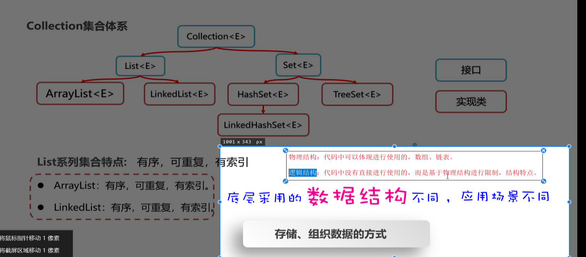
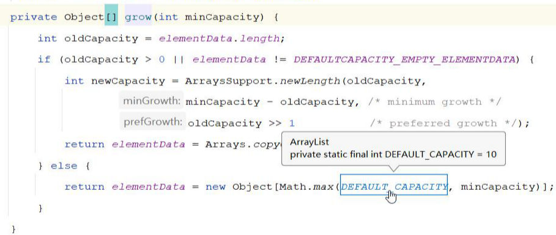

[TOC]


# List（接口）

接口多继承，

## 1、特点：

list的子类均有一下特点：有序（存取顺序）、可重复、有索引

ArrayList、LinkedList均是

## 2、特有方法


- add（）中index，长度最大为当前集合长度
- remove（）中的index只能是当前集合size - 1；
- set返回的是修改之前的元素
- 

### 面试题，ArrayList的remove方法删除的是索引1，还是元素？


### 为什么Collection和List中的remove返回值不一样？

没有失败；（返回值量两种情况：==第一种成功，第二种越界==）

**小快乐**


## 3、遍历

for循环

迭代器（两种collection、list独有）

增强for

lambda表达式（实现接口）


```java
package com.shizian.list;

import java.util.ArrayList;
import java.util.Iterator;
import java.util.List;
import java.util.ListIterator;
import java.util.function.Consumer;

/**
 * @author 施子安
 * @version 1.0
 * @date 2023/3/1 9:51
 * @Description list循环遍历五种方法
 */
public class ListDemo1 {
    public static void main(String[] args) {
        List<String> list = new ArrayList<>();
        list.add("shizian1");
        list.add("L李华");
        //for循环
        for (int i = 0; i < list.size(); i++) {
            System.out.println(list.get(i));
        }
        //增强for
        for (String s : list) {
            System.out.println(s);
        }
        //普通迭代器，collection
        Iterator<String> iterator = list.iterator();
        while (iterator.hasNext()) {
            System.out.println(iterator.next());
        }
        //list自己的迭代器
        ListIterator<String> stringListIterator = list.listIterator();
        while (stringListIterator.hasNext()) {
            System.out.println(stringListIterator.next());
        }
        //倒序输出
        while (stringListIterator.hasPrevious()) {
            System.out.println(stringListIterator.previous());
        }
        //lambda表达式
        iterator.forEachRemaining(new Consumer<String>() {
            @Override
            public void accept(String s) {
                System.out.println(s);
            }
        });
        iterator.forEachRemaining(s -> System.out.println(s));//简化版本
        iterator.forEachRemaining(System.out::println);//方法引用
    }
}

```

## 4、API（转换数组）

错误信息：”Exception in thread "main" java.lang.ClassCastException: [Ljava.lang.Object; cannot be cast to [Ljava.lang.Integer;

这个异常是下面的代码抛出的：

```java
    List<Integer> list = new ArrayList<Integer>();
    Integer[] array = (Integer[])list.toArray();
```
这个类型转换看上去好像很对，也不会有编译错误。
但是实际上是错误的，因为list.toArray返回类型是Object[]，而Integer[]不是Object[]的子类，虽然Integer是Object的子类，所以不能进行强制转换。

正确的做法应该是这样的：

```java
    List<Integer> list = new ArrayList<Integer>();
    Integer[] array = new Integer[1];
    array = list.toArray(array);
```
把数组类型传入toArray方法，通过反射获得参数类型，在方法内部进行转换。
————————————————
版权声明：本文为CSDN博主「LiQiyaoo」的原创文章，遵循CC 4.0 BY-SA版权协议，转载请附上原文出处链接及本声明。
原文链接：https://blog.csdn.net/L_BestCoder/article/details/77926058



# Vector线程安全

源码直接this（10），每一个方法加上sysconized

**Vector 是线程安全**

# ArrayList集合底层原理

基于数组实现

## 1、特点

**查询速度快**、

**删除速度快**：可能需要把后面很多数据向前移动

**添加效率低**，需要把元素后移，进行扩容

## 2、底层原理

- 利用无参构造创建集合，会在底层创建一个长度为0的数组
- 添加第一个元素时，底层会创建一个长度为10的数组




- 扩容


- 如果一次添加多个元素，1.5倍放不下，则会创建新数组的长度实际为准

### ==源码具体分析==：

**size 为实际添加的个数**

**elementData为存放元素的数组**

**底层是一个数组,数组的初始长度是多少?**

**构造方法 有参数 参数大于0为数组的长度** 

**参数等于0 EMPTY_ELEMENTDATA {} 有地址 长度为0**

**构造方法 无参数 DEFAULTCAPACITY_EMPTY_ELEMENTDATA {} 有地址长度为0**

1. 创建实例化，构造方法无参数的时候，默认为0，创建一个地址，长度为0的**数组**

2. 有参构造，直接创建对应长度的数组==与无参有参构造创建的数组对象不是一个==

3. 调用add()方法时候，无参构判断当前数组是那个，会创建一个长度为10的数组；需要容量比数组实际容量大的，掉用grow方法扩容

4. 扩容：**==新长度=原长度+原长度右移1== 等同于 /2** 

   **新长度 = 原长度 \* 1.5**

   **如果新长度 仍然不够用 那么新长度 = 需要的长度**

   **数组的长度最多也不能大于int的最大值**

   调用Arrays.copyof(原来长度，新长度)

5. 当堆内存该对象引用计数器为0，就会被垃圾回收；其实就是无引用。

   

## 3、面试题：默认长度、如果20个元素要添加，最少扩容几次？


## 4、面试题new ArrayList（）和new ArrayList（0）区别

构造方法的时候没区别，只是创建了不同的数组，

==**主要区别是扩容的时候**==：

- 如果是无参构造，直接产生一个为10的数组；不需要判断
- 有参构造是否为有参构造，比较方法最大长度1，设置新数组长度为1.

```java
 private Object[] grow(int minCapacity) {
        int oldCapacity = elementData.length;
        if (oldCapacity > 0 || elementData != DEFAULTCAPACITY_EMPTY_ELEMENTDATA) {
            int newCapacity = ArraysSupport.newLength(oldCapacity,
                    minCapacity - oldCapacity, /* minimum growth */
                    oldCapacity >> 1           /* preferred growth */);
            return elementData = Arrays.copyOf(elementData, newCapacity);
        } else {
            return elementData = new Object[Math.max(DEFAULT_CAPACITY, minCapacity)];
        }
    }
```


————————————————
原文链接：https://blog.csdn.net/qq_35358091/article/details/102522476/

如果是通过无参构造创建的对象 第一次添加的时候,容量至少会增加到10；

需要容量比数组实际容量大的，掉用grow方法扩容

## 5、面试ArrayList底层数组每次扩容是多少?

**==新长度=原长度+原长度右移1== 等同于 /2** 

**新长度 = 原长度 \* 1.5**

**如果新长度 仍然不够用 那么新长度 = 需要的长度**

**数组的长度最多也不能大于int的最大值**

调用Arrays.copyof(原来长度，新长度)

### ==原来数组长度会被释放吗？==

垃圾回收针对堆内存，引用计数器  （少用-1 ），引用计数器为0，堆区就会被回收掉


# LinkedList

## 1、底层原理

底层是**双链表**实现的

链表中的节点是独立的对象，在内存中是不连续的，每个节点包换数据值和下一个节点


## 2、特点

- 查询速度慢，每次都从头结点开始查找
- 链表增删相对快

- 都为元素增删改速度极快

## 3、方法


## 4、性能对比

在尾部添加的时候 ArrayList和LinkedList 性能相差不大

在中间位置或者首部添加的时候 ArrayList性能 明显 不如 LinkedList

在循环的时候 用get取值的时候 LinkedList和ArrayList性能相差 很大 LinkedList并不善于用get来取值

在循环的时候 用增强for循环 LinkedList和ArrayList性能相差不大

## 5、LinkedList应用场景一：队列Queue

LinkedList应用场景一：队列设计（先进先出）FIFO双开门


## 6、LinkedList应用场景二：栈Stack

先进后出FILO单开门

添加数据，进栈，压栈，栈顶栈底

（搞笑）吃多了喝多了


## 7、==源码解析==

Node是头结点next、尾结点 prev、内容，组合


### 添加add源码

Node first：记录的是第一个

Node last：记录的是最后一个

- 调用LinkLast（E），元素添加最后位置

- 将原来最后一个元素地址拿出来，放进l

- 创建新的Node，构造中第一个是前一个的地址，e是内容，next指针暂时为空

- 修改指针让尾指针last指向新创建的node地址

  

- 判断原来得位置是不是空指针，

  - 空，设置设置成第一个元素；
  - Node l 的next指向为新元素地址

**查询的时候才有二分查找**

# Set集合 

## 1、特点

无索引，不重复，无序（添加属猪的顺序和获取出的是数据顺序不一致）

HashSet：无序（hash表顺序）、不重复、无索引

LinkedHashSet：有序，不重复、无索引，插入顺序（双向链表顺序，HashSet子类）

TreeSet：可排序，不重复、无索引，内容默认顺序（自己创建顺序）


## 2、HashSet底层原理

### 2.1 哈希值：

int类型数值，java每一个对象都可以有一个哈希值；

java中左右对象都可以调用Object类提供的hashCode方法，返回一个hash值（同一个对象多次调用hashCode方法哈希值是相同的）


### 2.2 native修饰的方法为：本地方法就是有底层c++实现的


### 2.3底层组成


#### ==**创建添加源码结论：**==

- 创建一个默认长度为16的数组；默认负载因子0.75，数组名table（用hash存放key，线程不安全）

- 使用元素的哈希值对数组的长度取余计算存储位置（5 % 16）
- 判断当前位置是否为null，如果不是null直接存入
- 如果不为null，有元素，调用equals方法比较，相等不存，不等存入数组
  -  jdk8之前新元素存入数组头插发，占据老元素位置老元素在下边
  - jdk8以后挂在头结点下边

- 当数组存满16 * 0.75 = 12的时候，自动扩容，扩容原来的==两倍==
- 当数组长度>=64，链表长度>8;转换为红黑树（当链表长度>8,且数组长度< 64,持续扩容2倍）


### 2.4扩容

#### 1、HashSet扩容结论

HashSet底层是Hashmap即数组+链表，添加元素时，table数组扩容为16，加载因子为0.75，所以临界值为16 * 0.75 = 12，意思是添加12个元素后，table数组将继续扩容至原来的2倍即32，临界值也会变为32 * 0.75 = 24，以此类推。

#### 2、HashSet转成红黑树机制结论

当一条链表的元素得到8个之后，并且table数组的大小达到64，链表就转成红黑树，如果table数组未到64，table数组将扩容至原来的2倍，直至大小达到64链表转成红黑树为止。

##### **树：**

度每一个结点的子节点数量（二叉树，不能超过2）

==子节点，直接子类==


###### 二叉树


###### 二叉查找树：左小右大==极端瘸子==

产生了平衡二叉树：任何一个结点的左子树和右子树不能超过2；当树不满足规则，会进行自旋

###### 红黑树：平衡二叉树升级


###### **保证元素唯一**


当链表长度超过8，数组长度小于64需要扩容；长度超过8的链表暂时不会树化

### 2.5 hash表


重写hashCode，会根据**==对象内容==**存入hash表


## 3、LinkedHashSet

底层基于哈希表（数组，链表、红黑树），使用双链表记录添加顺序


## 4、TreeSet

### 4.1 特点：

不重复、无索引，可排序（默认升序，从小到大）

### 4.2 底层基于红黑树


### 4.3 保证元素唯一

- 与hash表无关

- 根据==**排序方法返回值**==，判断是否重复（严重问题）

  ==实体类中需要重写比较方法==


# 并发修改异常

remove方法


jdk8开始产生的条件删除

# 总结


