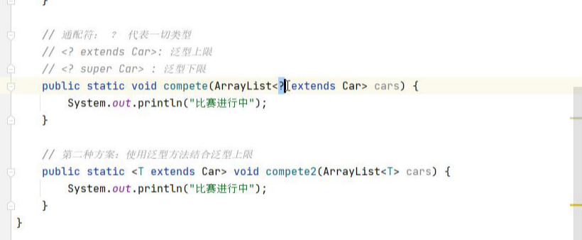

[TOC]


# 内部类

#### 1、类的五大成分：

成员变量、方法、构造器、代码块、内部类

#### 2、格式

```java
public class People{
    public class Heart{
		
		}
}
```

#### 3、应用场景：

当一个事物内部，有一个完整结构定义，而这个结构没有必要单独定义一个类，就在类的内部定义

#### 4、好处

内部类中可以访问外部类的私有成员

内部类有更好的封装性，访问修饰符

#### 5、四种形式

##### 	5、1 成员内部类

###### 			5、1、1 无static修饰的属于外部类的对象

###### 			5、1、2  jdk16之后可以定义静态成员


##### 	

```java
外部类.内部类  对象 = new 外部类构造器（）.new 内部类（）;
```


```java
sout.People.Heart.heartBeat
```

拓展：

1、成员内部类中是否可以直接访问外部类的静态成员？ 

​		**可以，外部类的静态成员只有一份可以被共享访问。**

2、成员内部类的实例方法中是否可以直接访问外部类的实例成员？ 

​		**可以，因为必须先有外部类对象，才能有成员内部类对象，所以可以直接访问外部类对象的实例成员。**


##### 	5、2 静态内部类

###### 			5、2、1有static修饰，属于我外部类


定义格式

```java
外部类名.内部类名 对象名 = new 外部类名.内部类构造器（）;
```

拓展：

1、静态内部类中是否可以直接访问外部类的静态成员？ 

​		**可以，外部类的静态成员只有一份可以被共享访问。**

2、静态内部类中是否可以直接访问外部类的实例成员？ 

​		**不可以，外部类的实例成员必须用外部类对象访问。**

##### 	5、3局部内部类


##### 	5、4匿名内部类

没有名字的局部内部类；只能是抽象类或者接口


**特点总结：**

- 匿名内部类是一个没有名字的内部类，同时也代表一个对象。

- 匿名内部类产生的对象类型，相当于是当前new的那个的类型的子类类型。

==**匿名内部类可以作为一个对象，直接传输给方法。**==

# 枚举

#### 1、定义形式

```java
修饰符 enum 枚举名称{
    //罗列枚举实例名称;
    SPRING,SUMMER;
}
```

javap 反编译


# 泛型

定义类接口方法，同时声明一个多个类型变量，则改类接口方法分别为泛型类、接口、方法


泛型方法




泛型擦除


# API


自动拆箱装箱原理：

## 自动装箱和拆箱的原理

自动装箱时编译器调用valueOf，或者是parseInt将原始类型值转换成对象，同时自动拆箱时，编译器通过调用类似intValue(),doubleValue()这类的方法将对象转换成原始类型值。


​                                              		

​                                              

明白自动装箱和拆箱的原理后，我们带着上面的疑问进行分析下Integer的自动装箱的实现源码。如下：

```cobol
    public static Integer valueOf(int i) {
        //判断i是否在-128和127之间，存在则从IntegerCache中获取包装类的实例，否则new一个新实例

        if (i >= IntegerCache.low && i <= IntegerCache.high)
            return IntegerCache.cache[i + (-IntegerCache.low)];
        return new Integer(i);
    }

    //使用亨元模式，来减少对象的创建（亨元设计模式大家有必要了解一下，我认为是最简单的设计模式，也许大家经常在项目中使用，不知道他的名字而已）

    private static class IntegerCache {
        static final int low = -128;

        static final int high;

        static final Integer cache[];

        //静态方法，类加载的时候进行初始化cache[],静态变量存放在常量池中

        static {

            // high value may be configured by property

            int h = 127;

            String integerCacheHighPropValue =

                sun.misc.VM.getSavedProperty("java.lang.Integer.IntegerCache.high");

            if (integerCacheHighPropValue != null) {

                try {

                    int i = parseInt(integerCacheHighPropValue);

                    i = Math.max(i, 127);

                    // Maximum array size is Integer.MAX_VALUE


                    h = Math.min(i, Integer.MAX_VALUE - (-low) -1);


                } catch( NumberFormatException nfe) {

                    // If the property cannot be parsed into an int, ignore it.

                }

            }


            high = h;


            cache = new Integer[(high - low) + 1];

            int j = low;

            for(int k = 0; k < cache.length; k++)

                cache[k] = new Integer(j++);

            // range [-128, 127] must be interned (JLS7 5.1.7)


            assert IntegerCache.high >= 127;

        }


        private IntegerCache() {}


    }
```

Integer i1 = 40; 自动装箱，相当于调用了Integer.valueOf(40);方法。
    首先判断i值是否在-128和127之间，如果在-128和127之间则直接从IntegerCache.cache缓存中获取指定数字的包装类；不存在则new出一个新的包装类。
    IntegerCache内部实现了一个Integer的静态常量数组，在类加载的时候，执行static静态块进行初始化-128到127之间的Integer对象，存放到cache数组中。cache属于常量，存放在java的方法区中。

通过分析源码发现，只有double和float的自动装箱代码没有使用缓存，每次都是new 新的对象，其它的6种基本类型都使用了缓存策略。
    使用缓存策略是因为，缓存的这些对象都是经常使用到的（如字符、-128至127之间的数字），防止每次自动装箱都创建一次对象的实例。
    而double、float是浮点型的，没有特别的热的（经常使用到的）数据的，缓存效果没有其它几种类型使用效率高。（补充：一个范围内的整数是有明确的个数限制的，而浮点型则不同）

 

```java
    //1、这个没解释的就是true
    System.out.println("i=i0\t" + (i == i0));  //true
    //2、int值只要在-128和127之间的自动装箱对象都从缓存中获取的，所以为true
    System.out.println("i1=i2\t" + (i1 == i2));  //true
    //3、涉及到数字的计算，就必须先拆箱成int再做加法运算，所以不管他们的值是否在-128和127之间，只要数字一样就为true
    System.out.println("i1=i2+i3\t" + (i1 == i2 + i3));//true  
    //比较的是对象内存地址，所以为false
    System.out.println("i4=i5\t" + (i4 == i5));  //false
    //5、同第3条解释，拆箱做加法运算，对比的是数字，所以为true
    System.out.println("i4=i5+i6\t" + (i4 == i5 + i6));//true      
    //double的装箱操作没有使用缓存，每次都是new Double，所以false
    System.out.println("d1=d2\t" + (d1==d2));//false
```

