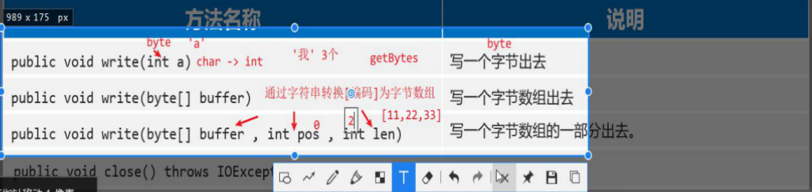
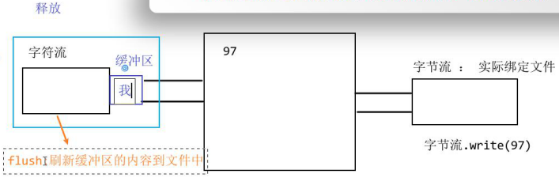
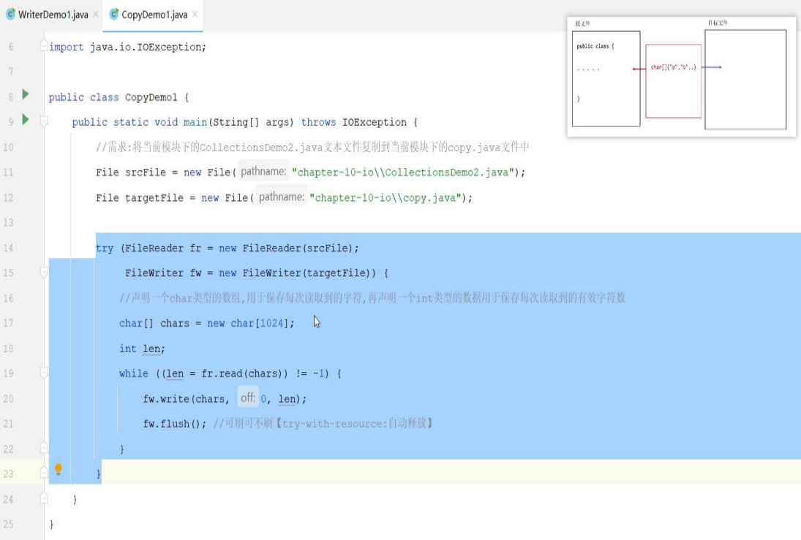
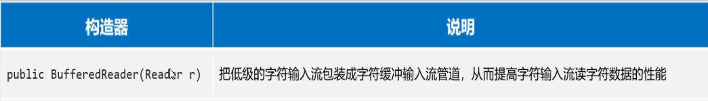

[TOC]


# File

java.io包下的类

==注意：==File类智能对文件本身进行造作，不能读写文件里边存储的数组

## 1、创建对象


- File对象既可以代表文件、文件夹

- File对象仅仅是一个路径名字，路径可存在，或者不存在

### 绝对路径、相对路径


### 构造创建流程3种


==补充==：src同级创建文件夹，==采用相对路径==


```java
模块名\\文件名字
```

## 2、File的API

### 常用方法1：判断文件类型、获取文件信息


### 常用方法2：创建文件、删除文件


不存在文件路径，如果创建文件，文件的上一级不存在，则会抛出异常IOExpection

★**处理方案**：无论是否存在，最终都可创建出来getParentFile（）：获取表示父路径得file对象


**空文件夹（下级有空文件路径不算）**


### 常用方法3：遍历文件


一级：文件夹下的直系内容


==**使用listFiles方法时的注意事项：**==

- 当主调是文件，或者路径不存在时，返回null

- 当主调是空文件夹时，返回一个长度为0的数组

- ==当主调是一个有内容的文件夹时，将里面所有一级文件和文件夹的路径放在File数组中返回==

- 当主调是一个文件夹，且里面有隐藏文件时，将里面所有文件和文件夹的路径放在File数组中返回，包含隐藏文件（二级不放）

- 当主调是一个文件夹，但是没有权限访问该文件夹时，返回null

## 综合案例

```java
package com.shizian.recorsion;

import java.io.File;
import java.util.Arrays;
import java.util.HashMap;
import java.util.Objects;

/**
 * @author 施子安
 * @version 1.0
 * @date 2023/3/4 12:08
 * @Description 综合案例从C:盘中，搜索“QQ.exe” 这个文件，找到后直接输出其位置
 */
public class RecorsionStatistics {

    //(1)查找指定文件 (2)统计文件夹大小 (3)统计文件夹文件个数 (4)作业:统计文件夹中不同类型文件的个数 HashMap<类型,个数>
    private static final File TARGET_DIRECTORY = new File("D:\\lib\\lib");
    private static final String TARGET_FILE_NAME = "per.txt"; //指定文件
    private static HashMap<String,Integer> hashMap = new HashMap<>();
    static Integer count = 1;
    private static Long fileLengthSum = 0L;
    private static Integer fileCount = 0;
    public static void main(String[] args) {
        findFile(TARGET_DIRECTORY);
        getFileLengthSum(TARGET_DIRECTORY);
        System.out.println(TARGET_DIRECTORY + "文件大小为：" + fileLengthSum + "字节");
        System.out.println(TARGET_DIRECTORY + "下有" + getFileCount(TARGET_DIRECTORY) + "个文件");
        getFileType(TARGET_DIRECTORY);
        hashMap.forEach((s, integer) -> System.out.println(s + "===" + integer));

    }

    private static void getFileType(File targetDirectory) {

        File[] files = getFiles(targetDirectory);
//        for (File file : files) {
//            if (file.isFile()){
//                String name = file.getName();
//                String peffx = name.substring(name.lastIndexOf(".") + 1);
//                if (null != hashMap.get(peffx))
//                    hashMap.put(peffx,++count);
//                else
//                    hashMap.put(peffx,count);
//            }
//            else getFileType(file);
//        }
        Arrays.stream(files).forEach(file -> {
            if (file.isFile()){
                String name = file.getName();
                String peffx = name.substring(name.lastIndexOf(".") + 1);
                if (null != hashMap.get(peffx))
                    hashMap.put(peffx,++count);
                else
                    hashMap.put(peffx,count);
            }
            else getFileType(file);
        });
    }

    private static Integer getFileCount(File targetDirectory) {
        for (File file : getFiles(targetDirectory)) {
            if (file.isFile())
                fileCount++;
            else
                getFileCount(file);
        }
        return fileCount;
    }

    private static void getFileLengthSum(File targetDirectory) {
        for (File file : getFiles(targetDirectory)) {
            if (file.isFile())
                fileLengthSum = file.length();
            else
                getFileLengthSum(file);
        }
    }

    //查找指定文件
    private static void findFile(File targetDirectory) {
        File[] files = getFiles(targetDirectory);
        if (files == null) return;
        //循环
        for (File file : files) {
            if (file.isFile() && file.getName().equals(TARGET_FILE_NAME))
                System.out.println("找到文件了：" + file.getAbsolutePath());
            else
                findFile(file);
        }
    }
    //统计文件夹大小


    private static File[] getFiles(File targetDirectory) {
        //获取一级文件集合
        File[] files = targetDirectory.listFiles();
        //判断文件是否为空
        if (Objects.isNull(files))
            return null;
        return files;
    }
}

```


# 方法递归

## 1、介绍：

方法调用方法本身；算法。

## 2、递归形式

- 直接递归
- 间接递归：方法调用其他方法，其他方法调用本身

**注意问题：**

递归如果没有控制好终止，会出现死循环，导致**栈内存溢出错误**StackOverflowError

## 3、递归算法三要素


## 案例：计算n的阶乘

## 案例：计算1- n的和


```java
package com.shizian.recorsion;

/**
 * @author 施子安
 * @version 1.0
 * @date 2023/3/4 11:25
 * @Description 递归，计算阶乘
 */
public class RecorsionDemo1 {
    public static void main(String[] args) {
        System.out.println(getFactoral(15));
        System.out.println(getSum(100));
    }

    private static int getSum(int n) {
        return n == 1 ? 1 : getSum( n - 1 ) + n;
    }

    private static int getFactoral(int n) {
        return n == 1 ? 1 : getFactoral(n - 1) * n;
    }


}

```


## 快排

# 字符集

### 1、介绍


- [ ] 

### 2、字符编码解码


```java
package com.shizian.code;

import java.io.UnsupportedEncodingException;
import java.util.Arrays;

/**
 * @author 施子安
 * @version 1.0
 * @date 2023/3/4 15:13
 * @Description 编码解码
 */
public class EncodeTest {
    public static void main(String[] args) throws UnsupportedEncodingException {
        //编码
        byte[] gbks = "施子安".getBytes("GBK");
        byte[] bytes = "施子安".getBytes();
        System.out.println(Arrays.toString(gbks));//[-54, -87, -41, -45, -80, -78]
        System.out.println(Arrays.toString(bytes));//[-26, -106, -67, -27, -83, -112, -27, -82, -119]
        System.out.println("==================");
        //解码
        String s = new String(gbks);
        String sGBK = new String(gbks,"GBK");
        String utfS = new String(bytes);
        byte[] kunjinkao = "ʩ�Ӱ�".getBytes();

        System.out.println("GBK--utf8解码：" + s);//GBK--utf8解码：ʩ�Ӱ�
        System.out.println("锟斤拷解码：" + new String(kunjinkao,"GBK"));//锟斤拷解码：施锟接帮拷
        System.out.println("==================");
        System.out.println("GBK解码:" + sGBK);//GBK解码:施子安
        System.out.println("utf8解码:" + utfS);//utf8解码:施子安


    }
}

```


# IO流

读写数据（文件、网络），

I为input，输入流：负责把数据读入内存中去

O为output：输出流，负责写数据出去

## 1、分类

**流分类**

- 输入流：读数据

- 输出流：写数据

**流中最小数据单位**

- 字节流：适合所有文件

- 字符流：只适合纯文本文件（比字节流方便）

**四大流总结**


## 2、IO流-字节流

### 2.1 字节输入流InputStream

FileInputStream（文件字节输入流）

#### 2.1.1 作用构造：

内存为基准，把磁盘文件中的数据以字节形式读入到内存中去。


**注意：**


#### 2.1.2 读入API：


==**read（）无参一次只能读一个字节，读取性能差，读取汉字会乱码，返回值为字符，没有找到为-1**==

read（）有参，一次尝试读取一个字节数组的数据（字节数组长度多少，就读多少），==没有数据会反会-1.有数据返回读到有效字节数作为返回值==

##### 解决中文乱码方式


内存溢出

## 2.2 字节输出流OutputStream

**FileOutputStream**

#### 2.2.1 构造


append默认是false

#### 2.2.2 API





### 案例赋值文件


```java
package com.shizian.copy;

import java.io.FileInputStream;
import java.io.FileOutputStream;

/**
 * @author 施子安
 * @version 1.0
 * @date 2023/3/4 17:38
 * @Description 拷贝文件
 */
public class CopyDemo1 {
    public static void main(String[] args) throws Exception {
        //加载文件路径
        FileInputStream inputStream = new FileInputStream("G:\\壁纸\\微信图片_20230114181140.jpg");
        //定义输出文件位置
        FileOutputStream outputStream = new FileOutputStream("day09-io\\1.jpg");

        //复制文件
        byte[] bytes = new byte[1024];
        int len = 0;
        while ((len = inputStream.read(bytes))  != -1){
            outputStream.write(bytes,0,len);
        }

        //关闭流
        inputStream.close();
        outputStream.close();
    }
}

```

## 概括


## 3、字符流

### **3.1 文件字符输入流FileReader**

内存为基准，读文件件的数据以字符形式读入内存中。

#### 3.1.1 构造


#### 3.1.2 方法API


### 3.2 文件字符输出流FileWriter

内存数据一字符的形式写入到文件中

#### 3.2.1 构造方法


#### 3.2.2 常用API


#### 注意：



==除了字节流，其他流都有缓冲区==

写入数据关闭流，才能写入文件

- 关闭流
- 刷新缓冲区


字符输出流实现换行

```java
"\r\n"
```

#### 案例：复制文本文档



```java
package com.shizian;

import java.io.*;

/**
 * @author 施子安
 * @version 1.0
 * @date 2023/3/5 10:19
 * @Description 讲一个文本文档赋值到另一个位置
 */
public class copy {
    public static void main(String[] args) {
        //源文件位置
        File srcfile = new File("day10-io\\Main.java");
        //目标文件位置
        File targrtFile = new File("day10-io\\Min.java");

        //读取文件
        try(FileReader fileReader = new FileReader(srcfile);
            FileWriter fileWriter = new FileWriter(targrtFile);){
            //创建赋值的数组
            char[] chars = new char[1024];
            int len = 0;
            while ((len = fileReader.read(chars)) != -1){
                //写入数据
                fileWriter.write(chars,0,len);
                //刷新缓冲区可写可不写
                fileWriter.flush();
            }

        } catch (FileNotFoundException e) {
            throw new RuntimeException(e);
        } catch (IOException e) {
            throw new RuntimeException(e);
        }


    }
}

```


## 4、缓冲流Buffered☆

**==重点==**


8k缓冲区

### 4.1 字节缓冲流


#### 4.1.1 构造


#### 案例对比普通流和缓冲流速度

```java
package com.shizian.copy;

import java.io.*;

/**
 * @author 施子安
 * @version 1.0
 * @date 2023/3/5 11:09
 * @Description 缓冲流和普通流对比速度
 */
public class CopyDemo {
    public static void main(String[] args) {
        //创建文件路径
        File srcFile = new File("day10-io\\Main.java");
        File targetFileOne = new File("day10-io\\111.java");
        File targetFileTow = new File("day10-io\\11.java");

        //字节读取写入
        getByByteWrite(srcFile,targetFileOne);
        getByBufferedWrite(srcFile,targetFileTow);
    }

    private static void getByBufferedWrite(File srcFile, File targetFileOne) {
        long start = System.currentTimeMillis();
        try(BufferedInputStream bufferedInputStream = new BufferedInputStream(new FileInputStream(srcFile));
            BufferedOutputStream fileOutputStream = new BufferedOutputStream(new FileOutputStream(targetFileOne))) {
            byte[] bytes = new byte[1024];
            int len = 0;
            while ((len = bufferedInputStream.read(bytes)) != -1){
                fileOutputStream.write(bytes,0,len);
            }
        } catch (FileNotFoundException e) {
            throw new RuntimeException(e);
        } catch (IOException e) {
            throw new RuntimeException(e);
        }

        long end = System.currentTimeMillis();
        System.out.println("buff " + (end - start));
    }

    private static void getByByteWrite(File srcFile, File targetFileOne) {
        long start = System.currentTimeMillis();
        try(FileInputStream fileInputStream = new FileInputStream(srcFile); 
            FileOutputStream fileOutputStream = new FileOutputStream(targetFileOne)) {
            byte[] bytes = new byte[1024];
            int len = 0;
            while ((len = fileInputStream.read(bytes)) != -1){
                fileOutputStream.write(bytes,0,len);
            }
        } catch (FileNotFoundException e) {
            throw new RuntimeException(e);
        } catch (IOException e) {
            throw new RuntimeException(e);
        }

        long end = System.currentTimeMillis();
        System.out.println("bye " + (end - start));
    }
}

```

### 4.2 字符缓冲流

BufferedReader字符缓冲输入流


#### 4.2.1 构造器




#### 4.2.2 特有API


==补充==：读取换行符，作为换行


构造中匿名内部类，，外部构造器自动关流

==readLine读取内容不包含换行符==


```java
package com.shizian.copy;

import java.io.*;

/**
 * @author 施子安
 * @version 1.0
 * @date 2023/3/5 11:52
 * @Description 字符缓冲流
 */
public class CopyBufferedS {
    public static void main(String[] args) {
        File srcfile = new File("day10-io\\Main.java");
        File targetfile = new File("day10-io\\BufferedWriter.java");

        //java中只要把用于包中的流释放掉，和他关联的流会自动释放
        try (BufferedReader br = new BufferedReader(new FileReader(srcfile));
             BufferedWriter bw = new BufferedWriter(new FileWriter(targetfile))
        ){
            String st;
            while ((st = br.readLine()) != null){
                //写出
                bw.write(st);
                //换行
                bw.newLine();
            }

        } catch (FileNotFoundException e) {
            throw new RuntimeException(e);
        } catch (IOException e) {
            throw new RuntimeException(e);
        }
    }
}

```


## 5、转换流


==解决思路：获取道原始字节流，再将其按真实的字符编码转换成字符输入流。，解决乱码==

解决思路：获取字节输出流，按照指定的编码将其转换为字符输出流


#### 5.1 构造器


前提：要求编码格式不是utf8


#### 案例：文件编码转换

```java
package com.shizian.copy;

import java.io.*;

/**
 * @author 施子安
 * @version 1.0
 * @date 2023/3/5 14:48
 * @Description 转换流
 */
public class OutputSreamReaderDemo2 {
    public static void main(String[] args) {
        File srcfile = new File("day10-io\\shizian.txt");
        File targetfile = new File("day10-io\\chushibiao.txt");
        try(InputStreamReader ipsr = new InputStreamReader(new FileInputStream(srcfile));
            OutputStreamWriter opsw = new OutputStreamWriter(new FileOutputStream(targetfile),"GBK")) {
            char[] chars = new char[1024];
            int len;
            while ((len = ipsr.read(chars)) != -1){
                opsw.write(chars,0,len);
            }
            System.out.println("复制成功！");
        } catch (FileNotFoundException e) {
            throw new RuntimeException(e);
        } catch (IOException e) {
            throw new RuntimeException(e);
        }

    }
}

```


## 6、打印流PrintStream/PrintWriter

PrintStream可以用于接收System.out的输出

PrintStream继承自OutputStream，因此可以直接输出字节数据

PrintStream和PrintWriter都有print()和println()方法


#### 区别：


System.setOut（）控制台转换为目标文件位置

System.err.println（）控制台转换为目标文件位置


## 7、数据流DataInputStream/DataOutputStream


### 7.1 构造

允许把==数据和其类型==一并写进去


### 7.2方法


## 8、序列化流


### 8.1 构造器

#### 序列化


**注意**：

对象如果要序列化，必须实现序列化接口（java.io.Serializable）


#### 反序列化


#### 案例：序列化反序列化


##### 多个对象序列化解决方案


#### 总结


```java
package com.shizian.object;

import com.shizian.entity.Student;

import java.io.*;
import java.util.ArrayList;
import java.util.Collections;

/**
 * @author 施子安
 * @version 1.0
 * @date 2023/3/5 16:58
 * @Description 序列化反序列化
 */
public class ObjectInputStreamDemo {
    public static void main(String[] args) {
//        writeObject();
        readObject();

    }

    private static void readObject() {
        try(ObjectInputStream ois = new ObjectInputStream(new FileInputStream("day10-io\\student.java"))) {
//            Student s = (Student) ois.readObject();

            ArrayList<Student> lis = (ArrayList<Student>) ois.readObject();
            lis.forEach(student -> System.out.println(student.getId() + " -----" +  student.getName()));

        } catch (FileNotFoundException e) {
            throw new RuntimeException(e);
        } catch (IOException e) {
            throw new RuntimeException(e);
        } catch (ClassNotFoundException e) {
            throw new RuntimeException(e);
        }
    }

    private static void writeObject() {
        Student student = new Student(001, "施子安");
        Student student2 = new Student(002, "施子安");
        //对象放进集合
        ArrayList<Student> students = new ArrayList<>();
        Collections.addAll(students,student,student2);
        //读取序列化对象
        try( ObjectOutputStream oos = new ObjectOutputStream(new FileOutputStream(new File("day10-io\\student.java")))) {
            oos.writeObject(students);
        } catch (FileNotFoundException e) {
            throw new RuntimeException(e);
        } catch (IOException e) {
            throw new RuntimeException(e);
        }
    }
}

```


## 9、补充知识IO框架

#### 什么是框架？

- 解决某类问题，编写的一套类、接口等，可以理解成一个半成品，大多框架都是第三方研发的。

- 好处：在框架的基础上开发，可以得到优秀的软件架构，并能提高开发效率

- 框架的形式：一般是把类、接口等编译成class形式，再压缩成一个.jar结尾的文件发行出去。

#### 什么是IO框架？

- 封装了Java提供的对文件、数据进行操作的代码，对外提供了更简单的方式来对文件进行操作，对数据进行读写等。

#### 使用步骤


#### API常用


HUTOOL java工具包 

# 释放资源的方式

## try-catch-finally


## try-with-resource

jdk7有


jdk9


 

