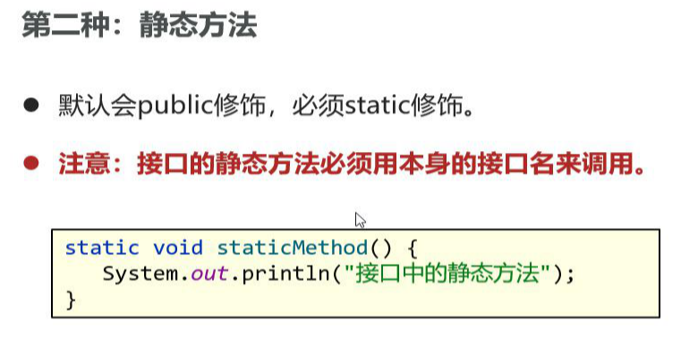

[TOC]


# 权限修饰符


==**重点：不同包下的子类中，在无关类中创建实例化，不可以访问protected修饰的成员（不同包下的子类中，不等于不同包下的子类对象)**==


# final

#### 特点：

###### 1、修饰类，不能别继承，

###### 2、修饰方法，方法不能被重写

###### 3、修饰变量，变量只能赋值一次且初始化的时候必须赋值

###### 4、==**修饰属性，该属性只能通过构造方法赋值一次**==

```java
 
public class TestFinal {
	public static void main(String[] args) {
		//显式赋值给常量
		final int NUM = 10;
		//NUM已经被初始化过了，不能被修改
		NUM = 22;//此处出错
	}
 
}
 
//A类使用final修饰，则A不能被继承
final class A {
	
}
//B类继承A类出错
class B extends A {//此处出错
	
}
 
class C {
	//method0()方法使用final修饰，则method0()方法不能被重写
	public final void method0() {
		
	}
}
class D extends C {
	//重写method0()出错
	public void method0() {//此处出错
		
	}
}
 
class E {
	//代码块给常量初始化，属于成员
	final String NATION;
	{
		NATION = "china";
	}
	
	//构造器给常量赋初值
	final int MONEY;
	public E() {
		MONEY = 10000;
	}
	
	//全局常量，例如：Math.PI
	static final int height = 123;
}
```

**final修饰的变量为基本类型，值不能改变，修饰的引用类型，引用的地址值不能改变，但是地址值指向对象的内容可以改变**

### 常量

常量在编译阶段会进行宏替换，将常量的地方替换为字面量

命名规则：大写，两个英语单词之间下划线连接

# 抽象类

修饰符：abstract

抽象方法不能有方法体，且有抽象方法的类一定是抽象类，但是抽象类里不一定有抽象方法

抽象方法一般作为父类，让子类继承，实现具体行为 ，==如果一个类继承了抽象方法，那么这个类必须重写抽象类的全部方法，否则这个类必须定义成抽象类==

（其实类似于异常抛出）

特征：

1、类有的成员，抽象类都有

2、抽象类中不一定有抽象方法，但是有抽象方法的类一定是抽象类

3、一个类继承抽象类，必须重写抽象类的所有方法；如果没有全部重写，这个类需要写成抽象类。

4、 不可以用abstract修饰变量、代码块，构造器。  

==5、得到了抽象方法，失去了创建对象的能力。==


### ==第二章 多态，抽象类==

#### 场景：

系统中出现同一种功能多出在开发，而且大部分代码是一样的，只有其中一部本不同。

#### 定义步骤：

1、定义一个抽象类

2、抽象类中，**创建一个模板方法**：里边存放共同代码，

**创建一个抽象方法**，具体实现交给子类完成

3、子类继承抽象类，重写抽象方法

==注意：模板方法建议加一个final修饰==

### final与abstract冲突

（1）互斥关系

（2）abstract定义的抽象类作为模板让子类继承，final定义的类不能让子类继承。

（3）abstract修饰的方法定义通用功能让子类重写，final定义的子类不能重写。

# 多态

```java
父类类型 对象名称 = new 子类构造器;
接口名称 对象名称 = new 子类构造器;

```

一个对象可以表现出多种形态,多态先建立在继承的基础之上

#### 1、**多态中成员访问特点**

方法调用：编译看左边，运行看右边。

变量调用：编译看左边，运行也看左边。（**注意**）


**赋值  父类的引用指向子类对象**

#### 2、多态的优势

==传参 如果参数定义为父类 所有子类均可传递==

#### 3、多态下类型转换

多态不能调用子类独有的方法

解决方法强转

# 接口interface

#### 1、接口定义形式

```java
public interface 接口名{
	成员变量（常量）；
    成员方法（抽象方法）；
}
```

#### 特点：jdk8之前

只能是：常量、抽象方法；
接口本质上就是规范，约束接口的实现类具备某种能力（实现接口中的方法）

实现接口的类叫做实现类（implements）；==**接口不能创建对象**==


#### 2、==接口与接口之间可以多继承，规范合并==

#### 3、继承抽象类的同时实现多个接口

#### 4、JDK8接口的新增成员方法（3种）

作用：**允许接口中直接定义带有方法体的方法**





#### 5、接口注意事项

