[TOC]

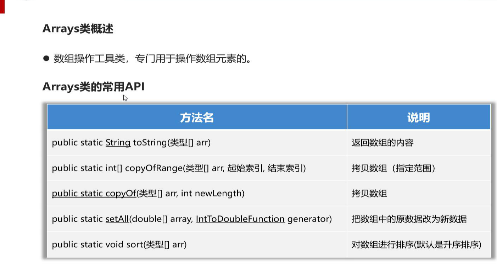

toString（）和Objects的无关

包头不包尾

```java
Arrays.copyOf(arr, 3)//超过数组个数，自动补充默认值
```

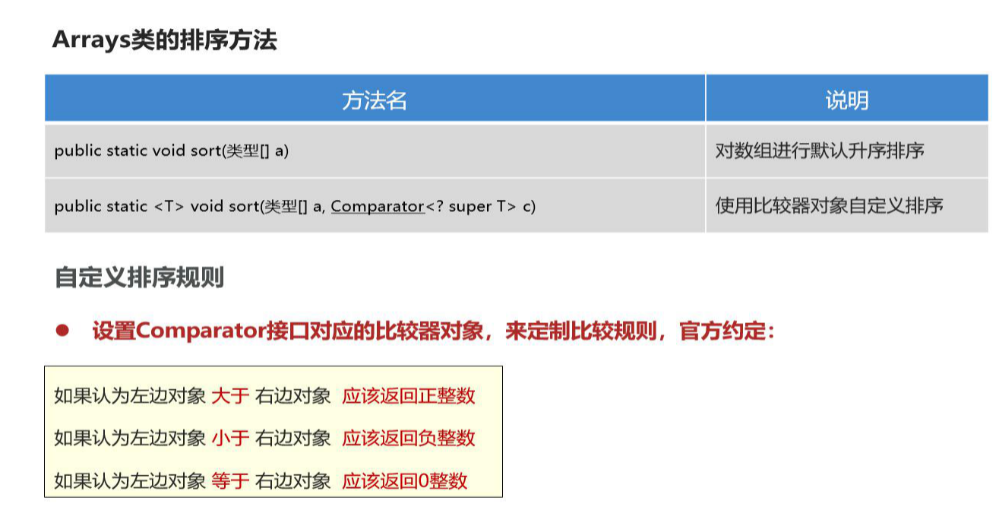

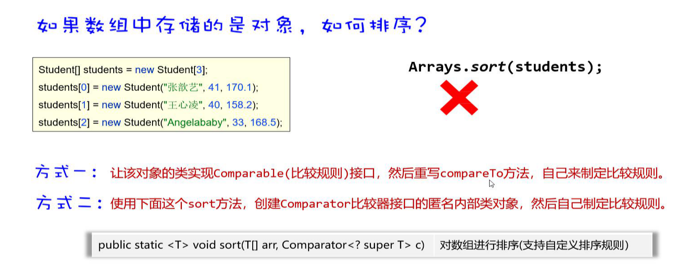

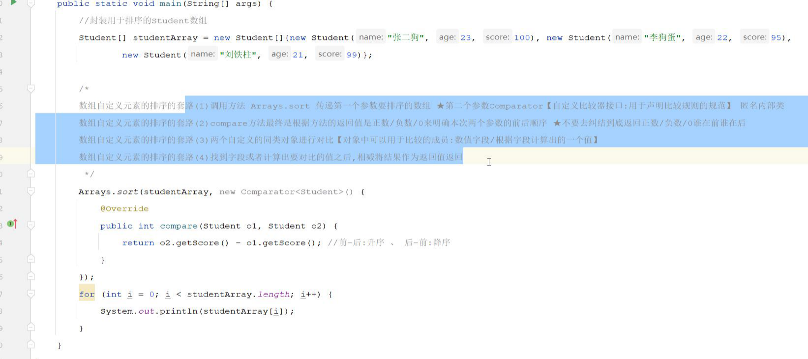

# 算法

## 1、二分查找

前提条件：数据有序，每次排除一半

步骤：

- 左右指针相加/2，记录中间数据

- 判断中间数据和查找数据范围

- 根据数值范围修改指针

- 左右指针位置交换，不存在left《= rigtht

  

## 2、面试题int超范围相加

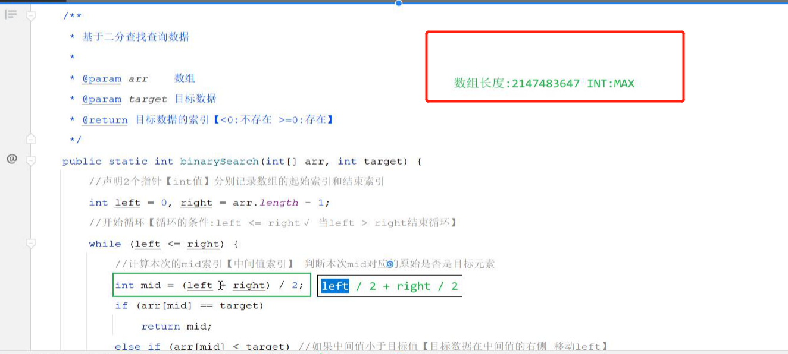

## 3、冒泡排序

### 两两比较（三种数值换位置，）

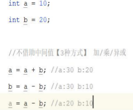

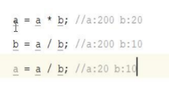

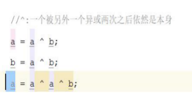

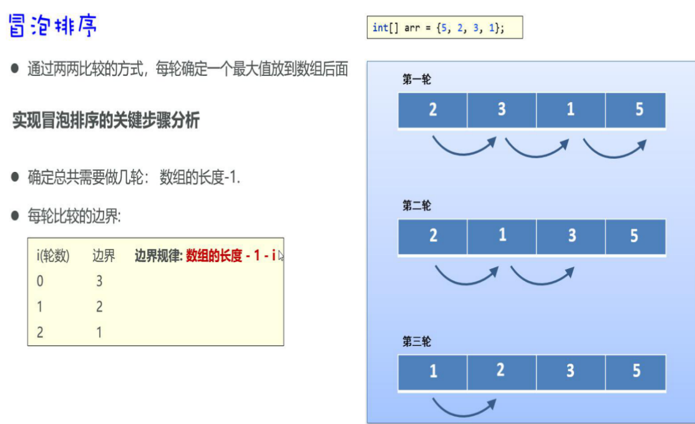

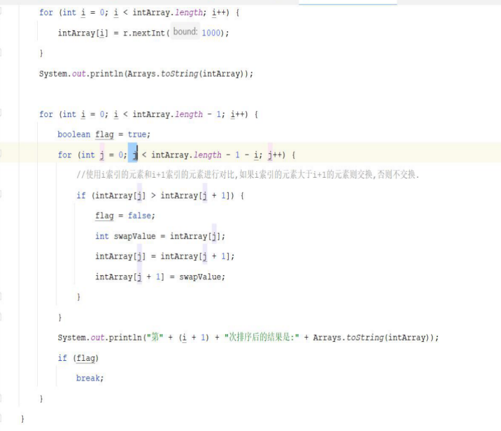

if中的j位置

## 4、选择排序

# 正则表达式

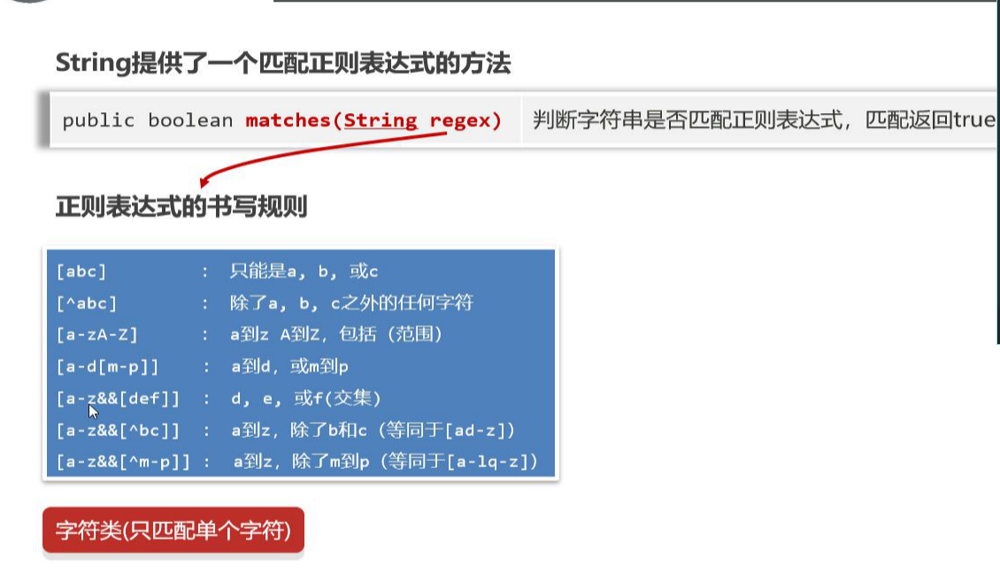

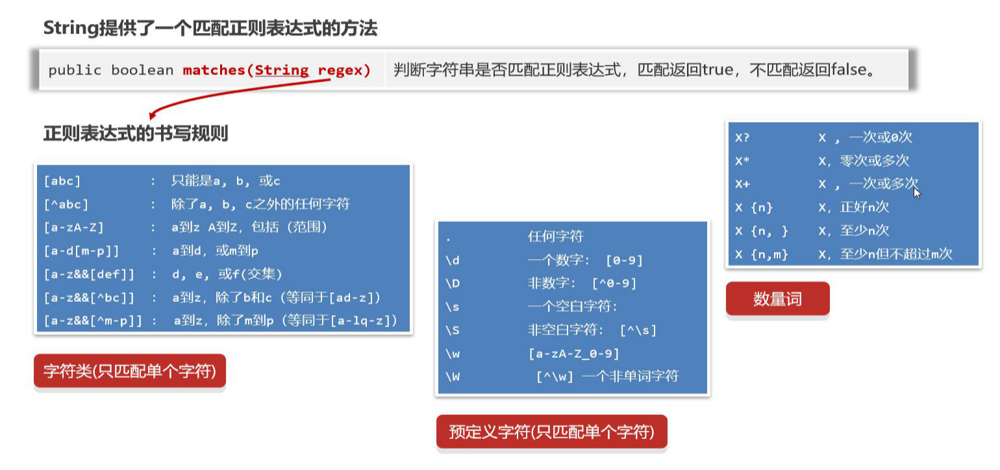

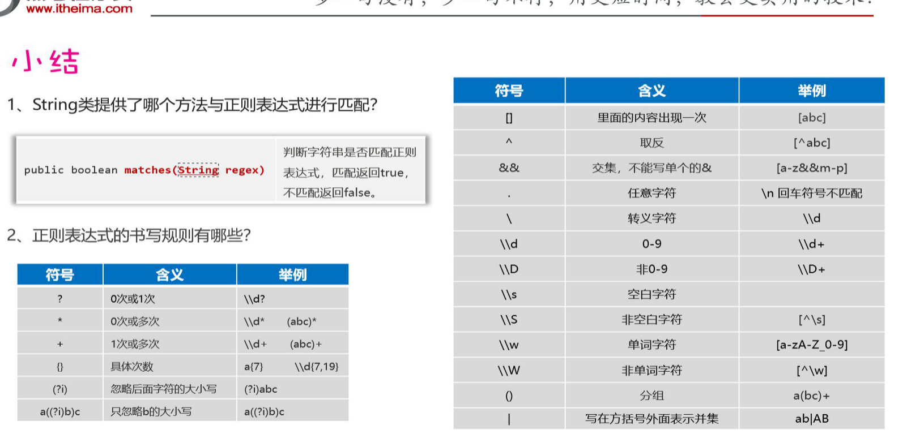

# 异常Throwable

## Error

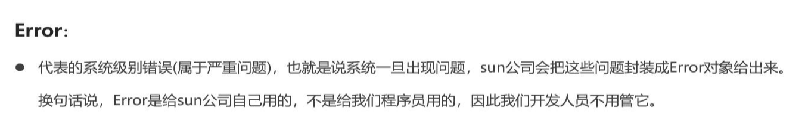

## Exception


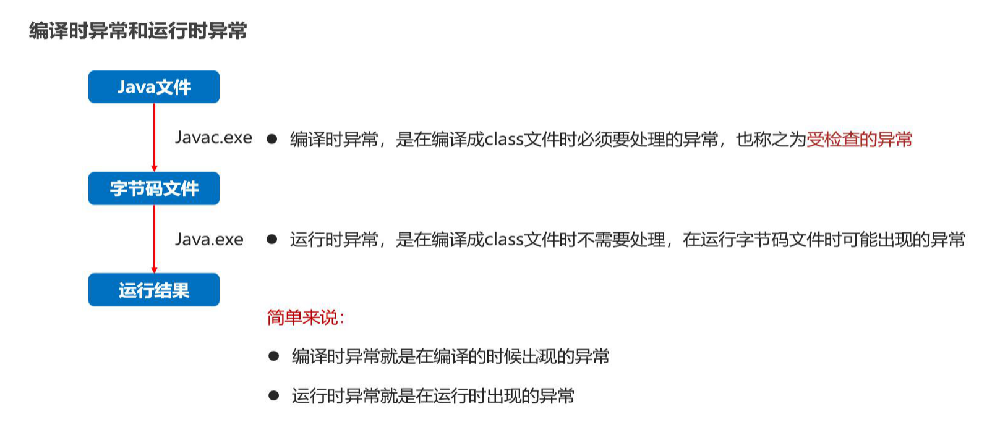

#### 异常流程

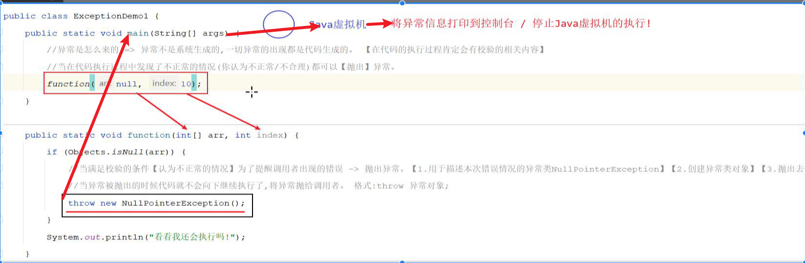

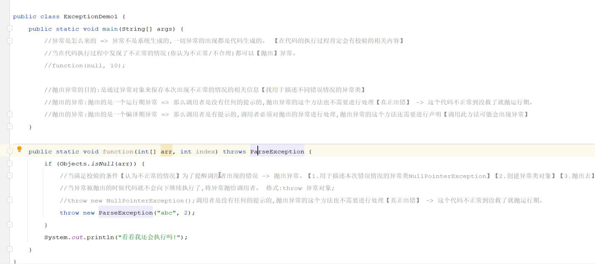

==继承方法重写，父类没有异常，子类只能try catch，接口也是一个样子==


#### 自定义异常

分为两类

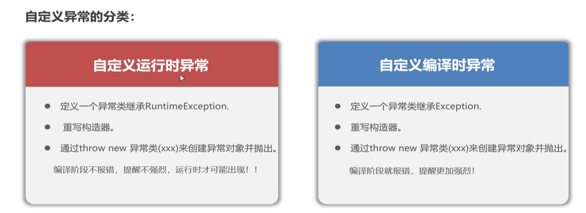 

## try-catch-finally