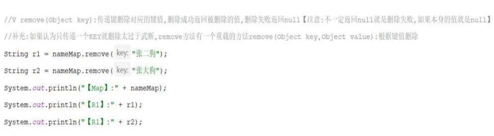

[TOC]


# 可变参数


# Collections

针对单列集合的工具类，静态方法

## 1、静态方法


# Map集合

## 1、概述

双列集合 key-value Entry对象，==一一对应==（接口）关联关系

键：==不可重复==

值：可重复

散列集合


## 2 .==**常用方法**==




- 添加数据put（）==返回值为null==；修改：返回值为之前修改的值，key重复直接覆盖value	
- remove删除成功返回被删除的值，删除失败返回null；==不一定返回null就是删除失败，如果本身值是null；==如果认为只传递一个key就删除太武断，remove方法有一个重载的方法remove(Object key,Object value)，根据键值删除

```java
package com.shizian.HashMap;

import java.util.HashMap;

/**
 * @author 施子安
 * @version 1.0
 * @date 2023/3/3 10:53
 * @Description 常用方法
 */
public class MapDemo {
    public static void main(String[] args) {
        //直接实现不需要多态
        HashMap<String, String> hashMap = new HashMap<>();
        //添加put，覆盖修改功能

        String put = hashMap.put("施子安", "18");
        System.out.println("put:" + put); //put:null
        
        hashMap.put("施子安2","18");
        
        hashMap.put("李华","buzhidao1");
        String put1 = hashMap.put("李华", "李华");//key相同，覆盖之前的
        System.out.println("修改："+put1);//修改：buzhidao1
        
        hashMap.put("华硕",null);
        System.out.println("put" + hashMap);//put{李华=李华, 施子安2=18, 华硕=null, 施子安=18}

        //获取几个大小
        int size = hashMap.size();
        System.out.println("size:" + size);

        //删除 key
        String remove = hashMap.remove("李华");
        //重载键值对删除
        boolean b = hashMap.remove("施子安", "18");
        //删除失败返回null ★集合中value是null
        String removeNull = hashMap.remove("华硕");
        System.out.println("★集合中value是null:" + removeNull);//★集合中value是null:null
        System.out.println("删除失败：" + hashMap.remove("111"));//删除失败：null
        System.out.println("重载remove" + b);//重载remove:true
        System.out.println("remove" + remove);//remove李华 返回value
        System.out.println("map" + hashMap);//map{施子安2=18}

        //查询key
        String s = hashMap.get("施子安");
        System.out.println("查询："  + s);//查询：null(查询没哟返回null)
        System.out.println("hashMap" + hashMap);

        //获取键
        boolean containsKey = hashMap.containsKey("施子安");//containsKey:false
        System.out.println("containsKey:" + containsKey);

        //获取值

        boolean containsValue = hashMap.containsValue("18");
        System.out.println("containsValues" + containsValue);
        //判断是否为空

        boolean empty = hashMap.isEmpty();
        System.out.println("empty:" + empty);
        //清除集合
        hashMap.clear();
        System.out.println("clear:" + hashMap);


    }
}

```

## 3、遍历

三种，

### 3.1 键找值


获取所有的key，返回一个Set集合，遍历Set获取key，在基于map的getValue方法进行值的返回


### 3.2 键值对


### 3.3 Lambda（函数式JDK8）


```java
package com.shizian.HashMap;

import java.util.HashMap;
import java.util.Map;
import java.util.Set;
import java.util.function.BiConsumer;

/**
 * @author 施子安
 * @version 1.0
 * @date 2023/3/3 14:32
 * @Description 循环遍历三种，键找值 键值对 lambda
 */
public class iteratorMap {
    public static void main(String[] args) {
        HashMap<Object, Object> map = new HashMap<>();
        map.put("123","shizi");
        map.put("1234","shizi");
        map.put("1235","shizi");
        map.put("1236","shizi");

        //键找值
        Set<Object> set = map.keySet();
        for (Object o : set) {
            System.out.println( o + "==" + map.get(o));
        }

        //键值对
        Set<Map.Entry<Object, Object>> entries = map.entrySet();
        for (Map.Entry<Object, Object> entry : entries) {
            System.out.println(entry.getKey() + "==" + entry.getValue());
        }

        //lambda
        map.forEach(new BiConsumer<Object, Object>() {
            @Override
            public void accept(Object key, Object value) {
                System.out.println(key + "==" + value);
            }
        });

        //map.forEach((key,value) -> System.out.println(key + "==" + value));
    }
}

```


## 4、Map统计思路


## 5、Map排序思路


```java
package com.shizian.HashMap;

import java.util.*;
import java.util.function.Consumer;

/**
 * @author 施子安
 * @version 1.0
 * @date 2023/3/3 13:27
 * @Description 投票
 */
public class MapTouPiao {
    private static final String[] STUDENT_CHOOSE_ARRAY = new String[80];

    //投票结果在main方法之前加载
    static {
        Random random = new Random();
        //声明景点 A B C D
        String[] chooseArray = {"A","B","C","D"};
        for (int i = 0; i < STUDENT_CHOOSE_ARRAY.length; i++) {
            STUDENT_CHOOSE_ARRAY[i] = chooseArray[random.nextInt(4)];
        }
    }

    public static void main(String[] args) {
        //声明投票结果map
        HashMap<String, Integer> hashMap = new HashMap<>();
        //循环投票结果
        for (String choose : STUDENT_CHOOSE_ARRAY) {
            //判断之前map里是否有结果
            if (hashMap.containsKey(choose)) {
                //如果包含,说明当前KEY不是第一次出现,
                // 已经出现过了,Map已经保存了KEY和VALUE【老次数】
                //拿出value++
                Integer count = hashMap.get(choose);
                //修改投一票结果
                hashMap.put(choose,++count);
            } else {
                //如果没有，这就是第一个投票结果
                hashMap.put(choose,1);
            }
        }

        //排序结果，通过list
        Set<Map.Entry<String, Integer>> entries = hashMap.entrySet();
        ArrayList<Map.Entry<String, Integer>> list = new ArrayList<>();
        //添加进有序集合
        list.addAll(entries);
        //指定规则排序
        Collections.sort(list, new Comparator<Map.Entry<String, Integer>>() {
            @Override
            public int compare(Map.Entry<String, Integer> o1, Map.Entry<String, Integer> o2) {
                return o2.getValue() - o1.getValue();
            }
        });

        //打印输出结果
        list.forEach(new Consumer<Map.Entry<String, Integer>>() {
            @Override
            public void accept(Map.Entry<String, Integer> stringIntegerEntry) {
                System.out.println(stringIntegerEntry.getKey() + " : " + stringIntegerEntry.getValue());
            }
        });
    }
}

```

## HashMap


### 1、底层原理

链表>8,数组长度>=64转为红黑树

### 2、键唯一性

重写hashCode 和 equals方法

## LinkedHashMap


## TreeMap


问题：排序规则返回0，其他的值相减也是0，需要重新制定规则。使用compartar


## 集合嵌套（最多三层，外部进入）

```java
package com.shizian.HashMap;

import java.util.*;

/**
 * @author 施子安
 * @version 1.0
 * @date 2023/3/3 16:19
 * @Description 输入省份，显示市信息
 */
public class CityMap {
    public static void main(String[] args) {
        HashMap<String, Set<String>> hashMap = getStringSetHashMap();
        getCity(hashMap,"河北");
    }

    private static HashMap<String, Set<String>> getStringSetHashMap() {
        //创建建总体集合
        HashMap<String, Set<String>> hashMap = new HashMap<>();
        //创建市信息
        HashSet<String> hebeiSet = new HashSet<>();
        HashSet<String> beijingSet = new HashSet<>();
        HashSet<String> henanSet = new HashSet<>();
        //添加市
        Collections.addAll(hebeiSet,"石家庄","承德","张家口");
        Collections.addAll(beijingSet,"顺义","昌平");
        Collections.addAll(henanSet,"郑州");

        //添所有进总集合
        hashMap.put("河北",hebeiSet);
        hashMap.put("北京",beijingSet);
        hashMap.put("河南",henanSet);
        return hashMap;
    }

    private static void getCity(HashMap<String, Set<String>> hashMap, String key) {
        Set<String> stringSet = hashMap.get(key);
        if (Objects.nonNull(stringSet)){
            System.out.println(key + "==" );
            stringSet.forEach(System.out::println);
        }else {
            System.out.println("您输入的"+key +"省份buzhnegque");
        }
    }
}

```


# Stream流

## 1、介绍

简化集合、数组操作API；结合Lambda

## 2、步骤


- 获得集合或者数组Stream流
- 调用Stream的方法处流数据
- 获取处理结果（回收后不可在使用）

## 3、API

### 3.1 获取Stream方法

#### 3.1.1 集合


#### 3.1.2 数组


#### 3.1.3 零散数据


```java
import java.util.*;
import java.util.stream.Stream;

public class Task {

    public static void main(String[] args) {
        
        // 为List创建流
        Stream<String> stream = getStream();
        stream.forEach(System.out::println);

        // 为Set创建流
        Stream<String> stream2 = getStream2();
        stream2.forEach(System.out::println);
        
        // 为Map创建流
        Stream<Map.Entry<String, Integer>> stream3 = getStream3();
        stream3.forEach(System.out::println);
        
        // 为数组创建流
        Stream<String> stream4 = getStream4();
        stream4.forEach(System.out::println);

        // 为任意长度参数创建流
        String name = "123";
        String name2 = "123";
        Stream.of(name,name2);

    }

    public static Stream<String> getStream4() {
        String[] array = {"a", "b", "c", "d", "e"};
        return Arrays.stream(array).sequential();
    }

    private static Stream<Map.Entry<String, Integer>> getStream3() {
        Map<String, Integer> map = new HashMap<>();
        map.put("a", 1);
        map.put("b", 2);
        map.put("c", 3);
        map.put("d", 4);
        return map.entrySet().stream();
    }

    public static Stream<String> getStream2() {
        Set<String> set = new HashSet<>();
        Collections.addAll(set, "a", "b", "c", "d", "e", "c");
        return set.stream();
    }

    private static Stream<String> getStream() {
        String[] array = {"a", "b", "c", "d", "e"};
        return Arrays.stream(array).sequential();
    }

}
```


### 3.2 Stream中间处理方法

中间方法调用完成后返回新的Stream流


### 3.3 Stream终结方法

终结方法调用之后就不会产生新的流


# ★基本流

### 1、流中元素是基本类型

IntStream/DoubleStream/LongStream

### 2、特点

- 不能根据集合来获取==引用类型==，只能基于基本类型的数组获取，当Array.steam()获取流的时候传递的是基本数据类型的数组即可获取基本流。
- 由于里边都是基本数据所以是不可以调用方法，但是提供了一些比较方便数据获取和运算方法。

