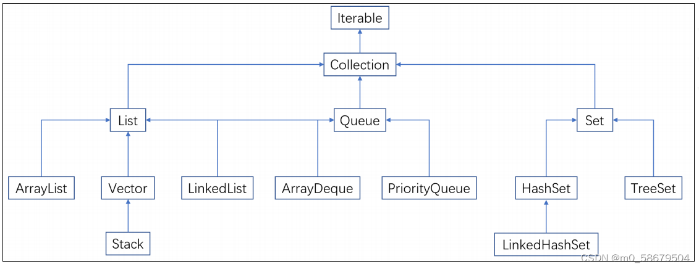

[TOC]

# Lambda表达式

## 函数式编程思想

有输入量，有输出量的内容；**前提**可明确的，可省略的


- 传递的实现类对象省略

- 传递实现类对象实现抽象方法省略

- 方法体内逻辑必须有

  

### 1.作用：

能简化匿名内部类代码写法

```java
(被重写方法的参数列表) -> {被重写方法的方法体};
```

### 2.应用场景:

Lambda表达式只能简化函数式接口的匿名内部类（**函数式接口：有且仅有一个抽象接口方法**）

注解校验函数式接口：@FunctionalInterface

### 3.结论：


### 4、省略写法


### 5、面试题Lambda就是匿名内部类的代替方式？


- 思想层面

  - 匿名内部类：面向对象
  - lambda：函数式思想，作为方法逻辑的载体而出现，重在方法

- 实现原理：

  - 匿名内部类：编译后单独生成.class文件，例如：类名$实现名称
  - lambda：不会声称额外的.class文件，代码执行动态编译

- 使用限制：

  - lambda：是能作用于函数式接口，有且仅有一个抽象方法
  - 匿名内部类：可以有多个抽象方法

- 所需类型不同：

  - lambda表达式只能是接口

  - 匿名内部类可以是：接口，抽象类、具体类

    

# 方法引用

简化lambda表达式

## 1、静态方法引用

###  格式

```java
类名::静态方法
```

###  使用场景


## 2、实例方法引用


## 3、特定类型方法引用


如果主要条件相同，还可以基于次要条件对比


## 4、构造器引用


```java
package com.shizian.method.referce;

import java.util.Arrays;
import java.util.Comparator;

/**
 * @author 施子安
 * @version 1.0
 * @date 2023/2/28 11:38
 * @Description 方法引用静态 和实例
 */
public class CompareTest {
    public static void main(String[] args) {
        Student[] studentArray = new Student[3];
        studentArray[0] = new Student("张二狗", 23, 100);
        studentArray[1] = new Student("刘铁柱", 21, 60);
        studentArray[2] = new Student("李狗蛋", 24, 75);

        //静态引用
        /*Arrays.sort(studentArray, new Comparator<Student>() {
            @Override
            public int compare(Student o1, Student o2) {
                return CompareStudent.compareStudentAge(o1,o2);
            }
        });

        Arrays.sort(studentArray,CompareStudent::compareStudentAge);
        System.out.println(Arrays.toString(studentArray));

        //实例方法
        CompareStudent compareStudent = new CompareStudent();
        Arrays.sort(studentArray, new Comparator<Student>() {
            @Override
            public int compare(Student o1, Student o2) {
                return compareStudent.compareStudentScore(o1,o2);
            }
        });
        Arrays.sort(studentArray,compareStudent::compareStudentScore);
        System.out.println(Arrays.toString(studentArray));*/

        //特定类型方法引用
        Arrays.sort(studentArray, new Comparator<Student>() {
            @Override
            public int compare(Student o1, Student o2) {
                return o1.compat(o2);
            }
        });
        Arrays.sort(studentArray, ( o1,  o2) -> o1.compat(o2));
        Arrays.sort(studentArray, Student::compat);
        //构造方法引用

//        studentCur studentCur = student -> new Student();
        studentCurTWO studentCurTow = Student::new;
        System.out.println(studentCurTow);
        studentCur studentCur = Student::new;

        System.out.println(studentCur);
        Student student = studentCur.studentInf("施子安", 18, 100);
        System.out.println(student);
    }

    @FunctionalInterface
    interface studentCur{
        Student studentInf(String name,Integer age,Integer score);
    }

    @FunctionalInterface
    interface studentCurTWO{
        Student studentInf();
    }

}

```

```java
package com.shizian.method.referce;

/**
 * @author 施子安
 * @version 1.0
 * @date 2023/2/28 11:36
 * @Description 方法
 */
public class CompareStudent {
    public static int compareStudentAge(Student s1,Student s2){
        return s1.getAge() - s2.getAge();
    }

    public int compareStudentScore(Student s1,Student s2){
        return s1.getScore() -s2.getScore();
    }
}

```

```java
package com.shizian.method.referce;

//实体类【存储有关联的数据类】
public class Student {
    private String name;
    private Integer age;
    private Integer score;


    public int compat(Student student){
        return this.getScore() - student.getScore();
    }
    public Student() {
    }

    public Student(String name, Integer age, Integer score) {
        this.name = name;
        this.age = age;
        this.score = score;
    }

    /**
     * 获取
     *
     * @return name
     */
    public String getName() {
        return name;
    }

    /**
     * 设置
     *
     * @param name
     */
    public void setName(String name) {
        this.name = name;
    }

    /**
     * 获取
     *
     * @return age
     */
    public Integer getAge() {
        return age;
    }

    /**
     * 设置
     *
     * @param age
     */
    public void setAge(Integer age) {
        this.age = age;
    }

    /**
     * 获取
     *
     * @return score
     */
    public Integer getScore() {
        return score;
    }

    /**
     * 设置
     *
     * @param score
     */
    public void setScore(Integer score) {
        this.score = score;
    }

    public String toString() {
        return "Student{name = " + name + ", age = " + age + ", score = " + score + "}";
    }
}

```


# 泛型jdk5以后


# 集合Collection


单列集合，一次存储一个数据


## 1、方法


### 1、删除源码分析


重写equals，调用者需要重写


### 2、查询功能源码

只能查找当前集合是否包含指定元素返回true

## 3、常用方法


## 4、迭代器


#### 1、迭代器是接口


#### 2、源码iterator（）


###### 2.1 迭代器流程源码

迭代器其实就是调用了ArrayList的iterator的实现方法，里边创建一个itr()；其实就是ArrayList中一个实现了迭代器规范的内部类；里边生成了迭代过程中要用到的数据；int cursor（下一个哟要返回元素的索引），int lastRet = -1（最后一次实际返回）；Itr对象用于遍历集合，==方法调用hasNext（）进行判断==，cursor ！= size才可执行，==进入方法体，调用next（）方法==，先用i接收cursor，进行判断cursor==size异常，之cursor+1，输出结合，**索引为lastRet = i**；**注意：每调用一次next（），cursor+1**

 


###### 2.2 并发修改异常


对集合修改添加，每次都会将int modcunt++，（修改次数）

当迭代器对象创建的时候，将当前==**集合修改次数modCount**赋给**当前迭代器expectedModCount（预期修改次数**），==当调用next（）方法时候会调用checkFormComodfication方法；判断当前集合修改的次数，是否不等于预期修改次数，不等于抛出异常；（数钱抽走，多放几张，不能确定最后结果正确性）

### 增强for循环


##### 结论


### Lambda表达式遍历集合


   用于所有容器集合类型和数组类型的遍历每个元素

 ==因为forEach()方法是[Iterable](https://so.csdn.net/so/search?q=Iterable&spm=1001.2101.3001.7020)接口的方法，集合继承了该接口==



## 集合中存储的对象的原理

