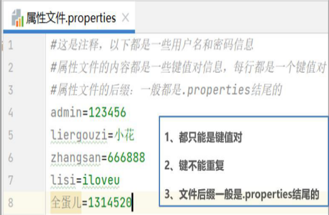
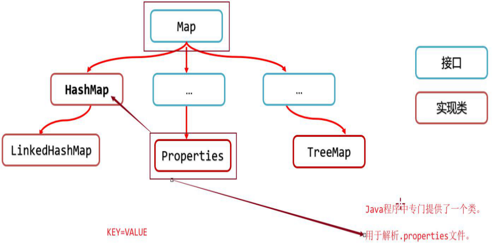
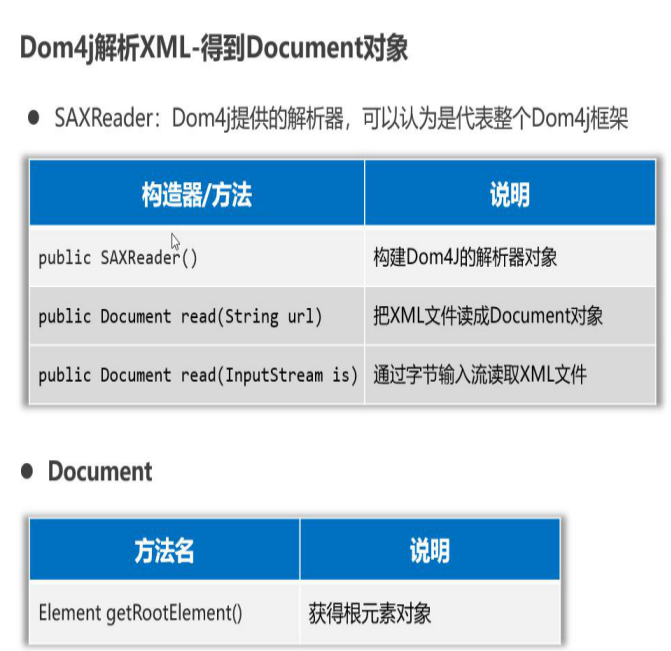
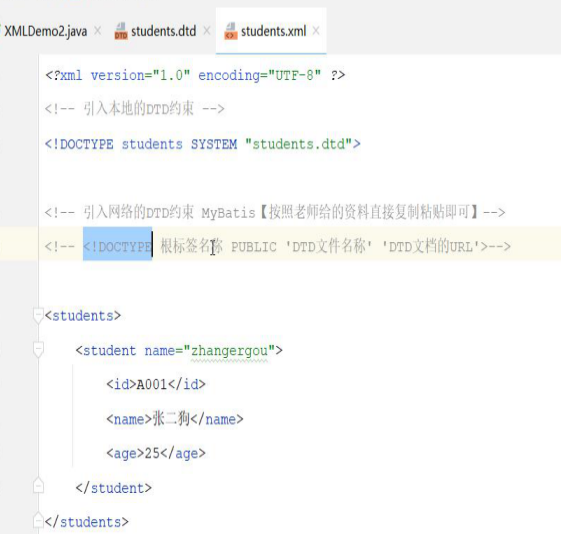

[TOC]


- 保存属性信息（用户名、校验码、服务器地址）
- 保存数据信息

# 特殊文件：Properties属性文件

## 1、特点



```java
#后面写注释，以下格式均可
[KEY VALUE] [KEY=VALUE]
```

## 2、使用



- Properties是一个Map集合

- java程序中专门提供一个Properties类，解析.properties文件属性内容。


源码中有一个反序列化id


和hashmap一样吗，存储数据？

不是，它是用来读取配置文件key，value

```java
package com.shizian.properties;

import java.io.FileInputStream;
import java.io.FileOutputStream;
import java.io.IOException;
import java.util.Properties;
import java.util.Set;

/**
 * @author 施子安
 * @version 1.0
 * @date 2023/3/7 9:43
 * @Description 特殊文件配置
 */
public class PropertiesDemo {
    public static void main(String[] args) throws IOException {
        //创建对象
        Properties prop = new Properties();
        //加载配置文件
        prop.load(new FileInputStream("day11-special-file\\info.properties"));
        //获取单个value
        String username = prop.getProperty("username");
        System.out.println("username:"+ username);
        //获取多个键值
        Set<String> strings = prop.stringPropertyNames();
        strings.stream().forEach(key -> System.out.println(key + "=>" + prop.getProperty(key)));

        Properties prop2 = new Properties();
        //添加key - value
        prop2.L("username","root");
        prop2.setProperty("password","root");
        prop2.setProperty("login","shzian");
        //将集合中的属性添加到配置文集中
        prop2.store(new FileOutputStream("day11-special-file\\info2.properties"),"username props");

    }
}

```


# 特殊文件：XML文件

如果你有多个User用户信息，User中包含了一些属性，想要将这些信息存储到文件中，方便以后查看和读取，那么最好使用哪种文件类型呢？


## 1、xml语法规则


## 2、编写格式


可拓展标记语言，全部由标签组成，传输存储属性信息


## 3、读取内容

解析xml文件


## 4、使用Dom4J依赖流程





/*有问题*/


```java
package com.shizian.xml;

import org.dom4j.Document;
import org.dom4j.DocumentException;
import org.dom4j.Element;
import org.dom4j.io.SAXReader;

import java.io.FileInputStream;
import java.io.FileNotFoundException;
import java.util.List;
import java.util.function.Consumer;

/**
 * @author 施子安
 * @version 1.0
 * @date 2023/3/7 12:08
 * @Description xml
 */
public class XmlDemo {
    public static void main(String[] args) throws FileNotFoundException, DocumentException {
        //引用xml，创建对象
        SAXReader reader = new SAXReader();
        //获取xml路径
        Document document = reader.read(new FileInputStream("day11-special-file\\info.xml"));
        //获取根元素对象
        Element rootElement = document.getRootElement();
        //获取根元素对象下边的子标签
        List<Element> elements = rootElement.elements("student");
        //循环遍历获取子标签下的各个标签
        elements.stream().forEach(new Consumer<Element>() {
            @Override
            public void accept(Element element) {
                //获取当前element下的属性id
                String studentId = element.attributeValue("id");
                System.out.println("studentId =>" + studentId);
                //获取student标签下的子标签
                Element name = element.element("name");
                //获取name标签中的内容
                String text = name.getText();
                System.out.println(name.getName() + "=>" + text);
                //获取student下边age标签内容
                String age = element.elementText("age");
                System.out.println("年龄=>" + age);
            }
        });


    }
}

```

**写出文件**


## 5、xml约束

### 5.1 **约束：**限制xml文件只能按照某种格式进行书写

### 5.2 **约束文档的分类：**

- DTD文档
- Schema文档

#### DTD约束使用




#### schema约束


```xml-dtd
<?xml version="1.0" encoding="UTF-8" ?>
<!-- xsd约束的根标签为<schema> xmlns="http://www.w3.org/2001/XMLSchema"(该文件被W3C的提供的内容约束)-->
<!-- targetNamespace="http://www.itcast.cn"(指定当前约束的URL) 网址不需要存在(和其他的XSD约束不重复)-->
<!-- elementFormDefault="qualified" (质量良好的约束文件)-->

<schema xmlns="http://www.w3.org/2001/XMLSchema"
        targetNamespace="http://www.itcast.cn"
        elementFormDefault="qualified">
    <!-- 通过标签的方式来进行约束的声明 <element name='标签名'> -->
    <element name="students">
        <complexType>
            <sequence>
                <element name="student" minOccurs="1" maxOccurs="unbounded">
                    <complexType>
                        <sequence>
                            <element name="id" type="string"/> <!-- 简单元素的声明 -->
                            <element name="name" type="string"/> <!-- 简单元素的声明 -->
                            <element name="age" type="int"/> <!-- 简单元素的声明 -->
                        </sequence>
                        <attribute name="name" type="string" use="required"/>
                    </complexType>
                </element>
            </sequence>
        </complexType>
    </element>
</schema>
```


# 日志文件

## 1、概述


概念：记录项目运行时相关信息，

为什么不用输出语句：只能控制台


## 2、日志技术体系、Logback日志框架


## 3、Logback快速入门


## 4、Logback设置日志级别


**占位符补充：**


```java
<?xml version="1.0" encoding="UTF-8"?>
<configuration>
    <!--
    CONSOLE:表示当前的日志信息是可以输出到控制台的。
    <appender>:指定日志的输出源 name="输出源名称" class="使用哪个类作为具体的输出源"
    -->
    <appender name="CONSOLE" class="ch.qos.logback.core.ConsoleAppender">
        <!-- <target>用于声明当输出日志到控制台的时候使用的流对象 -->
        <target>System.out</target>
        <encoder>
            <!--格式化输出：%d表示日期，%thread表示线程名，%-5level：级别从左显示5个字符宽度
                %msg：日志消息，%n是换行符-->
            <pattern>%d{yyyy-MM-dd HH:mm:ss.SSS} [%-5level]  %c [%thread] : %msg%n</pattern>
        </encoder>
    </appender>

    <!--
    <appender>:指定日志的输出源 name="输出源名称" class="使用哪个类作为具体的输出源"
    FILE:表示当前的日志信息是可以输出到文件
     -->
    <appender name="FILE" class="ch.qos.logback.core.rolling.RollingFileAppender">
        <encoder>
            <pattern>%d{yyyy-MM-dd HH:mm:ss.SSS} [%thread] %-5level %logger{36} - %msg%n</pattern>
            <charset>utf-8</charset>
        </encoder>
        <!-- 日志输出路径:向哪个文件输出日志【绝对路径】 日志文件不是.txt结尾的,而是.log结尾的【文本文件】-->
        <file>H:\log.log</file>
        <!-- 指定日志文件拆分和压缩规则 -->
        <rollingPolicy
                class="ch.qos.logback.core.rolling.SizeAndTimeBasedRollingPolicy">
            <!-- 通过指定压缩文件名称,来确定分割文件方式 -->
            <fileNamePattern>H:\log-%i-%d{yyyy-MM-dd}-.log.gz</fileNamePattern>
            <!-- 文件拆分大小 -->
            <maxFileSize>1MB</maxFileSize>
        </rollingPolicy>
    </appender>

    <!--
    <root>标签用于声明根LOGGER的相关配置 level:声明日志级别【ALL:开启日志 任何级别的日志都输出】【OFF:关闭日志】
    除了ALL和OFF之外还可以指定为具体的几倍 level="debug" 当输出的日志是DEBUG及以上级别的时候输出 level="info" 当输出的日志是INFO及以上级别的时候输出
    -->
    <root level="INFO">
        <!-- 指定输出源信息 -->
        <appender-ref ref="CONSOLE"/>
        <appender-ref ref="FILE" />
    </root>
</configuration>
```

补充重点☆：

- DTD约束文档的后缀名是.dtd

- Schema约束文档可以约束XML文件的编写、数据的类型

- Schema约束文档的后缀名是.xsd