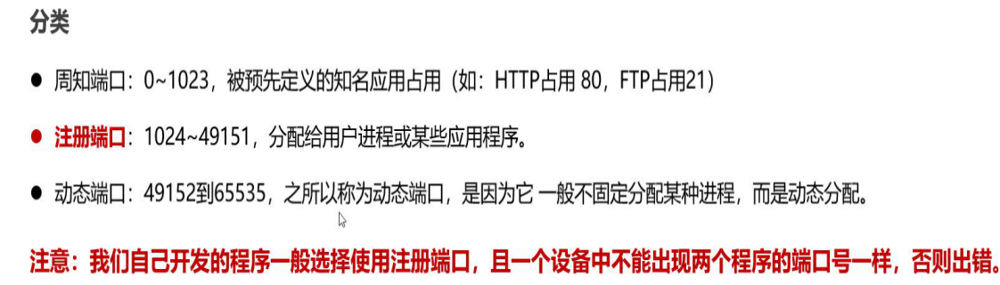

[TOC]


# 1、什么是网络编程？

可以让设备中的程序和网络其他中的程序进行数据交互的技术（实现网络通信）

==java中提供了java.net.*包下的网络编程解决方案==

## 基本通信结构（2种）


### 1、CS结构


好处：

- 更新，客户端服务端更新
- 便捷层面（不便捷）
- 效率层面
- 安全层面

### 2、BS结构


好处：

- 更新层面 客户端不需要更新，服务器端更新
- 效率层面 每次访问服务器 获取数据
- 便捷层面 只需要一个浏览器
- 安全层面 相较于CS而言不安全

混合App开发：cs套个壳的bs

# 2、网络编程三要素

## 1、IP地址

这杯在网络中的地址，唯一标识

*0.0.0.0是一个非常特殊的IP地址，这个IP相当于java中的this，代表当前设备的IP*

0.0.0.0 是对外开放，说明80端口外面可以访问；127.0.0.1 是只能本机访问，外面访问不了此端口

监听`0.0.0.0`的端口，就是监听本机中所有**IP**的端口

#### IPV4


#### IPV6


#### 如何找到域名？


#### 公网IP和内网IP


特殊IP地址


127.0.0.1回文地址

/*常用命令*/

ipconfig 常看端口号

ping 检查上网


### 获取ip常用方法


## 2、网络端口

应用程序在设备唯一标识


#### 分类




## 3、协议

连接和数据在网络中的传输规则


### UDP用户数据报协议，传输控制协议


UDP协议特点

- 无连接，不可可靠
- 
- 

### TCP协议


特点：

- 


### 三次握手


传输数据会进行确认，保证数据传输的可靠性

### 四次挥手


# 3、UDP-快速入门（了解）


/**/

### 步骤


```java
package com.shizian.UDP;


import org.slf4j.Logger;import org.slf4j.LoggerFactory;

import java.io.IOException;
import java.net.*;

/**
 * @author 施子安
 * @version 1.0
 * @date 2023/3/10 11:22
 * @Description udp客户端
 */
public class UdpClient {
    //创建日志对象
    public static final Logger LOGGER =  LoggerFactory.getLogger("UdpClient");
    public static void main(String[] args) throws IOException {
        //创建一个用于发送数据的对象
        DatagramSocket datagramSocket = new DatagramSocket();

        //创建数据包
        String str = "这里是客户端发送数据";
        byte[] bytes = str.getBytes();
        //改用其他ip
        InetAddress byName = InetAddress.getByName("192.168.172.184");
        DatagramPacket datagramPacket = new DatagramPacket(bytes,bytes.length, byName,8888);

        //发送数据
        datagramSocket.send(datagramPacket);
        LOGGER.info("客户端发送数据成功");

        //关闭
        datagramSocket.close();

    }
}

```

```java
package com.shizian.UDP;

import org.slf4j.Logger;
import org.slf4j.LoggerFactory;

import java.io.IOException;
import java.net.DatagramPacket;
import java.net.DatagramSocket;

/**
 * @author 施子安
 * @version 1.0
 * @date 2023/3/10 11:33
 * @Description 服务器端
 */
public class UdpServer {
    public static final Logger LOGGER =  LoggerFactory.getLogger("UdpServer");

    public static void main(String[] args) throws IOException {
        //创建接收数据对象,指定端口
        DatagramSocket socket = new DatagramSocket(8888);

        //创建接收的数据包
        byte[] bytes = new byte[1024 * 64];
        DatagramPacket packet = new DatagramPacket(bytes,bytes.length);

        //接收数据
        socket.receive(packet);

        //获取接收数据包中的数据

        //获取发送方地址
        String hostAddress = packet.getAddress().getHostAddress();
        //接收到的数据
        byte[] data = packet.getData();
        //接收到的有效数据
        int length = packet.getLength();
        //输出
        LOGGER.info("本次接收客户端ip{}",hostAddress);
        LOGGER.info("本次接收客户端发来的数据{}",new String(data,0,length));
    }
}

```


# 4、TCP-快速入门


## 客户端


### 步骤


## 服务端


### 步骤


# 5、TCP通信-多发多收


```java
package com.shizian.TCPAll;


import org.slf4j.Logger;
import org.slf4j.LoggerFactory;

import java.io.DataOutputStream;
import java.io.IOException;
import java.io.OutputStream;
import java.net.Socket;
import java.util.Scanner;

/**
 * @author 施子安
 * @version 1.0
 * @date 2023/3/10 14:24
 * @Description Tcp客户端
 */
public class TcpClient {
    private static final Logger LOGGER = LoggerFactory.getLogger("TcpClient");
    public static void main(String[] args) throws IOException {
        //地址
        String address = "127.0.0.1";
        //端口
        int port = 8888;
        Socket socket = new Socket(address,port);
        //搭建通道
        OutputStream ops = socket.getOutputStream();
        //将通道包装成字节数据流
        DataOutputStream dos = new DataOutputStream(ops);
        Scanner sc = new Scanner(System.in);
        LOGGER.info("请输入需要发送的数据");
        while (true){
            String line = sc.nextLine();
            dos.writeUTF(line);
            if ("exit".equalsIgnoreCase(line)) {
                //回收通道
                socket.close();
                dos.close();
                break;
            }
            LOGGER.info("TCP客户端发出数据：{}",line);
        }

    }
}

```

```java
package com.shizian.TCPAll;

import org.slf4j.Logger;
import org.slf4j.LoggerFactory;

import java.io.DataInputStream;
import java.io.IOException;
import java.io.InputStream;
import java.net.ServerSocket;
import java.net.Socket;


/**
 * @author 施子安
 * @version 1.0
 * @date 2023/3/10 14:48
 * @Description Tcp服务端
 */
public class TcpServer {
    private static final Logger LOGGER = LoggerFactory.getLogger("TcpServer");

    public static void main(String[] args) throws IOException {
        //创建服务器端接收信息的socket
        ServerSocket serverSocket = new ServerSocket(8888);

        //创建监听器
        LOGGER.info("TCP服务器端正在监听");
        Socket socket = serverSocket.accept();
        //服务器端创建连接成功
        LOGGER.info("服务器端三次握手创建连接成功{}",socket.getLocalAddress().getHostAddress());
        //创建通道
        InputStream is = socket.getInputStream();
        //包装一下通道以字节形式读取
        DataInputStream dis = new DataInputStream(is);

        while (true) {
            try {
                //读取通道数据
                String readUTF = dis.readUTF();
                //输出接收的数据
                LOGGER.info("TCP服务器端接收到的数据：{}",readUTF);
            } catch (IOException e) {
                //关闭资源
                socket.close();
                dis.close();
                break;
            }

        }
    }
}
```


# 6、TCP通信-同手接收多个客户端


```java
package com.shizian.TCPSave;


import org.slf4j.Logger;
import org.slf4j.LoggerFactory;

import java.io.DataInputStream;
import java.io.IOException;
import java.io.InputStream;
import java.net.Socket;

/**
 * @author 施子安
 * @version 1.0
 * @date 2023/3/10 15:52
 * @Description 多线程的闯将
 */
public class TcpServerRunnable implements Runnable{
    private static final Logger LOGGER = LoggerFactory.getLogger("TcpServerRunnable");
    //创建通道接口成员
    private Socket socket;

    public TcpServerRunnable(Socket socket) {
        this.socket = socket;
    }

    @Override
    public void run() {
        DataInputStream dis = null;

        try {
            //服务器端创建连接成功
            LOGGER.info("{} 服务器端三次握手创建连接成功{}",Thread.currentThread().getName(),socket.getInetAddress().getHostAddress());
            //创建通道
            InputStream is = socket.getInputStream();
            //包装一下通道以字节形式读取
            dis = new DataInputStream(is);
        } catch (IOException e) {
            throw new RuntimeException(e);
        }

        while (true) {
            try {
                //读取通道数据
                String readUTF = dis.readUTF();
                //输出接收的数据
                LOGGER.info("TCP服务器端接收到的数据：{}",readUTF);
            } catch (IOException e) {
                //关闭资源
                try {
                    socket.close();
                    dis.close();
                    break;
                } catch (IOException ex) {
                    throw new RuntimeException(ex);
                }
            }

        }
    }
}

```

```java
package com.shizian.TCPSave;

import org.slf4j.Logger;
import org.slf4j.LoggerFactory;

import java.io.DataInputStream;
import java.io.IOException;
import java.io.InputStream;
import java.net.ServerSocket;
import java.net.Socket;


/**
 * @author 施子安
 * @version 1.0
 * @date 2023/3/10 14:48
 * @Description Tcp服务端
 */
public class TcpServer {
    private static final Logger LOGGER = LoggerFactory.getLogger("TcpServer");

    public static void main(String[] args) throws IOException {
        //创建服务器端接收信息的socket
        ServerSocket serverSocket = new ServerSocket(8888);

        //创建监听器
        LOGGER.info("TCP服务器端正在监听");
        Socket socket = serverSocket.accept();
        //服务器端创建连接成功
        LOGGER.info("服务器端三次握手创建连接成功{}",socket.getLocalAddress().getHostAddress());
        //创建通道
        InputStream is = socket.getInputStream();
        //包装一下通道以字节形式读取
        DataInputStream dis = new DataInputStream(is);

        while (true) {
            try {
                //读取通道数据
                String readUTF = dis.readUTF();
                //输出接收的数据
                LOGGER.info("TCP服务器端接收到的数据：{}",readUTF);
            } catch (IOException e) {
                //关闭资源
                socket.close();
                dis.close();
                break;
            }

        }
    }
}

```


# 7、TCP通信-综合案例（群聊）


### BS架构基本原理


## 优化线程创建：线程池


