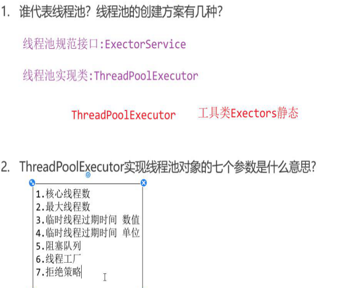

[TOC]


1. **线程：**

线程是一个程序内部的执行流程。

程序中如果只有一条执行流程，那么就称之为点线程。

​	2. **多线程：**

是指从软硬件上实现的大一调执行流程的技术（多线程有CPU负责调度执行）。

​	3. 多线程应用好处：

协同完成

​	4. ==java虚拟机默认提供一个main线程/主线程来执行mian方法==

基于main方法区调用方法

# ★★多线程创建

Java通过java.lang.Thread类对象来代表线程

## 方式一：继承Thread类

### 1、步骤


### 2、优缺点

不利于操作共享数据


### 3、注意事项


## 方式二：实现Runnable接口

线程要执行的代码抽取出来，出去出来的代码叫做线程任务

### 1、步骤


### 2、优缺点


### 3、第二种匿名内部类写法


## 方式三：实现Callable接口


### 1、步骤


```java
import java.util.concurrent.Callable;

public class MyCallable implements Callable<String> {
    
   @Override
   public String call() throws Exception {
      return "Hello Callable";
   }
   
}

```

```java
import java.util.concurrent.Callable;
import java.util.concurrent.ExecutionException;
import java.util.concurrent.FutureTask;

public class Main {

   public static void main(String[] args) throws ExecutionException, InterruptedException {
      // 1、定义一个类实现Callable接口，重写call方法，封装要做的事情，和要返回的数据；

      MyCallable myCallable = new MyCallable();
      // 2、把Callable类型的对象封装成FutureTask（线程任务对象）；
      FutureTask<String> futureTask = new FutureTask<String>(myCallable);

      // 3、把线程任务对象交给Thread对象处理；
      Thread thread = new Thread(futureTask);

      // 4、调用Thread对象的start方法启动线程；
      thread.start();

      // 5、线程执行完毕后，通过FutureTask对象的get方法去获取线程任务执行的结果，并输出。
      System.out.println(futureTask.get());
   }

}
```

总结


# Thread常用方法

线程中昌盛的变量存放在线程栈中


# 线程安全

### 1、什么是线程安全问题？

多线程==**同时***  ***操作****==同一个==**共享资源**==的时候，可能会存在业务安全问题

例子：夫妻去取钱


```java
package com.shizian.safe;

import java.time.LocalDate;

/**
 * @author 施子安
 * @version 1.0
 * @date 2023/3/8 11:56
 * @Description 账户创建
 */
public class Account {
    private String id;

    private double money;

    public Account() {
    }

    public Account(String id, double money) {
        this.id = id;
        this.money = money;
    }
    public void tackMoney(double money){
        //输出用户名称
        System.out.println(LocalDate.now() + " " + Thread.currentThread().getName() + " " + "准备开始取钱");
        //判断账户余额
        if (money <= this.money){
            System.out.println(LocalDate.now() + " " + Thread.currentThread().getName() + " " + "取钱");
            this.money -= money;
        }else {
            System.out.println("余额不足");
        }
        //显余额
        System.out.println(LocalDate.now() + " " +  "余额" + this.money + "元");

    }

    /**
     * 获取
     * @return id
     */
    public String getId() {
        return id;
    }

    /**
     * 设置
     * @param id
     */
    public void setId(String id) {
        this.id = id;
    }

    /**
     * 获取
     * @return money
     */
    public double getMoney() {
        return money;
    }

    /**
     * 设置
     * @param money
     */
    public void setMoney(double money) {
        this.money = money;
    }

    public String toString() {
        return "Account{id = " + id + ", money = " + money + "}";
    }
}

```

```java
package com.shizian.safe;

/**
 * @author 施子安
 * @version 1.0
 * @date 2023/3/8 11:58
 * @Description
 */
public class TackMoneyAccount implements Runnable {
    private Account account;

    public TackMoneyAccount(Account account) {
        this.account = account;
    }

    @Override
    public void run() {

        account.tackMoney(100000);

    }
}

```

```java
package com.shizian.safe;

/**
 * @author 施子安
 * @version 1.0
 * @date 2023/3/8 11:59
 * @Description
 */
public class Test {
    public static void main(String[] args) {
        Account account = new Account("建行1001",100000);
        //创建共享线程
        Thread thread = new Thread(new TackMoneyAccount(account),"施子安");
        Thread thread2 = new Thread(new TackMoneyAccount(account),"李华");

        thread.start();
        thread2.start();
    }
}

```


# ★★线程同步

### 1、认识线程同步

线程同步的思想：多个线程一次访问共享资源

## 解决方案

加锁：每次只允许一个线程加锁才能访问，访问完自动解锁。

### 1、同步代码块（自动释放锁）


#### **同步锁注意事项**


#### **锁对象使用规范**


- 建议使用共享资源锁对象，对于实例方法建议使用this作为锁对象
- 对于静态方法建议使用字节码（.class）对象作为锁对象

（对外只提供一个实例，单例模式）

### 2、同步方法（自动释放锁）

作用：把访问共享资源的核心方法给上锁，保证线程安全。


代码块和同步方法哪个好？


### 3、Lock锁（jdk5出现，手动解锁）


★无论是否产生异常，都需要释放锁


# 线程通信

生产者、消费者


```java
package com.itheima.pc;

import java.util.ArrayList;

//将此类定义为所有线程的共享资源
public class Desk {

    //(1)在Desk类中声明一个ArrayList集合,泛型是<String>,用于装载【厨师做出来的食物】
    private ArrayList<String> foodList = new ArrayList<>();

    //(2)将食物放在桌子上的方法
    public synchronized void put(String food) {
        try {
            if (foodList.isEmpty()) {
                System.out.println(Thread.currentThread().getName() + "做了" + food + "放到了桌子上!");
                foodList.add(food); //模拟将食物放在桌子上【添加到集合中】
            } else {
                //如果有食物,就让可以生产者进入等待状态【Cpu不会选择处于等待状态的线程执行】【会自动把锁释放掉】
                this.notifyAll();
                this.wait();
            }
        } catch (InterruptedException e) {
            e.printStackTrace();
        }
    }

    //(3)从桌子上获取食物的方法
    public synchronized void take() {
        try {
            if (!foodList.isEmpty()) {
                String food = foodList.remove(0);
                System.out.println(Thread.currentThread().getName() + "从桌子上获取了" + food + "!");
            } else {
                //如果没有食物,就可以让消费者进入到等待状态.
                this.notifyAll();
                this.wait();
            }
        } catch (InterruptedException e) {
            e.printStackTrace();
        }
    }
}

```

```java
package com.itheima.pc;

import java.util.Random;

public class PcTest {
    public static void main(String[] args) {
        String[] foodArray = new String[]{"冰糖肥肠", "九转大肠", "麻辣鱼鳞", "秋葵炒羊腰子", "鱼香肉丝"};
        Random r = new Random();
        Desk desk = new Desk();

        //模拟三个生产者线程
        new Thread(() -> {
            while (true) {
                desk.put(foodArray[r.nextInt(foodArray.length)]);
            }
        }, "小当家").start();
        new Thread(() -> {
            while (true) {
                desk.put(foodArray[r.nextInt(foodArray.length)]);
            }
        }, "小福贵").start();
        new Thread(() -> {
            while (true) {
                desk.put(foodArray[r.nextInt(foodArray.length)]);
            }
        }, "老八").start();

        //模拟两个消费者线程
        new Thread(() -> {
            while (true) {
                desk.take();
            }
        },"美食评委").start();

        new Thread(() -> {
            while (true) {
                desk.take();
            }
        },"吃货").start();
    }
}

```


### 面试题


等待队列，先进先出，jdk8 和jdk11唤醒注解作用

提高效率，唤醒等待时间最长的线程

# ★★线程池

## 1、认识线程池

### 1.1 定义：

线程池就是一个可以复用线程的技术。

### 1.2 不使用线程池的问题

- 用户每发起一个请求，后台就需要创建一个新线程来处理，下次新任务来了肯定又要创建新线程处理，而创建新线程的开销是很大的，并且请求过多时，肯定会产生大量的线程，这样会严重影响系统的性能。

### 1.3 线程池原理


==好处：复用性、管理使用顺序==

## 2、线程池创建对象


ThreadPoo lExcutor构造器


- 参数一：corePoolSize : 指定线程池的核心线程数量。             
- 参数二：maximumPoolSize：指定线程池的最大线程数量。
- 参数三：keepAliveTime ：指定临时线程的存活时间。
- 参数四：unit：指定临时线程存活的时间单位(秒、分、时、天）
- 参数五：workQueue：指定线程池的任务队列。
  - 有界阻塞队列：ArrayBlockingQueue构造的时候需要传递最大容量。
  - 误解阻塞队列：LinkedBlockingQueue构造的时候不需要传递任何参数，存放无数个。
- 参数六：threadFactory：指定线程池的线程工厂。
- 参数七：handler：指定线程池的任务拒绝策略（线程都在忙，任务队列也满了的时候，新任务来了该怎么处理）

**线程池的注意事项：**

**1、临时线程什么时候创建？**

新任务提交发现核心线程都在忙，任务队列也满了，并且还可以创建零食线程，此时才会创建临时线程。

**2、什么时候才回开始拒绝新任务？**

核心线程、任务队列、临时线程都满的时候



### 2.2 ExecutorService常用方法


创建完线程池使用excute提交

### 2.3  线程池处理Runnable任务

```java
package com.itheima.pool;

import java.util.concurrent.ArrayBlockingQueue;
import java.util.concurrent.Executors;
import java.util.concurrent.ThreadPoolExecutor;
import java.util.concurrent.TimeUnit;

public class PoolDemo1 {
    public static void main(String[] args) {
        //基于ThreadPoolExecutor的构造方法创建线程池对象
        //核心线程:【线程任务:Cpu密集型(运算):当前机器Cpu的核心数+1 Runtime.getRuntime().availableProcessors()+1】
        //核心线程:【线程任务:IO密集型(读写):当前机器Cpu的核心数*2 Runtime.getRuntime().availableProcessors()*2】
        //ThreadFactory:线程工厂 【Exectors.defaultThreadFactory】 获取默认的线程工厂
        ThreadPoolExecutor pool = new ThreadPoolExecutor(Runtime.getRuntime().availableProcessors() + 1, 15, 40L, TimeUnit.SECONDS,
                new ArrayBlockingQueue<>(3), Executors.defaultThreadFactory(), new ThreadPoolExecutor.CallerRunsPolicy());

        //可以基于线程池规范接口的execute方法提交线程任务交给线程池执行
        for (int i = 1; i <= 25; i++) {
            pool.execute(new Runnable() {
                @Override
                public void run() {
                    System.out.println(Thread.currentThread().getName() + "执行了线程任务!");
                }
            });
        }

        //AbortPolicy:默认丢弃新任务并且抛出异常
        //DiscardPolicy:默认丢弃新任务并且不抛出异常
        //DiscardOldestPolicy:默认将等待时间最长的任务丢弃,并且让新任务添加到队列中
        //CallerRunsPolicy:使用主线程执行新任务绕过当前线程池

        //线程池一旦提交任务就持久运行【想要关闭调用shutdown/shutdownNow】
        pool.shutdown();
    }
}

```


### 2.4 线程池处理Callable任务

```java
package com.itheima.pool;

import com.itheima.callable.MyCallable;

import java.util.concurrent.*;

public class PoolDemo2 {
    public static void main(String[] args) throws ExecutionException, InterruptedException {
        ThreadPoolExecutor pool = new ThreadPoolExecutor(Runtime.getRuntime().availableProcessors() + 1, 15, 40L, TimeUnit.SECONDS,
                new ArrayBlockingQueue<>(3), Executors.defaultThreadFactory(), new ThreadPoolExecutor.CallerRunsPolicy());

        //基于submit方法传递Callable线程任务让线程池执行,并且返回负责保存线程执行结果的对象
        Future<Integer> future = pool.submit(new MyCallable());
        //基于Future获取到线程执行完后返回的结果 get方法是阻塞的【会等到执行完成后才能获取到】
        Integer result = future.get();
        System.out.println("【Result】:" + result);

        pool.shutdown();
    }
}
```


### 2.5 Executors工具类实现线程池

 


```java
package com.itheima.pool;

import java.util.concurrent.*;

public class PoolDemo3 {
    public static void main(String[] args) throws ExecutionException, InterruptedException {
        //Executors.newFixedThreadPool(int threads):创建一个具有固定数量核心线程的线程池返回
        ExecutorService executorService = Executors.newFixedThreadPool(10);

        //Exectors.newSingleThreadExecutor():创建一个只有一个核心线程的线程池
        //如果是自己New的Thread没有替换线程任务的功能 只能在创建的时候传递什么任务就执行什么任务
        ExecutorService executorService2 = Executors.newSingleThreadExecutor();

        //Executors.newCachedThreadPool():返回一个没有核心线程全部都是临时线程的线程池
        ExecutorService executorService3 = Executors.newCachedThreadPool();
    }
}

```


### 面试：公司需要一个多线程，是设计一个全局线程池，还是具体场景具体分析


业务分析线程，

# 并发、并行

## 进程：

- 正在运行的程序（软件）就是一个独立的进程。

- 线程是属于进程的，一个进程中可以同时运行很多个线程。

- 进程中的多个线程其实是并发和并行执行的。

## 线程

线程是进程中的一个执行过程，一个进程至少要有一个线程，线程是cpu调度和分配的基本单位


#### 并发：（一核）

进程中的线程是由CPU负责调度执行的，但CPU能同时处理线程的数量有限，为了保证全部线程都能往前执行，CPU会轮询为系统的每个线程服务，由于CPU切换的速度很快，给我们的感觉这些线程在同时执行，这就是并发。

#### 并行：（多核）

在同一时刻，同时有多个线程被CPU调度执行


```
并发：两个或多个事件在同⼀时间间隔发⽣。
并⾏：两个或者多个事件在同⼀时刻发⽣。
并⾏是真正意义上，同⼀时刻做多件事情，⽽并发在同⼀时刻只会做⼀件事件，只是可以将时间切碎，交替做多件事情。
并⾏在多处理器系统中存在，⽽并发可以在单处理器和多处理器系统中都存在，并发能够在单处理器系统中存在是因为并发是并⾏的假象，并⾏要求程序能够同时执⾏多个操作，⽽并发只是要求程序假装同时执⾏多个操作（每个⼩时间⽚执⾏⼀个操作，多个操作快速切换执⾏）。
当系统有⼀个以上 CPU 时，则线程的操作有可能⾮并发。当⼀个 CPU 执⾏⼀个线程时，另⼀个 CPU 可以执⾏另⼀个线程，两个线程互不抢占 CPU 资源，可以同时进⾏，这种⽅式我们称之为并⾏（Parallel）。
并发编程的⽬标是充分的利⽤处理器的每⼀个核，以达到最⾼的处理性能。
```

## 面试题：==TimeUnit.MILLISECONDS.sleep(0)是什么意思？==

一瞬间让一下资源；放弃现在申请的资源

# ==★★★★线程的声明周期（面试）==

线程6种状态相互转换

有锁、无锁


/*两种情况答题*/

**线程状态**

**NEW 创建状态,创建了对象但是还没有start**

**RUNNABLE 调用了start 进入了就绪状态,并不代表正在执行,开始抢占Cpu资源**

**BLOCKED 阻塞状态** **运行时等待 被synchronized阻断**（没有抢到锁）

**WAITING**  **线程wait等待其他线程唤醒**

**TIMED_WAITING** **等待状态 有时间的等待 wait传了时间 SLEEP 都是等待状态**

**TERMINATED 执行结束**

### 面试题wait（）和sleep（）方法又什么区别？

