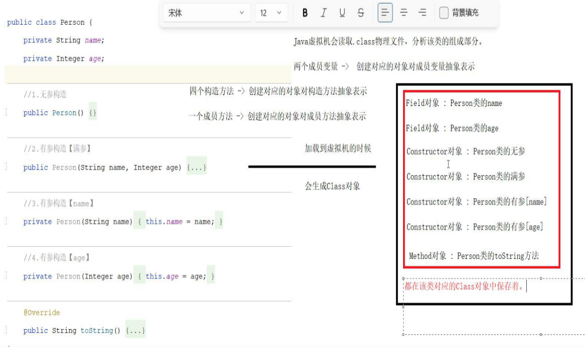

[TOC]


# ★单元测试

针对于最小的功能单元来进行测试

## Junit框架快速入门


## Junit框架常见注解


Before资源初始化 资源的释放


补充：

```java
package com.shizian.junit;

import org.junit.*;

/**
 * @author 施子安
 * @version 1.0
 * @date 2023/3/11 9:48
 * @Description c单元测试
 */
public class CalcTest {
    private static Calc calc;

    @BeforeClass//修饰静态方法，在所有测试方法之前加载一次
    public static void beforeClass(){
        System.out.println("beforeClass，calc对象创建成功");
        calc = new Calc();
    }

    @AfterClass//修饰静态方法，在所有测试方法之后加载一次
    public static void afterClass(){
        System.out.println("afterClass======");
    }

    @Before//修饰实例方法，每个测试方法之前加载一次
    public void Before(){
        System.out.println("Before======");
    }
    @After//修饰实例方法，每个测试方法之后加载一次
    public void After(){
        System.out.println("After======");
    }

    @Test
    public void addCalc(){
        calc.add(10,10);
    }
    @Test
    public void minCalc(){
        calc.minus(10,10);
    }
    @Test
    public void divCalc(){
        calc.divide(10,10);
    }
    @Test
    public void muCalc(){
        calc.multiply(10,10);
    }

}

```

```tex
beforeClass，calc对象创建成功
Before======
numberOne + numberTwo = 20
After======
Before======
numberOne - numberTwo = 0
After======
Before======
numberOne / numberTwo = 1
After======
Before======
numberOne * numberTwo = 100
After======
afterClass======
```


# ★★★反射reflection

## 认识反射、获取类

反射：加载类，并允许以编程的方式解剖类中的成分（成员变量、方法、构造器）


### 获取Class对象三种方式





### 总结：

什么是反射？（x光片）/**/

## 获取类的构造器

declared：公告的，公开的

#### 获取构造器API


#### 创建对象


```java
package com.shizian.reflect.constructor;

import com.shizian.entity.Student;

import java.lang.reflect.Constructor;
import java.lang.reflect.InvocationTargetException;
import java.util.Arrays;

/**
 * @author 施子安
 * @version 1.0
 * @date 2023/3/11 11:18
 * @Description 构造器反射获取对象
 */
public class ReflectConstructorDemo {
    public static void main(String[] args) throws NoSuchMethodException, InvocationTargetException, InstantiationException, IllegalAccessException {
        //获取student在编译期的Class类
        Class<Student> studentClass = Student.class;
        //获取student任意一个的构造器
        //无参构造
        Constructor<Student> noConstructor = studentClass.getDeclaredConstructor();
        //部分参数构造
        Constructor<Student> nameConstructor = studentClass.getDeclaredConstructor(String.class);
        //允许访问构造私有化
        nameConstructor.setAccessible(true);

        //获取student所有构造器
        Constructor<?>[] allConstructors = studentClass.getDeclaredConstructors();
        //循环所有构造器
//        Arrays.stream(allConstructors).forEach(constructor -> System.out.println("collect:" + constructor));
        Arrays.stream(allConstructors).forEach(System.out::println);
        System.out.println("==================================");

        //创建student对象
        Student student = noConstructor.newInstance();
        Student studentName = nameConstructor.newInstance("施子安");
        System.out.println("无参构造" + student);
        System.out.println("name有参构造" + studentName);


    }
}

```

==jdk8之前可以反射工具类==


## 获取类的成员变量


==只封装属性和属性的类型，不封装值==

#### 获取成员变量


#### 操作成员变量


```java
import com.shizian.entity.Student;

import java.lang.reflect.Constructor;
import java.lang.reflect.Field;
import java.lang.reflect.InvocationTargetException;

/**
 * @author 施子安
 * @version 1.0
 * @date ${DATE} ${TIME}
 * @Description ${Description}
 */
public class Main {
    public static void main(String[] args) throws NoSuchMethodException, InvocationTargetException, InstantiationException, IllegalAccessException, NoSuchFieldException {

        Class<Student> studentClass = Student.class;
        
        Constructor<Student> constructor = studentClass.getDeclaredConstructor();
        constructor.setAccessible(true);
        
        Student student = constructor.newInstance();
        
        Field namefiel = studentClass.getDeclaredField("name");
        namefiel.setAccessible(true);
        namefiel.set(student,"shizian");

        System.out.println(namefiel.get(student));
    }
}
```


#### 案例：任意对象内容打印写入文件中

```java
package com.shizian.reflect.constructor;

import com.shizian.entity.Coder;
import com.shizian.entity.Student;

import java.io.FileWriter;
import java.io.IOException;
import java.io.PrintWriter;
import java.lang.reflect.Field;

/**
 * @author 施子安
 * @version 1.0
 * @date 2023/3/11 12:10
 * @Description 将任意对象内容写进文件中
 */
public class RelectPrintWrite {
    public static void main(String[] args) throws IOException, IllegalAccessException {
        Student student = new Student("施子安", 18, 100);
        Coder coder = new Coder("李华","java");
        setWrite(student);
        setWrite(coder);
    }

    private static void setWrite(Object obj) throws IOException, IllegalAccessException {
        //创建打印流
        PrintWriter writer = new PrintWriter(new FileWriter("day14-reflect\\obj.txt",true));
        //获取对象
        Class<?> clazzs = obj.getClass();
        //打印标题
        String name = clazzs.getName();
        int i = name.lastIndexOf(".");
//        String[] split = name.split("\\.");
//        String s = split[name.split("\\.").length - 1];
        writer.println("========" + name.substring(i+1) + "========" );
        //获取属性
        Field[] fields = clazzs.getDeclaredFields();
        //循环打印
        for (Field field : fields) {
            //获取属性名称
            String fieldName = field.getName();
            //暴力开启反射
            field.setAccessible(true);
            //获取属性值
            Object fielValue = field.get(obj);
            //写入到流中
            writer.println(fieldName + "=" + fielValue);
        }
        //关闭流
        writer.close();
    }
}

```


## 获取类的成员方法

==getMethods（）能拿到父类方法==


### 作用应用场景

反射作用？

/**/

### 案例：读取配置文件properties中内容，利用反射调用方法

```java
package com.shizian.reflect.constructor;

import java.io.FileInputStream;
import java.io.IOException;
import java.lang.reflect.Constructor;
import java.lang.reflect.InvocationTargetException;
import java.lang.reflect.Method;
import java.util.Properties;

/**
 * @author 施子安
 * @version 1.0
 * @date 2023/3/11 15:18
 * @Description 读取配置文件内容进行反射
 */
public class ReflectProperties {
    public static void main(String[] args) throws IOException, ClassNotFoundException, NoSuchMethodException, InvocationTargetException, InstantiationException, IllegalAccessException {
        //读取配置文件内容
        Properties prop = new Properties();
        //记载配置文件路径
        prop.load(new FileInputStream("day14-reflect\\info.properties"));

        //读取配置文件内容
        String className = prop.getProperty("class-name");
        String classMethod = prop.getProperty("class-method");

        //创建反射对象
        Class<?> aClass = Class.forName(className);
        Constructor<?> constructor = aClass.getDeclaredConstructor(String.class,String.class);
        constructor.setAccessible(true);
        Object o = constructor.newInstance("施子安","java");

        //记载反射方法
        Method method = aClass.getDeclaredMethod(classMethod,String.class);
        method.setAccessible(true);
        //调用方法
        method.invoke(o,"python");


    }
}

```

### 泛型擦除


## 总结


# ★★注解Annotation

## 概述、自定义注解


### 自定义注解

```java
public @interface 注解名称{
    public 属性类型 属性名() default 默认值;
}
```


### 注解原理


==使用注解赋值，设置返回值==

#### 注解的作用？


## 元注解

**用于标记注解的注解**


## 注解的解析

#### 什么是注解解析？


## 应用场景

### 案例模拟Junit框架

```java
package com.shizian.annotation;

import com.shizian.junit.Calc;

import java.lang.reflect.InvocationTargetException;
import java.lang.reflect.Method;
import java.util.Arrays;

/**
 * @author 施子安
 * @version 1.0
 * @date 2023/3/11 17:17
 * @Description ceshi1
 */
public class JunitAnnotationTest {
    public static void main(String[] args) {
        //加载类的所有方法
        Class<Calc> calcClass = Calc.class;
        Method[] methods = calcClass.getDeclaredMethods();
        Calc calc = new Calc();
        //判断循环
        Arrays.stream(methods).forEach(method -> {
            //判断当前方法是否引用注解
            if (method.isAnnotationPresent(JunitAnnotation.class)){
                try {
                    method.invoke(calc,10,10);
                } catch (IllegalAccessException e) {
                    throw new RuntimeException(e);
                } catch (InvocationTargetException e) {
                    throw new RuntimeException(e);
                }
            }
        });
    }
}

```

```java
package com.shizian.annotation;

import java.lang.annotation.ElementType;
import java.lang.annotation.Retention;
import java.lang.annotation.RetentionPolicy;
import java.lang.annotation.Target;

/**
 * @author 施子安
 * @version 1.0
 * @date 2023/3/11 17:15
 * @Description 模拟junit
 */
@Target({ElementType.METHOD,ElementType.TYPE})
@Retention(RetentionPolicy.RUNTIME)
public @interface JunitAnnotation {
}

```


# ★★动态代理proxy

## 程序为什么需要 代理？代理样子？


 

## 解决实际问题、掌握使用代理的好处

JDK动态代理有一个类就可以动态代理，前提实现接口

# 类加载器