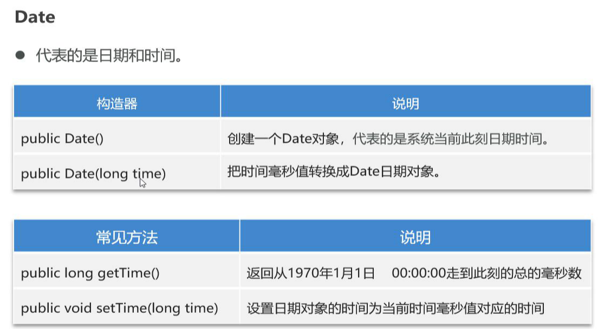

[TOC]


# StringBuilder

容器，字符串可以发生改变，操作字符串（回顾string）

StringBulider在用于字符串拼接效率高

#### 1、构造方法


#### 2、常用方法


空格算长度，而空字符不算长度


#### 3、StringBuilder与StringBuffer和String区别（内存中可变，堆区）


# StringJoiner（JDK8）

#### 1、卫函数


指定拼接分隔符


CharSequense字符规范


2、StringJoiner字符串反转转换格式

```java
package com.shizian.d1_advanced_StringJoiner;

import java.util.StringJoiner;

/**
 * @author 施子安
 * @version 1.0
 * @date 2023/2/25 10:40
 * @Description 字符串1换格式
 */
public class StringJoinerTest {
    //定义一个常量字符串
    public static final String BASE_ARRD = "[1,2,3]";
    public static void main(String[] args) {
        //定义一个stringjoiner定义规则
        StringJoiner stringJoiner  = new StringJoiner(".","[","]");
        System.out.println("之前字符串" + BASE_ARRD);
        //截取中括号
        String str = BASE_ARRD.substring(1, BASE_ARRD.length() - 1);
        //截取中间“，”
        String[] split = str.split(",");
        //倒序插入
        for (int i = split.length - 1; i >= 0; i--) {
            stringJoiner.add(split[i]);
        }
        //输出
        System.out.println("反转后字符串" + stringJoiner.toString());
    }
}

```

# Math

#### 1、工具类，静态方法，**构造方法私有化**


#### 2、round四舍五入只看小数点后一位


#### 3、静态导包（补充）


static修饰变量、方法、代码块、内部类、静态导包

# System

程序所在的系统，工具类

#### 1、常见方法


# Runtime

1、代表程序所处运行环境


2、常见方法


long返回字节单位

```java
package com.shizian.d4_advanced_Runtime;

import java.io.IOException;

/**
 * @author 施子安
 * @version 1.0
 * @date 2023/2/25 13:04
 * @Description 程序所处运行环境
 */
public class RuntimeTest {
    public static void main(String[] args) throws IOException, InterruptedException {
        Runtime runtime = Runtime.getRuntime();
        System.out.println("Java虚拟机可用的处理器数" + runtime.availableProcessors());
        System.out.println("Java虚拟机中的内存总量 " + runtime.totalMemory());
        System.out.println("Java虚拟机中的内存总量 " + runtime.totalMemory() / 1024 / 1024 + "GB");
        System.out.println("Java虚拟机中的可用内存" + runtime.freeMemory());
        Process exec = runtime.exec("E:\\HBuilderX\\HBuilderX.exe");

        Thread.sleep(10000);
        exec.destroy();

    }
}

```


# BigDecimal

#### 1、用于解决浮点型运算精度失真问题


#### 2、使用bigdecimal保证精度，但是返回的是BigDecimal，需要采用doubleValue（），转成double

#### 3、面试

###### （1）BigDecimal的equals（）方法逐位比较

10.0和10常规意义一样，但是逐个位置比较，原理string；所以返回false


###### （2）equals与==面试问题


**基本数据类型**

==比较的是内容数值，

**引用数类型**

==比较对象地址 ，equals（引用类型使用）重写方法比较的是内容是否相等，没有重写比较的是地址例如Objects.equals（）比较的就是地址。

**业务逻辑**

但是具体业务逻辑，有时候比较的不是内容

# JDK8之前传统的日期、时间

## Date

#### 1、用途

==时间点==，代表日期和时间，2023年2月25日15:33:18



#### 2、java中有两个Date类☆

java.util.Date另一个java.sql.Date，他是util的子类

```java
package com.shizian.d4_advanced_Date;


import java.util.Date;

/**
 * @author 施子安
 * @version 1.0
 * @date 2023/2/25 16:30
 * @Description 时间api
 */
public class DateTest {
    public static void main(String[] args) {
        //创建当前时间对象无参构造
        Date dateOne = new Date();
        System.out.println(dateOne.getTime());
        System.out.println("[dateOne]" + dateOne);
        //有参构造距离时间原点过去的时间毫秒所在的日期
        Date dateTwo = new Date(1000);
        System.out.println("[dateTwo]" + dateTwo);

        //getTime方法获取对象的时间与1970年1月1日0时0分0秒这个时间相差多少秒。
        //currentTimeMillis距离事件原点所过去的时间
        long currentTimeMillis = System.currentTimeMillis();
        System.out.println("currentTimeMillis距离事件原点所过去的时间" + currentTimeMillis);
        long time = dateOne.getTime();
        System.out.println("getTime距离事件原点所过去的时间" + time);
        System.out.println("getTime距离事件原点所过去的时间" + dateOne.getTime());

        //设置距离1970 1 1过去多少毫秒的时间
        dateOne.setTime(20000000L);
        System.out.println("[dateOne]" + dateOne);
    }
}

```


## SimpleDateFormat


```java
package com.shizian.d7_advanced_SimpleDateFormat;


import java.text.ParseException;
import java.text.SimpleDateFormat;
import java.util.Date;

/**
 * @author 施子安
 * @version 1.0
 * @date 2023/2/25 20:46
 * @Description 日期格式化
 */
public class SimpleDateFormatTest {
    static final String FORMAT = "yyyy-MM-dd HH:mm:ss";
    public static void main(String[] args) throws ParseException {
        Date date = new Date();
        //时间格式声明
        SimpleDateFormat format = new SimpleDateFormat(FORMAT);
        String s = format.format(date);
        System.out.println(s);
        System.out.println("毫秒：" + format.format(200000000L));

        /**
         * 解析字符串
         */

        Date parse = format.parse(s);
        System.out.println("解析字符串" + parse);

    }
}

```


## Calendar

#### 1、作用

导标的是系统看刺客时间对应的日历，通过他可以单独获取唏嘘该时间中的年、月、日、时、分、秒


**注意：****calendar****是可变对象，一旦修改后其对象本身表示的时间将产生变化。**


```java
package com.shizian.d4_advanced_Calendar;

import java.util.Calendar;
import java.util.Date;
import java.util.Scanner;

/**
 * @author 施子安
 * @version 1.0
 * @date 2023/2/25 17:07
 * @Description输入一个年份判断该2月有多少天
 */
public class CalendarTest {
    public static void main(String[] args) {
        Scanner sc = new Scanner(System.in);
        System.out.println("请输入年");
        int year = sc.nextInt();

        //获取指定日期对象
        Calendar calendar = Calendar.getInstance();
        //设置时间
        calendar.set(year,Calendar.MARCH,1);
        //向前推一天,DAY_OF_MONTH该月的第一天
        calendar.add(Calendar.DAY_OF_MONTH,-1);
        int day = calendar.get(Calendar.DAY_OF_MONTH);
        System.out.println(year + "年2月有" + day);


        /**
         * 设置当前对象的时间
         */
        //获取一个表示当前时间点的子类对象
        Calendar cTwo = Calendar.getInstance();
        cTwo.set(Calendar.YEAR,2008);
        cTwo.set(Calendar.MONDAY,2);
        cTwo.set(Calendar.DAY_OF_MONTH,1);
        System.out.println(cTwo.get(Calendar.YEAR));
        System.out.println(cTwo.get(Calendar.MONDAY) + 1);
        System.out.println(cTwo.get(Calendar.DAY_OF_MONTH));//在Calendar类中月份表示从0开始【0:1月】 => 获取的时候要默认对结果进行+1

        //最后计算完成之后:将Calendar转换为Date【MySQL:就要Date】 public Date getTime() : 将Calendar表示的时间点转换为Date对象
        Date time = cTwo.getTime();
        System.out.println("【time】:" + time);

    }
}

```


# JDK8之后传统的日期、时间


==**都在java.time包下**==


### LocalDate、LocalDateTime、LocalTime


```java
package com.shizian.d8_advanced_LocalDateTime;

import java.time.LocalDateTime;

/**
 * @author 施子安
 * @version 1.0
 * @date 2023/2/25 21:44
 * @Description 可以获取年月日时分秒直接获取
 */
public class LocalDateTimeTest {
    public static void main(String[] args) {


        //获取当前系统指定时间对象
        LocalDateTime time = LocalDateTime.now();
        System.out.println("[time] " + time.toString());

        //返回表示指定时间点的LocalDateTime对象
        LocalDateTime of = LocalDateTime.of(2000, 9, 20, 15, 30, 00, 1000);
        System.out.println("[of]" + of);

        //获取指定字段的日期
        System.out.println("当前年【year】"+ time.getYear());

        //修改指定时间，例如今天几点放学
        LocalDateTime localDateTime = time.withHour(21).withMinute(30);
        System.out.println("[今天放学时间]" + localDateTime);
        //添加时间例如两天后2小时是什么时间
        LocalDateTime plusHours = time.plusDays(2).plusHours(2);
        System.out.println("[两日后是是几小时]" + plusHours);

        //判断两个日期对象是否相等
        System.out.println("判断两个日期对象是否相等" + time.equals(plusHours));

        //判断日期对象是否在前
        System.out.println("判断日期对象是否在前" + time.isBefore(plusHours));

        //判断日期对象是否在后
        System.out.println("判断日期对象是否在后" + time.isAfter(plusHours));
    }
}

```


## DateTimeFormatter

格式化转换


## ZoneId、ZonedDateTime

时间区域


ZoneId表示时区id：洲名/城市名  国家名/城市名

```java
import java.time.ZoneId;
import java.time.ZonedDateTime;

/**
 * @author 施子安
 * @version 1.0
 * @date ${DATE} ${TIME}
 * @Description ${Description}
 */
public class Main {
    public static void main(String[] args) {
        for (String availableZoneId : ZoneId.getAvailableZoneIds()) {

        }

        ZoneId zoneId = ZoneId.systemDefault();
        System.out.println(zoneId);

        ZoneId of = ZoneId.of("America/New_York");
        System.out.println("时区对象"+ of);

        //封装zoneddatetime
        ZonedDateTime now = ZonedDateTime.now(of);
        System.out.println("获取指定位置时区信息时间" + now);

    }
}
```


## Instant

毫秒值，时间上线某一时刻时间戳


## Period、Duration

时间间隔计算


# double

Double类compare()法compare()方法在java.lang包中可用。

compare()方法用于检查给定两个双精度值的相等或不相等，换句话说，可以说此方法用于比较两个双精度值。

compare()方法是一个静态方法，也可以使用类名进行访问，如果尝试使用类对象访问该方法，那么也不会出错。

比较双精度值时，compare()方法不会引发异常。

语法：public static int compare(double value1, double value2);

参数：double value1，double value2 –这些参数表示要比较的double值。

返回值：

此方法的返回类型为int，它返回一个整数值。在第一种情况下，如果value1在数学上等于value2 ，则它返回0。

在第二种情况下，如果value1在数学上小于value2 ，则它返回值<0。

在第三种情况下，如果value1在数学上大于value2 ，则返回值> 0。
