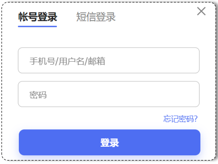
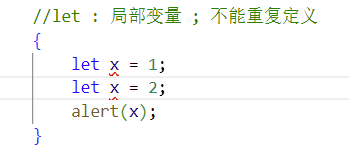

[TOC]


# 1 前端开发介绍

前端开发，主要开发的是网页。

那么要开发出上面的网页，需要使用到哪些技术呢？

万维网联盟（ World Wide Web Consortium ），创建于1994年10月，主要工作是对 web 进行标准化。

该组织定义了网页的开发需要如下3门技术：

- HTML:定义网页的结构
- CSS: 定义网页的表现，样式
- JavaScript: 定义网页的行为

当然了，随着技术的发展，我们为了更加快速的开发，对前端做了封装，衍生出了很多前端框架。例如：vue,elementui等等


前端的3天课程安排如下：

 


# 2 HTML

## 2.1 介绍&快速入门

### 2.1.1 HTML介绍

HTML（HyperText Markup Language）：超文本标记语言。那么什么是超文本呢？超文本就是超越了文本的限制，比普通文本更强大。除了文字信息，还可以定义图片、音频、视频等内容。对于标记语言的理解是：由标签构成的语言，HTML中的标签都是预定义好的。我们之前学过的xml就是标记语言，都是一个个的标签，如下图所示就是一个xml的案例：

 

下面展示的是一段html代码经过浏览器解析，呈现的效果如右图所示：

 


### 2.1.2 快速入门

接下来我们开始html的快速入门

第一步:创建一个名为HTML的文件夹，然后找到课程资料中的1.jpg文件放到该目录下，此时HTML文件夹中内容如下：

 


第二步：创建一个文本文件，然后修改文件名为hello.html,注意文件的后缀是.html,如下图所示：

 


第三步：选中文件，鼠标右击，选择使用记事本打开文件，并且编写前端代码:

首先html有固定的基本结构：

~~~html
<html>
	<head>
    	<title> </title>
    </head>
    <body>
        
    </body>
</html>
~~~


其中&lt;html&gt;是根标签，&lt;head&gt;和&lt;body&gt;是子标签，&lt;head&gt;中的字标签&lt;title&gt;是用来定义网页的标题的，里面定义的内容会显示在浏览器网页的标题位置，如下图红框内容所示：

 


然后&lt;body&gt;中的内容会显示在浏览器的内容区域，如下图红框内容所示：

 


当然了，上图展示的是黑色加粗的字体，所以咱们可以使用&lt;h1&gt;标签来包裹文本内容，代码如下

~~~html
<html>
	<head>
		<title>HTML 快速入门</title>
	</head>
	<body>
		<h1>Hello HTML</h1>
	</body>
</html>
~~~

此时我们通过浏览器打开，同学们是不是看到如上图所示的效果了。那么我们说html是超文本标记语言，还能修饰超文本，所以我们可以通过&lt;img&gt;来引入图片，其中该标签的src属性，用来指定图片的地址，代码如下：

~~~html
<HTml>
	<head>
		<title>HTML 快速入门</title>
	</head>
	<body>
		<h1>Hello HTML</h1>
		</img>
	</body>
</html>
~~~

然后选中文件，鼠标右击，选择使用浏览器打开文件，浏览器呈现效果如下:

 


我们的快速入门案例就到此结束了，我们需要知道html有其基本的结构如下：

~~~html
<html>
	<head>
    	<title> </title>
    </head>
    <body>
       
    </body>
</html>
~~~

&lt;title&gt;中定义标题显示在浏览器的标题位置，&lt;body&gt;中定义的内容会呈现在浏览器的内容区域


## 2.2 开发工具

我们通过快速入门案例，发现由记事本文件开发html是非常不方便的，所以接下来我们需要学习一款前端专业的开发工具VS Code。Visual Studio Code（简称 VS Code ）是 Microsoft 于2015年4月发布的一款代码编辑器。VS Code 对前端代码有非常强大的支持，同时也其他编程语言（例如：C++、Java、Python、PHP、Go等）。VS Code 提供了非常强大的插件库，大大提高了开发效率。官网： https://code.visualstudio.com


详细安装教程：参考 **资料/VSCode安装/安装文档/VS Code安装文档.md**

 


**需要注意的是，我们作为一名开发者，不应该将软件软装在包含中文名的路径中**


## 2.3 基础标签

html的预定义标签有很多，我们将来进入公司主要做后台开发的，所以，我们学习前端的html标签，只要学习一些基本的常见的即可

### 2.3.1 文本标签

文本标签顾名思义，都是用来修饰文本的，包括标题，段落，加粗等，具体需要学习的标签以及代表的含义如下表格所示：

| 标签                    | 描述                               |
| ----------------------- | ---------------------------------- |
| &lt;h1&gt; ~ &lt;h6&gt; | 定义标题，h1最大，h6最小           |
| &lt;font&gt;            | 定义文本的字体、字体大小、字体颜色 |
| &lt;b&gt;               | 定义粗体文本                       |
| &lt;i&gt;               | 定义斜体文本                       |
| &lt;u&gt;               | 定义文本下划线                     |
| &lt;center&gt;          | 定义文本居中                       |
| &lt;p&gt;               | 定义段落                           |
| &lt;br&gt;              | 定义折行                           |
| &lt;hr&gt;              | 定义水平线                         |


#### 2.3.1.1 标题标签

接下来我们需要通过VS Code开发工具来开发html，演示上述标签的作用，首先我们给大家演示标题标签

第一步：首先我们需要打开VS Code工具，点击File->Open Folder->选择之前快速入门创建的html目录


第二步：然后我们需要创建一个文件，并且给文件重命名，注意文件的后缀是.html

 

第三步：在文件中编写代码：

我们需要先定义html的基本结构，在VS Code中，我们只需要在开始输入! ，就可以输出html的基本模板了，如下图所示：


然后我们首先需要学习的是标题标签&lt;h1&gt;定义最大的标题，&lt;h6&gt;定义最小的标题，代码如下：

~~~html
<!-- 标识当前文档是HTML5 -->
<!DOCTYPE html>
<html lang="en">
<head>
    <!-- 字符集 -->
    <meta charset="UTF-8">
    <!-- 浏览器兼容问题 -->
    <meta http-equiv="X-UA-Compatible" content="IE=edge">
    <meta name="viewport" content="width=device-width, initial-scale=1.0">
    <title>HTML-基础文本标签</title>
</head>
<body>
    <h1>标题1</h1>
    <h2>标题2</h2>
    <h3>标题3</h3>
    <h4>标题4</h4>
    <h5>标题5</h5>
    <h6>标题6</h6>
</body>
</html>
~~~

可以通过浏览器打开查看效果：具体操作如下：

**注意：需要安装open in browser插件，可以参考安装教程**


然后浏览器中呈现如下所示的效果：

 


#### 2.3.1.2 字体标签（了解）

当然了，我们经常在网页上可以看到五颜六色的文字，在html中，我们可以通过&lt;font&gt;标签来修饰，标签的具体含义和属性如下表所示：

| 标签         | 属性  | 描述                                        |
| ------------ | ----- | ------------------------------------------- |
| &lt;font&gt; |       | 字体标签，修饰文本的颜色、大小、样式        |
|              | color | 设置文本的颜色                              |
|              | size  | 设置文本的大小，取值为1-7，其中1最小，7最大 |
|              | face  | 用来设置字体。如 "楷体"、"宋体"等           |

对于color属性取值有3种，分别是

- **英文单词**：颜色的单词，例如red,blue等等，但是表示的颜色有限制
- **rgb(值1，值2，值3)**：三原色表示法，取值范围为0-255之间
- **#值1值2值3**：还是三原色表示法，上述的简写方式，取值是16进制法，所以在00-FF之间

我们可以添加如下代码：

~~~html
 <font color="#00FF00" size="6" face="楷体">HTML,基础标签</font>
~~~

浏览器打开效果如下：

 


#### 2.3.1.3 水平线标签

当然了，我们也会在网页中看到水平线，是通过&lt;hr&gt;标签来实现的，添加如下代码即可：

~~~
<hr>
~~~

浏览器打开呈现的效果如下图所示：


#### 2.3.1.4 居中标签

我们上述绿色的文本是靠左的，在浏览网页的时候，我们有时看到的文本内容是居中的，这是怎么做到的呢？一个简单的&lt;center&gt;标签即可做到。添加如下代码：

~~~html
<center>HTML</center>
<hr>
~~~

浏览器刷新观察效果如图所示：


#### 2.3.1.5 斜体、加粗、下划线标签（了解）

网页中，我们也经常看到一些斜着或者加粗或者有下滑线的字体，可以通过如下标签来实现

| 标签      | 描述   |
| --------- | ------ |
| &lt;b&gt; | 加粗   |
| &lt;i&gt; | 斜体   |
| &lt;u&gt; | 下划线 |

添加如下代码：

~~~html
HTML 
<i>HTML</i> 
<b>HTML</b> 
<u>HTML</u>
<hr>
~~~

浏览器效果如下图所示：


#### 2.3.1.6 换行标签

上述的案例中，我们发现4个html全部显示在一行，不是非常方便观察，此时如果能够4个html在一列中显示，对比会更加明显，所以我们怎么去换行呢？可以通过&lt;br&gt;标签,修改上述代码如下：

~~~html
HTML <br>
<i>HTML</i> <br>
<b>HTML</b> <br>
<u>HTML</u> <br>
<hr>
~~~

浏览器重新刷新效果如下所示：


#### 2.3.1.7 段落标签

添加如下文本和代码：

~~~html
已经有包括上汽、吉利、百度、斑马智行等20余家汽车、自动驾驶相关企业在沪开放体验。<br>
而在更南的位置，粤港澳大湾区在广州、深圳二城的引领下，正在自动驾驶赛道上加速。
<hr>
~~~

刷新浏览器效果如图所示：


我们通过换行标签对文本进行换行，但是行之间太紧密了，此时我们可以使用&lt;p&gt;段落标签来修饰，添加如下代码：

~~~html
<p>已经有包括上汽、吉利、百度、斑马智行等20余家汽车、自动驾驶相关企业在沪开放体验。</p>
<p>而在更南的位置，粤港澳大湾区在广州、深圳二城的引领下，正在自动驾驶赛道上加速。</p>
~~~

刷新浏览器如图所示：

 

此时看着更加舒服。


此时我们的文本标签就讲解完毕了，全部代码如下：

~~~html
<!-- 标识当前文档是HTML5 -->
<!DOCTYPE html>
<html lang="en">
<head>
    <!-- 字符集 -->
    <meta charset="UTF-8">
    <!-- 浏览器兼容问题 -->
    <meta http-equiv="X-UA-Compatible" content="IE=edge">
    <meta name="viewport" content="width=device-width, initial-scale=1.0">
    <title>HTML-基础文本标签</title>
</head>
<body>
    <h1>标题1</h1>
    <h2>标题2</h2>
    <h3>标题3</h3>
    <h4>标题4</h4>
    <h5>标题5</h5>
    <h6>标题6</h6>
    
    <!-- 
        HTML颜色描述:
            1. 英文单词: red, green, blue
            2. RGB(值1, 值2, 值3): 红色, 绿色, 蓝色 ---- 0-255  (不推荐)
            3. #值1值2值3 : 红色, 绿色, 蓝色 ----------- 00-FF (十六进制)
     -->
    <font color="#00FF00" size="6" face="楷体">HTML,基础标签</font>

    <hr>

    <center>HTML</center>

    <hr>

    HTML <br>
    <i>HTML</i> <br>
    <b>HTML</b> <br>
    <u>HTML</u> <br>

    <hr>

    已经有包括上汽、吉利、百度、斑马智行等20余家汽车、自动驾驶相关企业在沪开放体验。<br>

    而在更南的位置，粤港澳大湾区在广州、深圳二城的引领下，正在自动驾驶赛道上加速。

    <hr>

    <p>已经有包括上汽、吉利、百度、斑马智行等20余家汽车、自动驾驶相关企业在沪开放体验。</p>

    <p>而在更南的位置，粤港澳大湾区在广州、深圳二城的引领下，正在自动驾驶赛道上加速。</p>
    
</body>
</html>
~~~

整个网页效果如下图所示：


### 2.3.2 图片音频视频标签

我们在浏览网页的时候，经常看到网页上有图片、视频，音频等，那么如何再网页上嵌入图片等元素呢？所以接下来我们需要学习相关的标签以及含义如下表所示：

| 标签          | 属性     | 描述                                 |
| ------------- | -------- | ------------------------------------ |
| &lt;img&gt;   |          | 在页面上引入图片的                   |
|               | height   | 用来定义图片的高度                   |
|               | width    | 用来定义图片的宽度                   |
|               | src      | 规定显示图像的 url（统一资源定位符） |
|               | alt      | 图片找不到显示什么                   |
| &lt;audio&gt; |          | 定义音频(支持MP3、MAV、OGG)          |
|               | src      | 规定音频的 url                       |
|               | controls | 显示播放控件                         |
| &lt;video&gt; |          | 定义视频(支持MP4、WebM、OGG)         |
|               | src      | 规定视频的 url                       |
|               | controls | 显示播放控件                         |

接下来我们需要通过VS Code开发工具来开发html，演示上述标签的作用

第一步：首先在html目录下分别创建用于存放视频，音频，图片的video,audio,img文件夹，然后讲资料提供的视频，音频，图片分别复制到对应的目录下，最后效果如下图所示：

 


第二步：创建名为02. HTML-图片音频视频标签.html的文件

 


然后我们编写3个标签，分别去引入资源

~~~html
<!DOCTYPE html>
<html lang="en">
<head>
    <meta charset="UTF-8">
    <meta http-equiv="X-UA-Compatible" content="IE=edge">
    <meta name="viewport" content="width=device-width, initial-scale=1.0">
    <title>HTML-图片音视频标签</title>
</head>
<body>
    
    <!-- 
        路径: 
            1. 绝对路径: 绝对磁盘路径 , 绝对网络路径
            2. 相对路径: 
                当前路径: .     ./img/01.jpg  == img/01.jpg
                上级目录: ..
        尺寸单位:
            1. 像素 px
            2. 百分比 %
     -->
    <!--  -->
    <!--  -->
    

    <audio src="audio/01.mp3" controls></audio>

    <video src="video/01.mp4" controls height="200" width="300"></video>
     
</body>
</html>
~~~

第三步：使用浏览器打开后，呈现的完整效果如下：


**注意：在此案例中，需要填写视频等资源的路径，路径建议采用相对路径，如果路径写错了，那么浏览器上是不会展示对应的资源的**


### 2.3.3 超链接表格标签

我们上网的时候，经常有些鼠标点击就跳转过去的效果，这就是超链接的效果，如下就是百度首页的超链接：


本节主要学习超链接标签的具体使用以及表格标签的使用，具体标签以及其含义如下表格所示:

| 标签          | 属性        | 描述                                             |
| ------------- | ----------- | ------------------------------------------------ |
| &lt;a&gt;     |             | 定义超链接，用于连接到另一个资源                 |
|               | href        | 指定需要访问的资源的URL                          |
|               | target      | _self,默认值，在当前页面打开, _blank在空白页打开 |
| &lt;table&gt; |             | 定义表格                                         |
|               | broder      | 规定表格边框的粗细                               |
|               | width       | 规定表格的宽度                                   |
|               | cellspacing | 规定单元格之间的空白                             |
| &lt;tr&gt;    |             | 定义表格的行                                     |
|               | align       | 定义表格行的内容对齐方式                         |
| &lt;td&gt;    |             | 定义普通单元格                                   |
| &lt;th&gt;    |             | 定义表头单元格，会有加粗居中的效果               |


接下来我们需要通过VS Code开发工具来开发html，演示上述标签的作用

第一步：创建名为03. HTML-超链接表格标签.html的文件，如下图所示：

 


第二步：编写如下代码：

~~~html
<!DOCTYPE html>
<html lang="en">
<head>
    <meta charset="UTF-8">
    <meta http-equiv="X-UA-Compatible" content="IE=edge">
    <meta name="viewport" content="width=device-width, initial-scale=1.0">
    <title>HTML-超链接表格标签</title>
</head>
<body>

     <a target="_blank" href="01.html">超链接</a> <br>

     <a target="_self" href="01.html">超链接</a>

</body>
</html>
~~~

打开浏览器，效果如下图所示： 


在浏览网页的时候，我们也经常看到使用表格来做报表，所以我们通过代码来演示表格标签，添加如下代码；

~~~html
<hr><hr>  
<table width="50%" border="1" cellspacing="0">
        <tr>
            <th>序号</th>
            <th>品牌Logo</th>
            <th>品牌名称</th>
            <th>企业名称</th>
        </tr>
        <tr align="center">
            <td>001</td>
            <td></td>
            <td>华为</td>
            <td>华为技术有限公司</td>
        </tr>
        <tr align="center">
            <td>002</td>
            <td></td>
            <td>阿里</td>
            <td>阿里巴巴集团控股有限公司</td>
        </tr>
    </table>
~~~

刷新浏览器，显示如下效果：


### 2.3.4 布局标签

接下来我们要学习的布局相关的标签以及其含义如下表所示：

| 标签         | 描述                                                         |
| ------------ | ------------------------------------------------------------ |
| &lt;div&gt;  | 定义HTML文档中的一个区域部分，经常与CSS一起使用，用来布局页面。 |
| &lt;span&gt; | 用来组合行内元素。一般用来展示文本                           |

如下图所示的网页：我们需要先针对网页进行排版，即把网页分成不同的区域，然后再在各区域内填充内容，这就是布局，需要借助div标签来完成。而&lt;span&gt;一般修饰文本内容


接下来我们需要通过VS Code开发工具来开发html，演示上述标签的作用

第一步：在VS Code中创建名为04. HTML-布局标签.html的文件：

 


第二步：编写如下代码：

```html
<!DOCTYPE html>
<html lang="en">
<head>
    <meta charset="UTF-8">
    <meta http-equiv="X-UA-Compatible" content="IE=edge">
    <meta name="viewport" content="width=device-width, initial-scale=1.0">
    <title>练习-布局标签</title>
    <style type="text/css">
        #navTop{
            background-color: beige; width: 100%;height: 80px;
        }
        #navLeft {
            background-color: aquamarine; float: left; width: 15%;height: 800px;
        }
        #navRight{
            background-color: antiquewhite; float: right; width: 85%;height: 800px;
        }
    </style>
</head>
<body>
    <div id="navTop" align="center">头部</div>
    <div id="navContent">
        <div id="navLeft">
            左侧导航<br>
            <span>1.JavaSE</span><br>
            <span>2.JavaWeb</span><br>
            <span>3.框架</span>
        </div>
        <div id="navRight">
            右侧内容
        </div>
    </div>
</body>
</html>
```


第三步：使用浏览器打开，效果如下图所示：

 


**注意：**

- div占据一整行，span仅仅占据文本部分
- div的高度想要高一点，可以通过css设置高度，此处我们不做演示。


### 2.3.5 表单标签

如图所示页面我们经常会看到，很显然，这里用户填写的数据是要传输到后台程序，然后后台程序将这些数据保存到数据库中。

 


所以接下来要讲的知识点非常重要，因为这是前端和后台进行交互的一种手段，我们必须掌握。这就是我们要学习的表单标签和表单项标签，此处我们先学习表单标签，下一小节，再学习表单项标签。


首先我们要学习的表单标签以及其含义如下表格所示：

| 标签         | 属性   | 描述                                         |
| ------------ | ------ | -------------------------------------------- |
| &lt;form&gt; |        | 定义表单的                                   |
|              | action | 定义表单数据提交的服务器地址                 |
|              | method | 定义表单数据提交的方式，一般有get和post这2种 |

表单项标签如下：

| 标签             | 属性 | 描述                                                |
| ---------------- | ---- | --------------------------------------------------- |
| &lt;input&gt;    |      | 定义表单项，通过type属性控制输入形式,接受用户的信息 |
|                  | type | 定义input表单项的表现形式，例如：文本框，密码框等   |
| &lt;select&gt;   |      | 定义下拉列表，<option>字标签定义选项                |
| &lt;textarea&gt; |      | 定义文本域                                          |

表单项标签和表单标签是配合在一起工作的，表单项标签必须书写在表单标签<form>中，他们之间的关系,举个例子：

假设我们需要寄快递，表单项标签就是需要寄出的物品，有文本域，密码框，然后这些物品需要打成一个包裹，就是表单标签<form>

,包裹上面需要指明顺丰快递（请求的方式method属性）和寄出的地址(action属性)


接下来，我们通过VS Code编写代码，来演示表单标签的作用

第一步：创建名为05. HTML-表单标签.html的文件：

 


第二步：编写如下代码

~~~html
<!DOCTYPE html>
<html lang="en">
<head>
    <meta charset="UTF-8">
    <meta http-equiv="X-UA-Compatible" content="IE=edge">
    <meta name="viewport" content="width=device-width, initial-scale=1.0">
    <title>HTML-表单标签</title>
</head>
<body>
    <form>
        <input type="text" name="username">
        <input type="text" name="age">
        <input type="submit" value="提交">
    </form>

</body>
</html>
~~~

第三步：浏览器打开，页面展示效果如下所示：

 


当我们点击提交时，我们数据提交到哪里去呢？以什么方式去提交呢？所以我们需要指定&lt;form&gt;表单标签的action属性和method属性，

此时我们没有服务器，action属性值为空即可，参考代码如下：

~~~html
<form action="" method="get">
~~~


第四步：然后我们编写内容，f12打开浏览器开发者工具，此处建议使用谷歌浏览器，来到network标签页进行抓包


第五步：点击提交按钮，观察抓包的结果

此处需要注意，表单提交的方式如果是get，那么提交表单时，参数会遵循  url?key=value&key=value的格式跟在地址的后面，其中，value就是用户填写的内容，自习观察key，key是表单项标签name的属性值。


第六步：然后我们修改<form>表单标签的method属性值为post，然后再次提交表单，并且抓包，效果如下图所示：


此时我们发现，提交的方式是post，但是地址的后面没有提交的参数了，我们可以去Payload页去查看post请求提交的参数：


最终完整代码如下：

~~~html
<!DOCTYPE html>
<html lang="en">
<head>
    <meta charset="UTF-8">
    <meta http-equiv="X-UA-Compatible" content="IE=edge">
    <meta name="viewport" content="width=device-width, initial-scale=1.0">
    <title>HTML-表单标签</title>
</head>
<body>

    <!-- 
        action: 表单数据提交的url , 如果未指定, 默认提交到当前页面.

                表单项要想被提交必须指定name属性

        method: 表单提交方式 ; 
            get: 默认值 , 表单数据在url后面拼接  ?username=java&age=22 ; url长度有限 .
            post
     -->
    <form action="" method="post">
        <input type="text" name="username">
        <input type="text" name="age">
        <input type="submit" value="提交">
    </form>

</body>
</html>
~~~


### 2.3.6 表单项标签

表单标签我们学习过了，接下来我们要学习表单标签中的**表单项标签**，如下表是我们要学习的表单项标签以及其含义：

| 标签             | 属性 | 描述                                                |
| ---------------- | ---- | --------------------------------------------------- |
| &lt;input&gt;    |      | 定义表单项，通过type属性控制输入形式,接受用户的信息 |
|                  | type | 定义input表单项的表现形式，例如：文本框，密码框等   |
| &lt;select&gt;   |      | 定义下拉列表，&lt;option&gt;字标签定义选项          |
| &lt;textarea&gt; |      | 定义文本域                                          |

type取值以及表现形式如下：

| type取值 | 描述描述                                         | 形式                                       |
| :------- | :----------------------------------------------- | :----------------------------------------- |
| text     | 默认值，定义单行的输入字段                       |  |
| password | 定义密码字段                                     |  |
| radio    | 定义单选按钮                                     |  |
| checkbox | 定义复选框                                       |  |
| file     | 定义文件上传按钮                                 |  |
| hidden   | 定义定义定义定义                                 |                                            |
| submit   | 定义提交按钮，提交按钮会把表单数据发送到服务器端 |  |
| reset    | 定义重置按钮，重置按钮会清除表单中的所有数据     |  |
| button   | 定义可点击按钮                                   |  |


接下来，我们通过VS Code编写代码，来演示表单标签的作用

第一步：在VS Code中创建名为06. HTML-表单项标签.html的文件：

 


第二步：编写如下代码：

```html
<!DOCTYPE html>
<html lang="en">
<head>
    <meta charset="UTF-8">
    <meta http-equiv="X-UA-Compatible" content="IE=edge">
    <meta name="viewport" content="width=device-width, initial-scale=1.0">
    <title>HTML-表单项标签</title>
</head>
<body>
<!-- value: 表单项提交的值 -->
<form action="http://wwww.baidu.com" method="post">
     姓名: <input type="text" name="name"> <br><br>

     密码: <input type="password" name="password">  <br><br> 

     性别: <input type="radio" name="gender" value="1"> 男
          <input type="radio" name="gender" value="2"> 女  <br><br>

     爱好: <input type="checkbox" name="hobby" value="java"> java 
          <input type="checkbox" name="hobby" value="game"> game 
          <input type="checkbox" name="hobby" value="sing"> sing  <br><br>

     图像: <input type="file" name="image">  <br><br>

     学历: <select name="degree">
               <option value="">----------- 请选择 -----------</option>
               <option value="1">初中</option>
               <option value="2">高中</option>
               <option value="3">大专</option>
               <option value="4">本科</option>
               <option value="5">硕士</option>
               <option value="6">博士</option>
          </select>  <br><br>
     描述: <textarea name="description" cols="30" rows="10"></textarea>  <br><br>
     
     <input type="hidden" name="id" value="1">
     <!-- 表单常见按钮 -->
     <input type="submit" value="提交">  
     <input type="reset" value="重置"> 
     <input type="button" value="按钮">  <br>
</form>

</body>
</html>
```

第三步：使用浏览器打开，页面展示效果如下：

 


第四步：填写完数据，f12打开浏览器的开发者工具，选择网络，进行抓包，然后点击提交按钮，抓包效果如下：


抓包结果如下：


数据提交的原始格式是：key=value&key=value，其中key是表单的name的属性值，value就是表单提交的值。


# 3 CSS

## 3.1 css介绍

html的学习我们就结束了，但是我们发现只有html开发的页面，呈现的效果不是那么的美观，所以接下来我们需要学习css，css可以让我们的页面更加的好看。接来下，我们先通过一段代码来体会一下css的作用。

第一步：在VS Code中创建名为07. CSS-介绍.html的文件：

 


第二步:编写如下代码，需要注意的是&lt;style&gt;标签中书写的是css样式，我们先照着写即可

~~~html
<!DOCTYPE html>
<html lang="en">
<head>
    <meta charset="UTF-8">
    <meta http-equiv="X-UA-Compatible" content="IE=edge">
    <meta name="viewport" content="width=device-width, initial-scale=1.0">
    <title>CSS-介绍</title>
    <style>
        div{
            color:red;
            font-size: 40px;
        }
    </style>
</head>
<body>
    
    <div>Hello CSS</div>

</body>
</html>
~~~


第三步：浏览器打开页面，效果如下：

 

很明显，如果没有css，我们只会呈现黑色的效果，而我们加入了css，此处呈现红色大号字体，让我们的网页变得更加的美观的(ps:此处我们审美问题，修饰的并不美丽)。所以css可以美化我们的页面。


## 3.2 css引入方式

我们知道了css可以美化html的页面，那么我们该如何再html中书写css呢？接下来我们需要学习html中书写css的方式，具体有3种，语法如下表格所示：

| 名称     | 语法描述                                          | 示例                                       |
| -------- | ------------------------------------------------- | ------------------------------------------ |
| 内联样式 | 在标签内使用style属性，属性值是css属性键值对      |  |
| 内部样式 | 定义&lt;style&gt;标签，在标签内部定义css样式      |  |
| 外部样式 | 定义&lt;link&gt;标签，通过href属性引入外部css文件 |  |

对于上述3种引入方式，企业开发的使用情况如下：

1. 内联样式会出现大量的代码冗余，不方便后期的维护，所以不常用。
2. 内部样式，通过定义css选择器，让样式作用于指定的标签上
3. 外部样式，html和css实现了完全的分离，企业开发常用方式。


接下来，我们通过VS Code编写代码，来演示css的引入方式

第一步：我们CS Code中创建名为08. CSS-引入方式.html的文件：

 


第二步：我们首先演示内联样式，按照内联样式的语法，我们编写如下代码：

~~~html
<!DOCTYPE html>
<html lang="en">
<head>
    <meta charset="UTF-8">
    <meta http-equiv="X-UA-Compatible" content="IE=edge">
    <meta name="viewport" content="width=device-width, initial-scale=1.0">
    <title>CSS-引入方式</title>
</head>
<body>
    <!-- 内联样式 -->
    <div style="color: red; font-size:40px">CSS 引入方式</div>
</body>
</html>
~~~


第三步：我们通过浏览器打开观察效果如下：

 


第四步：我们接下来注释掉内联样式，按照内部样式的语法演示内部样式，修改代码如下：

~~~html
<!DOCTYPE html>
<html lang="en">
<head>
    <meta charset="UTF-8">
    <meta http-equiv="X-UA-Compatible" content="IE=edge">
    <meta name="viewport" content="width=device-width, initial-scale=1.0">
    <title>CSS-引入方式</title>
    <!-- 内部样式 -->
    <style>
        div{
            color: red; 
            font-size:40px
        }
    </style>
</head>
<body>

    <!-- 内联样式 -->
    <!-- <div style="color: red; font-size:40px">CSS 引入方式</div> -->
    <div>CSS 引入方式</div>
    <div>CSS 引入方式</div>
</body>
</html>
~~~


新增内容：

 


第五步：打开浏览器观察效果如下：

 


第六步：接下来我们演示外部样式，我们先在VS Code中创建css目录，然后创建文件，重命名为demo.css,

 


第七步：在demo.css文件中编写如下的css代码：

~~~css
div{
    color:aqua; 
    font-size:40px
}
~~~


第八步：我们注释掉内部样式，新增&lt;link&gt;标签来引入外部css文件，完整代码如下：

~~~html
<!DOCTYPE html>
<html lang="en">
<head>
    <meta charset="UTF-8">
    <meta http-equiv="X-UA-Compatible" content="IE=edge">
    <meta name="viewport" content="width=device-width, initial-scale=1.0">
    <title>CSS-引入方式</title>
    <!-- 内部样式 -->
    <!-- <style>
        div{
            color: red; 
            font-size:40px
        }
    </style> -->
    <!-- 外部样式 -->
    <link rel="stylesheet" href="css/demo.css">
</head>
<body>

    <!-- 内联样式 -->
    <!-- <div style="color: red; font-size:40px">CSS 引入方式</div> -->
    <div>CSS 引入方式</div>
    <div>CSS 引入方式</div>
</body>
</html>
~~~

新增内容：

 


第九步：打开浏览器观察效果如图所示：

 


## 3.3 选择器和属性

上一小节我们学习了css的引入方式，其中内部样式和外部样式都书写了css选择器，那么本小节主要来讲解css的选择器，包括css选择器中的属性。顾名思义：选择器是选取需设置样式的元素（标签），但是我们根据业务场景不同，选择的标签的需求也是多种多样的，所以选择器有很多种，因为我们是做后台开发的，所以对于css选择器，我们只学习最基本的3种

**选择器通用语法如下**：

```css
选择器名   {
    css样式名：css样式值;
    css样式名：css样式值;
}
```

我们需要学习的3种选择器是元素选择器，id选择器，class选择器，语法以及作用如下：

**1.元素（标签）选择器：** 

- 选择器的名字必须是标签的名字
- 作用：选择器中的样式会作用于所有同名的标签上

~~~
元素名称 {
    css样式名:css样式值；
}
~~~

例子如下：

~~~css
 div{
     color: red;
 }
~~~


**2.id选择器:**

- 选择器的名字前面需要加上#
- 作用：选择器中的样式会作用于指定id的标签上，而且有且只有一个标签

~~~
#id属性值 {
    css样式名:css样式值；
}
~~~

例子如下：

~~~css
#did{
    color: blue;
}
~~~


**3.类选择器：**

- 选择器的名字前面需要加上.
- 作用：选择器中的样式会作用于所有class的属性值和该名字一样的标签上，可以是多个

~~~
.class属性值 {
    css样式名:css样式值；
}
~~~

例子如下：

~~~css
.cls{
     color: aqua;
 }
~~~


接下来我们需要通过代码来演示3种选择器的作用：

第一步：在VS Code中创建名为09. CSS-选择器.html的文件：

 


第二步：遵循上述的3种选择器语法，编写如下代码：

~~~html
<!DOCTYPE html>
<html lang="en">
<head>
    <meta charset="UTF-8">
    <meta http-equiv="X-UA-Compatible" content="IE=edge">
    <meta name="viewport" content="width=device-width, initial-scale=1.0">
    <title>CSS-选择器</title>
    <style>
        div{
            color: red;
        }

        #did{
            color: blue;
        }

        .cls{
            color: aqua;
        }
    </style>
</head>
<body>

    <div>Hello CSS</div>

    <div id="did">Hello CSS id</div>

    <div class="cls">Hello CSS class</div>
    
</body>
</html>
~~~


第三步：打开浏览器，观察效果如下图所示：

 


css的属性有很多，这是前端做的，我们不写，想要知道详细属性的作用，参考文档https://www.w3school.com.cn/cssref/index.asp


# 4 JavaScript

html完成了架子，css做了美化，但是网页是死的，我们需要给他注入灵魂，所以接下来我们需要学习JavaScript，这门语言会让我们的页面能够和用户进行交互。

## 4.1 介绍

通过**代码/js效果演示**提供资料进行效果演示

 


通过浏览器打开，我们点击主题5按钮，页面的主题发生了变化，所以js可以让我们的页面更加的智能，让页面和用户进行交互。

 


## 4.2 引入方式

同样，js代码也是书写在html中的，那么html中如何引入js代码呢？主要通过下面的2种引入方式：

**第一种方式：**内部脚本，将JS代码定义在HTML页面中

- JavaScript代码必须位于&lt;script&gt;&lt;/script&gt;标签之间
- 在HTML文档中，可以在任意地方，放置任意数量的&lt;script&gt;
- 一般会把脚本置于&lt;body&gt;元素的底部，可改善显示速度

例子：

~~~html
<script>
    alert("Hello JavaScript")
</script>
~~~


**第二种方式：**外部脚本将， JS代码定义在外部 JS文件中，然后引入到 HTML页面中

- 外部JS文件中，只包含JS代码，不包含&ltscript&gt;标签
- 引入外部js的&lt;script&gt;标签，必须是双标签

例子：

~~~html
<script src="js/demo.js"></script>
~~~

注意：demo.js中只有js代码，没有&lt;script&gt;标签


接下来，我们通过VS Code来编写代码，演示html中2种引入js的方式

第一步：在VS Code中创建名为10. JS-引入方式.html的文件：

 


第二步：按照上述第一种内部脚本的方式引入js，编写如下代码：

~~~html
<!DOCTYPE html>
<html lang="en">
<head>
    <meta charset="UTF-8">
    <meta http-equiv="X-UA-Compatible" content="IE=edge">
    <meta name="viewport" content="width=device-width, initial-scale=1.0">
    <title>JS-引入方式</title>
    <!-- 内部脚本 -->
    <script>
        alert('Hello JS');
    </script>
</head>
<body>
</body>
</html>
~~~


第三步：浏览器打开效果如图所示：

 


第四步：接下来演示外部脚本，注释掉内部脚本，然后在css目录同级创建js目录，然后创建一个名为demo.js的文件：

 


第五步：在demo.js中编写如下js内容：

~~~js
alert('Hello JS2');
~~~


第六步：注释掉之前的内部脚本代码，添加&lt;script&gt;标签来引入外部demo.js文件,具体代码如下：

~~~html
<!DOCTYPE html>
<html lang="en">
<head>
    <meta charset="UTF-8">
    <meta http-equiv="X-UA-Compatible" content="IE=edge">
    <meta name="viewport" content="width=device-width, initial-scale=1.0">
    <title>JS-引入方式</title>
    <!-- 内部脚本 -->
    <!-- <script>
        alert('Hello JS');
    </script> -->

    <!-- 外部脚本 -->
    <script src="js/demo.js"></script>
</head>
<body>

</body>
</html>
~~~


第七步：浏览器刷新效果如图：

 


## 4.3 基础语法

### 4.3.1 书写语法

掌握了js的引入方式，那么接下来我们需要学习js的书写了，首先需要掌握的是js的书写语法，语法规则如下：

- 区分大小写：与 Java 一样，变量名、函数名以及其他一切东西都是区分大小写的

- 每行结尾的分号可有可无

- 大括号表示代码块

- 注释：

  - 单行注释：// 注释内容

  - 多行注释：/* 注释内容 */

    

我们需要借助js中3钟输出语句，来演示书写语法

| api              | 描述             |
| ---------------- | ---------------- |
| window.alert()   | 警告框           |
| document.write() | 在HTML 输出内容  |
| console.log()    | 写入浏览器控制台 |

接下来我们选用通过VS Code，接触3种输入语句，来演示js的书写语法

第一步：在VS Code中创建名为11. JS-基础语法-输出语句.html的文件：

 


第二步：按照基本语法规则，编写3种输出语句的代码，并且添加注释，具体代码如下；

~~~html
<!DOCTYPE html>
<html lang="en">
<head>
    <meta charset="UTF-8">
    <meta http-equiv="X-UA-Compatible" content="IE=edge">
    <meta name="viewport" content="width=device-width, initial-scale=1.0">
    <title>JS-基本语法</title>
</head>
<body>
    
</body>
<script>
    /* alert("JS"); */
    //方式一: 弹出警告框
    window.alert("hello js");
</script>
</html>
~~~

浏览器打开如图所示效果：

 


我们注释掉上述代码，添加代码 document.write("hello js"); 来输出内容：

~~~html
<!DOCTYPE html>
<html lang="en">
<head>
    <meta charset="UTF-8">
    <meta http-equiv="X-UA-Compatible" content="IE=edge">
    <meta name="viewport" content="width=device-width, initial-scale=1.0">
    <title>JS-基本语法</title>
</head>
<body>
    
</body>
<script>
    /* alert("JS"); */

    //方式一: 弹出警告框
    // window.alert("hello js");

    //方式二: 写入html页面中
    document.write("hello js");

</script>
</html>
~~~

刷新浏览器，效果如图所示：

 

最后我们使用console.log("hello js"); 写入到控制台，并且注释掉之前的代码：

~~~html
<!DOCTYPE html>
<html lang="en">
<head>
    <meta charset="UTF-8">
    <meta http-equiv="X-UA-Compatible" content="IE=edge">
    <meta name="viewport" content="width=device-width, initial-scale=1.0">
    <title>JS-基本语法</title>
</head>
<body>
    
</body>
<script>
    /* alert("JS"); */

    //方式一: 弹出警告框
    // window.alert("hello js");

    // //方式二: 写入html页面中
    // document.write("hello js");

    //方式三: 控制台输出
    console.log("hello js");
</script>
</html>
~~~

浏览器f12抓包，去控制台页面，如图所示：


### 4.3.2 变量

书写语法会了，变量是一门编程语言比不可少的，所以接下来我们需要学习js中变量的声明，在js中，变量的声明和java中还是不同的。首先js中主要通过如下3个关键字来声明变量的：

| 关键字 | 解释                                                         |
| ------ | ------------------------------------------------------------ |
| var    | 早期ECMAScript5中用于变量声明的关键字                        |
| let    | ECMAScript6中新增的用于变量声明的关键字，相比较var，let只在代码块内生效 |
| const  | 声明常量的，常量一旦声明，不能修改                           |

在js中声明变量还需要注意如下几点：

- JavaScript 是一门弱类型语言，变量可以存放不同类型的值 。
- 变量名需要遵循如下规则：
  - 组成字符可以是任何字母、数字、下划线（_）或美元符号（$）
  - 数字不能开头
  - 建议使用驼峰命名


接下来我们需要通过VS Code编写代码来演示js中变量的定义

第一步：在VS Code中创建名为 12. JS-基础语法-变量.html的文件：

 


第二步：编写代码：

~~~html
<!DOCTYPE html>
<html lang="en">
<head>
    <meta charset="UTF-8">
    <meta http-equiv="X-UA-Compatible" content="IE=edge">
    <meta name="viewport" content="width=device-width, initial-scale=1.0">
    <title>JS-基础语法</title>
</head>
<body>
    
</body>
<script>

    //var定义变量
    var a = 10;
    a = "张三";
    alert(a);

</script>
</html>
~~~

可以看到浏览器弹出张三

 


在js中，我们var声明的变量可以接受任何数据类型的值。并且var声明的变量的作用于是全局的，注释掉之前的代码，添加如下代码：

~~~html
<script>
    //var定义变量
    // var a = 10;
    // a = "张三";
    // alert(a);

    //特点1 : 作用域比较大, 全局变量
    {
        var x = 1;
    }
    alert(x);
</script>
~~~

浏览器照样成功弹出：

 


而且var关键字声明的变量可以重复定义，修改代码如下：

~~~js
{
     var x = 1;
     var x = "A";
}
alert(x);
    
~~~

浏览器弹出内容是A

 


所以在ECMAScript 6 新增了 **let**关键字来定义变量，它的用法类似于 var，但是所声明的变量，只在 let关键字所在的代码块内有效，且不允许重复声明。注释掉之前的代码，添加代码如下：

~~~html
<script>

    //var定义变量
    // var a = 10;
    // a = "张三";
    // alert(a);

    //特点1 : 作用域比较大, 全局变量
    //特点2 : 可以重复定义的
    // {
    //     var x = 1;
    //     var x = "A";
    // }
    // alert(x);
    
    //let : 局部变量 ; 不能重复定义 
    {
        let x = 1;
    }
    alert(x);

</script>
~~~

浏览器打开，f12抓包，来到控制台页面，发现报错，变量没有定义，说明let声明的变量在代码块外不生效


接着我们使用let重复定义变量，代码修改如下：发现idea直接帮我们报错了，说明let声明的变量不能重复定义

 


在ECMAScript6中，还新增了const关键字用来声明常量，但是一旦声明，常量的值是无法更改的。注释之前的内容，添加如下代码：

~~~js
    const pi = 3.14;
    pi = 3.15;
    alert(pi);
~~~

浏览器f12抓包，来到控制台页面发现直接报错了，


关于变量的讲解我们就此结束，完整代码如下：

~~~html
<!DOCTYPE html>
<html lang="en">
<head>
    <meta charset="UTF-8">
    <meta http-equiv="X-UA-Compatible" content="IE=edge">
    <meta name="viewport" content="width=device-width, initial-scale=1.0">
    <title>JS-基础语法</title>
</head>
<body>
    
</body>
    <script>
        var userName = "zhangsan";  // 驼峰命名
        user_age = 12;              // var 可省略
        user_age = "24";     // 弱类型语言，存储什么类型都可以
        _index = 1;          // _开头的变量
        $number = 5;         // $开头的变量
        console.log(userName,user_age,_index,$number);
        {
            var y = 32;
            let z = 10;

        }
        console.log(y);
        console.log(z);
    </script>
</html>
~~~


### 4.3.3 数据类型和运算符

虽然js是弱数据类型的语言，但是js中也存在数据类型，js中的数据类型分为 ：原始类型 和 引用类型，具体有如下类型

| 数据类型  | 描述                                               |
| --------- | -------------------------------------------------- |
| number    | 数字（整数、小数、NaN(Not a Number)）              |
| string    | 字符串，单双引皆可                                 |
| boolean   | 布尔。true，false                                  |
| null      | 对象为空                                           |
| undefined | 当声明的变量未初始化时，该变量的默认值是 undefined |

使用typeof函数可以返回变量的数据类型，接下来我们需要通过书写代码来演示js中的数据类型

第一步：在VS Code中创建名为13. JS-基础语法-数据类型.html的文件：

 


第二步：编写如下代码，然后直接挨个观察数据类型：

~~~html
<!DOCTYPE html>
<html lang="en">
<head>
    <meta charset="UTF-8">
    <meta http-equiv="X-UA-Compatible" content="IE=edge">
    <meta name="viewport" content="width=device-width, initial-scale=1.0">
    <title>JS-数据类型</title>
</head>
<body>
    <script>
        console.log(typeof '');     // 单引号表示字符串
        console.log(typeof "");     // 双引号表示字符串
        console.log(typeof 3);      // 数字类型
        console.log(typeof 3.14);   // 数字类型
        console.log(typeof true);   // 布尔类型
        console.log(typeof null);   // object null历史遗留
        console.log(Number('abc'))  // object NaN Not a Number
        console.log(Number("112"))  //112
        var age ;                   // 未赋值
        console.log(typeof age);    // undefined
        console.log(typeof email);  // undefined
        var student = {}                // 自定义对象
        var courses = ["java","python"];// 定义数组
        var sum = function(n1,n2){      // 定义函数
            return n1+n2;
        }
        console.log(typeof student);    // object
        console.log(typeof courses);    // object
        console.log(typeof sum);        // function
    </script>
</body>

</html>
~~~


熟悉了js的数据类型了，那么我们需要学习js中的运算法，js中的运算规则绝大多数还是和java中一致的，具体运算符如下：

| 运算规则   | 运算符                                                       |
| ---------- | ------------------------------------------------------------ |
| 算术运算符 | + , - , * , / , % , ++ , --                                  |
| 赋值运算符 | = , += , -= , *= , /= , %=                                   |
| 比较运算符 | &gt; , < , >= , <= , != , == , ===   注意     == 会进行类型转换，=== 不会进行类型转换 |
| 逻辑运算符 | && , \|\| , !                                                |
| 三元运算符 | 条件表达式 ? true_value: false_value                         |


接下来我们通过代码来演示js中的运算法，主要记忆js中和java中不一致的地方

第一步：在VS Code中创建名为14. JS-基础语法-运算符.html的文件：

 


第二步：编写代码

在js中，绝大多数的运算规则和java中是保持一致的，但是js中的\==和===是有区别的。

- \==：只比较值是否相等，不区分数据类型，哪怕类型不一致，==也会自动转换类型进行值得比较
- ===：不光比较值，还要比较类型，如果类型不一致，直接返回false

~~~html
<!DOCTYPE html>
<html lang="en">
<head>
    <meta charset="UTF-8">
    <meta http-equiv="X-UA-Compatible" content="IE=edge">
    <meta name="viewport" content="width=device-width, initial-scale=1.0">
    <title>JS-运算符</title>
</head>
<body>
    
</body>
<script>
     var age = 20;
     var _age = "20";
     var $age = 20;
    
     alert(age == _age);//true ，只比较值
     alert(age === _age);//false ，类型不一样
     alert(age === $age);//true ，类型一样，值一样

</script>
</html>
~~~

在js中，虽然不区分数据类型，但是有时候涉及到数值计算，还是需要进行类型转换的，js中可以通过parseInt()函数来进行将其他类型转换成数值类型。注释之前的代码，添加代码如下：

~~~js
// 类型转换 - 其他类型转为数字
alert(parseInt("12")); //12
alert(parseInt("12A45")); //12
alert(parseInt("A45"));//NaN (not a number)
~~~

除此之外，在js中，还有非常重要的一点是：0,null,undefined,"",NaN理解成false,反之理解成true。注释掉之前的代码，添加如下代码：

~~~js
 if(0){ //false
    alert("0 转换为false");
 }
~~~


浏览器刷新页面，发现没有任何弹框，因为0理解成false，所以条件不成立。注释掉上述代码，添加如下代码：

~~~js
if(1){ //true
    alert("除0和NaN其他数字都转为 true");
}
~~~

浏览器刷新，因为1理解成true，条件成立，所以浏览器效果如下；

 


其他情况可以一一演示，完整演示代码如下：

~~~js
    // if(0){ //false
    //     alert("0 转换为false");
    // }
    // if(NaN){//false
    //     alert("NaN 转换为false");
    // }
    if(1){ //true
        alert("除0和NaN其他数字都转为 true");
    }

    // if(""){ //false
    //     alert("空字符串为 false, 其他都是true");
    // }
        
    // if(null){ //false
    //     alert("null 转化为false");
    // }
    // if(undefined){ //false
    //     alert("undefined 转化为false");
    // }
~~~


流程控制语句if，switch，for等和java保持一致，此处不再演示

**需要注意的是：**在js中，0,null,undefined,"",NaN理解成false,反之理解成true


