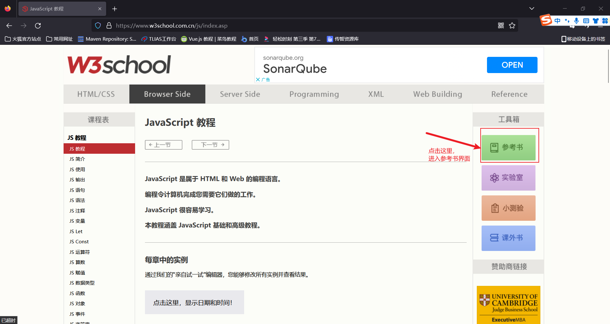
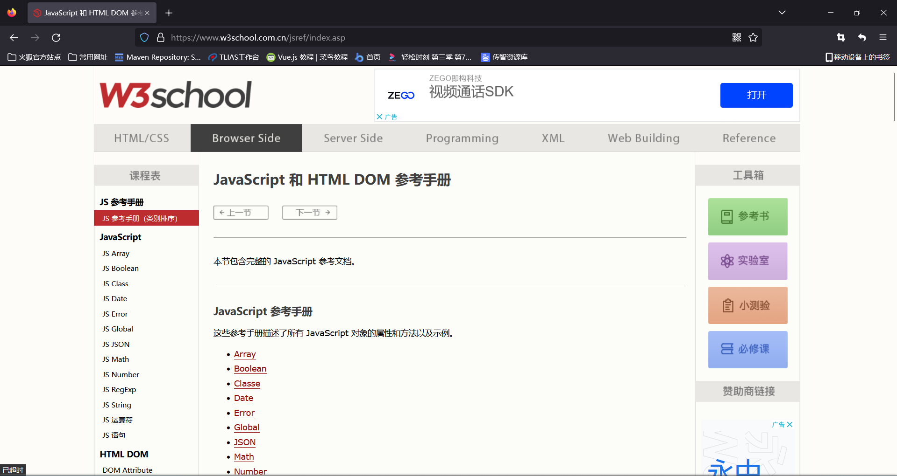
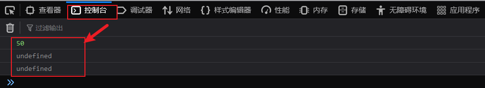
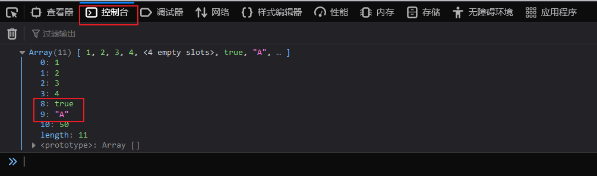
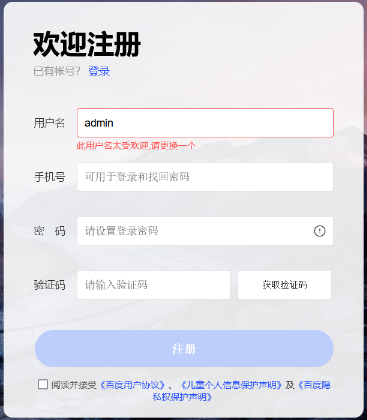
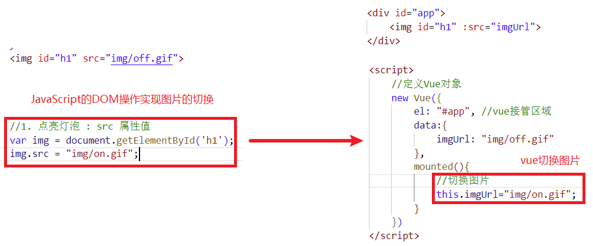
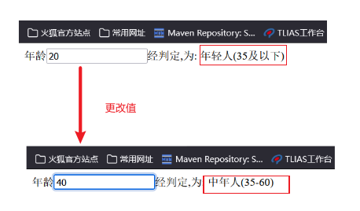

[TOC]


# 1 JavaScript

## 1.1 函数

在java中我们为了提高代码的复用性，可以使用方法。同样，在JavaScript中可以使用函数来完成相同的事情。JavaScript中的函数被设计为执行特定任务的代码块，通过关键字function来定义。接下来我们学习一下JavaScript中定义函数的2种语法

### 1.1.1 第一种定义格式

第一种定义格式如下：

~~~js
function 函数名(参数1,参数2..){
    要执行的代码
}
~~~

因为JavaScript是弱数据类型的语言，所以有如下几点需要注意：

- 形式参数不需要声明类型，并且JavaScript中不管什么类型都是let或者var去声明，加上也没有意义。
- 返回值也不需要声明类型，直接return即可

如下示例：

~~~js
function add(a, b){
    return a + b;
}
~~~

接下来我们需要在VS Code中编写代码来演示

第一步：新建名为js的文件夹，创建名为01. JS-函数的html文件，然后在&lt;script&gt;中定义上述示例的函数：

~~~html
<script>
     function add(a,b){
        return  a + b;
     }
</script>
~~~

但是上述只是定义函数，**函数需要被调用才能执行！**所以接下来我们需要调用函数

第二步：因为定义的add函数有返回值，所以我们可以接受返回值，并且输出到浏览器上，添加如下代码：

~~~js
let result = add(10,20);
alert(result);
~~~

查看浏览器运行结果：浏览器弹框内容如下图所示：

 


### 1.1.2 第二种定义格式

第二种可以通过var去定义函数的名字，具体格式如下：

~~~js
var functionName = function (参数1,参数2..){   
	//要执行的代码
}
~~~

接下来我们按照上述的格式，修改代码如下：只需要将第一种定义方式注释掉，替换成第二种定义方式即可，函数的调用不变

~~~html
<script>

    //定义函数-1
    // function add(a,b){
    //    return  a + b;
    // }

    //定义函数-2
    var add = function(a,b){
        return  a + b;
    }


    //函数调用
    var result = add(10,20);
    alert(result);
    
</script>
~~~


浏览器弹框效果和上述一致

 

我们在调用add函数时，再添加2个参数，修改代码如下：

~~~js
var result = add(10,20,30,40);
~~~

浏览器打开，发现没有错误，并且依然弹出30，这是为什么呢？

因为在JavaScript中，函数的调用只需要名称正确即可，参数列表不管的。如上述案例，10传递给了变量a，20传递给了变量b,而30和40没有变量接受，但是不影响函数的正常调用。


## 1.2 JavaScript对象

JavaScript中的对象有很多，主要可以分为如下3大类，我们可以打开[W3school在线学习文档](https://www.w3school.com.cn/)，来到首页，在左侧栏找到浏览器脚本下的JavaScript，如下图所示：


然后进入到如下界面，点击右侧的参考书

 


然后进入到如下页面，此页面列举出了JavaScript中的所有对象




可以大体分页3大类：

第一类：基本对象,我们主要学习Array和JSON和String

 

第二类：BOM对象,主要是和浏览器相关的几个对象

 

第三类：DOM对象，JavaScript中将html的每一个标签都封装成一个对象

 

我们先来学习基本对象种的Array对象

### 1.2.1 基本对象

#### 1.2.1.1 Array对象

##### 语法格式

Array对象时用来定义数组的。常用语法格式有如下2种：

方式1：

~~~js
var 变量名 = new Array(元素列表); 
~~~

例如：

~~~js
var arr = new Array(1,2,3,4); //1,2,3,4 是存储在数组中的数据（元素）
~~~


方式2：

~~~js
var 变量名 = [ 元素列表 ]; 
~~~

例如：

~~~js
var arr = [1,2,3,4]; //1,2,3,4 是存储在数组中的数据（元素）
~~~

数组定义好了，那么我们该如何获取数组中的值呢？和java中一样，需要通过索引来获取数组中的值。语法如下：

~~~js
arr[索引] = 值;
~~~

接下来，我们在VS Code中创建名为02. JS-对象-Array.html的文件，按照上述的语法定义数组，并且通过索引来获取数组中的值。

~~~html
<script>
    //定义数组
     var arr = new Array(1,2,3,4);
     var arr = [1,2,3,4];
	//获取数组中的值，索引从0开始计数
     console.log(arr[0]);
     console.log(arr[1]);
</script>
~~~

浏览器控制台观察的效果如下：输出1和2


##### 特点

与java中不一样的是，JavaScript中数组相当于java中的集合，==数组的长度是可以变化的。==而且JavaScript是弱数据类型的语言，所以==数组中可以存储任意数据类型的值。==接下来我们通过代码来演示上述特点。

注释掉之前的代码，添加如下代码：

~~~js
//特点: 长度可变 类型可变
var arr = [1,2,3,4];
arr[10] = 50;

console.log(arr[10]);
console.log(arr[9]);
console.log(arr[8]);
~~~

上述代码定义的arr变量中，数组的长度是4，但是我们直接再索引10的位置直接添加了数据10，并且输出索引为10的位置的元素，浏览器控制台数据结果如下：



因为索引8和9的位置没有值，所以输出内容undefined,当然，我们也可以给数组添加其他类型的值，添加代码如下：注释掉之前控制台输出的代码

~~~js
//特点: 长度可变 类型可变
var arr = [1,2,3,4];
arr[10] = 50;

// console.log(arr[10]);
// console.log(arr[9]);
// console.log(arr[8]);

arr[9] = "A";
arr[8] = true;

console.log(arr);
~~~

浏览器控制台输出结果如下：




##### 属性和方法

Array作为一个对象，那么对象是有属性和方法的，所以接下来我们介绍一下Array对象的属性和方法

官方文档中提供了Array的很多属性和方法，但是我们只学习常用的属性和方法，如下图所示：

属性：

| 属性   | 描述                         |
| :----- | :--------------------------- |
| length | 设置或返回数组中元素的数量。 |

方法：

| 方法方法  | 描述                                             |
| :-------- | :----------------------------------------------- |
| forEach() | 遍历数组中的每个有值得元素，并调用一次传入的函数 |
| push()    | 将新元素添加到数组的末尾，并返回新的长度         |
| splice()  | 从数组中删除元素                                 |

- length属性：

  length属性可以用来获取数组的长度，所以我们可以借助这个属性，来遍历数组中的元素，添加如下代码：

  ~~~js
  var arr = [1,2,3,4];
  arr[10] = 50;
  	for (let i = 0; i < arr.length; i++) {
  	console.log(arr[i]);
  }
  ~~~

  浏览器控制台输出结果如图所示：

   


- forEach()函数

  首先我们学习forEach()方法，顾名思义，这是用来遍历的，那么遍历做什么事呢？所以这个方法的参数，需要传递一个函数，而且这个函数接受一个参数，就是遍历时数组的值。修改之前的遍历代码如下：

  ~~~js
  //e是形参，接受的是数组遍历时的值
  arr.forEach(function(e){
       console.log(e);
  })
  ~~~

  当然了，在ES6中，引入箭头函数的写法，语法类似java中lambda表达式，修改上述代码如下：

  ~~~js
  arr.forEach((e) => {
       console.log(e);
  }) 
  ~~~


  浏览器输出结果如下：注意的是，没有元素的内容是不会输出的，因为forEach只会遍历有值的元素 

    


- push()函数

  push()函数是用于向数组的末尾添加元素的，其中函数的参数就是需要添加的元素，编写如下代码：向数组的末尾添加3个元素

  ~~~js
  //push: 添加元素到数组末尾
  arr.push(7,8,9);
  console.log(arr);
  ~~~

  浏览器输出结果如下：

   

  


- splice()函数

  splice()函数用来删除数组中的元素，函数中填入2个参数。

  参数1：表示从哪个索引位置删除

  参数2：表示删除元素的个数

  如下代码表示：从索引2的位置开始删，删除2个元素

  ~~~js
  //splice: 删除元素
  arr.splice(2,2);
  console.log(arr);
  ~~~

  浏览器执行效果如下：元素3和4被删除了，元素3是索引2

   


Array数组的完整代码如下：

~~~html
<!DOCTYPE html>
<html lang="en">
<head>
    <meta charset="UTF-8">
    <meta http-equiv="X-UA-Compatible" content="IE=edge">
    <meta name="viewport" content="width=device-width, initial-scale=1.0">
    <title>Document</title>
    <script>
       var arr = new Array(1,2,3,4);
       var arr2 = [4,5,6,7];
      arr[8] = "hello";
      console.log(arr.length);
      console.log(arr[3]);
      arr.forEach(e=>{
        console.log(e);
      });
      arr2.push(8,9);
      console.log(arr2);   // 4,5,6,7,8,9
      arr2.splice(2,2);    // 6,7删除
    </script>
</head>
<body>
</body>
</html>
~~~


#### 1.2.1.2 String对象

##### 语法格式

String对象的创建方式有2种：

方式1：

~~~js
var 变量名 = new String("…") ; //方式一
~~~

例如：

~~~js
var str = new String("Hello String");
~~~


方式2：

~~~js
var 变量名 = "…" ; //方式二
~~~

例如：

~~~js
var str = 'Hello String';
~~~


按照上述的格式，在VS Code中创建为名03. JS-对象-String.html的文件，编写代码如下：

~~~html
<script>
    //创建字符串对象
    //var str = new String("Hello String");
    var str = "  Hello String    ";

    console.log(str);
</script>
~~~

浏览器控制台输出结果如下：

 


##### 属性和方法

String对象也提供了一些常用的属性和方法，如下表格所示：

属性：

| 属性   | 描述           |
| ------ | -------------- |
| length | 字符串的长度。 |

方法：

| 方法                     | 描述                                                         |
| ------------------------ | ------------------------------------------------------------ |
| charAt()                 | 返回在指定位置的字符。                                       |
| indexOf()                | 检索字符串。                                                 |
| trim()                   | 去除字符串两边的空格                                         |
| substring(index1,index2) | 提取字符串中两个指定的索引号之间的字符。                     |
| replace(A,B)             | 把字符串中A的内容，替换为B的内容，A的位置可以是正则表达式 (/正则表达式/g |

- length属性：

  length属性可以用于返回字符串的长度，添加如下代码：

  ~~~js
  //length
  console.log(str.length);
  ~~~

- charAt()函数：

  charAt()函数用于返回在指定索引位置的字符，函数的参数就是索引。添加如下代码：

  ~~~js
  console.log(str.charAt(4));
  ~~~

- indexOf()函数

  indexOf()函数用于检索指定内容在字符串中的索引位置的，返回值是索引，参数是指定的内容。添加如下代码：

  ~~~js
  console.log(str.indexOf("lo"));
  ~~~

- trim()函数

  trim()函数用于去除字符串两边的空格的。添加如下代码：

  ~~~js
  var s = str.trim();
  console.log(s.length);
  ~~~

- substring()函数

  substring()函数用于截取字符串的，函数有2个参数。==（包前不包后）==

  参数1：表示从那个索引位置开始截取。包含

  参数2：表示到那个索引位置结束。不包含

  ~~~js
  console.log(s.substring(0,5));
  ~~~


整体代码如下：

~~~html
<!DOCTYPE html>
<html lang="en">
<head>
    <meta charset="UTF-8">
    <meta http-equiv="X-UA-Compatible" content="IE=edge">
    <meta name="viewport" content="width=device-width, initial-scale=1.0">
    <title>Document</title>
    <script>
       var username = new String("zhangsan"); //不常用
       var message = " hello123 javascript456 string ";
       console.log(message.length);
       message = message.trim();
       message2 = message.substring(message.indexOf("123"),message.indexOf("456"))
       console.log(message);
       console.log(message2);
       var regNumber = /[0-9]+/g;  // 正则表达式 /开头，/g结束  [0-9]数字
       var regSpace = /\s*/g;      // 表示空格
       message3 = message.replace(regNumber,"").replace(regSpace,"");
       console.log(message3);
    </script>
</head>
<body>
    
</body>
</html>
~~~

#### 1.2.1.3 自定义对象

##### 自定义对象

在 JavaScript 中自定义对象特别简单，其语法格式如下：

~~~js
var 对象名 = {
    属性名1: 属性值1, 
    属性名2: 属性值2,
    属性名3: 属性值3,
    函数名称: function(形参列表){}
};

~~~

我们可以通过如下语法调用属性：

~~~js
对象名.属性名
~~~

通过如下语法调用函数：

~~~js
对象名.函数名()
~~~


接下来，我们再VS Code中创建名为04. JS-对象-JSON.html的文件演示自定义对象

~~~html
<script>
    //自定义对象
    var user = {
        name: "Tom",
        age: 10,
        gender: "male",
        eat: function(){
             console.log("用膳~");
         }
    }
    console.log(user.name);
    user.eat();
<script>
~~~

浏览器控制台结果如下：


其中上述函数定义的语法可以简化成如下格式：

~~~js
    var user = {
        name: "Tom",
        age: 10,
        gender: "male",
        // eat: function(){
        //      console.log("用膳~");
        //  }
        eat(){
            console.log("用膳~");
        }
    }
~~~


##### json

JSON：**J**ava**S**cript **O**bject **N**otation，JavaScript对象标记法。是通过JavaScript标记法书写的文本。其格式如下：

~~~js
{
    "key":value,
    "key":value,
    "key":value
}
~~~

其中，==**key必须使用引号并且是双引号标记，value可以是任意数据类型。**==

例如我们可以直接百度搜索“json在线解析”，随便挑一个进入，然后编写内容如下：

~~~js
{
	"name": "李传播"
}
~~~

https://www.sojson.com/


 但是当我们将双引号切换成单引号，再次校验，则报错，如下图所示：


那么json这种数据格式的文本到底应用在企业开发的什么地方呢？-- 经常用来作为前后台交互的数据载体

如下图所示：前后台交互时，我们需要传输数据，但是java中的对象我们该怎么去描述呢？我们可以使用如图所示的xml格式，可以清晰的描述java中需要传递给前端的java对象。

 


但是xml格式存在如下问题：

- 标签需要编写双份，占用带宽，浪费资源
- 解析繁琐

所以我们可以使用json来替代，如下图所示：

 


接下来我们通过代码来演示json对象：注释掉之前的代码，编写代码如下：

~~~js
var jsonstr = '{"name":"Tom", "age":18, "addr":["北京","上海","西安"]}';
alert(jsonstr.name);
~~~

浏览器输出结果如下：

 

为什么呢？**因为上述是一个json字符串，不是json对象，所以我们需要借助如下函数来进行==json字符串和json对象的转换==。**添加代码如下：

~~~js
var obj = JSON.parse(jsonstr);
alert(obj.name);
~~~

此时浏览器输出结果如下：

 

当然了，我们也可以通过如下函数将==json对象再次转换成json字符串==。添加如下代码：

~~~js
alert(JSON.stringify(obj));
~~~

浏览器输出结果如图所示：

 


整体全部代码如下：

~~~html
<!DOCTYPE html>
<html lang="en">
<head>
    <meta charset="UTF-8">
    <meta http-equiv="X-UA-Compatible" content="IE=edge">
    <meta name="viewport" content="width=device-width, initial-scale=1.0">
    <title>JS-对象-JSON</title>
</head>
<body>
    
</body>
    <script>
      var user = {
        name: "tom",
        age:10,
        gender: "male",
        eat: function(){
            console.log("用膳...");
        }
      }
      console.log(user);
      console.log(user.name);
      user.eat();
      var jsonData = 
      '{"name":"tom","age":18,"addr":["北京","上海","西安"]}';
      console.log(jsonData);
      // JSON字符串转对象
      var jsonObj = JSON.parse(jsonData);  
      console.log(jsonObj);
      // JSON对象转字符串
      var jsonStr = JSON.stringify(jsonObj);
      console.log(jsonStr);
    </script>
</html>
~~~

### 1.2.2 BOM对象

接下来我们学习BOM对象，BOM的全称是Browser Object Model,翻译过来是==浏览器对象模型==。也就是JavaScript将浏览器的各个组成部分封装成了对象。我们要操作浏览器的部分功能，可以通过操作BOM对象的相关属性或者函数来完成。例如：我们想要将浏览器的地址改为`http://www.baidu.com`,我们就可以通过BOM中提供的location对象的href属性来完成，代码如下：`location.href='http://www.baidu.com'`

BOM中提供了如下5个对象：

| 对象名称  | 描述           |
| :-------- | :------------- |
| Window    | 浏览器窗口对象 |
| Navigator | 浏览器对象     |
| Screen    | 屏幕对象       |
| History   | 历史记录对象   |
| Location  | d地址栏对象    |

上述5个对象与浏览器各组成对应的关系如下图所示：

 

对于上述5个对象，我们重点学习的是Window对象、Location对象这2个。


#### 1.2.3.1 Window对象

window对象指的是浏览器窗口对象，是JavaScript的全部对象，所以对于window对象，我们可以直接使用，并且对于window对象的方法和属性，我们可以省略window.例如：我们之前学习的alert()函数其实是属于window对象的,其完整的代码如下：

~~~
window.alert('hello');
~~~

其可以省略window.  所以可以简写成

~~~
alert('hello')
~~~

所以对于window对象的属性和方法，我们都是采用简写的方式。window提供了很多属性和方法，下表列出了常用属性和方法

window对象提供了获取其他BOM对象的属性：

| 属性      | 描述                  |
| --------- | --------------------- |
| history   | 用于获取history对象   |
| location  | 用于获取location对象  |
| Navigator | 用于获取Navigator对象 |
| Screen    | 用于获取Screen对象    |

也就是说我们要使用location对象，只需要通过代码`window.location`或者简写`location`即可使用

window也提供了一些常用的函数，如下表格所示：

| 函数          | 描述                                               |
| ------------- | -------------------------------------------------- |
| alert()       | 显示带有一段消息和一个确认按钮的警告框。           |
| comfirm()     | 显示带有一段消息以及确认按钮和取消按钮的对话框。   |
| setInterval() | 按照指定的周期（以毫秒计）来调用函数或计算表达式。 |
| setTimeout()  | 在指定的毫秒数后调用函数或计算表达式。             |

接下来，我们通过VS Code中创建名为05. JS-对象-BOM.html文件来编写代码来演示上述函数：

- alert()函数：弹出警告框，函数的内容就是警告框的内容

  ~~~html
  <script>
      //window对象是全局对象，window对象的属性和方法在调用时可以省略window.
      window.alert("Hello BOM");
      alert("Hello BOM Window");
  </script>
  ~~~

  浏览器打开，依次弹框，此处只截图一张

   

  

- confirm()函数：弹出确认框，并且提供用户2个按钮，分别是确认和取消。

  添加如下代码：

  ~~~js
  confirm("您确认删除该记录吗?");
  ~~~

  浏览器打开效果如图所示：

   

  但是我们怎么知道用户点击了确认还是取消呢？所以这个函数有一个返回值，当用户点击确认时，返回true，点击取消时，返回false。我们根据返回值来决定是否执行后续操作。修改代码如下：再次运行，可以查看返回值true或者false

  ~~~js
  var flag = confirm("您确认删除该记录吗?");
  alert(flag);
  ~~~

- setInterval(fn,毫秒值)：定时器，用于周期性的执行某个功能，并且是**循环执行**。该函数需要传递2个参数：

  fn:函数，需要周期性执行的功能代码

  毫秒值：间隔时间

  注释掉之前的代码，添加代码如下：

  ~~~js
  //定时器 - setInterval -- 周期性的执行某一个函数
  var i = 0;
  setInterval(function(){
       i++;
       console.log("定时器执行了"+i+"次");
  },2000);
  ~~~

  刷新页面，浏览器每个一段时间都会在控制台输出，结果如下：

   

- setTimeout(fn,毫秒值) ：定时器，只会在一段时间后**执行一次功能**。参数和上述setInterval一致

  注释掉之前的代码，添加代码如下：

  ~~~js
  //定时器 - setTimeout -- 延迟指定时间执行一次 
  setTimeout(function(){
  	console.log("我就执行一次哈===========");
  },3000);
  ~~~


#### 1.2.3.2 Location对象

location是指代浏览器的地址栏对象，对于这个对象，我们常用的是href属性，用于获取或者设置浏览器的地址信息，添加如下代码：

~~~js
//设置浏览器地址栏信息
location.href = "https://www.itcast.cn";
~~~

完整代码如下：

~~~html
<!DOCTYPE html>
<html lang="en">
<head>
    <meta charset="UTF-8">
    <meta http-equiv="X-UA-Compatible" content="IE=edge">
    <meta name="viewport" content="width=device-width, initial-scale=1.0">
    <title>JS-对象-BOM</title>
</head>
<body>
    
</body>
<script>
        window.alert("Hello BOM");
        alert("Hello BOM Window");
        var flag = window.confirm("您确认删除该记录吗?");
        if(flag){
            console.log("确定删除了哈");
        }
        var i = 0;
        setInterval(function(){
            i++;
            console.log("定时器执行了"+i+"次");
        },2000);
        //定时器 - setTimeout -- 延迟指定时间执行一次 
        setTimeout(function(){
            console.log("我就执行一次哈===========");
        },3000);
        setTimeout(function(){
            console.log("我要跳转到itcast.cn啦");
             //设置浏览器地址栏信息
            location.href = "https://www.itcast.cn";
        },10000);
   </script>
</html>
~~~

### 1.2.3 DOM对象

#### 1.2.3.1 DOM介绍

DOM：Document Object Model ==文档对象模型==。也就是 JavaScript 将 HTML 文档的各个组成部分封装为对象。

DOM 其实我们并不陌生，之前在学习 XML 就接触过，只不过 XML 文档中的标签需要我们写代码解析，而 HTML 文档是浏览器解析。封装的对象分为

- Document：整个文档对象
- Element：元素对象
- Attribute：属性对象
- Text：文本对象
- Comment：注释对象

如下图，左边是 HTML 文档内容，右边是 DOM 树

 

那么我们学习DOM技术有什么用呢？主要作用如下：

- 改变 HTML 元素的内容
- 改变 HTML 元素的样式（CSS）
- 对 HTML DOM 事件作出反应
- 添加和删除 HTML 元素

总而达到动态改变页面效果目的，具体我们可以查看代码中提供的06. JS-对象-DOM-演示.html来体会DOM的效果。


#### 1.2.3.2 获取DOM对象

我们知道DOM的作用是通过修改HTML元素的内容和样式等来实现页面的各种动态效果，但是我们要操作DOM对象的前提是先获取元素对象，然后才能操作。所以学习DOM,主要的核心就是学习如下2点：

- 如何获取DOM中的元素对象（Element对象 ，也就是标签）
- 如何操作Element对象的属性,也就是标签的属性。

接下来我们先来学习如何获取DOM中的元素对象。

HTML中的Element对象可以通过Document对象获取，而Document对象是通过window对象获取的。document对象提供的用于获取Element元素对象的api如下表所示：

| 函数                              | 描述                                     |
| --------------------------------- | ---------------------------------------- |
| document.getElementById()         | 根据id属性值获取，返回单个Element对象    |
| document.getElementsByTagName()   | 根据标签名称获取，返回Element对象数组    |
| document.getElementsByName()      | 根据name属性值获取，返回Element对象数组  |
| document.getElementsByClassName() | 根据class属性值获取，返回Element对象数组 |

接下来我们通过VS Code中创建名为07. JS-对象-DOM-获取元素.html的文件来演示上述api，首先在准备如下页面代码：

~~~html
<!DOCTYPE html>
<html lang="en">
<head>
    <meta charset="UTF-8">
    <meta http-equiv="X-UA-Compatible" content="IE=edge">
    <meta name="viewport" content="width=device-width, initial-scale=1.0">
    <title>JS-DOM</title>
</head>
<body>
    <br><br>

  <div class="cls">传智教育</div>   <br>
  <div class="cls">黑马程序员</div>  <br>

  <input type="checkbox" name="hobby"> 电影
  <input type="checkbox" name="hobby"> 旅游
  <input type="checkbox" name="hobby"> 游戏 
  <br><br>
  <input type="button" value="获取元素" onclick="change()">
</body>
<script>
  function change(){
    console.log("改变元素...")
  }
</script>
</html>
~~~

- document.getElementById()： 根据标签的id属性获取标签对象，id是唯一的，所以获取到是单个标签对象。

  添加如下代码：

  ~~~html
  <script>
  //1. 获取Element元素
  
  //1.1 获取元素-根据ID获取
   var img = document.getElementById('h1');
   alert(img);
  </script>
  ~~~

  浏览器打开，效果如图所示：从弹出的结果能够看出，这是一个图片标签对象

   

- document.getElementsByTagName() :  根据标签的名字获取标签对象，同名的标签有很多，所以返回值是数组。

  添加如下代码:

  ~~~js
  //1.2 获取元素-根据标签获取 - div
  var divs = document.getElementsByTagName('div');
  for (let i = 0; i < divs.length; i++) {
       alert(divs[i]);
  }
  ~~~

  浏览器输出2次如下所示的弹框

   

- document.getElementsByName() ：根据标签的name的属性值获取标签对象，name属性值可以重复，所以返回值是一个数组。

  添加如下代码：

  ~~~js
  //1.3 获取元素-根据name属性获取
  var ins = document.getElementsByName('hobby');
  for (let i = 0; i < ins.length; i++) {
      alert(ins[i]);
  }
  ~~~

  浏览器会有3次如下图所示的弹框：

    

- document.getElementsByClassName() : 根据标签的class属性值获取标签对象，class属性值也可以重复，返回值是数组。

  添加如下图所示的代码：

  ~~~js
  //1.4 获取元素-根据class属性获取
  var divs = document.getElementsByClassName('cls');
  for (let i = 0; i < divs.length; i++) {
       alert(divs[i]);
  }
  ~~~

  浏览器会弹框2次，都是div标签对象

   

- 操作属性

  那么获取到标签了，我们如何操作标签的属性呢？通过查询文档资料，如下图所示：

   

  得出我们可以通过div标签对象的innerHTML属性来修改标签的内容。此时我们想把页面中的**传智教育替换成传智教育666**，所以要获取2个div中的第一个，所以可以通过下标0获取数组中的第一个div，注释之前的代码，编写如下代码：

  ~~~js
  var divs = document.getElementsByClassName('cls');
  var div1 = divs[0];
  
  div1.innerHTML = "传智教育666";
  ~~~

  浏览器刷新页面，展示效果如下图所示：

   

  发现页面内容变成了传智教育666


完整代码如下：

~~~html
<!DOCTYPE html>
<html lang="en">
<head>
    <meta charset="UTF-8">
    <meta http-equiv="X-UA-Compatible" content="IE=edge">
    <meta name="viewport" content="width=device-width, initial-scale=1.0">
    <title>JS-DOM</title>
    <script>
      
    </script>
</head>
<body>
    <br><br>

  <div class="cls">传智教育</div>   <br>
  <div class="cls">黑马程序员</div>  <br>

  <input type="checkbox" name="hobby"> 电影
  <input type="checkbox" name="hobby"> 旅游
  <input type="checkbox" name="hobby"> 游戏 
  <br><br>
  <input type="button" value="获取元素" onclick="change()">
</body>
<script>
  function change(){
      // 获取Id是h1的元素
      var img = document.getElementById('h1');   
      console.log(img);
      // 获取所有标签名称是 div的元素列表
      var divCls = document.getElementsByTagName("div");
      for (let index = 0; index < divCls.length; index++) {
        let element = divCls[index];
        console.log(element);
      }
      //获取所有元素name是hobby的元素列表
      var hobbyChecks = document.getElementsByName("hobby");
      for (let index = 0; index < hobbyChecks.length; index++) {
        let element = hobbyChecks[index];
        console.log(element);
      }
  }
</script>
</html>
~~~


### 1.2.4 案例

#### 1.2.4.1 需求说明

鲁迅说的好，光说不练假把式,光练不说傻把式。所以接下来我们需要通过案例来加强对于上述DOM知识的掌握。需求如下3个：

- 点亮灯泡
- 将所有的div标签的标签体内容后面加上：very good
- 使所有的复选框呈现被选中的状态

效果如下所示：

 

#### 1.2.4.2 资料准备 

在VS Code中创建名为08. JS-对象-DOM-案例.html的文件，然后准备如下代码：

~~~html
<!DOCTYPE html>
<html lang="en">
<head>
    <meta charset="UTF-8">
    <meta http-equiv="X-UA-Compatible" content="IE=edge">
    <meta name="viewport" content="width=device-width, initial-scale=1.0">
    <title>JS-DOM-案例</title>
</head>
<body>
    <br><br>

  <div class="cls">传智教育</div>   <br>
  <div class="cls">黑马程序员</div>  <br>

  <input type="checkbox" name="hobby"> 电影
  <input type="checkbox" name="hobby"> 旅游
  <input type="checkbox" name="hobby"> 游戏 
  <br><br>
  <input type="button" value="开始变" onclick="change()">
</body>
<script>
  function change(){
    console.log("改变元素...")
  }
</script>
</html>
~~~

浏览器打开此时效果如图所示：

 


#### 1.2.4.3 需求1

- 需求

  点亮灯泡

- 分析

  此时我们需要把灯泡点亮，其实就是换一张图片。那么我们需要切换图片，就需要操作图片的src属性。要操作图片的src属性，就需要先来获取img标签对象。

- 步骤

  - 首先获取img标签对象
  - 然后修改img标签对象的src属性值，进行图片的切换

- 代码实现

  ~~~js
  //1. 点亮灯泡 : src 属性值
  //首先获取img标签对象
  var img = document.getElementById('h1');
  //然后修改img标签对象的src属性值，进行图片的切换
  img.src = "img/on.gif";
  ~~~

浏览器打开，效果如图所示：

 


#### 1.2.4.4 需求2

- 需求

  将所有的div标签的标签体内容后面加上：very good  

  并且very good是红色字体

- 分析

  我们需要在原有内容后面追加红色的very good.所以我们首先需要获取原有内容，然后再进行内容的追加。但是如何保证very good是红色的呢？所以我们可以通过之前html中学过的&lt;font&gt;标签和属性来完整。如何进行内容的替换呢？之前我们学习过innerHTML属性。需要替换2个div的内容，所以我们需要获取2个div，并且遍历进行替换。

- 步骤

  - 通过标签的名字div获取所有的div标签
  - 遍历所有的div标签
  - 获取div标签的原有内容，然后追加&lt;font color='red'&gt;very good&lt;/font&gt;,并且替原内容 

- 代码实现

  ~~~js
  //2. 将所有div标签的内容后面加上: very good (红色字体) -- <font color='red'></font>
  var divs = document.getElementsByTagName('div');
  for (let i = 0; i < divs.length; i++) {
      const div = divs[i];
      div.innerHTML += "<font color='red'>very good</font>"; 
  }
  ~~~

浏览器打开效果如图所示：

 


#### 1.2.4.5 需求3

- 需求

  使所有的复选框呈现被选中的状态

- 分析

  要让复选框处于选中状态，那么什么属性或者方法可以使复选框选中？可以查询资料得出checkbox标签对象的checked属性设置为true，可以改变checkbox为选中状态。那么需要设置所有的checkbox，那么我们需要获取所有的checkbox并且遍历

- 步骤

  - 可以通过name属性值获取所有的checkbox标签
  - 遍历所有的checkbox标签，
  - 设置每个checkbox标签的

- 代码实现

  ~~~js
  // //3. 使所有的复选框呈现选中状态
  var ins = document.getElementsByName('hobby');
  for (let i = 0; i < ins.length; i++) {
  const check = ins[i];
  check.checked = true;//选中
  }
  ~~~

浏览器刷新，效果如图所示:

 

#### 1.2.4.6 完整代码

~~~html
<!DOCTYPE html>
<html lang="en">
<head>
    <meta charset="UTF-8">
    <meta http-equiv="X-UA-Compatible" content="IE=edge">
    <meta name="viewport" content="width=device-width, initial-scale=1.0">
    <title>JS-DOM-案例</title>
    <script>
      
    </script>
</head>
<body>
    <br><br>

  <div class="cls">传智教育</div>   <br>
  <div class="cls">黑马程序员</div>  <br>

  <input type="checkbox" name="hobby"> 电影
  <input type="checkbox" name="hobby"> 旅游
  <input type="checkbox" name="hobby"> 游戏 
  <br><br>
  <input type="button" value="开始变" onclick="change()">
</body>
<script>
  function change(){
      // 获取Id是h1的元素
      var img = document.getElementById('h1');   
      console.log(img);
      img.src = "img/on.gif";
      // 获取所有标签名称是 div的元素列表
      var divCls = document.getElementsByTagName("div");
      for (let index = 0; index < divCls.length; index++) {
        let element = divCls[index];
        console.log(element);
        element.innerHTML += "<font color='red'> very good </font>";
      }
      //获取所有元素name是hobby的元素列表
      var hobbyChecks = document.getElementsByName("hobby");
      for (let index = 0; index < hobbyChecks.length; index++) {
        let element = hobbyChecks[index];
        console.log(element);
        element.checked = true;
      }
  }
</script>
</html>
~~~


## 1.3 JavaScript事件

### 1.3.1 事件介绍

如下图所示的百度注册页面，当我们用户输入完内容，百度可以自动的提示我们用户名已经存在还是可以使用。那么百度是怎么知道我们用户名输入完了呢？这就需要用到JavaScript中的事件了。

 

什么是事件呢？HTML事件是发生在HTML元素上的 “事情”，例如：

- 按钮被点击
- 鼠标移到元素上
- 输入框失去焦点
- ........

而我们可以给这些事件绑定函数，当事件触发时，可以自动的完成对应的功能。这就是事件监听。例如：对于我们所说的百度注册页面，我们给用户名输入框的失去焦点事件绑定函数，当我们用户输入完内容，在标签外点击了鼠标，对于用户名输入框来说，失去焦点，然后执行绑定的函数，函数进行用户名内容的校验等操作。JavaScript事件是js非常重要的一部分，接下来我们进行事件的学习。那么我们对于JavaScript事件需要学习哪些内容呢？我们得知道有哪些常用事件，然后我们得学会如何给事件绑定函数。所以主要围绕2点来学习：

- 事件绑定
- 常用事件


### 1.3.2 事件绑定 

JavaScript对于事件的绑定提供了2种方式：

- 方式1：通过html标签中的事件属性进行绑定

  例如一个按钮，我们对于按钮可以绑定单机事件，可以借助标签的onclick属性，属性值指向一个函数。

  在VS Code中创建名为09. JS-事件-事件绑定.html，添加如下代码：

  ~~~html
  <input type="button" id="btn1" value="事件绑定1" onclick="on()">
  ~~~

  很明显没有on函数，所以我们需要创建该函数，代码如下：

  ~~~html
  <script>
      function on(){
          alert("按钮1被点击了...");
      }
  </script>
  ~~~

  浏览器打开，然后点击按钮，弹框如下：

   

  

- 方式2：通过DOM中Element元素的事件属性进行绑定

  依据我们学习过得DOM的知识点，我们知道html中的标签被加载成element对象，所以我们也可以通过element对象的属性来操作标签的属性。此时我们再次添加一个按钮，代码如下：

  ~~~html
  <input type="button" id="btn2" value="事件绑定2">
  ~~~

  我们可以先通过id属性获取按钮对象，然后操作对象的onclick属性来绑定事件，代码如下：

  ~~~js
  document.getElementById('btn2').onclick = function(){
      alert("按钮2被点击了...");
  }
  ~~~

  浏览器刷新页面，点击第二个按钮，弹框如下：

   

  

  **需要注意的是：事件绑定的函数，只有在事件被触发时，函数才会被调用。**

  

  整体代码如下：

  ~~~html
  <!DOCTYPE html>
  <html lang="en">
  <head>
      <meta charset="UTF-8">
      <meta http-equiv="X-UA-Compatible" content="IE=edge">
      <meta name="viewport" content="width=device-width, initial-scale=1.0">
      <title>JS-事件-事件绑定</title>
  </head>
  
  <body>
      <input type="button" id="btn1" value="事件绑定1" onclick="on()">
      <input type="button" id="btn2" value="事件绑定2">
  </body>
  
  <script>
      function on(){
          alert("按钮1被点击了...");
      }
  
      document.getElementById('btn2').onclick = function(){
          alert("按钮2被点击了...");
      }
  
  </script>
  </html>
  ~~~

  

  

### 1.3.3 常见事件

上面案例中使用到了 `onclick` 事件属性，那都有哪些事件属性供我们使用呢？下面就给大家列举一些比较常用的事件属性

| 事件属性名  | 说明                     |
| ----------- | ------------------------ |
| onclick     | 鼠标单击事件             |
| onblur      | 元素失去焦点             |
| onfocus     | 元素获得焦点             |
| onload      | 某个页面或图像被完成加载 |
| onsubmit    | 当表单提交时触发该事件   |
| onmouseover | 鼠标被移到某元素之上     |
| onmouseout  | 鼠标从某元素移开         |

在代码中提供了10. JS-事件-常见事件.html的文件，我们可以通过浏览器打开来观察几个常用事件的具体效果：

- onfocus:获取焦点事件，鼠标点击输入框，输入框中光标一闪一闪的，就是输入框获取焦点了

   

- onblur:失去焦点事件，前提是输入框获取焦点的状态下，在输入框之外的地方点击，光标从输入框中消失了，这就是失去焦点。

   

其他事件的效果，同学们可以通过提供好的代码去演示，亲身体会事件在什么时候触发。

```html
<!DOCTYPE html>
<html lang="en">
<head>
    <meta charset="UTF-8">
    <meta http-equiv="X-UA-Compatible" content="IE=edge">
    <meta name="viewport" content="width=device-width, initial-scale=1.0">
    <title>JS-事件-常见事件</title>
</head>

<body onload="load()">
    <form action="" style="text-align: center;" 
          onsubmit="subfn()">
        <input type="text" name="username" 
        onblur="bfn()" onfocus="ffn()" onkeydown="kfn()">
        <input id="b1" type="submit" value="提交">
        <input id="b1" type="button" value="单击事件" onclick="fn1()">
    </form>  
    <br><br><br>
    <table width="800px" border="1" cellspacing="0" align="center" 
           onmouseover="over()" onmouseout="out()">
        <tr>
            <th>学号</th>
            <th>姓名</th>
            <th>分数</th>
            <th>评语</th>
        </tr>
        <tr align="center">
            <td>001</td>
            <td>张三</td>
            <td>90</td>
            <td>很优秀</td>
        </tr>
        <tr align="center">
            <td>002</td>
            <td>李四</td>
            <td>92</td>
            <td>优秀</td>
        </tr>
    </table>
</body>

<script>
    //onload : 页面/元素加载完成后触发
    function load(){
        console.log("页面加载完成...")
    }
    //onclick: 鼠标点击事件
    function fn1(){
        console.log("我被点击了...");
    }
    //onblur: 失去焦点事件
    function bfn(){
        console.log("失去焦点...");
    }
    //onfocus: 元素获得焦点
    function ffn(){
        console.log("获得焦点...");
    }
    //onkeydown: 某个键盘的键被按下
    function kfn(){
        console.log("键盘被按下了...");
    }
    //onmouseover: 鼠标移动到元素之上
    function over(){
        console.log("鼠标移入了...")
    }
    //onmouseout: 鼠标移出某元素
    function out(){
        console.log("鼠标移出了...")
    }
    //onsubmit: 提交表单事件
    function subfn(){
        alert("表单被提交了...");
    }
</script>
</html>
```


### 1.3.4 案例

#### 1.3.4.1 需求说明

接下来我们通过案例来加强所学js知识点的掌握。

需求如下3个：

1. 点击 “点亮”按钮 点亮灯泡，点击“熄灭”按钮 熄灭灯泡
2. 输入框鼠标聚焦后，展示小写；鼠标离焦后，展示大写。
3. 点击 “全选”按钮使所有的复选框呈现被选中的状态，点击 “反选”按钮使所有的复选框呈现取消勾选的状态。

效果如图所示：

 

 

#### 1.3.4.1 资料准备

在VS  Code中创建名为11. JS-事件-案例.html的文件，提前准备如下代码：

~~~html
<!DOCTYPE html>
<html lang="en">
<head>
    <meta charset="UTF-8">
    <meta http-equiv="X-UA-Compatible" content="IE=edge">
    <meta name="viewport" content="width=device-width, initial-scale=1.0">
    <title>JS-事件-案例</title>
</head>
<body>

     <br>

    <input type="button" value="点亮" > 
    <input type="button"  value="熄灭" >

    <br> <br>

    <input type="text" id="name" value="ITCAST" >
    <br> <br>

    <input type="checkbox" name="hobby"> 电影
    <input type="checkbox" name="hobby"> 旅游
    <input type="checkbox" name="hobby"> 游戏
    <br>

    <input type="button" value="全选" > 
    <input type="button" value="反选" >

</body>

</html>
~~~

浏览器打开如图所示：

 


#### 1.3.4.2 需求1

- 需求：

  点击 “点亮”按钮 点亮灯泡，点击“熄灭”按钮 熄灭灯泡

- 分析：

  点击按钮的时候触发，所以我们需要绑定单击事件。不管是点亮还是熄灭，都是图片的变化，所以我们需要修改图片。但是修改图片我们还需要先获取标签图片标签对象。

- 步骤：

  - 首先给点亮按钮和熄灭按钮都绑定单击事件。分别绑定函数on()和off（）
  - 然后在js中定义on()和off()函数
  - on()函数中，通过id获取img标签对象，然后通过img标签对象的src属性切换点亮的图片
  - off()函数中，通过id获取img标签对象，然后通过img标签对象的src属性切换熄灭的图片

- 代码实现：

  事件绑定

  ~~~html
  <input type="button" value="点亮" onclick="on()"> 
  <input type="button"  value="熄灭" onclick="off()">
  ~~~

  on()和off()函数

  ~~~js
  //1. 点击 "点亮" 按钮, 点亮灯泡; 点击 "熄灭" 按钮, 熄灭灯泡; -- onclick
  function on(){
      //a. 获取img元素对象
      var img = document.getElementById("light");
      //b. 设置src属性
      img.src = "img/on.gif";
  }
  
  function off(){
      //a. 获取img元素对象
      var img = document.getElementById("light");
      //b. 设置src属性
      img.src = "img/off.gif";
  }
  ~~~

  

#### 1.3.4.3 需求2

- 需求：

  输入框鼠标聚焦后，展示小写；鼠标离焦后，展示大写。

- 分析：

  聚焦和失焦的时候完成功能，所以我们需要给input标签绑定onfocus和onblur事件；我们要切换大小写，那么我们可定要获取原本输入框的内容，通过查询资料，需要使用input标签对象的value属性，然后进行大小写切换；切换完成我们需要重新填入，所以还是通过value属性来设置input标签输入框的内容

- 步骤:

  - 给input标签的onfocus和onblur事件分别绑定lower()和upper()函数
  - 然后在js中定义lower()和upper()函数
  - 对于lower()函数，先通过id获取输入框对象，然后通过输入框的value属性来设置内容，内容的话可以通过字符串的toLowerCase()函数来进行小写转换
  - 对于upper()函数，先通过id获取输入框对象，然后通过输入框的value属性来设置内容，内容的话可以通过字符串的toupperCase()函数来进行大写转换

- 代码实现：、

  事件绑定：

  ~~~html
  <input type="text" id="name" value="ITCAST" onfocus="lower()" onblur="upper()">
  ~~~

  lower()和upper()函数

  ~~~js
  //2. 输入框聚焦后, 展示小写; 输入框离焦后, 展示大写; -- onfocus , onblur
  function lower(){//小写
      //a. 获取输入框元素对象
      var input = document.getElementById("name");
  
      //b. 将值转为小写
      input.value = input.value.toLowerCase();
  }
  
  function upper(){//大写
      //a. 获取输入框元素对象
      var input = document.getElementById("name");
  
      //b. 将值转为大写
      input.value = input.value.toUpperCase();
  }
  ~~~

  

#### 1.3.4.4 需求3

- 需求：

  点击 “全选”按钮使所有的复选框呈现被选中的状态，点击 “反选”按钮使所有的复选框呈现取消勾选的状态。

- 分析：

  点击按钮完成功能，所以我们需要给2个按钮绑定单击事件；我们需要设置所有复选框的状态，通过我们之前的案例，我们知道，我们需要获取所有的复选框，然后遍历，可以通过设置checked属性为true，来设置复选框为选中；那么反之，设置checked属性为false，来设置复选框为未选中。

- 步骤：

  - 给全选和反选按钮绑定单击事件，分别绑定函数checkAll()和reverse()
  - 在js中定义checkAll()和reverse()函数
  - 对于checkAll()函数，首先通过name属性值为hobby来获取所有的复选框，然后遍历复选框，设置每个复选框的checked属性为true即可
  - 对于reverse()函数，首先通过name属性值为hobby来获取所有的复选框，然后遍历复选框，设置每个复选框的checked属性为false即可

- 代码实现：

  事件绑定：

  ~~~html
  <input type="button" value="全选" onclick="checkAll()"> 
  <input type="button" value="反选" onclick="reverse()">
  ~~~

  checkAll()和reverse()函数

  ~~~js
   //3. 点击 "全选" 按钮使所有的复选框呈现选中状态 ; 点击 "反选" 按钮使所有的复选框呈现取消勾选的状态 ; 
  function checkAll(){
      //a. 获取所有复选框元素对象
      var hobbys = document.getElementsByName("hobby");
  
      //b. 设置选中状态
      for (let i = 0; i < hobbys.length; i++) {
          const element = hobbys[i];
          element.checked = true;
      }
  }
      
  function reverse(){
      //a. 获取所有复选框元素对象
      var hobbys = document.getElementsByName("hobby");
  
      //b. 设置未选中状态
      for (let i = 0; i < hobbys.length; i++) {
          const element = hobbys[i];
          element.checked = false;
      }
  }
  ~~~
  


#### 1.3.4.5 完整代码

~~~html
<!DOCTYPE html>
<html lang="en">
<head>
    <meta charset="UTF-8">
    <meta http-equiv="X-UA-Compatible" content="IE=edge">
    <meta name="viewport" content="width=device-width, initial-scale=1.0">
    <title>JS-事件-案例</title>
</head>
<body>

     <br>

    <input type="button" value="点亮" onclick="on()"> 
    <input type="button"  value="熄灭" onclick="off()">
    
    <br> <br>
    <input type="text" id="name" value="ITCAST" onfocus="lower()" onblur="upper()">
    <br> <br>

    <input type="checkbox" name="hobby"> 电影
    <input type="checkbox" name="hobby"> 旅游
    <input type="checkbox" name="hobby"> 游戏
    <br>
    <input type="button" value="全选" onclick="checkAll()"> 
    <input type="button" value="反选" onclick="reverse()">
</body>
<script>
    //1. 点击 "点亮" 按钮, 点亮灯泡; 点击 "熄灭" 按钮, 熄灭灯泡; -- onclick
    function on(){
        //a. 获取img元素对象
        var img = document.getElementById("light");

        //b. 设置src属性
        img.src = "img/on.gif";
    }

    function off(){
        //a. 获取img元素对象
        var img = document.getElementById("light");

        //b. 设置src属性
        img.src = "img/off.gif";
    }

    //2. 输入框聚焦后, 展示小写; 输入框离焦后, 展示大写; -- onfocus , onblur
    function lower(){//小写
        //a. 获取输入框元素对象
        var input = document.getElementById("name");

        //b. 将值转为小写
        input.value = input.value.toLowerCase();
    }

    function upper(){//大写
        //a. 获取输入框元素对象
        var input = document.getElementById("name");

        //b. 将值转为大写
        input.value = input.value.toUpperCase();
    }

    //3. 点击 "全选" 按钮使所有的复选框呈现选中状态 ; 点击 "反选" 按钮使所有的复选框呈现取消勾选的状态 ; -- onclick
    function checkAll(){
        //a. 获取所有复选框元素对象
        var hobbys = document.getElementsByName("hobby");

        //b. 设置选中状态
        for (let i = 0; i < hobbys.length; i++) {
            const element = hobbys[i];
            element.checked = true;
        }
    }
    
    function reverse(){
        //a. 获取所有复选框元素对象
        var hobbys = document.getElementsByName("hobby");

        //b. 设置未选中状态
        for (let i = 0; i < hobbys.length; i++) {
            const element = hobbys[i];
            element.checked = false;
        }
    }

</script>
</html>
~~~


# 2 Vue

## 2.1 Vue概述

通过我们学习的html+css+js已经能够开发美观的页面了，但是开发的效率还有待提高，那么如何提高呢？我们先来分析下页面的组成。一个完整的html页面包括了视图和数据，数据是通过请求 从后台获取的，那么意味着我们需要将后台获取到的数据呈现到页面上，很明显， 这就需要我们使用DOM操作。正因为这种开发流程，所以我们引入了一种叫做**MVVM(Model-View-ViewModel)的前端开发思想**，即让我们开发者更加关注数据，而非数据绑定到视图这种机械化的操作。那么具体什么是MVVM思想呢？

MVVM:其实是Model-View-ViewModel的缩写，有3个单词，具体释义如下：

- Model: 数据模型，特指前端中通过请求从后台获取的数据
- View: 视图，用于展示数据的页面，可以理解成我们的html+css搭建的页面，但是没有数据
- ViewModel: 数据绑定到视图，负责将数据（Model）通过JavaScript的DOM技术，将数据展示到视图（View）上

如图所示就是MVVM开发思想的含义：

 

基于上述的MVVM思想，其中的Model我们可以通过Ajax来发起请求从后台获取;对于View部分，我们将来会学习一款ElementUI框架来替代HTML+CSS来更加方便的搭建View;而今天我们要学习的就是侧重于ViewModel部分开发的vue前端框架，用来替代JavaScript的DOM操作，让数据展示到视图的代码开发变得更加的简单。可以简单到什么程度呢？可以参考下图对比：

 

在更加复杂的dom操作中，vue只会变得更加的简单！在上述的代码中，我们看不到之前的DOM操作，因为vue全部帮我们封装好了。


接下来我们来介绍一下vue。

Vue.js（读音 /vjuː/, 类似于 **view**） 是一套构建用户界面的 **渐进式框架**。与其他重量级框架不同的是，Vue 采用自底向上增量开发的设计。Vue 的核心库只关注视图层，并且非常容易学习，非常容易与其它库或已有项目整合。Vue.js 的目标是通过尽可能简单的 API 实现**响应的数据绑定**和**组合的视图组件**。

框架即是一个半成品软件，是一套可重用的、通用的、软件基础代码模型。基于框架进行开发，更加快捷、更加高效。


## 2.2 快速入门

接下来我们通过一个vue的快速入门案例，来体验一下vue。

第一步：在VS Code中创建名为12. Vue-快速入门.html的文件，并且在html文件同级创建js目录，将**资料/vue.js文件**目录下得vue.js拷贝到js目录，如下图所示：

 

第二步：然后编写&lt;script&gt;标签来引入vue.js文件，代码如下：

~~~html
<script src="js/vue.js"></script>
~~~

第三步：在js代码区域定义vue对象,代码如下：

~~~html
<script>
    //定义Vue对象
    new Vue({
        el: "#app", //vue接管区域
        data:{
            message: "Hello Vue"
        }
    })
</script>
~~~

在创建vue对象时，有几个常用的属性：

- el:  用来指定哪儿些标签受 Vue 管理。 该属性取值 `#app` 中的 `app` 需要是受管理的标签的id属性值
- data: 用来定义数据模型
- methods: 用来定义函数。这个我们在后面就会用到

第四步：在html区域编写视图，其中{{}}是插值表达式，用来将vue对象中定义的model展示到页面上的

~~~html
<body>
    <div id="app">
        <input type="text" v-model="message">
        {{message}}
    </div>
</body>
~~~

浏览器打开效果如图所示：

 


整体代码如下：

~~~html
<!DOCTYPE html>
<html lang="en">
<head>
    <meta charset="UTF-8">
    <meta http-equiv="X-UA-Compatible" content="IE=edge">
    <meta name="viewport" content="width=device-width, initial-scale=1.0">
    <title>Vue-快速入门</title>
    <script src="js/vue.js"></script>
</head>
<body>

    <div id="app">
        <input type="text" v-model="message">
        {{message}}
    </div>

</body>
<script>
    //定义Vue对象
    new Vue({
        el: "#app", //vue接管区域
        data:{
            message: "Hello Vue"
        }
    })
</script>
</html>
~~~


## 2.3 Vue指令

在上述的快速入门中，我们发现了html中输入了一个没有学过的属性`v-model`，这个就是vue的**指令**。

**指令：**HTML 标签上带有 v- 前缀的特殊属性，不同指令具有不同含义。例如：v-if，v-for…

在vue中，通过大量的指令来实现数据绑定到视图的，所以接下来我们需要学习vue的常用指令，如下表所示：

| **指令**  | **作用**                                            |
| --------- | --------------------------------------------------- |
| v-bind    | 为HTML标签绑定属性值，如设置  href , css样式等      |
| v-model   | 在表单元素上创建双向数据绑定                        |
| v-on      | 为HTML标签绑定事件                                  |
| v-if      | 条件性的渲染某元素，判定为true时渲染,否则不渲染     |
| v-else    |                                                     |
| v-else-if |                                                     |
| v-show    | 根据条件展示某元素，区别在于切换的是display属性的值 |
| v-for     | 列表渲染，遍历容器的元素或者对象的属性              |


### 2.3.1 v-bind和v-model

我们首先来学习v-bind指令和v-model指令。

| **指令** | **作用**                                       |
| -------- | ---------------------------------------------- |
| v-bind   | 为HTML标签绑定属性值，如设置  href , css样式等 |
| v-model  | 在表单元素上创建双向数据绑定                   |

- v-bind:  为HTML标签绑定属性值，如设置  href , css样式等。当vue对象中的数据模型发生变化时，标签的属性值会随之发生变化。

  接下来我们通过代码来演示。

  首先我们在VS Code中创建名为13. Vue-指令-v-bind和v-model.html的文件，然后准备好如下代码：

  ~~~html
  <!DOCTYPE html>
  <html lang="en">
  <head>
      <meta charset="UTF-8">
      <meta http-equiv="X-UA-Compatible" content="IE=edge">
      <meta name="viewport" content="width=device-width, initial-scale=1.0">
      <title>Vue-指令-v-bind</title>
      <script src="js/vue.js"></script>
  </head>
  <body>
      <div id="app">
  
          <a >链接1</a>
          <a >链接2</a>
  
          <input type="text" >
  
      </div>
  </body>
  <script>
      //定义Vue对象
      new Vue({
          el: "#app", //vue接管区域
          data:{
             url: "https://www.baidu.com"
          }
      })
  </script>
  </html>
  ~~~

  在上述的代码中，我们需要给&lt;a&gt;标签的href属性赋值，并且值应该来自于vue对象的数据模型中的url变量。所以编写如下代码：

  ~~~html
  <a v-bind:href="url">链接1</a>
  ~~~

  在上述的代码中，v-bind指令是可以省略的，但是:不能省略，所以第二个超链接的代码编写如下：

  ~~~html
  <a :href="url">链接2</a>
  ~~~

  浏览器打开，2个超链接都可以点击，然后跳转到百度去！效果如图所示：

   

  

  **注意：html属性前面有:表示采用的vue的属性绑定！**

- v-model： 在表单元素上创建双向数据绑定。什么是双向？

  -  vue对象的data属性中的数据变化，视图展示会一起变化
  - 视图数据发生变化，vue对象的data属性中的数据也会随着变化。

  data属性中数据变化，我们知道可以通过赋值来改变，但是视图数据为什么会发生变化呢？**只有表单项标签！所以双向绑定一定是使用在表单项标签上的**。编写如下代码：

  ~~~html
  <input type="text" v-model="url">
  ~~~

  打开浏览器，我们修改表单项标签，发现vue对象data中的数据也发生了变化，如下图所示：

   

  通过上图我们发现，我们只是改变了表单数据，那么我们之前超链接的绑定的数据值也发生了变化，为什么？

  就是因为我们双向绑定，在视图发生变化时，同时vue的data中的数据模型也会随着变化。那么这个在企业开发的应用场景是什么？

  **双向绑定的作用：可以获取表单的数据的值，然后提交给服务器**

  

  整体代码如下:

  ~~~html
  <!DOCTYPE html>
  <html lang="en">
  <head>
      <meta charset="UTF-8">
      <meta http-equiv="X-UA-Compatible" content="IE=edge">
      <meta name="viewport" content="width=device-width, initial-scale=1.0">
      <title>Vue-指令-v-bind</title>
      <script src="js/vue.js"></script>
  </head>
  <body>
      <div id="app">
          <a v-bind:href="url">传智教育</a> <br>
          <a :href="url">传智教育</a> <br>
              <input type="text" v-model="message">
              {{message}}
      </div>
  </body>
  <script>
      new new Vue({
          el: "#app",
          data:{
              message:"传智播客",
              url:"http://www.itcast.cn"
          }
      })
  </script>
  </html>
  ~~~
  
  

### 2.3.2 v-on

接下来我们学习一下v-on指令。

v-on: 用来给html标签绑定事件的。

**需要注意的是如下2点**：

- v-on语法给标签的事件绑定的函数，必须是vue对象种声明的函数

- v-on语法绑定事件时，事件名相比较js中的事件名，没有on

  例如：在js中，事件绑定demo函数

  ~~~html
  <input onclick="demo()">
  ~~~

  vue中，事件绑定demo函数

  ~~~html
  <input v-on:click="demo()">
  ~~~

接下来我们通过代码演示。


首先在VS Code中创建名为14. Vue-指令-v-on.html的文件，提前准备如下代码：

~~~html
<!DOCTYPE html>
<html lang="en">
<head>
    <meta charset="UTF-8">
    <meta http-equiv="X-UA-Compatible" content="IE=edge">
    <meta name="viewport" content="width=device-width, initial-scale=1.0">
    <title>Vue-指令-v-on</title>
    <script src="js/vue.js"></script>
</head>
<body>
    <div id="app">

        <input type="button" value="点我一下">
        <input type="button" value="点我一下">

    </div>
</body>
<script>
    //定义Vue对象
    new Vue({
        el: "#app", //vue接管区域
        data:{
           
        },
        methods: {
           
        }
    })
</script>
</html>
~~~

然后我们需要在vue对象的methods属性中定义事件绑定时需要的handle()函数，代码如下：

~~~js
 methods: {
        handle: function(){
           alert("你点我了一下...");
        }
}
~~~

然后我们给第一个按钮，通过v-on指令绑定单击事件，代码如下：

~~~html
 <input type="button" value="点我一下" v-on:click="handle()">
~~~

同样，v-on也存在简写方式，即v-on: 可以替换成@，所以第二个按钮绑定单击事件的代码如下：

~~~html
<input type="button" value="点我一下" @click="handle()">
~~~


完整代码如下：

~~~html
<!DOCTYPE html>
<html lang="en">
<head>
    <meta charset="UTF-8">
    <meta http-equiv="X-UA-Compatible" content="IE=edge">
    <meta name="viewport" content="width=device-width, initial-scale=1.0">
    <title>Vue-指令-v-on</title>
    <script src="js/vue.js"></script>
</head>
<body>
    <div id="app">

        <input type="button" value="点我一下" v-on:click="handle()">

        <input type="button" value="点我一下" @click="handle()">

    </div>
</body>
<script>
    //定义Vue对象
    new Vue({
        el: "#app", //vue接管区域
        data:{
           
        },
        methods: {
            handle: function(){
                alert("你点我了一下...");
            }
        }
    })
</script>
</html>
~~~


### 2.3.3 v-if和v-show

| 指令      | 描述                                                |
| --------- | --------------------------------------------------- |
| v-if      | 条件性的渲染某元素，判定为true时渲染,否则不渲染     |
| v-if-else |                                                     |
| v-else    |                                                     |
| v-show    | 根据条件展示某元素，区别在于切换的是display属性的值 |

我们直接通过代码来演示效果。在VS Code中创建名为15. Vue-指令-v-if和v-show.html的文件，提前准备好如下代码：

~~~html
<!DOCTYPE html>
<html lang="en">
<head>
    <meta charset="UTF-8">
    <meta http-equiv="X-UA-Compatible" content="IE=edge">
    <meta name="viewport" content="width=device-width, initial-scale=1.0">
    <title>Vue-指令-v-if与v-show</title>
    <script src="js/vue.js"></script>
</head>
<body>
    <div id="app">
        
        年龄<input type="text" v-model="age">经判定,为:
        <span>年轻人(35及以下)</span>
        <span>中年人(35-60)</span>
        <span>老年人(60及以上)</span>

        <br><br>
    </div>
</body>
<script>
    //定义Vue对象
    new Vue({
        el: "#app", //vue接管区域
        data:{
           age: 20
        },
        methods: {
            
        }
    })
</script>
</html>
~~~

其中采用了双向绑定到age属性，意味着我们可以通过表单输入框来改变age的值。

需求是当我们改变年龄时，需要动态判断年龄的值，呈现对应的年龄的文字描述。年轻人，我们需要使用条件判断`age<=35`,中年人我们需要使用条件判断`age>35 && age<60`,其他情况是老年人。所以通过v-if指令编写如下代码：

~~~html
年龄<input type="text" v-model="age">经判定,为:
<span v-if="age <= 35">年轻人(35及以下)</span>
<span v-else-if="age > 35 && age < 60">中年人(35-60)</span>
<span v-else>老年人(60及以上)</span>
~~~

浏览器打开测试效果如下图：

 

v-show和v-if的作用效果是一样的，只是原理不一样。复制上述html代码，修改v-if指令为v-show指令，代码如下：

~~~html
年龄<input type="text" v-model="age">经判定,为:
<span v-show="age <= 35">年轻人(35及以下)</span>
<span v-show="age > 35 && age < 60">中年人(35-60)</span>
<span v-show="age >= 60">老年人(60及以上)</span>
~~~

打开浏览器，展示效果如下所示：

 

可以发现，浏览器呈现的效果是一样的，但是浏览器中html源码不一样。v-if指令，不满足条件的标签代码直接没了，而v-show指令中，不满足条件的代码依然存在，只是添加了css样式来控制标签不去显示。


完整代码如下：

~~~html
<!DOCTYPE html>
<html lang="en">
<head>
    <meta charset="UTF-8">
    <meta http-equiv="X-UA-Compatible" content="IE=edge">
    <meta name="viewport" content="width=device-width, initial-scale=1.0">
    <title>Vue-指令-v-if与v-show</title>
    <script src="js/vue.js"></script>
</head>
<body>
    <div id="app">
        
        年龄<input type="text" v-model="age">经判定,为:
        <span v-if="age <= 35">年轻人(35及以下)</span>
        <span v-else-if="age > 35 && age < 60">中年人(35-60)</span>
        <span v-else>老年人(60及以上)</span>

        <br><br>

        年龄<input type="text" v-model="age">经判定,为:
        <span v-show="age <= 35">年轻人(35及以下)</span>
        <span v-show="age > 35 && age < 60">中年人(35-60)</span>
        <span v-show="age >= 60">老年人(60及以上)</span>

    </div>
</body>
<script>
    //定义Vue对象
    new Vue({
        el: "#app", //vue接管区域
        data:{
           age: 20
        },
        methods: {
            
        }
    })
</script>
</html>
~~~


### 2.3.4 v-for

v-for: 从名字我们就能看出，这个指令是用来遍历的。其语法格式如下：

~~~html
<标签 v-for="变量名 in 集合模型数据">
    {{变量名}}
</标签>
~~~

需要注意的是：需要循环那个标签，v-for 指令就写在那个标签上。

有时我们遍历时需要使用索引，那么v-for指令遍历的语法格式如下：

~~~html
<标签 v-for="(变量名,索引变量) in 集合模型数据">
    <!--索引变量是从0开始，所以要表示序号的话，需要手动的加1-->
   {{索引变量 + 1}} {{变量名}}
</标签>
~~~

接下来，我们再VS Code中创建名为16. Vue-指令-v-for.html的文件编写代码演示，提前准备如下代码：

~~~html
<!DOCTYPE html>
<html lang="en">
<head>
    <meta charset="UTF-8">
    <meta http-equiv="X-UA-Compatible" content="IE=edge">
    <meta name="viewport" content="width=device-width, initial-scale=1.0">
    <title>Vue-指令-v-for</title>
    <script src="js/vue.js"></script>
</head>
<body>
    <div id="app">

    </div>
</body>
<script>
    //定义Vue对象
    new Vue({
        el: "#app", //vue接管区域
        data:{
           addrs:["北京", "上海", "西安", "成都", "深圳"]
        },
        methods: {
            
        }
    })
</script>
</html>
~~~

然后分别编写2种遍历语法，来遍历数组，展示数据，代码如下：

~~~html
 <div id="app">
     <div v-for="addr in addrs">{{addr}}</div>
     <hr>
     <div v-for="(addr,index) in addrs">{{index + 1}} : {{addr}}</div>
</div>
~~~

浏览器打开，呈现如下效果：

 


### 2.3.5 案例

- 需求：

   

  如上图所示，我们提供好了数据模型，users是数组集合，提供了多个用户信息。然后我们需要将数据以表格的形式，展示到页面上，其中，性别需要转换成中文男女，等级需要将分数数值转换成对应的等级。

- 分析：

  首先我们肯定需要遍历数组的，所以需要使用v-for标签；然后我们每一条数据对应一行，所以v-for需要添加在tr标签上；其次我们需要将编号，所以需要使用索引的遍历语法；然后我们要将数据展示到表格的单元格中，所以我们需要使用{{}}插值表达式；最后，我们需要转换内容，所以我们需要使用v-if指令，进行条件判断和内容的转换

- 步骤：

  - 使用v-for的带索引方式添加到表格的&lt;tr&gt;标签上
  - 使用{{}}插值表达式展示内容到单元格
  - 使用索引+1来作为编号
  - 使用v-if来判断，改变性别和等级这2列的值

- 代码实现：

  首先创建名为17. Vue-指令-案例.html的文件，提前准备如下代码：

  ~~~html
  <!DOCTYPE html>
  <html lang="en">
  <head>
      <meta charset="UTF-8">
      <meta http-equiv="X-UA-Compatible" content="IE=edge">
      <meta name="viewport" content="width=device-width, initial-scale=1.0">
      <title>Vue-指令-案例</title>
      <script src="js/vue.js"></script>
  </head>
  <body>
      
      <div id="app">
          
          <table border="1" cellspacing="0" width="60%">
              <tr>
                  <th>编号</th>
                  <th>姓名</th>
                  <th>年龄</th>
                  <th>性别</th>
                  <th>成绩</th>
                  <th>等级</th>
              </tr>
          </table>
  
      </div>
  
  </body>
  
  <script>
      new Vue({
          el: "#app",
          data: {
              users: [{
                  name: "Tom",
                  age: 20,
                  gender: 1,
                  score: 78
              },{
                  name: "Rose",
                  age: 18,
                  gender: 2,
                  score: 86
              },{
                  name: "Jerry",
                  age: 26,
                  gender: 1,
                  score: 90
              },{
                  name: "Tony",
                  age: 30,
                  gender: 1,
                  score: 52
              }]
          },
          methods: {
              
          },
      })
  </script>
  </html>
  ~~~

  然后在&lt;tr&gt;上添加v-for进行遍历，以及通过插值表达式{{}}和v-if指令来填充内容和改变内容，其代码如下：

  ~~~html
   <tr align="center" v-for="(user,index) in users">
       <td>{{index + 1}}</td>
       <td>{{user.name}}</td>
       <td>{{user.age}}</td>
       <td>
           <span v-if="user.gender == 1">男</span>
           <span v-if="user.gender == 2">女</span>
       </td>
       <td>{{user.score}}</td>
       <td>
           <span v-if="user.score >= 85">优秀</span>
           <span v-else-if="user.score >= 60">及格</span>
           <span style="color: red;" v-else>不及格</span>
       </td>
  </tr>
  ~~~


其完整代码如下：

~~~html
<!DOCTYPE html>
<html lang="en">
<head>
    <meta charset="UTF-8">
    <meta http-equiv="X-UA-Compatible" content="IE=edge">
    <meta name="viewport" content="width=device-width, initial-scale=1.0">
    <title>Vue-指令-案例</title>
    <script src="js/vue.js"></script>
</head>
<body>
    
    <div id="app">
        
        <table border="1" cellspacing="0" width="60%">
            <tr>
                <th>编号</th>
                <th>姓名</th>
                <th>年龄</th>
                <th>性别</th>
                <th>成绩</th>
                <th>等级</th>
            </tr>

            <tr align="center" v-for="(user,index) in users">
                <td>{{index + 1}}</td>
                <td>{{user.name}}</td>
                <td>{{user.age}}</td>
                <td>
                    <span v-if="user.gender == 1">男</span>
                    <span v-else>女</span>
                </td>
                <td>{{user.score}}</td>
                <td>
                    <span v-if="user.score >= 85">优秀</span>
                    <span v-else-if="user.score >= 60">及格</span>
                    <span v-else style="color: red;" >不及格</span>
                </td>
            </tr>
        </table>

    </div>

</body>

<script>
    new Vue({
        el: "#app",
        data: {
            users: [{
                name: "Tom",
                age: 20,
                gender: 1,
                score: 78
            },{
                name: "Rose",
                age: 18,
                gender: 2,
                score: 86
            },{
                name: "Jerry",
                age: 26,
                gender: 1,
                score: 90
            },{
                name: "Tony",
                age: 30,
                gender: 1,
                score: 52
            }]
        },
        methods: {
            
        },
    })
</script>
</html>
~~~


## 2.4 生命周期

vue的生命周期：指的是vue对象从创建到销毁的过程。vue的生命周期包含8个阶段：每触发一个生命周期事件，会自动执行一个生命周期方法，这些生命周期方法也被称为钩子方法。其完整的生命周期如下图所示：

| 状态          | 阶段周期 |
| ------------- | -------- |
| beforeCreate  | 创建前   |
| created       | 创建后   |
| beforeMount   | 挂载前   |
| mounted       | 挂载完成 |
| beforeUpdate  | 更新前   |
| updated       | 更新后   |
| beforeDestroy | 销毁前   |
| destroyed     | 销毁后   |

下图是 Vue 官网提供的从创建 Vue 到效果 Vue 对象的整个过程及各个阶段对应的钩子函数：


其中我们需要重点关注的是**mounted,**其他的我们了解即可。

mounted：挂载完成，Vue初始化成功，HTML页面渲染成功。**以后我们一般用于页面初始化自动的ajax请求后台数据**

我们在VS Code中创建名为18. Vue-生命周期.html的文件编写代码来演示效果，提前准备如下代码：

~~~html
<!DOCTYPE html>
<html lang="en">
<head>
    <meta charset="UTF-8">
    <meta http-equiv="X-UA-Compatible" content="IE=edge">
    <meta name="viewport" content="width=device-width, initial-scale=1.0">
    <title>Vue-指令-v-for</title>
    <script src="js/vue.js"></script>
</head>
<body>
    <div id="app">

    </div>
</body>
<script>
    //定义Vue对象
    new Vue({
        el: "#app", //vue接管区域
        data:{
           
        },
        methods: {
            
        }
    })
</script>
</html>
~~~


然后我们编写mounted声明周期的钩子函数，与methods同级，代码如下：

~~~html
<script>
    //定义Vue对象
    new Vue({
        el: "#app", //vue接管区域
        data:{
           
        },
        methods: {
            
        },
        mounted () {
            alert("vue挂载完成,发送请求到服务端")
        }
    })
</script>
~~~

浏览器打开，运行结果如下：我们发现，自动打印了这句话，因为页面加载完成，vue对象创建并且完成了挂在，此时自动触发mounted所绑定的钩子函数，然后自动执行，弹框。

 

