[TOC]


# Maven

## 课程内容

> 1. 初识Maven
> 2. Maven概述
>    - Maven模型介绍
>    - Maven仓库介绍
>    - Maven安装与配置
> 3. IDEA集成Maven
> 4. 依赖管理

## 01. Maven课程介绍

### 1.1 课程安排

学习完前端Web开发技术后，我们即将开始学习后端Web开发技术。做为一名Java开发工程师，**后端Web开发技术是我们学习的重点**。


后端Web开发技术的学习，我们会先学习Java项目的构建工具：Maven


### 1.2 初识Maven

#### 1.2.1 什么是Maven

Maven是Apache旗下的一个开源项目，是一款用于管理和构建java项目的工具。

官网：https://maven.apache.org/

> Apache 软件基金会，成立于1999年7月，是目前世界上最大的最受欢迎的开源软件基金会，也是一个专门为支持开源项目而生的非盈利性组织。
>
> 开源项目：https://www.apache.org/index.html#projects-list


#### 1.2.2 Maven的作用

使用Maven能够做什么呢？

1. 依赖管理
2. 统一项目结构
3. 项目构建


**依赖管理**：

- 方便快捷的管理项目依赖的资源(jar包)，避免版本冲突问题


当使用maven进行项目依赖(jar包)管理，则很方便的可以解决这个问题。 我们只需要在maven项目的pom.xml文件中，添加一段如下图所示的配置即可实现。

  


**统一项目结构 : **

- 提供标准、统一的项目结构

在项目开发中，当你使用不同的开发工具 (如：Eclipse、Idea)，创建项目工程时：

 

若我们创建的是一个maven工程，是可以帮我们自动生成统一、标准的项目目录结构：


具体的统一结构如下：


> 目录说明： 
>
> - src/main/java: java源代码目录
> - src/main/resources:  配置文件信息
> - src/test/java: 测试代码
> - src/test/resources: 测试配置文件信息


**项目构建 :** 

- maven提供了标准的、跨平台(Linux、Windows、MacOS) 的自动化项目构建方式


如上图所示我们开发了一套系统，代码需要进行编译、测试、打包、发布，这些操作如果需要反复进行就显得特别麻烦，而Maven提供了一套简单的命令来完成项目构建。


综上所述，可以得到一个结论：**Maven是一款管理和构建java项目的工具**


## 02. Maven概述

### 2.1 Maven介绍

Apache Maven是一个项目管理和构建工具，它基于项目对象模型(Project Object Model , 简称: POM)的概念，通过一小段描述信息来管理项目的构建、报告和文档。

官网：https://maven.apache.org/

Maven的作用： 

1. 方便的依赖管理
2. 统一的项目结构
3. 标准的项目构建流程


### 2.2 Maven模型

* 项目对象模型 (Project Object Model)
* 依赖管理模型(Dependency)
* 构建生命周期/阶段(Build lifecycle & phases)


1). 构建生命周期/阶段(Build lifecycle & phases)


以上图中紫色框起来的部分，就是用来完成标准化构建流程 。当我们需要编译，Maven提供了一个编译插件供我们使用；当我们需要打包，Maven就提供了一个打包插件供我们使用等。 


2). 项目对象模型 (Project Object Model)


以上图中紫色框起来的部分属于项目对象模型。

项目对象模型就是将项目抽象成一个对象模型，有自己专属的坐标，如下图所示是一个Maven项目：


> 坐标，就是资源(jar包)的唯一标识，通过坐标可以定位到所需资源(jar包)位置
>
> 


3). 依赖管理模型(Dependency)


以上图中紫色框起来的部分属于依赖管理模型，是使用坐标来描述当前项目依赖哪些第三方jar包


之前我们项目中需要jar包时，直接就把jar包复制到项目下的lib目录，而现在书写在pom.xml文件中的坐标又是怎么能找到所要的jar包文件的呢？

> 答案：Maven仓库


### 2.3 Maven仓库 

仓库：用于存储资源，管理各种jar包

> 仓库的本质就是一个目录(文件夹)，这个目录被用来存储开发中所有依赖(就是jar包)和插件


Maven仓库分为：

- 本地仓库：自己计算机上的一个目录(用来存储jar包)
- 中央仓库：由Maven团队维护的全球唯一的。仓库地址：https://repo1.maven.org/maven2/
- 远程仓库(私服)：一般由公司团队搭建的私有仓库


当项目中使用坐标引入对应依赖jar包后，首先会查找本地仓库中是否有对应的jar包

* 如果有，则在项目直接引用

* 如果没有，则去中央仓库中下载对应的jar包到本地仓库

如果还可以搭建远程仓库(私服)，将来jar包的查找顺序则变为： 本地仓库 --> 远程仓库--> 中央仓库


### 2.4 Maven安装

认识了Maven后，我们就要开始使用Maven了，那么首先我们要进行Maven的下载与安装。

#### 2.4.1 下载

下载地址：https://maven.apache.org/download.cgi

在提供的资料中，已经提供了下载好的安装包。如下： 

 


#### 2.4.2 安装步骤

Maven安装配置步骤：

1. 解压安装
2. 配置仓库
3. 配置Maven环境变量


**1、解压 apache-maven-3.6.1-bin.zip（解压即安装）**

> 建议解压到没有中文、特殊字符的路径下。如课程中解压到 `E:\develop` 下。

 

解压缩后的目录结构如下：

 

* bin目录 ： 存放的是可执行命令。（mvn 命令重点关注）
* conf目录 ：存放Maven的配置文件。（settings.xml配置文件后期需要修改）
* lib目录 ：存放Maven依赖的jar包。（Maven也是使用java开发的，所以它也依赖其他的jar包）


**2、配置本地仓库**

2.1、在自己计算机上新一个目录（本地仓库，用来存储jar包）

 


2.2、进入到conf目录下修改settings.xml配置文件 

1). 使用超级记事本软件，打开settings.xml文件，定位到53行

2). 复制<localRepository>标签，粘贴到注释的外面（55行）

3). 复制之前新建的用来存储jar包的路径，替换掉<localRepository>标签体内容

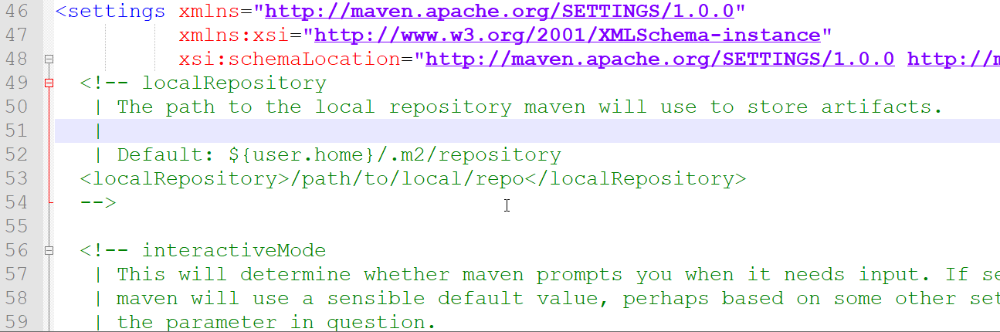


**3、配置阿里云私服**

由于中央仓库在国外，所以下载jar包速度可能比较慢，而阿里公司提供了一个远程仓库，里面基本也都有开源项目的jar包。

进入到conf目录下修改settings.xml配置文件：

1). 使用超级记事本软件，打开settings.xml文件，定位到160行左右

2). 在<mirrors>标签下为其添加子标签<mirror>，内容如下：

```xml
<mirror>  
    <id>alimaven</id>  
    <name>aliyun maven</name>  
    <url>http://maven.aliyun.com/nexus/content/groups/public/</url>
    <mirrorOf>central</mirrorOf>          
</mirror>
```


注意配置的位置，在<mirrors> ... </mirrors> 中间添加配置。如下图所示：


==注:  只可配置一个<mirror>(另一个要注释!) ，不然两个可能发生冲突，导致jar包无法下载!!!!!!!==


**4、配置环境变量**

> Maven环境变量的配置类似于JDK环境变量配置一样

1). 在系统变量处新建一个变量MAVEN_HOME

- MAVEN_HOME环境变量的值，设置为maven的解压安装目录

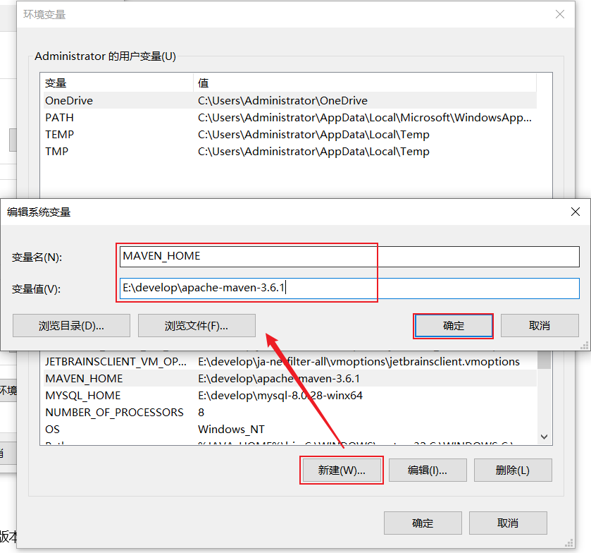


2). 在Path中进行配置

- PATH环境变量的值，设置为：%MAVEN_HOME%\bin

 


3). 打开DOS命令提示符进行验证，出现如图所示表示安装成功

```
mvn -v
```

 


## 03. IDEA集成Maven

我们要想在IDEA中使用Maven进行项目构建，就需要在IDEA中集成Maven

### 3.1 配置Maven环境 

#### 3.1.1 当前工程设置 

1、选择 IDEA中 File  =>  Settings  =>  Build,Execution,Deployment  =>  Build Tools  =>  Maven

 


2、设置IDEA使用本地安装的Maven，并修改配置文件及本地仓库路径


> Maven home path ：指定当前Maven的安装目录
>
> User settings file ：指定当前Maven的settings.xml配置文件的存放路径
>
> Local repository ：指定Maven的本地仓库的路径 (如果指定了settings.xml, 这个目录会自动读取出来, 可以不用手动指定)


3、配置工程的编译版本为11

- Maven默认使用的编译版本为5（版本过低）

 

上述配置的maven环境，只是针对于当前工程的，如果我们再创建一个project，又恢复成默认的配置了。 要解决这个问题， 我们就需要配置全局的maven环境。

  

#### 3.1.2 全局设置 

1、进入到IDEA欢迎页面

- 选择 IDEA中 File  =>  close project


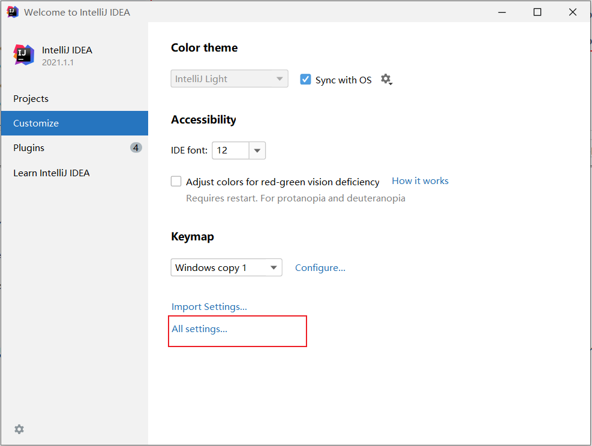


2、打开 All settings , 选择 Build,Execution,Deployment  =>  Build Tools  =>  Maven


3、配置工程的编译版本为11


这里所设置的maven的环境信息，并未指定任何一个project，此时设置的信息就属于全局配置信息。 以后，我们再创建project，默认就是使用我们全局配置的信息。


### 3.2 Maven项目

#### 3.2.1 创建Maven项目 

1、创建一个空项目 


2、创建模块，选择Maven，点击Next


3、填写模块名称，坐标信息，点击finish，创建完成

 


4、在Maven工程下，创建HelloWorld类


> - Maven项目的目录结构:
>
>   maven-project01
>   	|---  src  (源代码目录和测试代码目录)
>   		    |---  main (源代码目录)
>   			           |--- java (源代码java文件目录)
>   			           |--- resources (源代码配置文件目录)
>   		    |---  test (测试代码目录)
>   			           |--- java (测试代码java目录)
>   			           |--- resources (测试代码配置文件目录)
>   	|--- target (编译、打包生成文件存放目录)


5、编写 HelloWorld，并运行

```java
public class HelloWorld {
    public static void main(String[] args) {
        System.out.println("Hello Maven ...");
    }
}
```


#### 3.2.2 POM配置详解

POM (Project Object Model) ：指的是项目对象模型，用来描述当前的maven项目。

- 使用pom.xml文件来实现

pom.xml文件：

~~~xml
<?xml version="1.0" encoding="UTF-8"?>
<project xmlns="http://maven.apache.org/POM/4.0.0"
         xmlns:xsi="http://www.w3.org/2001/XMLSchema-instance"
         xsi:schemaLocation="http://maven.apache.org/POM/4.0.0 http://maven.apache.org/xsd/maven-4.0.0.xsd">
    <!-- POM模型版本 -->
    <modelVersion>4.0.0</modelVersion>

    <!-- 当前项目坐标 -->
    <groupId>com.itheima</groupId>
    <artifactId>maven_project1</artifactId>
    <version>1.0-SNAPSHOT</version>
    
    <!-- 打包方式 -->
    <packaging>jar</packaging>
 
</project>
~~~

pom文件详解：

- <project> ：pom文件的根标签，表示当前maven项目
- <modelVersion> ：声明项目描述遵循哪一个POM模型版本
  - 虽然模型本身的版本很少改变，但它仍然是必不可少的。目前POM模型版本是4.0.0
- 坐标 ：<groupId>、<artifactId>、<version>
  - 定位项目在本地仓库中的位置，由以上三个标签组成一个坐标
- <packaging> ：maven项目的打包方式，通常设置为jar或war（默认值：jar）


#### 3.2.3 Maven坐标详解

什么是坐标？

* Maven中的坐标是==资源的唯一标识== , 通过该坐标可以唯一定位资源位置
* 使用坐标来定义项目或引入项目中需要的依赖

Maven坐标主要组成

* groupId：定义当前Maven项目隶属组织名称（通常是域名反写，例如：com.itheima）
* artifactId：定义当前Maven项目名称（通常是模块名称，例如 order-service、goods-service）
* version：定义当前项目版本号

如下图就是使用坐标表示一个项目：

 

> **注意：**
>
> * 上面所说的资源可以是插件、依赖、当前项目。
> * 我们的项目如果被其他的项目依赖时，也是需要坐标来引入的。


### 3.3 导入Maven项目

- **方式1：使用Maven面板，快速导入项目**

打开IDEA，选择右侧Maven面板，点击 + 号，选中对应项目的pom.xml文件，双击即可

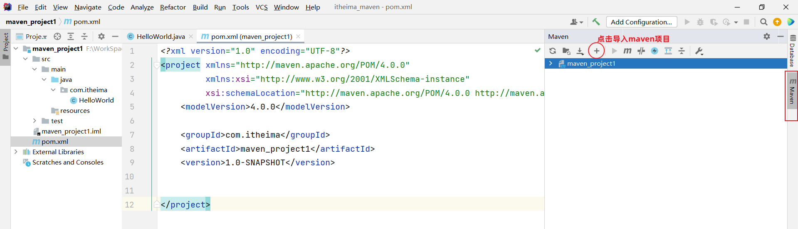

 

> 说明：如果没有Maven面板，选择 View  =>  Appearance  =>  Tool Window Bars
>
>  


- **方式2：使用idea导入模块项目**

File  =>  Project Structure  =>  Modules  =>  +  =>  Import Module

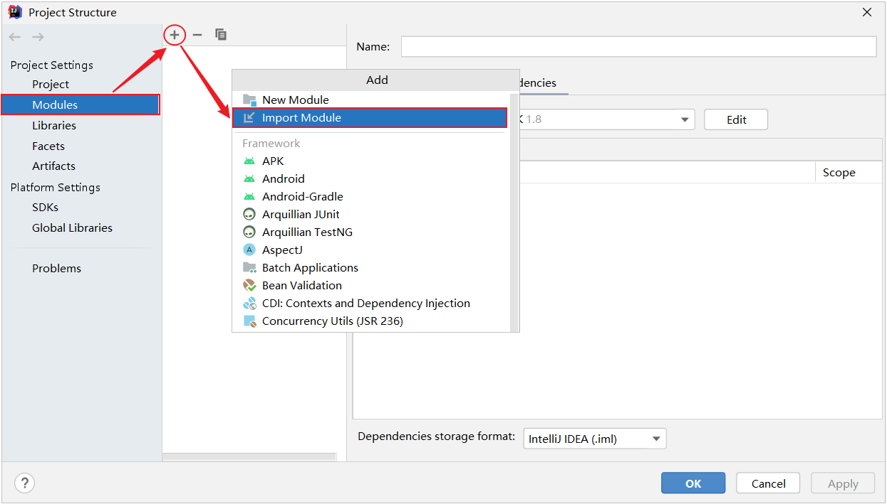

找到要导入工程的pom.xml


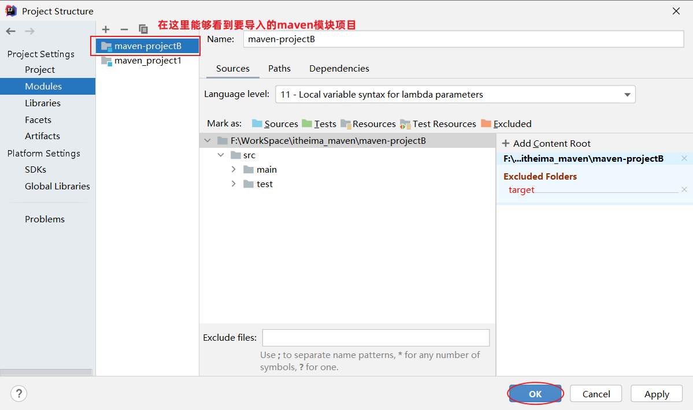


## 04. 依赖管理

### 4.1 依赖配置

依赖：指当前项目运行所需要的jar包。一个项目中可以引入多个依赖：

例如：在当前工程中，我们需要用到logback来记录日志，此时就可以在maven工程的pom.xml文件中，引入logback的依赖。具体步骤如下：

1. 在pom.xml中编写<dependencies>标签

2. 在<dependencies>标签中使用<dependency>引入坐标

3. 定义坐标的 groupId、artifactId、version

```xml
<dependencies>
    <!-- 第1个依赖 : logback -->
    <dependency>
        <groupId>ch.qos.logback</groupId>
        <artifactId>logback-classic</artifactId>
        <version>1.2.11</version>
    </dependency>
    <!-- 第2个依赖 : junit -->
    <dependency>
        <groupId>junit</groupId>
        <artifactId>junit</artifactId>
        <version>4.12</version>
    </dependency>
</dependencies>
```

4. 点击刷新按钮，引入最新加入的坐标
   - 刷新依赖：保证每一次引入新的依赖，或者修改现有的依赖配置，都可以加入最新的坐标

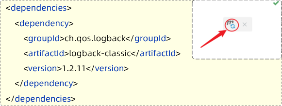  

> 注意事项：
>
> 1. 如果引入的依赖，在本地仓库中不存在，将会连接远程仓库 / 中央仓库，然后下载依赖（这个过程会比较耗时，耐心等待）
> 2. 如果不知道依赖的坐标信息，可以到mvn的中央仓库（https://mvnrepository.com/）中搜索

**添加依赖的几种方式：**

1. 利用中央仓库搜索的依赖坐标

   


2. 利用IDEA工具搜索依赖

   


3. 熟练上手maven后，快速导入依赖

   


### 4.2 依赖传递

#### 4.2.1 依赖具有传递性

早期我们没有使用maven时，向项目中添加依赖的jar包，需要把所有的jar包都复制到项目工程下。如下图所示，需要logback-classic时，由于logback-classic又依赖了logback-core和slf4j，所以必须把这3个jar包全部复制到项目工程下


我们现在使用了maven，当项目中需要使用logback-classic时，只需要在pom.xml配置文件中，添加logback-classic的依赖坐标即可。


在pom.xml文件中只添加了logback-classic依赖，但由于maven的依赖具有传递性，所以会自动把所依赖的其他jar包也一起导入。


依赖传递可以分为：

1. 直接依赖：在当前项目中通过依赖配置建立的依赖关系

2. 间接依赖：被依赖的资源如果依赖其他资源，当前项目间接依赖其他资源

 

比如以上图中：

导入模块A、B，C，测试依赖效果

- projectA依赖了projectB。对于projectA 来说，projectB 就是直接依赖。

- 而projectB依赖了projectC及其他jar包。

  那么此时，在projectA中也会将projectC的依赖传递下来。

  对于projectA 来说，projectC就是间接依赖。


#### 4.2.2 排除依赖

问题：之前我们讲了依赖具有传递性。那么A依赖B，B依赖C，如果A不想将C依赖进来，是否可以做到？ 

答案：在maven项目中，我们可以通过排除依赖来实现。


什么是排除依赖？

- 排除依赖：指主动断开依赖的资源。（被排除的资源无需指定版本）

```xml
<dependency>
    <groupId>com.itheima</groupId>
    <artifactId>maven-projectB</artifactId>
    <version>1.0-SNAPSHOT</version>
   
    <!--排除依赖, 主动断开依赖的资源-->
    <exclusions>
    	<exclusion>
            <groupId>junit</groupId>
            <artifactId>junit</artifactId>
        </exclusion>
    </exclusions>
</dependency>
```


依赖排除示例：

- maven-projectA依赖了maven-projectB，maven-projectB依赖了Junit。基于依赖的传递性，所以maven-projectA也依赖了Junit


- 使用排除依赖后

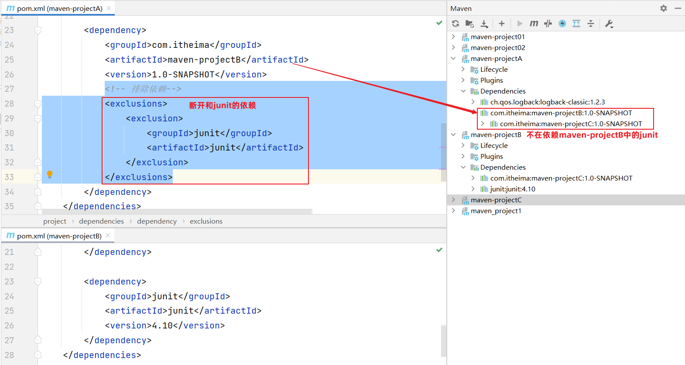

 

备注：第二种方案：B主动告知依赖不传递,通过在依赖配置中加入<optional>true</optional>

```xml
        <dependency>
            <groupId>junit</groupId>
            <artifactId>junit</artifactId>
            <version>4.10</version>
            <optional>true</optional>
        </dependency>
```


### 4.3 依赖范围

在项目中导入依赖的jar包后，默认情况下，可以在任何地方使用。

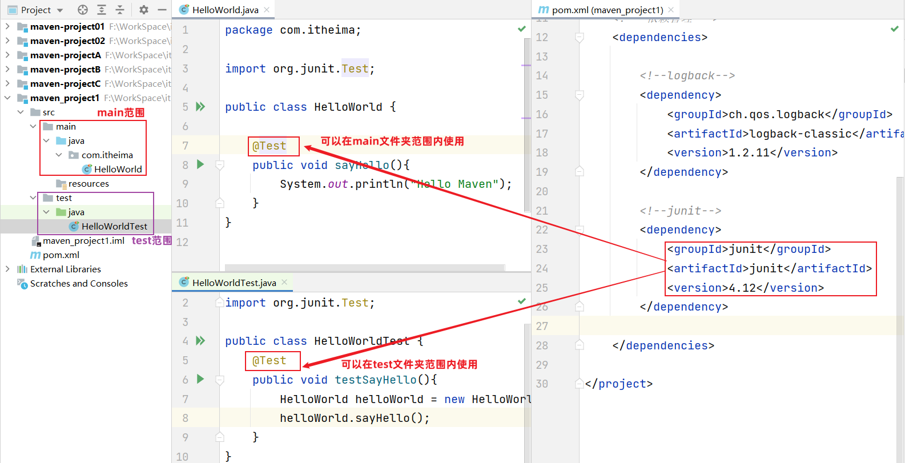

如果希望限制依赖的使用范围，可以通过<scope>标签设置其作用范围。

 

作用范围：

1. 主程序范围有效（main文件夹范围内）

2. 测试程序范围有效（test文件夹范围内）

3. 是否参与打包运行（package指令范围内）


如上图所示，给junit依赖通过scope标签指定依赖的作用范围。 那么这个依赖就只能作用在测试环境，其他环境下不能使用。

scope标签的取值范围：

| **scope**值     | **主程序** | **测试程序** | **打包（运行）** | **范例**    |
| --------------- | ---------- | ------------ | ---------------- | ----------- |
| compile（默认） | Y          | Y            | Y                | log4j       |
| test            | -          | Y            | -                | junit       |
| provided        | Y          | Y            | -                | servlet-api |
| runtime         | -          | Y            | Y                | jdbc驱动    |


### 4.4 生命周期

#### 4.4.1 介绍

Maven的生命周期就是为了对所有的构建过程进行抽象和统一。 描述了一次项目构建，经历哪些阶段。

在Maven出现之前，项目构建的生命周期就已经存在，软件开发人员每天都在对项目进行清理，编译，测试及部署。虽然大家都在不停地做构建工作，但公司和公司间、项目和项目间，往往使用不同的方式做类似的工作。

Maven从大量项目和构建工具中学习和反思，然后总结了一套高度完美的，易扩展的项目构建生命周期。这个生命周期包含了项目的清理，初始化，编译，测试，打包，集成测试，验证，部署和站点生成等几乎所有构建步骤。

Maven对项目构建的生命周期划分为3套（相互独立）：


- clean：清理工作。

- default：核心工作。如：编译、测试、打包、安装、部署等。

- site：生成报告、发布站点等。

三套生命周期又包含哪些具体的阶段呢, 我们来看下面这幅图:

 

我们看到这三套生命周期，里面有很多很多的阶段，这么多生命周期阶段，其实我们常用的并不多，主要关注以下几个：

• clean：移除上一次构建生成的文件

• compile：编译项目源代码

• test：使用合适的单元测试框架运行测试(junit)

• package：将编译后的文件打包，如：jar、war等

• install：安装项目到本地仓库


Maven的生命周期是抽象的，这意味着生命周期本身不做任何实际工作。**在Maven的设计中，实际任务（如源代码编译）都交由插件来完成。**


IDEA工具为了方便程序员使用maven生命周期，在右侧的maven工具栏中，已给出快速访问通道

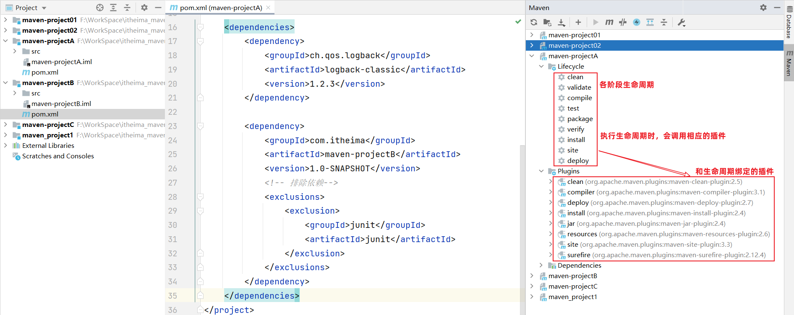

生命周期的顺序是：clean --> validate --> compile --> test --> package --> verify --> install --> site --> deploy 

我们需要关注的就是：clean -->  compile --> test --> package  --> install 

> 说明：在同一套生命周期中，我们在执行后面的生命周期时，前面的生命周期都会执行。

>  思考：当运行package生命周期时，clean、compile生命周期会不会运行？
>
>  ​		clean不会运行，compile会运行。  因为compile与package属于同一套生命周期，而clean与package不属于同一套生命周期。


#### 4.4.2 执行

在日常开发中，当我们要执行指定的生命周期时，有两种执行方式：

1. 在idea工具右侧的maven工具栏中，选择对应的生命周期，双击执行
2. 在DOS命令行中，通过maven命令执行


**方式一：在idea中执行生命周期**

- 选择对应的生命周期，双击执行

 


compile：


test：


package：

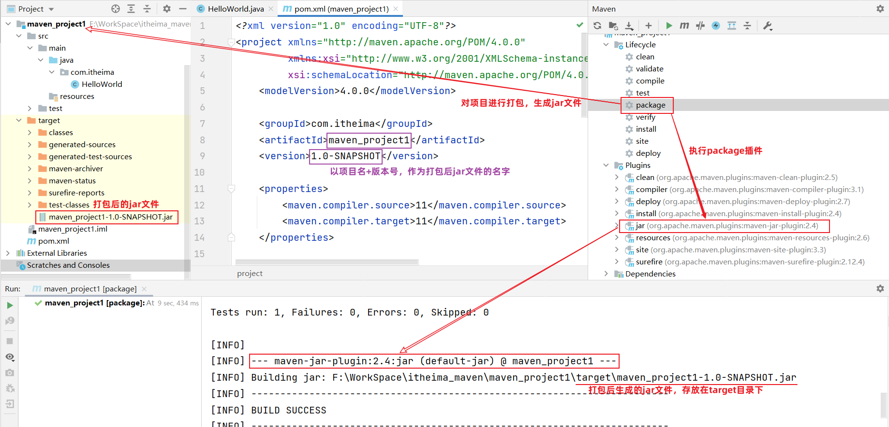


install：


clean：


**方式二：在命令行中执行生命周期**

1. 进入到DOS命令行


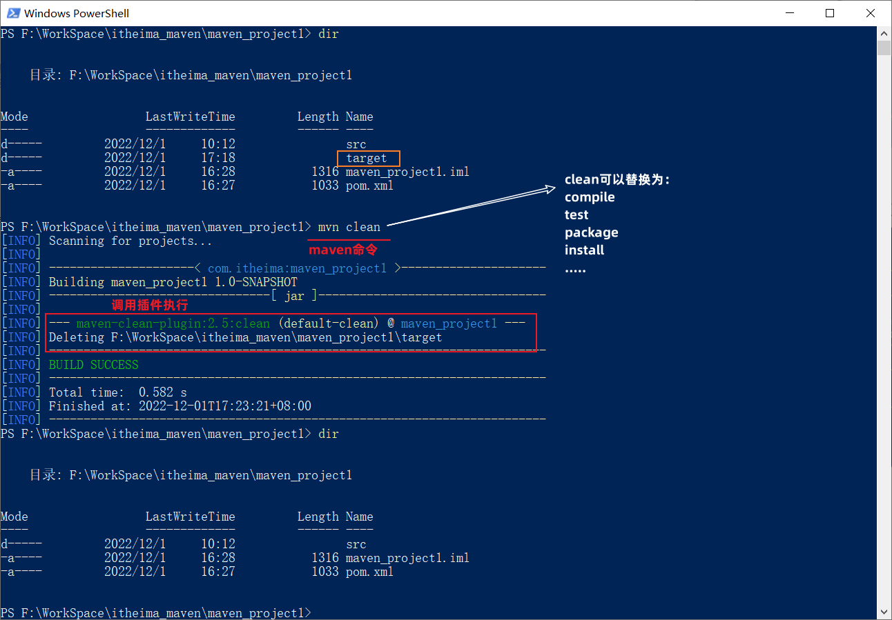 


常用命令：

```
mvn clean package -Dmaven.test.skip=true
```

 

## 05. 附录

### 5.1 更新依赖索引

有时候给idea配置完maven仓库信息后，在idea中依然搜索不到仓库中的jar包。这是因为仓库中的jar包索引尚未更新到idea中。这个时候我们就需要更新idea中maven的索引了，具体做法如下：

 打开设置----搜索maven----Repositories----选中本地仓库-----点击Update


### 5.2 清理maven仓库

初始情况下，我们的本地仓库是没有任何jar包的，此时会从私服去下载（如果没有配置，就直接从中央仓库去下载），可能由于网络的原因，jar包下载不完全，这些不完整的jar包都是以lastUpdated结尾。此时，maven不会再重新帮你下载，需要你删除这些以lastUpdated结尾的文件，然后maven才会再次自动下载这些jar包。


如果本地仓库中有很多这样的以lastUpadted结尾的文件，可以定义一个批处理文件，在其中编写如下脚本来删除： 

~~~
set REPOSITORY_PATH=E:\develop\apache-maven-3.6.1\mvn_repo
rem 正在搜索...

del /s /q %REPOSITORY_PATH%\*.lastUpdated

rem 搜索完毕
pause
~~~


操作步骤如下：

1). 定义批处理文件del_lastUpdated.bat  (直接创建一个文本文件，命名为del_lastUpdated，后缀名直接改为bat即可 )

 

2). 在上面的bat文件上**右键---》编辑** 。修改文件：

 

修改完毕后，双击运行即可删除maven仓库中的残留文件。

# SpringBoot基础 

## 课程内容

> 1. SpringBootWeb入门
>
> 2. HTTP协议
>
> 3. Web服务器-Tomcat

## 前言

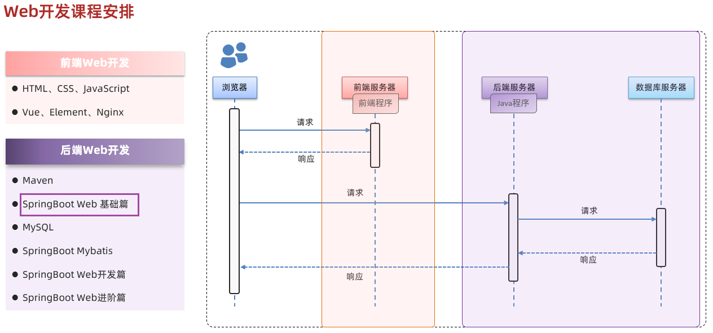

下面我们将进入SpringBoot基础阶段的学习。

在没有正式的学习SpringBoot之前，我们要先来了解下什么是Spring。

我们可以打开Spring的官网(https://spring.io)，去看一下Spring的简介：Spring makes Java simple。


Spring的官方提供很多开源的项目，我们可以点击上面的projects，看到spring家族旗下的项目，按照流行程度排序为：


Spring发展到今天已经形成了一种开发生态圈，Spring提供了若干个子项目，每个项目用于完成特定的功能。而我们在项目开发时，一般会偏向于选择这一套spring家族的技术，来解决对应领域的问题，那我们称这一套技术为**spring全家桶**。


而Spring家族旗下这么多的技术，最基础、最核心的是 SpringFramework。其他的spring家族的技术，都是基于SpringFramework的，SpringFramework中提供很多实用功能，如：依赖注入、事务管理、web开发支持、数据访问、消息服务等等。

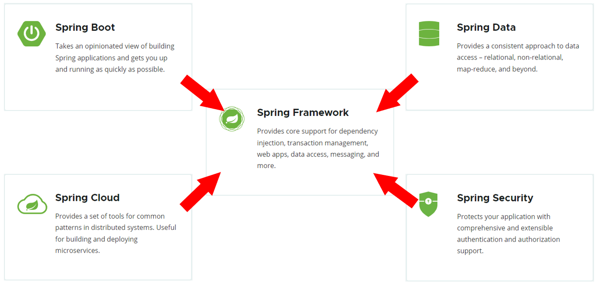


而如果我们在项目中，直接基于SpringFramework进行开发，存在两个问题：配置繁琐、入门难度大。 


所以基于此呢，spring官方推荐我们从另外一个项目开始学习，那就是目前最火爆的SpringBoot。 

通过springboot就可以快速的帮我们构建应用程序，所以springboot呢，最大的特点有两个 ：

- 简化配置
- 快速开发

**Spring Boot 可以帮助我们非常快速的构建应用程序、简化开发、提高效率 。**


接下来，我们就直接通过一个SpringBoot的web入门程序，让大家快速感受一下，基于SpringBoot进行Web开发的便捷性。


## 1. SpringBootWeb快速入门

### 1.1 需求

需求：基于SpringBoot的方式开发一个web应用，浏览器发起请求/hello后，给浏览器返回字符串 “Hello World ~”。


 

### 1.2 开发步骤

第1步：创建SpringBoot工程项目 （骨架创建）

第2步：定义HelloController类，添加方法hello，并添加注解

第3步：测试运行

#### 1.2.1 创建SpringBoot工程（需要联网）

基于Spring官方骨架，创建SpringBoot工程。

备注1：start.spring.io如果连接不成功，可点击右侧齿轮，更改为连接阿里云:start.aliyun.com

备注2：可以参考资料-Springboot项目(手动构建)-来完成SpringBoot工程创建（无需联网设置）。


基本信息描述完毕之后，勾选web开发相关依赖。


点击Finish之后，就会联网创建这个SpringBoot工程，创建好之后，结构如下：

- ==注意：在联网创建过程中，会下载相关资源(请耐心等待)==

 


#### 1.2.2 定义请求处理类

在com.itheima这个包下创建一个子包controller


然后在controller包下新建一个类：HelloController


```java
package com.itheima.controller;
import org.springframework.web.bind.annotation.*;

@RestController
public class HelloController {

    @RequestMapping("/hello")
    public String hello(){
        System.out.println("Hello World ~");
        return "Hello World ~";
    }
    
}    
```


#### 1.2.3 运行测试

运行SpringBoot自动生成的引导类

 

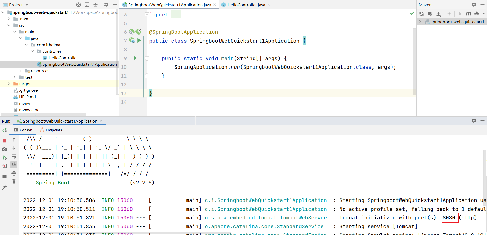 

打开浏览器，输入 `http://localhost:8080/hello`


#### 自定义banner

https://www.bootschool.net/ascii-art


### 1.3 Web分析


浏览器：

- 输入网址：`http://192.168.100.11:8080/hello`

  - 通过IP地址192.168.100.11定位到网络上的一台计算机

    > 我们之前在浏览器中输入的localhost，就是127.0.0.1（本机）

  - 通过端口号8080找到计算机上运行的程序

    > `localhost:8080`  , 意思是在本地计算机中找到正在运行的8080端口的程序

  - /hello是请求资源位置

    - 资源：对计算机而言资源就是数据
      - web资源：通过网络可以访问到的资源（通常是指存放在服务器上的数据）

    > `localhost:8080/hello` ，意思是向本地计算机中的8080端口程序，获取资源位置是/hello的数据
    >
    > - 8080端口程序，在服务器找/hello位置的资源数据，发给浏览器

服务器：（可以理解为ServerSocket）

- 接收到浏览器发送的信息（如：/hello）
- 在服务器上找到/hello的资源
- 把资源发送给浏览器

> 我们在JavaSE阶段学习网络编程时，有讲过网络三要素：
>
> - IP  ：网络中计算机的唯一标识
> - 端口 ：计算机中运行程序的唯一标识
> - 协议 ：网络中计算机之间交互的规则
>
> **问题：浏览器和服务器两端进行数据交互，使用什么协议？**
>
> **答案：http协议**


## 2. HTTP协议

### 2.1 HTTP-概述

#### 2.1.1 介绍


HTTP：Hyper Text Transfer Protocol(==超文本传输协议==)，规定了浏览器与服务器之间数据传输的规则。

- http是互联网上应用最为广泛的一种网络协议 
- http协议要求：浏览器在向服务器发送请求数据时，或是服务器在向浏览器发送响应数据时，都必须按照固定的格式进行数据传输


如果想知道http协议的数据传输格式有哪些，可以打开浏览器，点击`F12`打开开发者工具，点击`Network`来查看


浏览器向服务器进行请求时：

- 服务器按照固定的格式进行解析


服务器向浏览器进行响应时：

- 浏览器按照固定的格式进行解析


**所以，我们学习HTTP主要就是学习请求和响应数据的具体格式内容。**


#### 2.2.2 特点

我们刚才初步认识了HTTP协议，那么我们在看看HTTP协议有哪些特点：

* **基于TCP协议: **   面向连接，安全

  > TCP是一种面向连接的(建立连接之前是需要经过三次握手)、可靠的、基于字节流的传输层通信协议，在数据传输方面更安全

* **基于请求-响应模型:**   一次请求对应一次响应（先请求后响应）

  > 请求和响应是一一对应关系，没有请求，就没有响应

* **==HTTP协议是无状态协议==:**  对于数据没有记忆能力。每次请求-响应都是独立的

  > 无状态指的是客户端发送HTTP请求给服务端之后，服务端根据请求响应数据，响应完后，不会记录任何信息。
  >
  > - 缺点:  多次请求间不能共享数据
  > - 优点:  速度快
  >
  > 请求之间无法共享数据会引发的问题：
  >
  > - 如：京东购物。加入购物车和去购物车结算是两次请求
  > - 由于HTTP协议的无状态特性，加入购物车请求响应结束后，并未记录加入购物车是何商品
  > - 发起去购物车结算的请求后，因为无法获取哪些商品加入了购物车，会导致此次请求无法正确展示数据
  >
  > 具体使用的时候，我们发现京东是可以正常展示数据的，原因是Java早已考虑到这个问题，并提出了使用会话技术(Cookie、Session)来解决这个问题。具体如何来做，我们后面课程中会讲到。

  刚才提到HTTP协议是规定了请求和响应数据的格式，那具体的格式是什么呢?


### 2.2 HTTP-请求协议

浏览器和服务器是按照HTTP协议进行数据通信的。

HTTP协议又分为：请求协议和响应协议

- 请求协议：浏览器将数据以请求格式发送到服务器
  - 包括：**请求行**、**请求头** 、**请求体** 
- 响应协议：服务器将数据以响应格式返回给浏览器
  - 包括：**响应行** 、**响应头** 、**响应体** 

#### 2.2.1 请求行


请求行 ：HTTP请求中的第一行数据。由：==`请求方式`、`资源路径`、`协议/版本`组成（之间使用空格分隔）

* 请求方式：GET  
* 资源路径：/brand/findAll?name=OPPO&status=1
  * 请求路径：/brand/findAll
  * 请求参数：name=OPPO&status=1
    * 请求参数是以key=value形式出现
    * 多个请求参数之间使用`&`连接
  * 请求路径和请求参数之间使用`?`连接 			 
* 协议/版本：HTTP/1.1  

浏览器支持的请求方式，包含如下： 

| 请求方式 | 请求说明                                                     |
| :------: | :----------------------------------------------------------- |
| **GET**  | 获取资源。<br/>向特定的资源发出请求。例：http://www.baidu.com/s?wd=itheima |
| **POST** | 传输实体主体。<br/>向指定资源提交数据进行处理请求（例：上传文件），数据被包含在请求体中。 |
| OPTIONS  | 返回服务器针对特定资源所支持的HTTP请求方式。<br/>因为并不是所有的服务器都支持规定的方法，为了安全有些服务器可能会禁止掉一些方法，例如：DELETE、PUT等。那么OPTIONS就是用来询问服务器支持的方法。 |
|   HEAD   | 获得报文首部。<br/>HEAD方法类似GET方法，但是不同的是HEAD方法不要求返回数据。通常用于确认URI的有效性及资源更新时间等。 |
|   PUT    | 传输文件。<br/>PUT方法用来传输文件。类似FTP协议，文件内容包含在请求报文的实体中，然后请求保存到URL指定的服务器位置。 |
|  DELETE  | 删除文件。<br/>请求服务器删除Request-URI所标识的资源         |
|  TRACE   | 追踪路径。<br/>回显服务器收到的请求，主要用于测试或诊断      |
| CONNECT  | 要求用隧道协议连接代理。<br/>HTTP/1.1协议中预留给能够将连接改为管道方式的代理服务器 |

在我们实际应用中常用的也就是 ：**GET、POST**


**GET方式的请求协议：**

 

#### 2.2.2 请求头与请求体

请求头 ：第二行开始，上图黄色部分内容就是请求头。格式为key: value形式 

- http是个无状态的协议，所以在请求头设置浏览器的一些自身信息和想要响应的形式。这样服务器在收到信息后，就可以知道是谁，想干什么了

常见的HTTP请求头有:

~~~
Host: 表示请求的主机名

User-Agent: 浏览器版本。 例如：Chrome浏览器的标识类似Mozilla/5.0 ...Chrome/79 ，IE浏览器的标识类似Mozilla/5.0 (Windows NT ...)like Gecko

Accept：表示浏览器能接收的资源类型，如text/*，image/*或者*/*表示所有；

Accept-Language：表示浏览器偏好的语言，服务器可以据此返回不同语言的网页；

Accept-Encoding：表示浏览器可以支持的压缩类型，例如gzip, deflate等。

Content-Type：请求主体的数据类型

Content-Length：数据主体的大小（单位：字节）
~~~

> 举例说明：服务端可以根据请求头中的内容来获取客户端的相关信息，有了这些信息服务端就可以处理不同的业务需求。
>
> 比如:
>
> - 不同浏览器解析HTML和CSS标签的结果会有不一致，所以就会导致相同的代码在不同的浏览器会出现不同的效果
> - 服务端根据客户端请求头中的数据获取到客户端的浏览器类型，就可以根据不同的浏览器设置不同的代码来达到一致的效果（这就是我们常说的浏览器兼容问题）

- 请求体 ：存储请求参数
  - GET请求的请求参数在请求行中，故不需要设置请求体


**POST方式的请求协议：**	


- 请求行(以上图中红色部分)：包含请求方式、资源路径、协议/版本
  - 请求方式：POST
  - 资源路径：/brand
  - 协议/版本：HTTP/1.1
- 请求头(以上图中黄色部分)   
- 请求体(以上图中绿色部分) ：存储请求参数 
  - 请求体和请求头之间是有一个空行隔开（作用：用于标记请求头结束）


GET请求和POST请求的区别：

| 区别方式     | GET请求                                                      | POST请求             |
| ------------ | ------------------------------------------------------------ | -------------------- |
| 请求参数     | 请求参数在请求行中。<br/>例：/brand/findAll?name=OPPO&status=1 | 请求参数在请求体中   |
| 请求参数长度 | 请求参数长度有限制(浏览器不同限制也不同)                     | 请求参数长度没有限制 |
| 安全性       | 安全性低。原因：请求参数暴露在浏览器地址栏中。               | 安全性相对高         |


### 2.3 HTTP-响应协议

#### 2.3.1 格式介绍

与HTTP的请求一样，HTTP响应的数据也分为3部分：**响应行**、**响应头** 、**响应体** 

 

* 响应行(以上图中红色部分)：响应数据的第一行。响应行由`协议及版本`、`响应状态码`、`状态码描述`组成

  * 协议/版本：HTTP/1.1
  * 响应状态码：200
  * 状态码描述：OK

* 响应头(以上图中黄色部分)：响应数据的第二行开始。格式为key：value形式

  * http是个无状态的协议，所以可以在请求头和响应头中设置一些信息和想要执行的动作，这样，对方在收到信息后，就可以知道你是谁，你想干什么

  常见的HTTP响应头有:

  ~~~
  Content-Type：表示该响应内容的类型，例如text/html，image/jpeg ；
  
  Content-Length：表示该响应内容的长度（字节数）；
  
  Content-Encoding：表示该响应压缩算法，例如gzip ；
  
  Cache-Control：指示客户端应如何缓存，例如max-age=300表示可以最多缓存300秒 ;
  
  Set-Cookie: 告诉浏览器为当前页面所在的域设置cookie ;
  ~~~

- 响应体(以上图中绿色部分)： 响应数据的最后一部分。存储响应的数据
  - 响应体和响应头之间有一个空行隔开（作用：用于标记响应头结束）


#### 2.3.2 响应状态码

| 状态码分类 | 说明                                                         |
| ---------- | ------------------------------------------------------------ |
| 1xx        | **响应中** --- 临时状态码。表示请求已经接受，告诉客户端应该继续请求或者如果已经完成则忽略 |
| 2xx        | **成功** --- 表示请求已经被成功接收，处理已完成              |
| 3xx        | **重定向** --- 重定向到其它地方，让客户端再发起一个请求以完成整个处理 |
| 4xx        | **客户端错误** --- 处理发生错误，责任在客户端，如：客户端的请求一个不存在的资源，客户端未被授权，禁止访问等 |
| 5xx        | **服务器端错误** --- 处理发生错误，责任在服务端，如：服务端抛出异常，路由出错，HTTP版本不支持等 |

参考: 资料/SpringbootWeb/响应状态码.md

关于响应状态码，我们先主要认识三个状态码，其余的等后期用到了再去掌握：

* 200    ok   客户端请求成功
* 404  Not Found  请求资源不存在
* 500  Internal Server Error  服务端发生不可预期的错误


### 2.4 HTTP-协议解析

将资料中准备好的Demo工程，导入到我们的IDEA中，有一个Server.java类，这里面就是自定义的一个服务器代码，主要使用到的是`ServerSocket`和`Socket`

> 说明：以下代码大家不需要自己写，我们主要是通过代码，让大家了解到服务器针对HTTP协议的解析机制

```java
package com.itheima;

import java.io.*;
import java.net.ServerSocket;
import java.net.Socket;
import java.nio.charset.StandardCharsets;

/*
 * 自定义web服务器
 */
public class Server {
    public static void main(String[] args) throws IOException {
        ServerSocket ss = new ServerSocket(8080); // 监听指定端口
        System.out.println("server is running...");

        while (true){
            Socket sock = ss.accept();
            System.out.println("connected from " + sock.getRemoteSocketAddress());
            Thread t = new Handler(sock);
            t.start();
        }
    }
}

class Handler extends Thread {
    Socket sock;

    public Handler(Socket sock) {
        this.sock = sock;
    }

    public void run() {
        try (InputStream input = this.sock.getInputStream();
             OutputStream output = this.sock.getOutputStream()) {
                handle(input, output);
        } catch (Exception e) {
            try {
                this.sock.close();
            } catch (IOException ioe) {
            }
            System.out.println("client disconnected.");
        }
    }

    private void handle(InputStream input, OutputStream output) throws IOException {
        BufferedReader reader = new BufferedReader(new InputStreamReader(input, StandardCharsets.UTF_8));
        BufferedWriter writer = new BufferedWriter(new OutputStreamWriter(output, StandardCharsets.UTF_8));
        // 读取HTTP请求:
        boolean requestOk = false;
        String first = reader.readLine();
        if (first.startsWith("GET / HTTP/1.")) {
            requestOk = true;
        }
        for (;;) {
            String header = reader.readLine();
            if (header.isEmpty()) { // 读取到空行时, HTTP Header读取完毕
                break;
            }
            System.out.println(header);
        }
        System.out.println(requestOk ? "Response OK" : "Response Error");

        if (!requestOk) {// 发送错误响应:
            writer.write("HTTP/1.0 404 Not Found\r\n");
            writer.write("Content-Length: 0\r\n");
            writer.write("\r\n");
            writer.flush();
        } else {// 发送成功响应:
            //读取html文件，转换为字符串
            InputStream is = Server.class.getClassLoader().getResourceAsStream("html/a.html");
            BufferedReader br = new BufferedReader(new InputStreamReader(is));
            StringBuilder data = new StringBuilder();
            String line = null;
            while ((line = br.readLine()) != null){
                data.append(line);
            }
            br.close();
            int length = data.toString().getBytes(StandardCharsets.UTF_8).length;

            writer.write("HTTP/1.1 200 OK\r\n");
            writer.write("Connection: keep-alive\r\n");
            writer.write("Content-Type: text/html\r\n");
            writer.write("Content-Length: " + length + "\r\n");
            writer.write("\r\n"); // 空行标识Header和Body的分隔
            writer.write(data.toString());
            writer.flush();
        }
    }
}

```

启动ServerSocket程序：


浏览器输入：`http://localhost:8080`  就会访问到ServerSocket程序 

- ServerSocket程序，会读取服务器上`html/a.html`文件，并把文件数据发送给浏览器
- 浏览器接收到a.html文件中的数据后进行解析，显示以下内容

 


现在大家知道了服务器是可以使用java完成编写，是可以接受页面发送的请求和响应数据给前端浏览器的，而在开发中真正用到的Web服务器，我们不会自己写的，都是使用目前比较流行的web服务器。如：**Tomcat**

 


## 3. WEB服务器-Tomcat

### 3.1 简介

#### 3.1.1 服务器概述

**服务器硬件**

- 指的也是计算机，只不过服务器要比我们日常使用的计算机大很多。

 

服务器，也称伺服器。是提供计算服务的设备。由于服务器需要响应服务请求，并进行处理，因此一般来说服务器应具备承担服务并且保障服务的能力。

服务器的构成包括处理器、硬盘、内存、系统总线等，和通用的计算机架构类似，但是由于需要提供高可靠的服务，因此在处理能力、稳定性、可靠性、安全性、可扩展性、可管理性等方面要求较高。

在网络环境下，根据服务器提供的服务类型不同，可分为：文件服务器，数据库服务器，应用程序服务器，WEB服务器等。

服务器只是一台设备，必须安装服务器软件才能提供相应的服务。

**服务器软件**

服务器软件：基于ServerSocket编写的程序

- 服务器软件本质是一个运行在服务器设备上的应用程序
- 能够接收客户端请求，并根据请求给客户端响应数据


#### 3.1.2 Web服务器

Web服务器是一个应用程序(软件)，对HTTP协议的操作进行封装，使得程序员不必直接对协议进行操作(不用程序员自己写代码去解析http协议规则)，让Web开发更加便捷。主要功能是"提供网上信息浏览服务"。

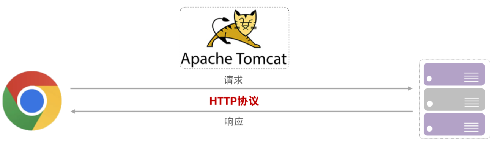

Web服务器是安装在服务器端的一款软件，将来我们把自己写的Web项目部署到Tomcat服务器软件中，当Web服务器软件启动后，部署在Web服务器软件中的页面就可以直接通过浏览器来访问了。


**Web服务器软件使用步骤**

* 准备静态资源
* 下载安装Web服务器软件
* 将静态资源部署到Web服务器上
* 启动Web服务器使用浏览器访问对应的资源

第1步：准备静态资源

- 在提供的资料中找到静态资源文件

 

第2步：下载安装Web服务器软件

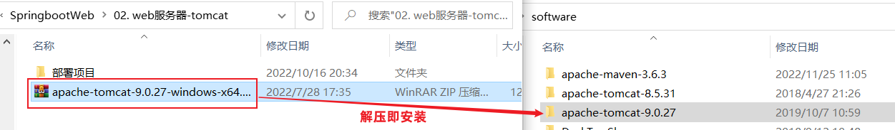

第3步：将静态资源部署到Web服务器上

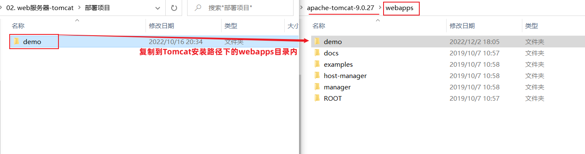

第4步：启动Web服务器使用浏览器访问对应的资源


浏览器输入：`http://localhost:8080/demo/index.html`


上述内容在演示的时候，使用的是Apache下的Tomcat软件，至于Tomcat软件如何使用，后面会详细的讲到。而对于Web服务器来说，实现的方案有很多，Tomcat只是其中的一种，而除了Tomcat以外，还有很多优秀的Web服务器，比如:

 

Tomcat就是一款软件，我们主要是以学习如何去使用为主。具体我们会从以下这些方向去学习:

1. 简介：初步认识下Tomcat

2. 基本使用: 安装、卸载、启动、关闭、配置和项目部署，这些都是对Tomcat的基本操作

3. IDEA中如何创建Maven Web项目

4. IDEA中如何使用Tomcat,后面这两个都是我们以后开发经常会用到的方式

首选我们来认识下Tomcat。


#### 3.1.3 Tomcat

Tomcat服务器软件是一个免费的开源的web应用服务器。是Apache软件基金会的一个核心项目。由Apache，Sun和其他一些公司及个人共同开发而成。

由于Tomcat只支持Servlet/JSP少量JavaEE规范，所以是一个开源免费的轻量级Web服务器。

> JavaEE规范：   JavaEE => Java Enterprise Edition(Java企业版)
>
> avaEE规范就是指Java企业级开发的技术规范总和。包含13项技术规范：JDBC、JNDI、EJB、RMI、JSP、Servlet、XML、JMS、Java IDL、JTS、JTA、JavaMail、JAF

因为Tomcat支持Servlet/JSP规范，所以Tomcat也被称为Web容器、Servlet容器。JavaWeb程序需要依赖Tomcat才能运行。

Tomcat的官网: https://tomcat.apache.org/ 

 


### 3.2 基本使用

#### 3.2.1 下载

直接从官方网站下载：https://tomcat.apache.org/download-90.cgi


> Tomcat软件类型说明：
>
> - tar.gz文件，是linux和mac操作系统下的压缩版本
> - zip文件，是window操作系统下压缩版本（我们选择zip文件）

大家可以自行下载，也可以直接使用资料中已经下载好的资源，

Tomcat的软件程序  ：/资料/SpringbootWeb/apache-tomcat-9.0.27-windows-x64.zip

 

 


#### 3.2.2 安装与卸载

**安装:** Tomcat是绿色版，直接解压即安装

> 在E盘的develop目录下，将`apache-tomcat-9.0.27-windows-x64.zip`进行解压缩，会得到一个`apache-tomcat-9.0.27`的目录，Tomcat就已经安装成功。


==注意，Tomcat在解压缩的时候，解压所在的目录可以任意，但最好解压到一个不包含中文和空格的目录，因为后期在部署项目的时候，如果路径有中文或者空格可能会导致程序部署失败。==


打开`apache-tomcat-9.0.27`目录就能看到如下目录结构，每个目录中包含的内容需要认识下

  

bin：目录下有两类文件，一种是以`.bat`结尾的，是Windows系统的可执行文件，一种是以`.sh`结尾的，是Linux系统的可执行文件。

webapps：就是以后项目部署的目录


**卸载：**卸载比较简单，可以直接删除目录即可


#### 3.2.3 启动与关闭

**启动Tomcat** 

- 双击tomcat解压目录/bin/**startup.bat**文件即可启动tomcat

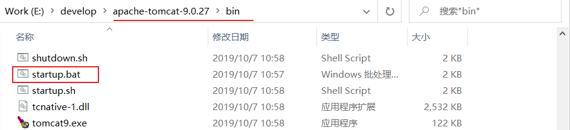

==注意: tomcat服务器启动后,黑窗口不会关闭,只要黑窗口不关闭,就证明tomcat服务器正在运行==


Tomcat的默认端口为8080，所以在浏览器的地址栏输入：`http://127.0.0.1:8080` 即可访问tomcat服务器

> 127.0.0.1 也可以使用localhost代替。如：`http://localhost:8080`


- 能看到以上图片中Apache Tomcat的内容就说明Tomcat已经启动成功

==注意事项== ：Tomcat启动的过程中，遇到控制台有中文乱码时，可以通常修改conf/logging.prooperties文件解决

 


**关闭:**  关闭有三种方式 

1、强制关闭：直接x掉Tomcat窗口（不建议）


2、正常关闭：bin\shutdown.bat

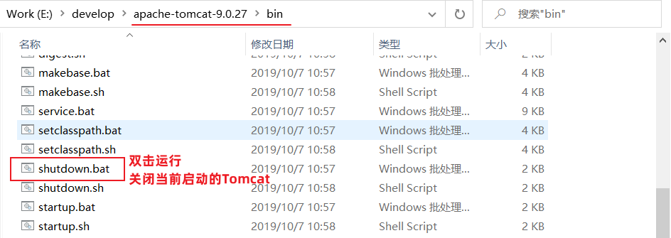

3、正常关闭：在Tomcat启动窗口中按下 Ctrl+C

- 说明：如果按下Ctrl+C没有反映，可以多按几次


#### 3.2.4 常见问题

**问题1：Tomcat启动时，窗口一闪而过**

- 检查JAVA_HOME环境变量是否正确配置

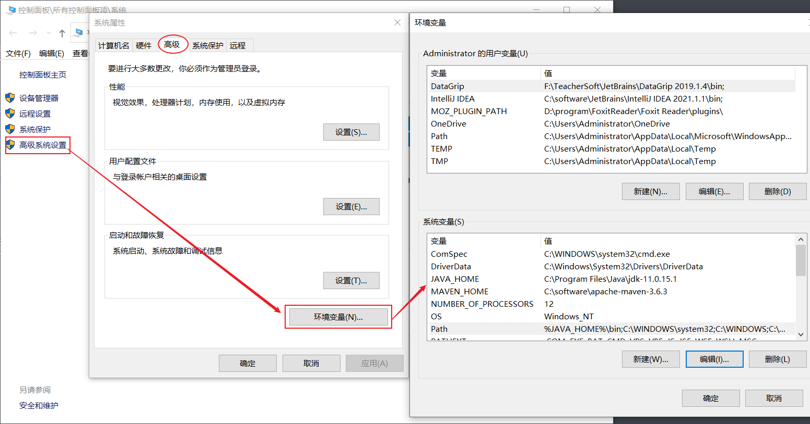


**问题2：端口号冲突**


- 发生问题的原因：Tomcat使用的端口被占用了。

- 解决方案：换Tomcat端口号
  - 要想修改Tomcat启动的端口号，需要修改 conf/server.xml文件

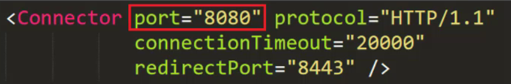 

> 注: HTTP协议默认端口号为80，如果将Tomcat端口号改为80，则将来访问Tomcat时，将不用输入端口号。


### 3.3 入门程序解析

关于web开发的基础知识，我们可以告一段落了。

下面呢，我们基于今天的核心技术点SpringBoot快速入门案例进行分析。

#### 3.3.1 起步依赖

在我们之前讲解的SpringBoot快速入门案例中，同样也引用了：web依赖和test依赖


spring-boot-starter-web和spring-boot-starter-test，在SpringBoot中又称为：起步依赖

而在SpringBoot的项目中，有很多的起步依赖，他们有一个共同的特征：就是以`spring-boot-starter-`作为开头。在以后大家遇到spring-boot-starter-xxx这类的依赖，都为起步依赖。

起步依赖有什么特殊之处呢，这里我们以入门案例中引入的起步依赖做为讲解：

- spring-boot-starter-web：包含了web应用开发所需要的常见依赖
- spring-boot-starter-test：包含了单元测试所需要的常见依赖

> **spring-boot-starter-web**内部把关于Web开发所有的依赖都已经导入并且指定了版本，只需引入 `spring-boot-starter-web` 依赖就可以实现Web开发的需要的功能
>
> 

Spring的官方提供了很多现成的starter(起步依赖)，我们在开发相关应用时，只需要引入对应的starter即可。

官方地址：https://docs.spring.io/spring-boot/docs/2.7.2/reference/htmlsingle/#using.build-systems.starters

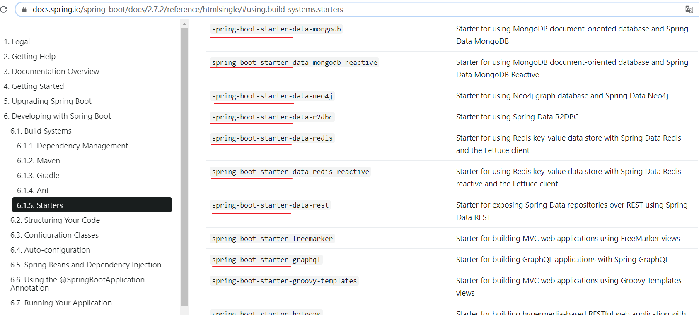

每一个起步依赖，都用于开发一个特定的功能。

> 举例：当我们开发中需要使用redis数据库时，只需要在SpringBoot项目中，引入：spring-boot-starter-redis ，即可导入redis开发所需要的依赖。

#### 3.3.2 SpringBoot父工程

在我们之前开发的SpringBoot入门案例中，我们通过maven引入的依赖，是没有指定具体的依赖版本号的。


为什么没有指定<version>版本号，可以正常使用呢？

- 因为每一个SpringBoot工程，都有一个父工程。依赖的版本号，在父工程中统一管理。

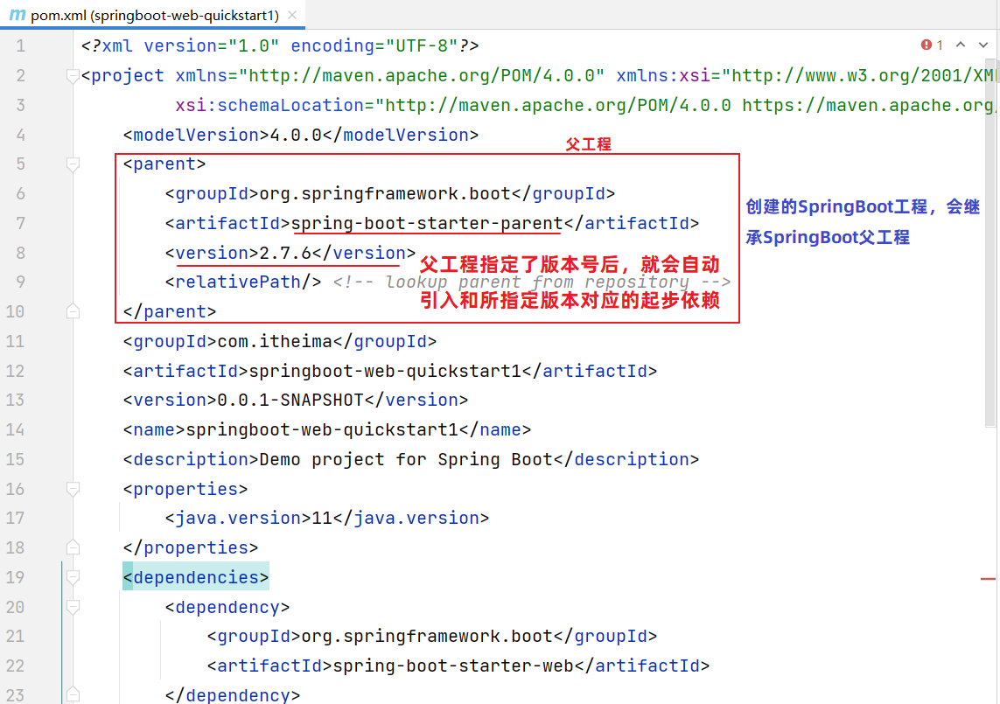


#### 3.3.3 内嵌Tomcat

问题：为什么我们之前书写的SpringBoot入门程序中，并没有把程序部署到Tomcat的webapps目录下，也可以运行呢？

原因呢，是因为在我们的SpringBoot中，引入了web运行环境(也就是引入spring-boot-starter-web起步依赖)，其内部已经集成了内置的Tomcat服务器。

我们可以通过IDEA开发工具右侧的maven面板中，就可以看到当前工程引入的依赖。其中已经将Tomcat的相关依赖传递下来了，也就是说在SpringBoot中可以直接使用Tomcat服务器。

 

当我们运行SpringBoot的引导类时(运行main方法)，就会看到命令行输出的日志，其中占用8080端口的就是Tomcat。


 
