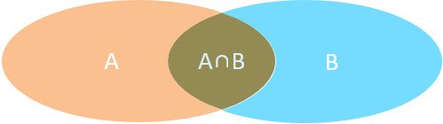
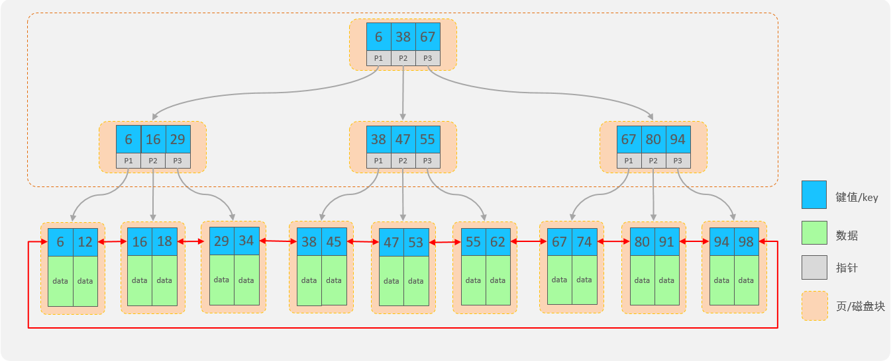
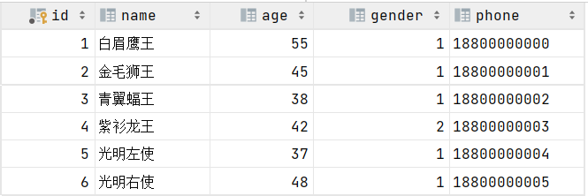
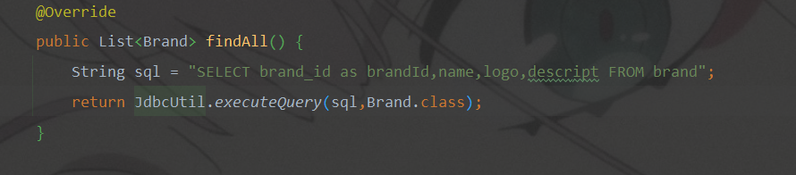
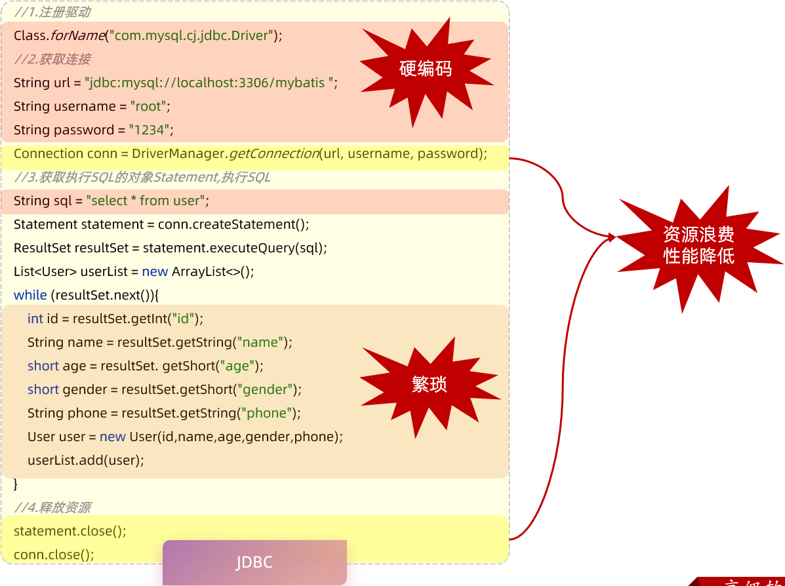
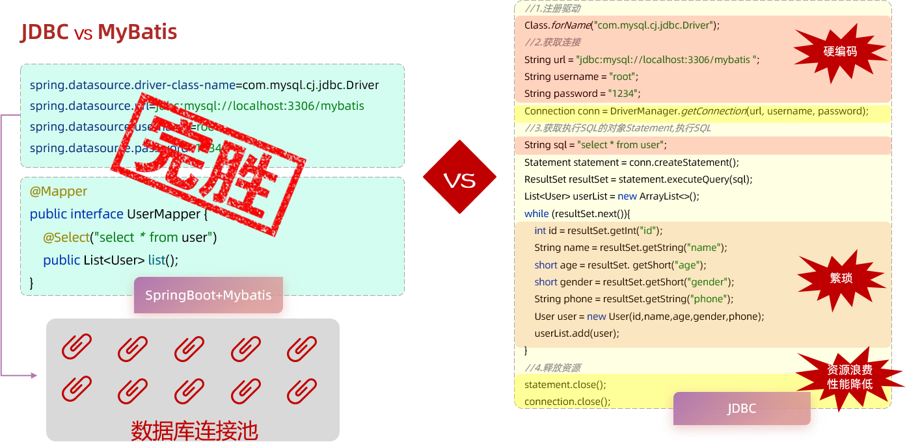
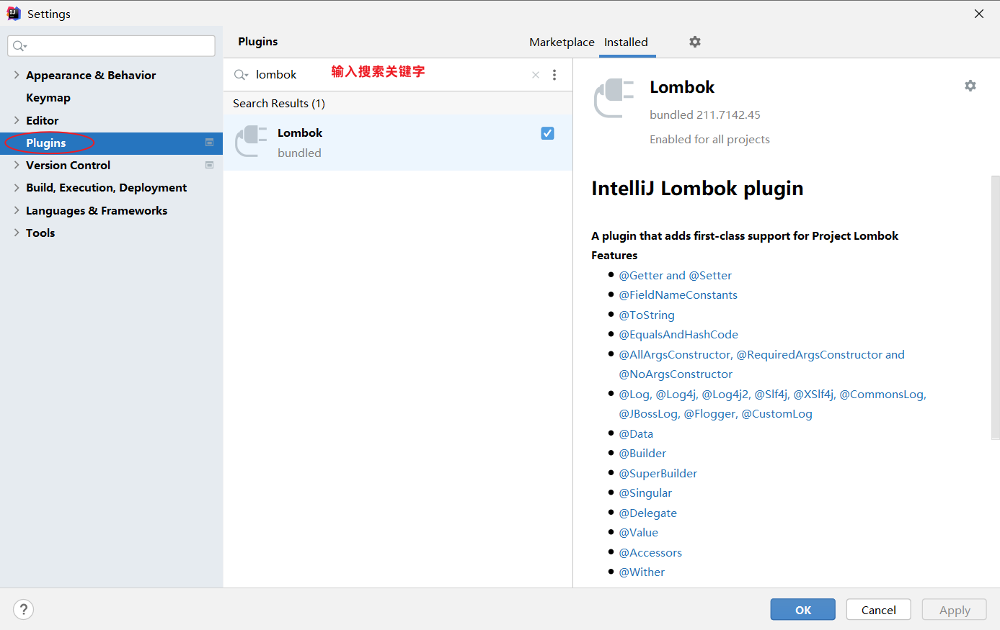

# 数据库开发-MySQL

# 1. 多表查询

## 1.1 概述

### 1.1.1 数据准备

SQL脚本：

~~~mysql
#建议：创建新的数据库
create database db04;
use db04;

-- 部门表
create table tb_dept
(
    id          int unsigned primary key auto_increment comment '主键ID',
    name        varchar(10) not null unique comment '部门名称',
    create_time datetime    not null comment '创建时间',
    update_time datetime    not null comment '修改时间'
) comment '部门表';
-- 部门表测试
insert into tb_dept (id, name, create_time, update_time)
values (1, '学工部', now(), now()),
       (2, '教研部', now(), now()),
       (3, '咨询部', now(), now()),
       (4, '就业部', now(), now()),
       (5, '人事部', now(), now());

-- 员工表
create table tb_emp
(
    id          int unsigned primary key auto_increment comment 'ID',
    username    varchar(20)      not null unique comment '用户名',
    password    varchar(32) default '123456' comment '密码',
    name        varchar(10)      not null comment '姓名',
    gender      tinyint unsigned not null comment '性别, 说明: 1 男, 2 女',
    image       varchar(300) comment '图像',
    job         tinyint unsigned comment '职位, 说明: 1 班主任,2 讲师, 3 学工主管, 4 教研主管, 5 咨询师',
    entrydate   date comment '入职时间',
    dept_id     int unsigned comment '部门ID',
    create_time datetime         not null comment '创建时间',
    update_time datetime         not null comment '修改时间'
) comment '员工表';
-- 员工表测试数据
INSERT INTO tb_emp(id, username, password, name, gender, image, job, entrydate,dept_id, create_time, update_time) 
VALUES 
(1,'jinyong','123456','金庸',1,'1.jpg',4,'2000-01-01',2,now(),now()),
(2,'zhangwuji','123456','张无忌',1,'2.jpg',2,'2015-01-01',2,now(),now()),
(3,'yangxiao','123456','杨逍',1,'3.jpg',2,'2008-05-01',2,now(),now()),
(4,'weiyixiao','123456','韦一笑',1,'4.jpg',2,'2007-01-01',2,now(),now()),
(5,'changyuchun','123456','常遇春',1,'5.jpg',2,'2012-12-05',2,now(),now()),
(6,'xiaozhao','123456','小昭',2,'6.jpg',3,'2013-09-05',1,now(),now()),
(7,'jixiaofu','123456','纪晓芙',2,'7.jpg',1,'2005-08-01',1,now(),now()),
(8,'zhouzhiruo','123456','周芷若',2,'8.jpg',1,'2014-11-09',1,now(),now()),
(9,'dingminjun','123456','丁敏君',2,'9.jpg',1,'2011-03-11',1,now(),now()),
(10,'zhaomin','123456','赵敏',2,'10.jpg',1,'2013-09-05',1,now(),now()),
(11,'luzhangke','123456','鹿杖客',1,'11.jpg',5,'2007-02-01',3,now(),now()),
(12,'hebiweng','123456','鹤笔翁',1,'12.jpg',5,'2008-08-18',3,now(),now()),
(13,'fangdongbai','123456','方东白',1,'13.jpg',5,'2012-11-01',3,now(),now()),
(14,'zhangsanfeng','123456','张三丰',1,'14.jpg',2,'2002-08-01',2,now(),now()),
(15,'yulianzhou','123456','俞莲舟',1,'15.jpg',2,'2011-05-01',2,now(),now()),
(16,'songyuanqiao','123456','宋远桥',1,'16.jpg',2,'2007-01-01',2,now(),now()),
(17,'chenyouliang','123456','陈友谅',1,'17.jpg',NULL,'2015-03-21',NULL,now(),now());
~~~


### 1.1.2 介绍

多表查询：查询时从多张表中获取所需数据

> 单表查询的SQL语句：select  字段列表  from  表名;
>
> 那么要执行多表查询，只需要使用逗号分隔多张表即可，如： select   字段列表  from  表1, 表2;

查询用户表和部门表中的数据：

~~~mysql
select * from  tb_emp , tb_dept;
~~~

  

此时,我们看到查询结果中包含了大量的结果集，总共85条记录，而这其实就是员工表所有的记录(17行)与部门表所有记录(5行)的所有组合情况，这种现象称之为笛卡尔积。

笛卡尔积：笛卡尔乘积是指在数学中，两个集合(A集合和B集合)的所有组合情况。


> 在多表查询时，需要消除无效的笛卡尔积，只保留表关联部分的数据


在SQL语句中，如何去除无效的笛卡尔积呢？只需要给多表查询加上连接查询的条件即可。

~~~mysql
select * from tb_emp , tb_dept where tb_emp.dept_id = tb_dept.id ;
~~~


> 由于id为17的员工，没有dept_id字段值，所以在多表查询时，根据连接查询的条件并没有查询到。


### 1.1.3 分类

多表查询可以分为：

1. 连接查询

   - 内连接：相当于查询A、B交集部分数据

    

2. 外连接

   - 左外连接：查询左表所有数据(包括两张表交集部分数据)

   - 右外连接：查询右表所有数据(包括两张表交集部分数据)

3. 子查询


## 1.2 内连接

内连接查询：查询两表或多表中交集部分数据。

内连接从语法上可以分为：

- 隐式内连接

- 显式内连接

隐式内连接语法：

``` mysql
select  字段列表   from   表1 , 表2   where  条件 ... ;
```

显式内连接语法：

``` mysql
select  字段列表   from   表1  [ inner ]  join 表2  on  连接条件 ... ;
```


案例：查询员工的姓名及所属的部门名称

- 隐式内连接实现

~~~mysql
select tb_emp.name , tb_dept.name -- 分别查询两张表中的数据
from tb_emp , tb_dept -- 关联两张表
where tb_emp.dept_id = tb_dept.id; -- 消除笛卡尔积
~~~

- 显式内连接实现

~~~mysql
select tb_emp.name , tb_dept.name
from tb_emp inner join tb_dept
on tb_emp.dept_id = tb_dept.id;
~~~


多表查询时给表起别名：

- tableA  as  别名1  ,  tableB  as  别名2 ;

- tableA  别名1  ,  tableB  别名2 ;

使用了别名的多表查询：

~~~mysql
select emp.name , dept.name
from tb_emp emp inner join tb_dept dept
on emp.dept_id = dept.id;
~~~

> 注意事项:
>
> 一旦为表起了别名，就不能再使用表名来指定对应的字段了，此时只能够使用别名来指定字段。


## 1.3 外连接

外连接分为两种：左外连接 和 右外连接。

左外连接语法结构：

```mysql
select  字段列表   from   表1  left  [ outer ]  join 表2  on  连接条件 ... ;
```

> 左外连接相当于查询表1(左表)的所有数据，当然也包含表1和表2交集部分的数据。

右外连接语法结构：

```mysql
select  字段列表   from   表1  right  [ outer ]  join 表2  on  连接条件 ... ;
```

> 右外连接相当于查询表2(右表)的所有数据，当然也包含表1和表2交集部分的数据。


案例：查询员工表中所有员工的姓名, 和对应的部门名称

~~~mysql
-- 左外连接：以left join关键字左边的表为主表，查询主表中所有数据，以及和主表匹配的右边表中的数据
select emp.name , dept.name
from tb_emp AS emp left join tb_dept AS dept 
     on emp.dept_id = dept.id;
~~~


案例：查询部门表中所有部门的名称, 和对应的员工名称 

~~~mysql
-- 右外连接
select dept.name , emp.name
from tb_emp AS emp right join  tb_dept AS dept
     on emp.dept_id = dept.id;
~~~


> 注意事项：
>
> 左外连接和右外连接是可以相互替换的，只需要调整连接查询时SQL语句中表的先后顺序就可以了。而我们在日常开发使用时，更偏向于左外连接。


## 1.4 子查询

### 1.4.1 介绍

SQL语句中嵌套select语句，称为嵌套查询，又称子查询。

```sql
SELECT  *  FROM   t1   WHERE  column1 =  ( SELECT  column1  FROM  t2 ... );
```

> 子查询外部的语句可以是insert / update / delete / select 的任何一个，最常见的是 select。


根据子查询结果的不同分为：

1. 标量子查询（子查询结果为单个值[一行一列]）

2. 列子查询（子查询结果为一列，但可以是多行）

3. 行子查询（子查询结果为一行，但可以是多列）

4. 表子查询（子查询结果为多行多列[相当于子查询结果是一张表]）

子查询可以书写的位置：

1. where之后
2. from之后
3. select之后


### 1.4.2 标量子查询

子查询返回的结果是单个值(数字、字符串、日期等)，最简单的形式，这种子查询称为标量子查询。

常用的操作符： =   <>   >    >=    <   <=   


案例1：查询"教研部"的所有员工信息

> 可以将需求分解为两步：
>
> 1. 查询 "教研部" 部门ID
> 2. 根据 "教研部" 部门ID，查询员工信息

```mysql
-- 1.查询"教研部"部门ID
select id from tb_dept where name = '教研部';    #查询结果：2
-- 2.根据"教研部"部门ID, 查询员工信息
select * from tb_emp where dept_id = 2;

-- 合并出上两条SQL语句
select * from tb_emp where dept_id = (select id from tb_dept where name = '教研部');
```


案例2：查询在 "方东白" 入职之后的员工信息

> 可以将需求分解为两步：
>
> 1. 查询 方东白 的入职日期
> 2. 查询 指定入职日期之后入职的员工信息

```mysql
-- 1.查询"方东白"的入职日期
select entrydate from tb_emp where name = '方东白';     #查询结果：2012-11-01
-- 2.查询指定入职日期之后入职的员工信息
select * from tb_emp where entrydate > '2012-11-01';

-- 合并以上两条SQL语句
select * from tb_emp where entrydate > (select entrydate from tb_emp where name = '方东白');
```


### 1.4.3 列子查询

子查询返回的结果是一列(可以是多行)，这种子查询称为列子查询。

常用的操作符：

| **操作符** | **描述**                     |
| ---------- | ---------------------------- |
| IN         | 在指定的集合范围之内，多选一 |
| NOT IN     | 不在指定的集合范围之内       |

案例：查询"教研部"和"咨询部"的所有员工信息

> 分解为以下两步：
>
> 1. 查询 "销售部" 和 "市场部" 的部门ID
> 2. 根据部门ID, 查询员工信息

```mysql
-- 1.查询"销售部"和"市场部"的部门ID
select id from tb_dept where name = '教研部' or name = '咨询部';    #查询结果：3,2
-- 2.根据部门ID, 查询员工信息
select * from tb_emp where dept_id in (3,2);

-- 合并以上两条SQL语句
select * from tb_emp where dept_id in (select id from tb_dept where name = '教研部' or name = '咨询部');
```


### ==1.4.4 行子查询==

子查询返回的结果是一行(可以是多列)，这种子查询称为行子查询。

常用的操作符：= 、<> 、IN 、NOT IN


案例：查询与"韦一笑"的入职日期及职位都相同的员工信息 

> 可以拆解为两步进行： 
>
> 1. 查询 "韦一笑" 的入职日期 及 职位
> 2. 查询与"韦一笑"的入职日期及职位相同的员工信息 

```mysql
-- 查询"韦一笑"的入职日期 及 职位
select entrydate , job from tb_emp where name = '韦一笑';  #查询结果： 2007-01-01 , 2
-- 查询与"韦一笑"的入职日期及职位相同的员工信息
select * from tb_emp where (entrydate,job) = ('2007-01-01',2);

select * from tb_emp  where entrydate = (select entrydate  from tb_emp where name = '韦一笑') and job = (select job  from tb_emp where name = '韦一笑')
-- 合并以上两条SQL语句
select * from tb_emp where (entrydate,job) = (select entrydate , job from tb_emp where name = '韦一笑');
```


### 1.4.5 表子查询

子查询返回的结果是多行多列，常作为临时表，这种子查询称为表子查询。


案例：查询入职日期是 "2006-01-01" 之后的员工信息 , 及其部门信息

> 分解为两步执行：
>
> 1. 查询入职日期是 "2006-01-01" 之后的员工信息
> 2. 基于查询到的员工信息，在查询对应的部门信息

~~~mysql
select * from emp where entrydate > '2006-01-01';

select e.*, d.* 
from (select * from emp where entrydate > '2006-01-01') e left join dept d on e.dept_id = d.id ;
~~~


## 1.5 案例

基于之前设计的多表案例的表结构，我们来完成今天的多表查询案例需求。

**准备环境**

将资料中准备好的多表查询的数据准备的SQL脚本导入数据库中。

 

- 分类表：category
- 菜品表：dish
- 套餐表：setmeal
- 套餐菜品关系表：setmeal_dish

 


需求：

```
1.查询价格低于 10元 的菜品的名称 、价格 及其 菜品的分类名称
2.查询所有价格在 10元(含)到50元(含)之间 且 状态为"起售"的菜品名称、价格及其分类名称 (即使菜品没有分类 , 也要将菜品查询出来)
3.查询每个分类下最贵的菜品, 展示出分类的名称、最贵的菜品的价格 .
4.查询各个分类下 菜品状态为 "起售" , 并且 该分类下菜品总数量大于等于3 的 分类名称
5.查询出 "商务套餐A" 中包含了哪些菜品 （展示出套餐名称、价格, 包含的菜品名称、价格、份数）
6.查询出低于菜品平均价格的菜品信息 (展示出菜品名称、菜品价格)
```


**实现**

1. 查询价格低于 10元 的菜品的名称 、价格 及其 菜品的分类名称

~~~mysql
/*查询技巧：
     明确1：查询需要用到哪些字段
        菜品名称、菜品价格 、 菜品分类名
     明确2：查询的字段分别归属于哪张表
        菜品表：[菜品名称、菜品价格]
        分类表：[分类名]
     明确3：如查多表，建立表与表之间的关联
        菜品表.caategory_id = 分类表.id
     其他：（其他条件、其他要求）
        价格 < 10
*/
select d.name , d.price , c.name
from dish AS d , category AS c
where d.category_id = c.id
      and d.price < 10;
~~~


2. 查询所有价格在 10元(含)到50元(含)之间 且 状态为"起售"的菜品名称、价格及其分类名称 (即使菜品没有分类 , 也要将菜品查询出来)

~~~mysql
select d.name , d.price, c.name
from dish AS d left join category AS c on d.category_id = c.id
where d.price between 10 and 50
      and d.status = 1;
~~~


3. 查询每个分类下最贵的菜品, 展示出分类的名称、最贵的菜品的价格 

~~~mysql
select c.name , max(d.price)
from dish AS d , category AS c
where d.category_id = c.id
group by c.name;
~~~


4. 查询各个分类下 菜品状态为 "起售" , 并且 该分类下菜品总数量大于等于3 的 分类名称

~~~mysql
/*查询技巧：
     明确1：查询需要用到哪些字段
        分类名称、菜品总数量
     明确2：查询用到的字段分别归属于哪张表
        分类表：[分类名]
        菜品表：[菜品状态]
     明确3：如查多表，建立表与表之间的关联
        菜品表.caategory_id = 分类表.id
     其他：（其他条件、其他要求）
        条件：菜品状态 = 1 (1表示起售)
        分组：分类名
        分组后条件： 总数量 >= 3
*/
select c.name , count(*)
from dish AS d , category AS c
where d.category_id = c.id
      and d.status = 1 -- 起售状态
group by c.name  -- 按照分类名分组
having count(*)>=3; -- 各组后筛选菜品总数据>=3
~~~


5. 查询出 "商务套餐A" 中包含了哪些菜品 （展示出套餐名称、价格, 包含的菜品名称、价格、份数）

~~~mysql
select s.name, s.price, d.name, d.price, sd.copies
from setmeal AS s , setmeal_dish AS sd , dish AS d
where s.id = sd.setmeal_id and sd.dish_id = d.id
      and s.name='商务套餐A';
~~~


6. 查询出低于菜品平均价格的菜品信息 (展示出菜品名称、菜品价格)

~~~mysql
-- 1.计算菜品平均价格
select avg(price) from dish;    -- 查询结果：37.736842
-- 2.查询出低于菜品平均价格的菜品信息
select * from dish where price < 37.736842;

-- 合并以上两条SQL语句
select * from dish where price < (select avg(price) from dish);
~~~


## ==1.6 面试题补充 union 和 union all 的区别==

union all：对两个结果集直接进⾏并集操作，记录可能有重复，不会进⾏排序。
union：对两个结果集进⾏并集操作，会进⾏去重，记录不会重复，按字段的默认规则排序。
因此，从效率上说，UNION ALL 要⽐ UNION 更快。

**扩展：UNION 和 UNION ALL 内部的 SELECT 语句必须拥有相同数量的列**

每条 SELECT 语句中列的顺序必须相同
先来说下，如果顺序不同，会是什么结果？
答：结果字段的顺序以union all 前面的表字段顺序为准。
union all 后面的表的数据会按照顺序依次附在后面。注意：按照==字段顺序匹配==，而不是按照字段名称匹配。

sql如下：顺序对结果的影响


综上：
union all 结果字段的顺序以 union all 前面的表字段顺序为准。union all 后面的表的数据会按照字段顺序依次附在后面，而不是按照字段名称匹配。

我们上面以*来表示顺序的不同，其实你写成不同顺序的字段结果一致。


3. union all 使用场景
sql 中的组合in，可用 union all 来代替，提高查询效率
原文链接：https://blog.csdn.net/m0_51176516/article/details/122364709

## 1.7 总结 查询语句执行顺序

```sql
（8）Select
（9）distinct 字段名1,字段名2，
（6）[fun(字段名)]  
（1）from 表1
（3）<join类型>join 表2 
（2）on <join条件> 
（4）where <where条件> 
（5）group by <字段> 
（7）having <having条件> 
（10）order by <排序字段> 
（11）limit <起始偏移量,行数>
https://blog.csdn.net/mysnsds/article/details/125313346
第一步 执行 from 知道先从<left_table>这个表开始的
第二步 执行 on 过滤 根据 <join_condition> 这里的条件过滤掉不符合内容的数据
第三步 执行 join 添加外部行
-------- inner join 找两张表共同的部分
--------- left join 以左表为准，找出左表所有的信息，包括右表没有的
--------- right join 以右表为准，找出左表所有的信息，包括左表没有的
--------- #注意：mysql不支持全外连接 full JOIN 可以用union
第四步 执行 where 条件 where后加需要满足的条件，然后就会得到满足条件的数据
第五步 执行 group by 分组 当我们得到满足where条件后的数据时候，group by 可以对其进行分组操作
第六步 执行 [fun(字段名)]  聚合函数结合 group by使用
第七步 执行 having 过滤 having 和 group by 通常配合使用，可以对 满足where条件内容进行过滤
第八步 执行 select 打印操作 当以上内容都满足之后，才会执行得到select列表
第九步 执行 distinct 去重 得到select列表之后，如果指定有 distinct ，执行select后会执行 distinct去重操作
第十步 执行 order by 排序 以上得到select列表 也经过去重 基本上就已经得到想要的所有内容了 然后就会执行 order by 排序asc desc
第十一步 执行 limit 限制打印行数，我们可以用limit 来打印出我们想要显示多少行。

原文链接：https://blog.csdn.net/m0_47090638/article/details/108663727
```

## 1.8 扩展从执行计划看IN、EXISTS 和 INNER JOIN效率

或许与大家想象的不一样，以上三个PLAN中JOIN写法利用了`HASH JOIN`(哈希连接），其他两种运用的都是HASH JOIN SEMI(哈希半连接），说明在这个语句中的IN与EXISTS效率是一样的。所以，**在不知哪种写法高效时应查看PLAN,而不是去记固定的结论**。

https://blog.csdn.net/qq_28356739/article/details/128944653

# 2. 事务

场景：学工部整个部门解散了，该部门及部门下的员工都需要删除了。

- 操作：

  ```sql
  -- 删除学工部
  delete from dept where id = 1;  -- 删除成功
  
  -- 删除学工部的员工
  delete from emp where dept_id = 1; -- 删除失败（操作过程中出现错误：造成删除没有成功）
  ```

- 问题：如果删除部门成功了，而删除该部门的员工时失败了，此时就造成了数据的不一致。

​	要解决上述的问题，就需要通过数据库中的事务来解决。


## 2.1 介绍

在实际的业务开发中，有些业务操作要多次访问数据库。一个业务要发送多条SQL语句给数据库执行。需要将多次访问数据库的操作视为一个整体来执行，要么所有的SQL语句全部执行成功。如果其中有一条SQL语句失败，就进行事务的回滚，所有的SQL语句全部执行失败。

简而言之：事务是一组操作的集合，它是一个不可分割的工作单位。事务会把所有的操作作为一个整体一起向系统提交或撤销操作请求，即这些操作要么同时成功，要么同时失败。

事务作用：保证在一个事务中多次操作数据库表中数据时，要么全都成功,要么全都失败。

#### ==**面试题 1、Mysql 中四种隔离级别分别是什么？**==

主要⽤于解决脏读、不可重复读、幻读。
**脏读**：⼀个事务读取到另⼀个事务还未提交的数据。
**不可重复读**：在⼀个事务中多次读取同⼀个数据时，结果出现不⼀致。
**幻读**：在⼀个事务中使⽤相同的 SQL 两次读取，第⼆次读取到了其他事务新插⼊的⾏。
不可重复读注重于数据的修改，⽽幻读注重于数据的插⼊。


**读未提交（READ UNCOMMITTED）**：未提交读隔离级别也叫读脏，就是事务可以读取其它事务未提交的数据。
**读已提交（READ COMMITTED）**：在其它数据库系统比如SQL Server 默认的隔离级别就是提交读，已提交读隔离级别就是在事务未提交之前所做的修改其它事务是不可见的。
**可重复读（REPEATABLE READ）**：保证同一个事务中的多次相同的查询的结果是一致的，比如一个事务一开始查询了一条记录然后过了几秒钟又执行了相同的查询，保证两次查询的结果是相同的，可重复读也是mysql 的默认隔离级别。
**可串行化（SERIALIZABLE）**：可串行化就是保证读取的范围内没有新的数据插入，比如事务第一次查询得到某个范围的数据，第二次查询也同样得到了相同范围的数据，中间没有新的数据插入到该范围中。

## 2.2 操作

MYSQL中有两种方式进行事务的操作：

1. 自动提交事务：即执行一条sql语句提交一次事务。（默认MySQL的事务是自动提交）
2. 手动提交事务：先开启，再提交 

事务操作有关的SQL语句：

| SQL语句                        | 描述             |
| ------------------------------ | ---------------- |
| start transaction;  /  begin ; | 开启手动控制事务 |
| commit;                        | 提交事务         |
| rollback;                      | 回滚事务         |

> 手动提交事务使用步骤：
>
> - 第1种情况：开启事务  =>  执行SQL语句   =>  成功  =>  提交事务
> - 第2种情况：开启事务  =>  执行SQL语句   =>  失败  =>  回滚事务


使用事务控制删除部门和删除该部门下的员工的操作：

```sql
-- 开启事务
start transaction ;

-- 删除学工部
delete from tb_dept where id = 1;

-- 删除学工部的员工
delete from tb_emp where dept_id = 1;
```

- 上述的这组SQL语句，如果如果执行成功，则提交事务

```sql
-- 提交事务 (成功时执行)
commit ;
```

- 上述的这组SQL语句，如果如果执行失败，则回滚事务

```sql
-- 回滚事务 (出错时执行)
rollback ;
```


## 2.3 四大特性

#### ==面试题面1：事务有哪些特性？==

> 事务的四大特性简称为：ACID


- **原子性（Atomicity）** ：原子性是指事务包装的一组sql是一个不可分割的工作单元，事务中的操作要么全部成功，要么全部失败。事务在执行过程中发生错误，会被回滚（Rollback）到事务开始前的状态，就像这个事务从来没有执行过一样。

- **一致性（Consistency）**：一个事务完成之后数据都必须处于一致性状态。

​		如果事务成功的完成，那么数据库的所有变化将生效。

​		如果事务执行出现错误，那么数据库的所有变化将会被回滚(撤销)，返回到原始状态。

- **隔离性（Isolation）**：多个用户并发的访问数据库时，一个用户的事务不能被其他用户的事务干扰，多个并发的事务之间要相互隔离。

​		一个事务的成功或者失败对于其他的事务是没有影响。

- **持久性（Durability）**：一个事务一旦被提交或回滚，它对数据库的改变将是永久性的，哪怕数据库发生异常，重启之后数据亦然存在。


# 3. 索引

## 3.1 介绍 

**索引(index)**：是帮助数据库高效获取数据的数据结构 。简单来讲，就是使用索引可以提高查询的效率。


比如查询年龄=45的员工：

无索引：全表扫描


有索引：按索引表（B+树结构）


==优点：==

1. 提高数据查询的效率，降低数据库的IO成本。
2. 通过索引列对数据进行排序，降低数据排序的成本，降低CPU消耗。

==缺点：==

1. 索引会占用存储空间。
2. 索引大大提高了查询效率，同时却也降低了insert、update、delete的效率。


## 3.2 结构

MySQL数据库支持的索引结构有很多，如：Hash索引、B+Tree索引、Full-Text索引等。

我们平常所说的索引，如果没有特别指明，都是指默认的 B+Tree 结构组织的索引。

在没有了解B+Tree结构前，我们先回顾下之前所学习的树结构：

> 二叉查找树：左边的子节点比父节点小，右边的子节点比父节点大

 

> 当我们向二叉查找树保存数据时，是按照从大到小(或从小到大)的顺序保存的，此时就会形成一个单向链表，搜索性能会打折扣。

 

> 可以选择平衡二叉树或者是红黑树来解决上述问题。（红黑树也是一棵平衡的二叉树）


> 但是在Mysql数据库中并没有使用二叉搜索数或二叉平衡数或红黑树来作为索引的结构。

思考：采用二叉搜索树或者是红黑树来作为索引的结构有什么问题？

<details>
    <summary>答案</summary>
    最大的问题就是在数据量大的情况下，树的层级比较深，会影响检索速度。因为不管是二叉搜索数还是红黑数，一个节点下面只能有两个子节点。此时在数据量大的情况下，就会造成数的高度比较高，树的高度一旦高了，检索速度就会降低。
</details>
> 说明：如果数据结构是红黑树，那么查询1000万条数据，根据计算树的高度大概是23左右，这样确实比之前的方式快了很多，但是如果高并发访问，那么一个用户有可能需要23次磁盘IO，那么100万用户，那么会造成效率极其低下。所以为了减少红黑树的高度，那么就得增加树的宽度，就是不再像红黑树一样每个节点只能保存一个数据，可以引入另外一种数据结构，一个节点可以保存多个数据，这样宽度就会增加从而降低树的高度。这种数据结构例如BTree就满足。

下面我们来看看B+Tree(多路平衡搜索树)结构中如何避免这个问题：





##### ==B+Tree结构：==

- 每一个节点，可以存储多个key（有n个key，就有n个指针）
- 节点分为：叶子节点、非叶子节点
  - 叶子节点，就是最后一层子节点，所有的数据都存储在叶子节点上
  - 非叶子节点，不是树结构最下面的节点，用于索引数据，存储的的是：key+指针
- 为了提高范围查询效率，叶子节点形成了一个双向链表，便于数据的排序及区间范围查询

**补充：**

B+树与B树：

最大区别，B树的每个节点都存储数据。


B+Tree是B-Tree的变种，如图所示：

 

我们可以看到，两部分：

- 绿色框框起来的部分，是索引部分，仅仅起到索引数据的作用，不存储数据。
- 红色框框起来的部分，是数据存储部分，在其叶子节点中要存储具体的数据。形成单向链表结构


关于B+树数据结构，感兴趣的同学可以通过一个网站进行演示：

 https://www.cs.usfca.edu/~galles/visualization/BPlusTree.html

 

插入一组数据： 100 65 169 368 900 556 780 35 215 1200 234 888 158 90 1000 88 120 268 250 。然后观察一些数据插入过程中，节点的变化情况。

 

**拓展-一个三阶（三层高）的B+树，可以存储多少条数据**

> ****
>
> 非叶子节点都是由key+指针域组成的，一个key占8字节，一个指针占6字节，而一个节点总共容量是16KB，那么可以计算出一个节点可以存储的元素个数：16*1024字节 / (8+6)=1170个元素。
>
> - 查看mysql索引节点大小：show global status like 'innodb_page_size';    -- 节点大小：16384
>
> 当根节点中可以存储1170个元素，那么根据每个元素的地址值又会找到下面的子节点，每个子节点也会存储1170个元素，那么第二层即第二次IO的时候就会找到数据大概是：1170*1170=135W。也就是说B+Tree数据结构中只需要经历两次磁盘IO就可以找到135W条数据。
>
> 对于第二层每个元素有指针，那么会找到第三层，第三层由key+数据组成，假设key+数据总大小是1KB，而每个节点一共能存储16KB，所以一个第三层一个节点大概可以存储16个元素(即16条记录)。那么结合第二层每个元素通过指针域找到第三层的节点，第二层一共是135W个元素，那么第三层总元素大小就是：135W*16结果就是2000W+的元素个数。
>
> 结合上述分析B+Tree有如下优点：
>
> - 千万条数据，B+Tree可以控制在小于等于3的高度
> - 所有的数据都存储在叶子节点上，并且底层已经实现了按照索引进行排序，还可以支持范围查询，叶子节点是一个双向链表，支持从小到大或者从大到小查找


## 3.3索引的类型

1. 按数据结构形式

​       B+Tree索引(InnoDB引擎默认）、Hash索引、Full-text索引（全文索引MyISAM）

2. 按物理存储分类

​    聚集索引、非聚集索引（二级索引）

3. 按字段特性分类

   主键索引、唯一索引、普通索引、全文索引

4. 按字段个数分类

​    单列索引、联合索引（组合索引）

重点说明物理存储形式

| 分类                                        | 含义                                                       | 特点                |
| ------------------------------------------- | ---------------------------------------------------------- | ------------------- |
| 聚集（聚簇）索引(Clustered  Index)          | 将数据存储与索引放到了一块，索引结构的叶子节点保存了行数据 | 必须有,而且只有一个 |
| 二级索引/非聚集（非聚簇）(Secondary  Index) | 将数据与索引分开存储，索引结构的叶子节点关联的是对应的主键 | 可以存在多个        |

聚集索引选取规则:

- 如果存在主键，主键索引就是聚集索引。

- 如果不存在主键，将使用第一个唯一（UNIQUE）索引作为聚集索引。

- 如果表没有主键，或没有合适的唯一索引，则InnoDB会自动生成一个rowid作为隐藏的聚集索引。


#### ==面试题 2、**聚簇索引和非聚簇索引查询过程原则**==


MyISAM 的索引⽅式就是⾮聚簇索引。

#### ==面试题3：什么是聚簇索引（聚集索引）？==

**聚簇索引**并不是⼀种单独的索引类型，⽽是⼀种数据存储⽅式。聚簇索引将索引和数据⾏放到了⼀块，找到索引也就找到了数据。因为⽆需进⾏回表操作，所以效率很⾼。InnoDB 中必然会有，且只会有⼀个聚簇索引。通常是主键，如果没有主键，则优先选择⾮空的唯⼀索引，如果唯⼀索引也没有，则会创建⼀个隐藏的row_id 作为聚簇索引。⾄于为啥会只有⼀个聚簇索引，其实很简单，因为我们的数据只会存储⼀份。

⽽**⾮聚簇索**引则将数据存储和索引分开，找到索引后，需要通过对应的地址找到对应的数据⾏。MyISAM 的索引⽅式就是⾮聚簇索引。

#### ==面试题4：什么是回表查询？==

InnoDB 中，对于主键索引，只需要⾛⼀遍主键索引的查询就能在叶⼦节点拿到数据。
⽽对于普通索引，叶⼦节点存储的是 key + 主键值，因此需要再⾛⼀次主键索引，通过主键索引找到⾏记录，这就是所谓的回表查询，先定位主键值，再定位⾏记录。

#### ==面试题5：如何知道sql语句是否有索引==

执行计划explain：作用检测sql效率，是否有索引


type ：all全表扫描

##### 解释Explain得到的结果

- **type 反应查询语句的性能**

  我们主需要注意一个最重要的的 type 的信息很明显地体现出是否用到了索引：

  type 结果值从好到坏依次是：

  system > const > eq_ref > ref > fulltext > ref_or_null > index_merge > unique_subquery > index_subquery > range > index > ALL

  一般来说，得保证查询至少达到 range 级别，最好能达到 ref 级别，否则就可能出现性能问题。

- **possible_keys: SQL查询时用到的索引。**

  可以看到，没加索引时，possible_keys 的值为 NULL，加了索引后的值为 address，即用到了索引address(索引默认为(column_list)中的第一个列的名字).

- **key 显示SQL实际决定查询结果使用的键(索引)。如果没有使用索引，值为NULL**

  可以看到，没加索引时，key 的值为 NULL，加了索引后的值为 address，即决定查询结果用到了索引address

- **rows 显示MySQL认为它执行查询时必须检查的行数**

  可以看到，没加索引时，rows 的值为17，即数据表student中所有数据，说明没加索引时的SQL查询是全表扫描；加了索引后，rows 的值为6，数据库表中address以“北京市”开头的一共也就6条，SQL在执行查询操作时，一共也检查了6行，不必进行全表扫描查询，可以很容易得出结论：加索引的SQL查询性能远高于不加索引的情况。

原文链接：https://blog.csdn.net/qq_27198345/article/details/116382587

## 3.4 语法

**创建索引**

~~~mysql
create  [ unique ]  index 索引名 on  表名 (字段名,... ) ;
~~~

案例：为tb_emp表的name字段建立一个索引

~~~mysql
create index idx_emp_name on tb_emp(name);
~~~

案例：为tb_emp表的name、username字段建立一个联合索引

~~~mysql
create index idx_emp_name_username on tb_emp(name,username);
~~~

案例：创建表的时候创建索引；新建一张学生表，并添加id为主键索引，name为普通索引，(name,age)为组合索引

```mysql
CREATE TABLE `student` (
  `id` int NOT NULL COMMENT 'id',
  `name` varchar(255) COLLATE utf8mb4_bin DEFAULT NULL COMMENT '姓名',
  `age` int DEFAULT NULL COMMENT '年龄',
  `birthday` datetime DEFAULT NULL COMMENT '生日',
  PRIMARY KEY (`id`),
  KEY `idx_name` (`name`) USING BTREE,
  KEY `idx_name_age` (`name`,`age`) USING BTREE
) ENGINE=InnoDB DEFAULT CHARSET=utf8mb4 COLLATE=utf8mb4_bin;
```


> 在创建表时，如果添加了主键和唯一约束，就会默认创建：主键索引、唯一约束
>
> 


**查看索引**

~~~mysql
show  index  from  表名;
~~~

案例：查询 tb_emp 表的索引信息

~~~mysql
show  index  from  tb_emp;
~~~


**删除索引**

~~~mysql
drop  index  索引名  on  表名;
~~~

案例：删除 tb_emp 表中name字段的索引

~~~mysql
drop index idx_emp_name on tb_emp;
~~~


> 注意事项：
>
> - 主键字段，在建表时，会自动创建主键索引
>
> - 添加唯一约束时，数据库实际上会添加唯一索引

#### ==面试6：索引失效==

/**/

- 查询条件中有or,即使有部分条件带索引也会失效（除非or全部都有索引）

- 模糊查询索引失效、列上做计算索引失效
- 如果列类型是字符串，那在查询条件中需要将数据用引号引用起来，否则不走索引
- 违背联合索引最左匹配原则(和建立再(name,age)组合索引的基础上，当查询条件中没有第一个组合索引的字段(name)会导致索引失效)

```mysql
例如：select * from admin where year(admin_time)>2014
优化为： select * from admin where admin_time> '2014-01-01′
```

建索引失效

联合索引最左匹配


# Mybatis入门

## 前言

在前面我们学习MySQL数据库时，都是利用图形化客户端工具(如：idea、datagrip)，来操作数据库的。

> 在客户端工具中，编写增删改查的SQL语句，发给MySQL数据库管理系统，由数据库管理系统执行SQL语句并返回执行结果。
>
> 增删改操作：返回受影响行数
>
> 查询操作：返回结果集(查询的结果)

我们做为后端程序开发人员，通常会使用Java程序来完成对数据库的操作。Java程序操作数据库，现在主流的方式是：Mybatis。

什么是MyBatis?

- MyBatis是一款优秀的 **持久层** **框架**，用于简化JDBC的开发。

- MyBatis本是 Apache的一个开源项目iBatis，2010年这个项目由apache迁移到了google code，并且改名为MyBatis 。2013年11月迁移到Github。

- 官网：https://mybatis.org/mybatis-3/zh/index.html 

在上面我们提到了两个词：一个是持久层，另一个是框架。

- 持久层：指的是就是数据访问层(dao)，是用来操作数据库的。

 

- 框架：是一个半成品软件，是一套可重用的、通用的、软件基础代码模型。在框架的基础上进行软件开发更加高效、规范、通用、可拓展。


Mybatis课程安排：

- Mybatis入门

- Mybatis基础增删改查

- Mybatis动态SQL

接下来，我们就通过一个入门程序，让大家快速感受一下通过Mybatis如何来操作数据库。

## 1. 快速入门

需求：使用Mybatis查询所有用户数据。

### 1.1 入门程序分析

以前我们是在图形化客户端工具中编写SQL查询代码，发送给数据库执行，数据库执行后返回操作结果。

 


图形化工具会把数据库执行的查询结果，使用表格的形式展现出来

 


现在使用Mybatis操作数据库，就是在Mybatis中编写SQL查询代码，发送给数据库执行，数据库执行后返回结果。


 Mybatis会把数据库执行的查询结果，使用实体类封装起来（一行记录对应一个实体类对象）


Mybatis操作数据库的步骤：

1. 准备工作(创建springboot工程、数据库表user、实体类User)

2. 引入Mybatis的相关依赖，配置Mybatis(数据库连接信息)

3. 编写SQL语句(注解/XML)


### 1.2 入门程序实现

#### 1.2.1 准备工作

##### 1.2.1.1 创建springboot工程

创建springboot工程，并导入 mybatis的起步依赖、mysql的驱动包。(如图是在一个空工程创建的一个模块)


> 项目工程创建完成后，自动在pom.xml文件中，导入Mybatis依赖和MySQL驱动依赖

~~~xml
<!-- 仅供参考：只粘贴了pom.xml中部分内容 -->
<dependencies>
        <!-- mybatis起步依赖 -->
        <dependency>
            <groupId>org.mybatis.spring.boot</groupId>
            <artifactId>mybatis-spring-boot-starter</artifactId>
            <version>2.3.0</version>
        </dependency>

        <!-- mysql驱动包依赖 -->
        <dependency>
            <groupId>com.mysql</groupId>
            <artifactId>mysql-connector-j</artifactId>
            <scope>runtime</scope>
        </dependency>
        
        <!-- spring单元测试 (集成了junit) -->
        <dependency>
            <groupId>org.springframework.boot</groupId>
            <artifactId>spring-boot-starter-test</artifactId>
            <scope>test</scope>
        </dependency>
</dependencies>
~~~


##### 1.2.1.2 数据准备

在db01数据库中，创建用户表user，并创建对应的实体类User。

- 用户表：

```sql
use db01;
-- 用户表
create table user(
    id int unsigned primary key auto_increment comment 'ID',
    name varchar(100) comment '姓名',
    age tinyint unsigned comment '年龄',
    gender tinyint unsigned comment '性别, 1:男, 2:女',
    phone varchar(11) comment '手机号'
) comment '用户表';

-- 测试数据
insert into user(id, name, age, gender, phone) VALUES (null,'白眉鹰王',55,'1','18800000000');
insert into user(id, name, age, gender, phone) VALUES (null,'金毛狮王',45,'1','18800000001');
insert into user(id, name, age, gender, phone) VALUES (null,'青翼蝠王',38,'1','18800000002');
insert into user(id, name, age, gender, phone) VALUES (null,'紫衫龙王',42,'2','18800000003');
insert into user(id, name, age, gender, phone) VALUES (null,'光明左使',37,'1','18800000004');
insert into user(id, name, age, gender, phone) VALUES (null,'光明右使',48,'1','18800000005');
```

 

- 实体类 放在com.itheima.pojo包中

  - 实体类的属性名与表中的字段名一一对应。

```java
public class User {
    private Integer id;   //id（主键）
    private String name;  //姓名
    private Short age;    //年龄
    private Short gender; //性别
    private String phone; //手机号
    
    public User(){
        
    }
    
    public User(Integer id, String name, Short age, Short gender, String phone) {
        this.id = id;
        this.name = name;
        this.age = age;
        this.gender = gender;
        this.phone = phone;
    }
    
    //省略GET, SET方法
}
```


#### 1.2.2 配置Mybatis

> 在之前使用图形化客户端工具，连接MySQL数据库时，需要配置：
>
> 
>
> 连接数据库的四大参数：
>
> - MySQL驱动类 
> - 登录名
> - 密码
> - 数据库连接字符串

基于上述分析，在Mybatis中要连接数据库，同样也需要以上4个参数配置。

在springboot项目中，可以编写application.properties文件，配置数据库连接信息。我们要连接数据库，就需要配置数据库连接的基本信息，包括：driver-class-name、url 、username，password。

> 在入门程序中，大家可以直接这么配置，后面会介绍什么是驱动。


application.properties:

```properties
#驱动类名称
spring.datasource.driver-class-name=com.mysql.cj.jdbc.Driver
#数据库连接的url
spring.datasource.url=jdbc:mysql://localhost:3306/db01
#连接数据库的用户名
spring.datasource.username=root
#连接数据库的密码
spring.datasource.password=root
```

> 上述的配置，可以直接复制过去，不要敲错了。 全部都是 spring.datasource.xxxx 开头。


#### 1.2.3 编写SQL语句

在创建出来的springboot工程中，在引导类所在包下，在创建一个包 mapper。在mapper包下创建一个接口 UserMapper ，这是一个持久层接口（Mybatis的持久层接口规范一般都叫 XxxMapper）。


UserMapper：

~~~java
import com.itheima.pojo.User;
import org.apache.ibatis.annotations.Mapper;
import org.apache.ibatis.annotations.Select;
import java.util.List;

@Mapper
public interface UserMapper {
    
    //查询所有用户数据
    @Select("select id, name, age, gender, phone from user")
    public List<User> list();
    
}
~~~

> @Mapper注解：表示是mybatis中的Mapper接口
>
> - 程序运行时：框架会自动生成接口的实现类对象(代理对象)，并给交Spring的IOC容器管理
>
>  @Select注解：代表的就是select查询，用于书写select查询语句


#### 1.2.4 单元测试

在创建出来的SpringBoot工程中，在src下的test目录下，已经自动帮我们创建好了测试类 ，并且在测试类上已经添加了注解 @SpringBootTest，代表该测试类已经与SpringBoot整合。 

该测试类在运行时，会自动通过引导类加载Spring的环境（IOC容器）。我们要测试那个bean对象，就可以直接通过@Autowired注解直接将其注入进行，然后就可以测试了。 

测试类代码如下： 

```java
@SpringBootTest
public class MybatisQuickstartApplicationTests {
	
    @Autowired
    private UserMapper userMapper;
	
    @Test
    public void testList(){
        List<User> userList = userMapper.list();
        for (User user : userList) {
            System.out.println(user);
        }
    }

}
```

> 运行结果：
>
> ~~~
> User{id=1, name='白眉鹰王', age=55, gender=1, phone='18800000000'}
> User{id=2, name='金毛狮王', age=45, gender=1, phone='18800000001'}
> User{id=3, name='青翼蝠王', age=38, gender=1, phone='18800000002'}
> User{id=4, name='紫衫龙王', age=42, gender=2, phone='18800000003'}
> User{id=5, name='光明左使', age=37, gender=1, phone='18800000004'}
> User{id=6, name='光明右使', age=48, gender=1, phone='18800000005'}
> ~~~


### 1.3 解决SQL警告与提示(没有提示，忽略即可)

默认我们在UserMapper接口上加的@Select注解中编写SQL语句是没有提示的。 如果想让idea给我们提示对应的SQL语句，我们需要在IDEA中配置与MySQL数据库的链接。 

默认我们在UserMapper接口上的@Select注解中编写SQL语句是没有提示的。如果想让idea给出提示，可以做如下配置：


配置完成之后，发现SQL语句中的关键字有提示了，但还存在不识别表名(列名)的情况：


> 产生原因：Idea和数据库没有建立连接，不识别表信息
>
> 解决方案：在Idea中配置MySQL数据库连接

 

> 在配置的时候指定连接那个数据库，如上图所示连接的就是mybatis数据库。


## 2. JDBC介绍(了解)

### 2.1 介绍

通过Mybatis的快速入门，我们明白了，通过Mybatis可以很方便的进行数据库的访问操作。但是大家要明白，其实java语言操作数据库呢，只能通过一种方式：使用sun公司提供的 JDBC 规范。

> Mybatis框架，就是对原始的JDBC程序的封装。 

那到底什么是JDBC呢，接下来，我们就来介绍一下。

JDBC： ( Java DataBase Connectivity )，就是使用Java语言操作关系型数据库的一套API。

 


> 本质：
>
> - sun公司官方定义的一套操作所有关系型数据库的规范，即接口。
>
> - 各个数据库厂商去实现这套接口，提供数据库驱动jar包。
>
> - 我们可以使用这套接口(JDBC)编程，真正执行的代码是驱动jar包中的实现类。


### 2.2 代码

下面我们看看原始的JDBC程序是如何操作数据库的。操作步骤如下：

1. **注册驱动**
2. **获取连接对象**
3. **执行SQL语句，返回执行结果**
4. **处理执行结果**
5. **释放资源**

> 在pom.xml文件中已引入MySQL驱动依赖，我们直接编写JDBC代码即可

JDBC具体代码实现：

```java
package com.neuedu.util;

import java.lang.reflect.Field;
import java.sql.*;
import java.util.ArrayList;
import java.util.List;

/**
 * @author 施子安
 * @create
 */
public class JdbcUtil {
    static String URL ="jdbc:mysql://127.0.0.1:3306/db?useUnicode=true&characterEncoding=utf8";
    static String USER = "root";
    static String PASSWORD = "";
    static {
        //选择数据库类型
        try {
            Class.forName("com.mysql.jdbc.Driver");
        } catch (ClassNotFoundException e) {
            e.printStackTrace();
        }
    }
    static Connection connection(){
        Connection con = null;
        //创建数据库连接
        try {
            con = DriverManager.getConnection(URL,USER,PASSWORD);
        } catch (SQLException throwables) {
            throwables.printStackTrace();
        }
        return con;
    }
    static void close(PreparedStatement prs ,Connection con){
        try {
            if (prs != null) prs.close();
            if (con != null) con.close();
        } catch (SQLException throwables) {
            throwables.printStackTrace();
        }
    }
    static void close(ResultSet resultSet, PreparedStatement prs , Connection con){
        try {
            if (resultSet != null)resultSet.close();
            close(prs,con);
        } catch (SQLException throwables) {
            throwables.printStackTrace();
        }
    }
    public static int executeUpdate(String sql,Object... objs){
        int i = 0;
        Connection con = connection();
        PreparedStatement prs = null;
        try {
            prs = con.prepareStatement(sql);
            if (objs != null){
                for (int j = 0; j < objs.length; j++) {
                    prs.setObject(j + 1,objs[j]);
                }
            }

            i = prs.executeUpdate();
        }  catch (SQLException throwables) {
            throwables.printStackTrace();
        }finally {
            close(prs,con);
        }
        return i;
    }

    public static <T> List<T> executeQuery(String sql,Class<T> claz,Object... objs){
        List<T> list = new ArrayList<>();
        Connection con = connection();
        PreparedStatement prs = null;
        ResultSet resultSet = null;
        try {
            prs = con.prepareStatement(sql);
            if (objs != null){
                for (int i = 0; i < objs.length; i++) {
                    prs.setObject(i + 1,objs[i]);
                }
            }
            resultSet = prs.executeQuery();
            //数据控查询出数据
            while (resultSet.next()){
                T t = claz.newInstance();
                //接收所有属性名称
                Field[] fields = claz.getDeclaredFields();
                for (Field field : fields) {
                    //取出单个属性名字
                    String field_name = field.getName();
                    //开启权限，忽略修饰符
                    field.setAccessible(true);
                    //将属性名字放到对应列
                    field.set(t,resultSet.getObject(field_name));
                }
                list.add(t);
            }
        } catch (SQLException throwables) {
            throwables.printStackTrace();
        } catch (IllegalAccessException e) {
            e.printStackTrace();
        } catch (InstantiationException e) {
            e.printStackTrace();
        }finally {
            close(resultSet,prs,con);
        }
        return list;
    }
}

```



```java
import com.itheima.pojo.User;
import org.junit.jupiter.api.Test;
import java.sql.Connection;
import java.sql.DriverManager;
import java.sql.ResultSet;
import java.sql.Statement;
import java.util.ArrayList;
import java.util.List;

public class JdbcTest {
    @Test
    public void testJdbc() throws Exception {
        //1. 注册驱动
        Class.forName("com.mysql.cj.jdbc.Driver");

        //2. 获取数据库连接
        String url="jdbc:mysql://127.0.0.1:3306/db01";
        String username = "root";
        String password = "root";
        Connection connection = DriverManager.getConnection(url, username, password);

        //3. 执行SQL
        Statement statement = connection.createStatement(); //操作SQL的对象
        String sql="select id,name,age,gender,phone from user";
        ResultSet rs = statement.executeQuery(sql);//SQL查询结果会封装在ResultSet对象中

        List<User> userList = new ArrayList<>();//集合对象（用于存储User对象）
        //4. 处理SQL执行结果
        while (rs.next()){
            //取出一行记录中id、name、age、gender、phone下的数据
            int id = rs.getInt("id");
            String name = rs.getString("name");
            short age = rs.getShort("age");
            short gender = rs.getShort("gender");
            String phone = rs.getString("phone");
            //把一行记录中的数据，封装到User对象中
            User user = new User(id,name,age,gender,phone);
            userList.add(user);//User对象添加到集合
        }
        //5. 释放资源
        statement.close();
        connection.close();
        rs.close();

        //遍历集合
        for (User user : userList) {
            System.out.println(user);
        }
    }
}
```

> DriverManager(类)：数据库驱动管理类。
>
> - 作用：
>
>   1. 注册驱动
>
>   2. 创建java代码和数据库之间的连接，即获取Connection对象
>
> Connection(接口)：建立数据库连接的对象
>
> - 作用：用于建立java程序和数据库之间的连接
>
> Statement(接口)： 数据库操作对象(执行SQL语句的对象)。
>
> - 作用：用于向数据库发送sql语句
>
> ResultSet(接口)：结果集对象（一张虚拟表）
>
> - 作用：sql查询语句的执行结果会封装在ResultSet中

通过上述代码，我们看到直接基于JDBC程序来操作数据库，代码实现非常繁琐，所以在项目开发中，我们很少使用。  在项目开发中，通常会使用Mybatis这类的高级技术来操作数据库，从而简化数据库操作、提高开发效率。


### 2.3 问题分析

原始的JDBC程序，存在以下几点问题：

1. 数据库链接的四要素(驱动、链接、用户名、密码)全部硬编码在java代码中
2. 查询结果的解析及封装非常繁琐
3. 每一次查询数据库都需要获取连接,操作完毕后释放连接, 资源浪费, 性能降低




### 2.4 技术对比

分析了JDBC的缺点之后，我们再来看一下在mybatis中，是如何解决这些问题的：

1. 数据库连接四要素(驱动、链接、用户名、密码)，都配置在springboot默认的配置文件 application.properties中

2. 查询结果的解析及封装，由mybatis自动完成映射封装，我们无需关注

3. 在mybatis中使用了数据库连接池技术，从而避免了频繁的创建连接、销毁连接而带来的资源浪费。



> 使用SpringBoot+Mybatis的方式操作数据库，能够提升开发效率、降低资源浪费

而对于Mybatis来说，我们在开发持久层程序操作数据库时，需要重点关注以下两个方面：

1. application.properties

   ~~~properties
   #驱动类名称
   spring.datasource.driver-class-name=com.mysql.cj.jdbc.Driver
   #数据库连接的url
   spring.datasource.url=jdbc:mysql://localhost:3306/mybatis
   #连接数据库的用户名
   spring.datasource.username=root
   #连接数据库的密码
   spring.datasource.password=1234
   ~~~

2. Mapper接口（编写SQL语句）

   ~~~java
   @Mapper
   public interface UserMapper {
       @Select("select id, name, age, gender, phone from user")
       public List<User> list();
   }
   ~~~

   

 


## 3. 数据库连接池

在前面我们所讲解的mybatis中，使用了数据库连接池技术，避免频繁的创建连接、销毁连接而带来的资源浪费。

下面我们就具体的了解下数据库连接池。


### 3.1 介绍


> 没有使用数据库连接池：
>
> - 客户端执行SQL语句：要先创建一个新的连接对象，然后执行SQL语句，SQL语句执行后又需要关闭连接对象从而释放资源，每次执行SQL时都需要创建连接、销毁链接，这种频繁的重复创建销毁的过程是比较耗费计算机的性能。


**数据库连接池是个容器，负责分配、管理数据库连接(Connection)**

- 程序在启动时，会在数据库连接池(容器)中，创建一定数量的Connection对象

**允许应用程序重复使用一个现有的数据库连接，而不是再重新建立一个**

- 客户端在执行SQL时，先从连接池中获取一个Connection对象，然后在执行SQL语句，SQL语句执行完之后，释放Connection时就会把Connection对象归还给连接池（Connection对象可以复用）

**释放空闲时间超过最大空闲时间的连接，来避免因为没有释放连接而引起的数据库连接遗漏**

- 客户端获取到Connection对象了，但是Connection对象并没有去访问数据库(处于空闲)，数据库连接池发现Connection对象的空闲时间 > 连接池中预设的最大空闲时间，此时数据库连接池就会自动释放掉这个连接对象

**数据库连接池的好处：**

1. 资源重用
2. 提升系统响应速度
3. 避免数据库连接遗漏

### 3.2 产品

要怎么样实现数据库连接池呢？

- 官方(sun)提供了数据库连接池标准（javax.sql.DataSource接口）

  - 功能：获取连接 

    ~~~java
    public Connection getConnection() throws SQLException;
    ~~~

  - 第三方组织必须按照DataSource接口实现

常见的数据库连接池：

* C3P0
* DBCP
* Druid
* Hikari (springboot默认)

现在使用更多的是：Hikari、Druid  （性能更优越）

- Hikari（追光者） [默认的连接池] 

 

* Druid（德鲁伊）

  * Druid连接池是阿里巴巴开源的数据库连接池项目 

  * 功能强大，性能优秀，是Java语言最好的数据库连接池之一

​		

如果我们想把默认的数据库连接池切换为Druid数据库连接池，只需要完成以下两步操作即可：

> 参考官方地址：https://github.com/alibaba/druid/tree/master/druid-spring-boot-starter

1. 在pom.xml文件中引入依赖

```xml
<dependency>
    <!-- Druid连接池依赖 -->
        <groupId>com.alibaba</groupId>
    <artifactId>druid-spring-boot-starter</artifactId>
    <version>1.2.8</version>
</dependency>
```

2. 在application.properties中引入数据库连接配置

方式1：

~~~properties
spring.datasource.druid.driver-class-name=com.mysql.cj.jdbc.Driver
spring.datasource.druid.url=jdbc:mysql://localhost:3306/db01
spring.datasource.druid.username=root
spring.datasource.druid.password=root
~~~

方式2：

~~~properties
spring.datasource.driver-class-name=com.mysql.cj.jdbc.Driver
spring.datasource.url=jdbc:mysql://localhost:3306/db01
spring.datasource.username=root
spring.datasource.password=root
~~~


## 4. lombok

### 4.1 介绍

Lombok是一个实用的Java类库，可以通过简单的注解来简化和消除一些必须有但显得很臃肿的Java代码。


> 通过注解的形式自动生成构造器、getter/setter、equals、hashcode、toString等方法，并可以自动化生成日志变量，简化java开发、提高效率。

| **注解**            | **作用**                                                     |
| ------------------- | ------------------------------------------------------------ |
| @Getter/@Setter     | 为所有的属性提供get/set方法                                  |
| @ToString           | 会给类自动生成易阅读的  toString 方法                        |
| @EqualsAndHashCode  | 根据类所拥有的非静态字段自动重写 equals 方法和  hashCode 方法 |
| @Data               | 提供了更综合的生成代码功能（@Getter  + @Setter + @ToString + @EqualsAndHashCode） |
| @NoArgsConstructor  | 为实体类生成无参的构造器方法                                 |
| @AllArgsConstructor | 为实体类生成除了static修饰的字段之外带有各参数的构造器方法。 |


### 4.2 使用

第1步：在pom.xml文件中引入依赖

```xml
<!-- 在springboot的父工程中，已经集成了lombok并指定了版本号，故当前引入依赖时不需要指定version -->
<dependency>
    <groupId>org.projectlombok</groupId>
    <artifactId>lombok</artifactId>
</dependency>
```

第2步：在实体类上添加注解

```java
import lombok.Data;

@Data
public class User {
    private Integer id;
    private String name;
    private Short age;
    private Short gender;
    private String phone;
}
```

> 在实体类上添加了@Data注解，那么这个类在编译时期，就会生成getter/setter、equals、hashcode、toString等方法。
>
> 

说明：@Data注解中不包含全参构造方法，通常在实体类上，还会添加上：全参构造、无参构造

~~~java
import lombok.Data;

@Data //getter方法、setter方法、toString方法、hashCode方法、equals方法
@NoArgsConstructor //无参构造
@AllArgsConstructor//全参构造
public class User {
    private Integer id;
    private String name;
    private Short age;
    private Short gender;
    private String phone;
}
~~~


Lombok的注意事项：

- Lombok会在编译时，会自动生成对应的java代码
- 在使用lombok时，还需要安装一个lombok的插件（新版本的IDEA中自带）




