web：万维网 前后台系统

web网站流程

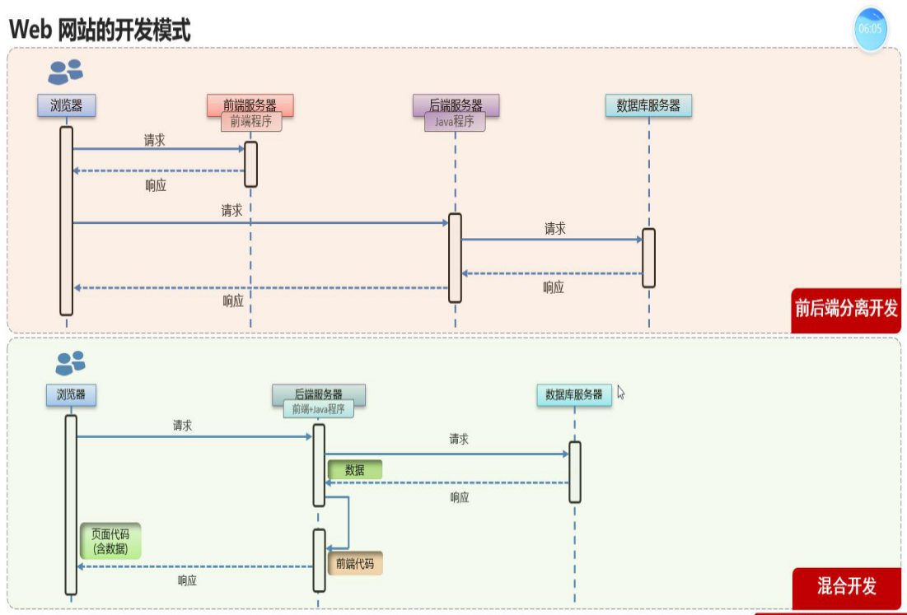

1994年10月，对web进行标准化

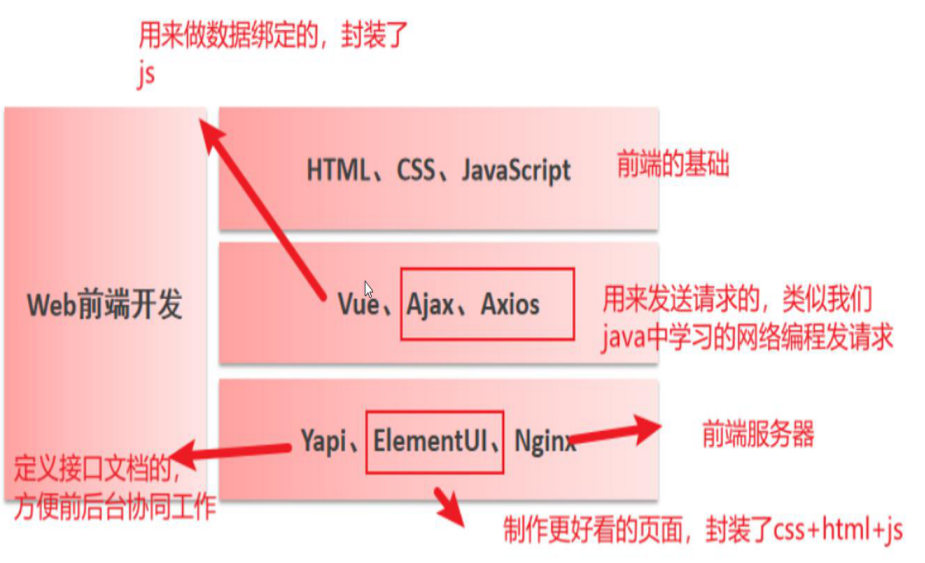

# HTML

html:超文本标记语言

## 标签

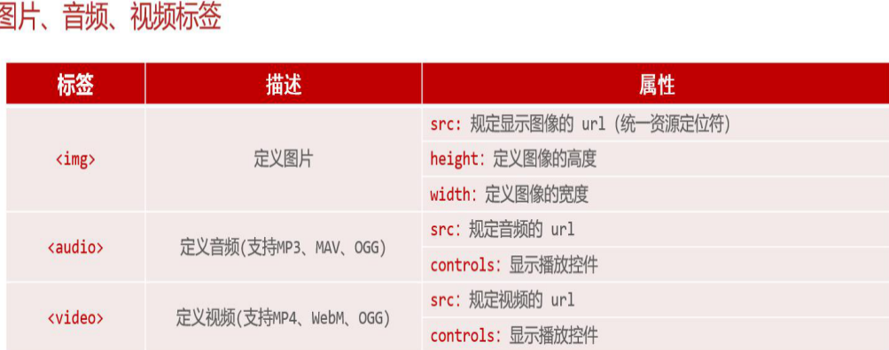

```html

```

alt：图片找不到显示什么

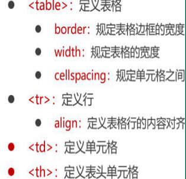

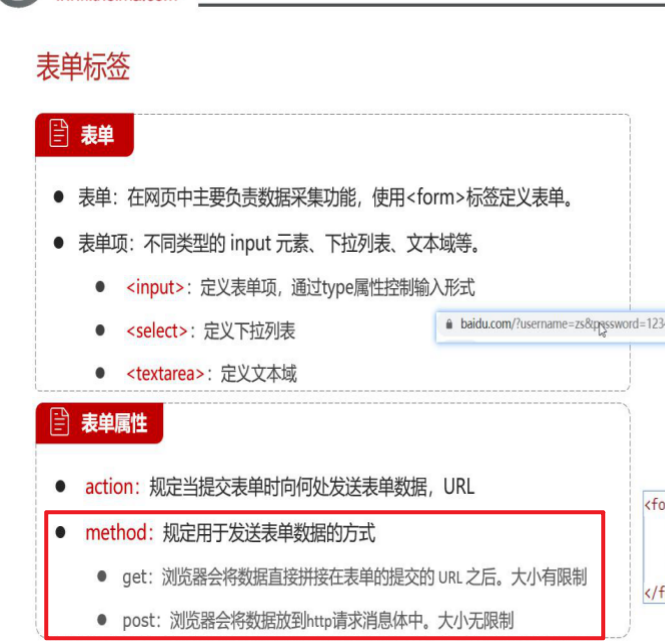

# css

元素选择器 类选择器 id选择器

# JavaScript

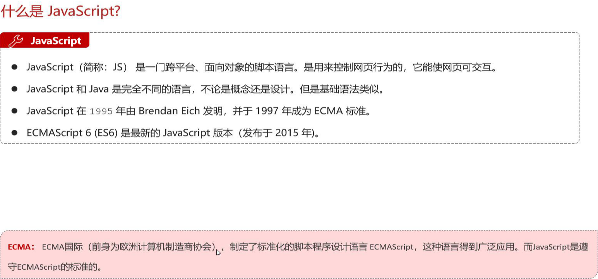

## js引入方式

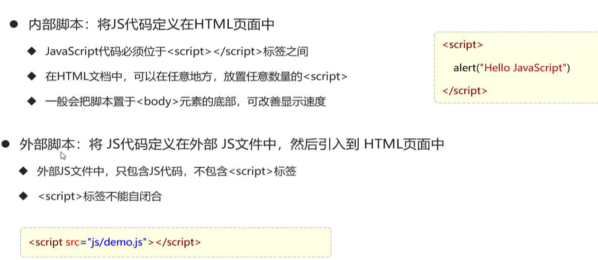

## js基本语法

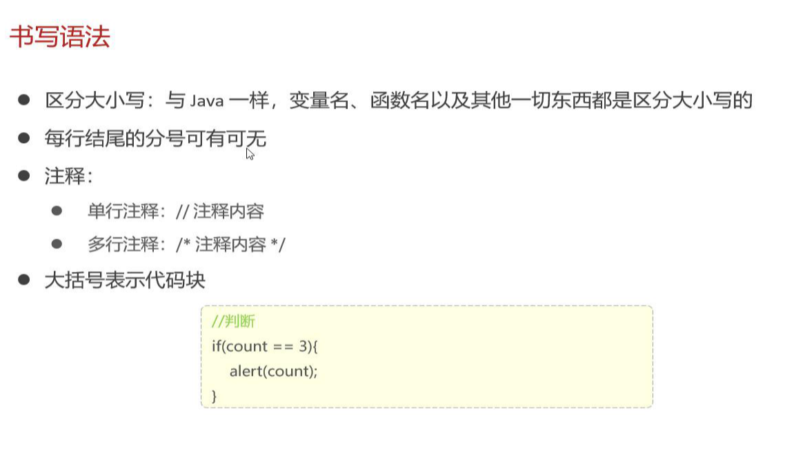

变量

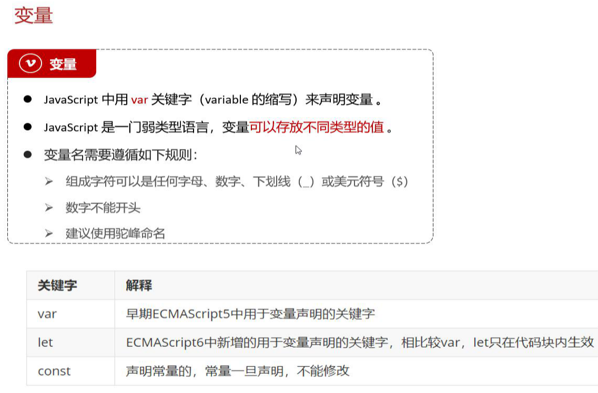

数据类型（原始类型和引用类型）

==比较 true自动编译成1

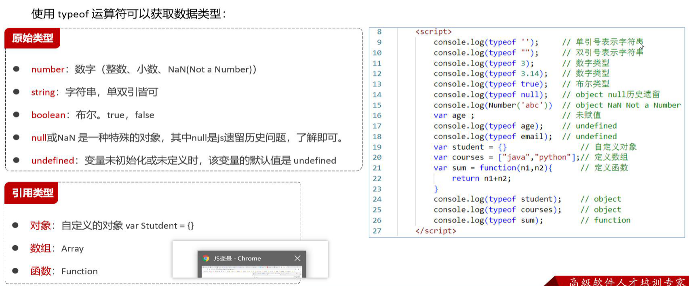

运算符

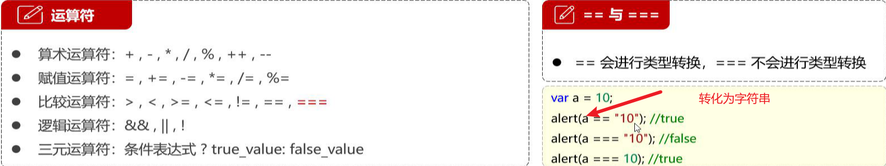

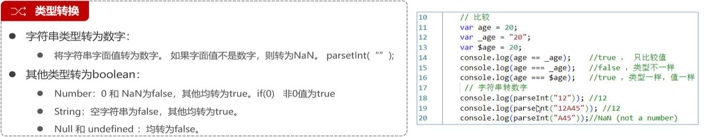

Number("112")//112

流程控制语句-与java语法基本一致

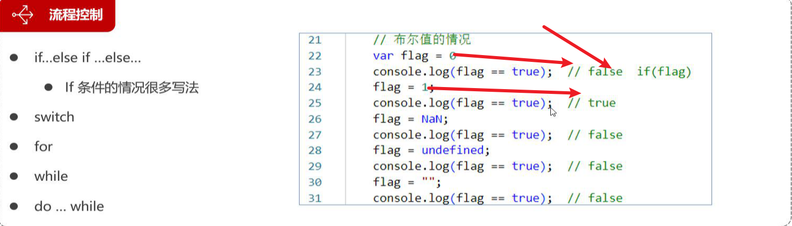

## js函数

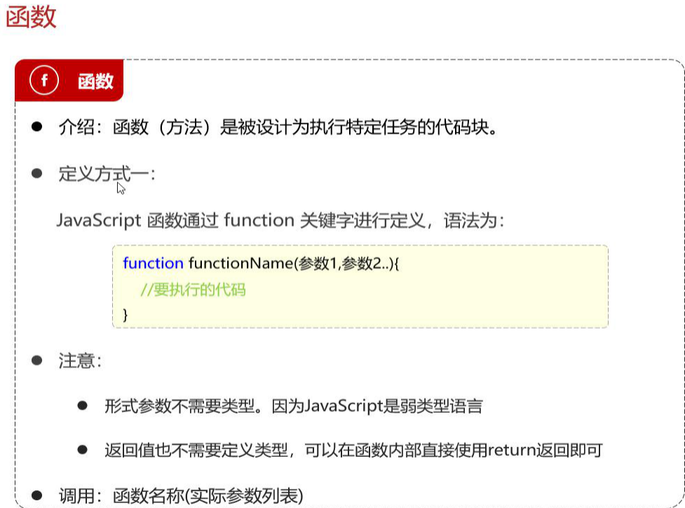

## js对象


## js监听器