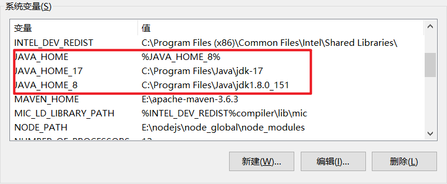
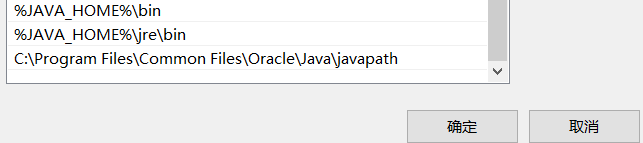
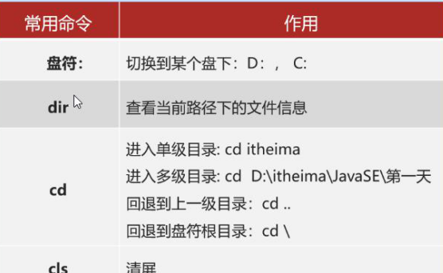
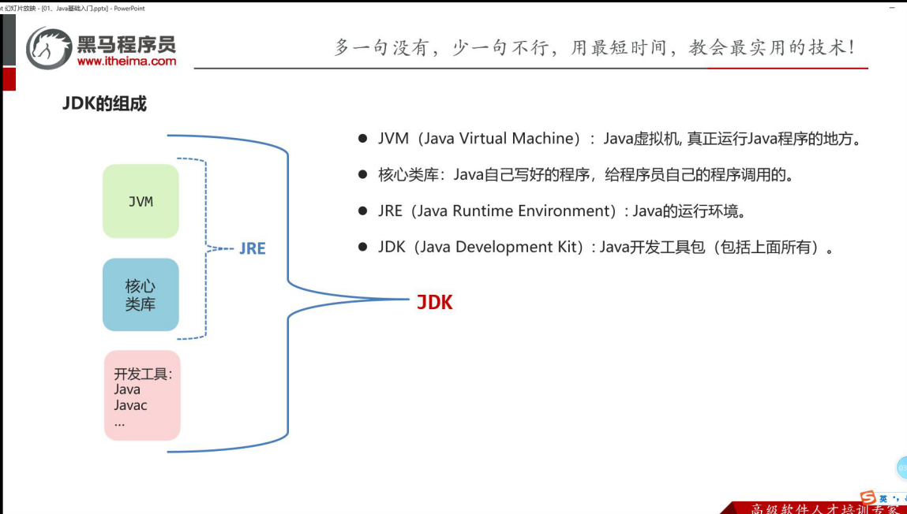
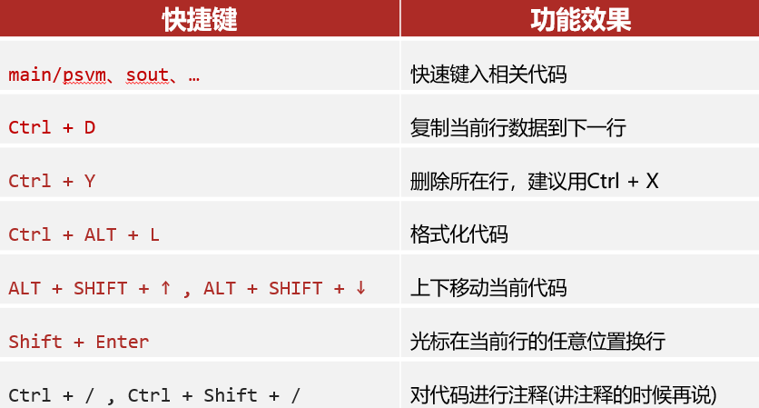
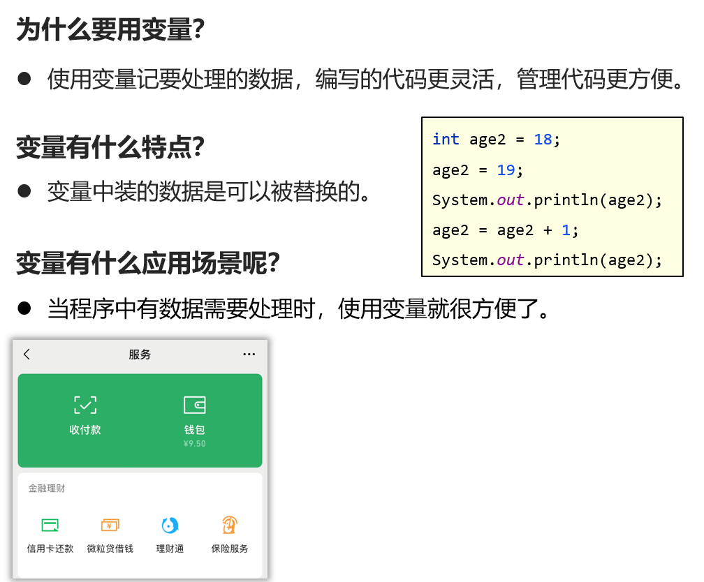
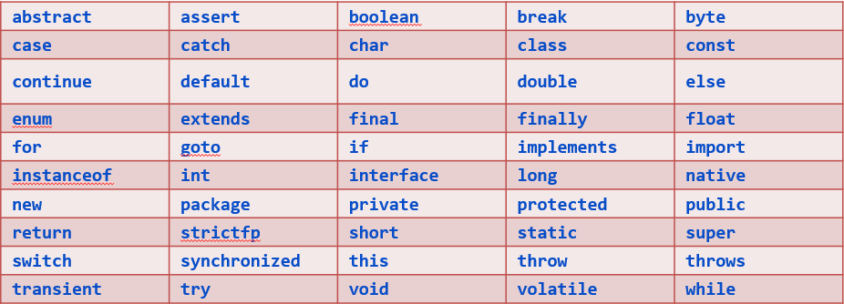
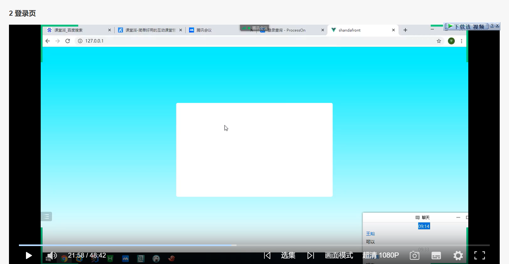

#### 一、电脑安装两个版本jdk

​	https://blog.csdn.net/ming2060/article/details/127656897

#### 二、java背景

1995年 高级语言 sun公司（斯坦福大学）  

变更公司Orcale公司 2009年  java之父 詹姆斯.高斯林

#### 三、环境安装

java中jdk开发者工具包，平台；下载**lts**稳定版本

##### 	**1、电脑环境**

​	在Path中配置：%JAVA_HOME%\bin  %JAVA_HOME%\jre\bin

##### 	2、检测运行

​	java运行  javac编译命令

##### 	3、cmd命令

​		

#### 四、程序编写

##### 	1、过程

编写源文件.java ，javac编译成字节码文件.class， 运行程序

**快捷方式**：选中当前目录输入cmd，javac HelloWorld.javac， java HelloWorld运行并显示结果；**jdk11可以java HelloWorld.java运行**

##### 	2、jdk组成

面试题：jdk和jre区别

**JVM是Java的虚拟机,JRE是Java的运行时环境,JDK是Java的开发环境,其中JRE中包含JVM和核心类库,JDK中包含JRE和开发工具。**

跨平台：安装不同的jvm虚拟机

#### 五、IDEA软件安装

U：企业版 ；C：社区版

##### 	1、创建项目

创建空工程-->创建模块-->创建包-->新建文件

##### 	2、快捷键

#### 六、变量字面量

##### 	1、字面量

整数、小数sout直接写

字符 单引号‘ ’ ，（其中字符中必须有数据）

字符串 “ ”（字符串可以不输入数据）

布尔型 false true

空值 null

**\n、\t特殊值**

##### 	2、变量

###### 		a、定义格式

​			数据类型 变量名 = 数据

###### 		b、变量区域

​			变量即在内存一块区域，在jvm的java虚拟机栈中，

###### 		c、变量注意事项

​	（1）变量必须先声明才能使用

​	（2）变量与数据类型一致

​	（3）变量生命周期{}之内且不可重名

​	（4）变量可以先声明，使用之前必须赋值

#### 七、关键字、标识符

##### 	1、标识符

**基本组成**：由数字、字母、下划线(_)和美元符($)等组成

**强制要求**：不能以数字开头、不能用关键字做为名字、且是区分大小写的。

**变量名称**：满足标识符规则，同时建议用英文、有意义、首字母小写，满足“驼峰模式”，例如：int studyNumber = 59;

**类名称**： 满足标识符规则，建议全英文、有意义、首字母大写，满足“驼峰模式”，例如： HelloWorld, Student

