##### 一、常用String、ArrayList

数组长度不变，集合长度可变；

#### 二、包

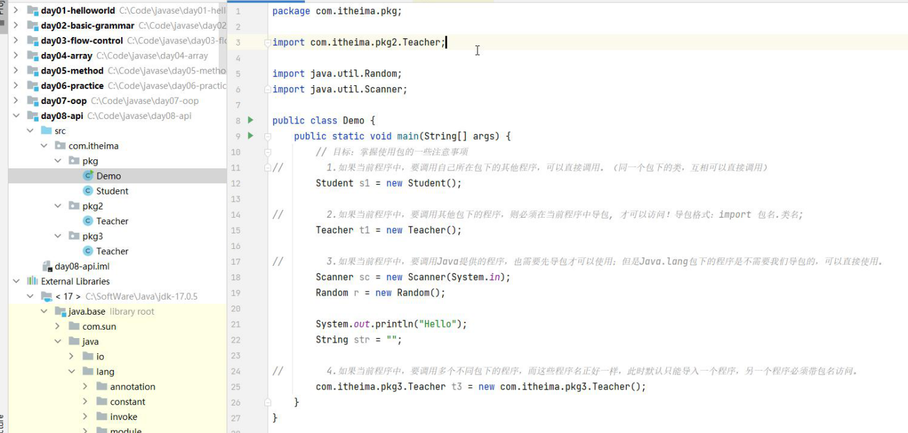

java.lang不需要导包，自动支持

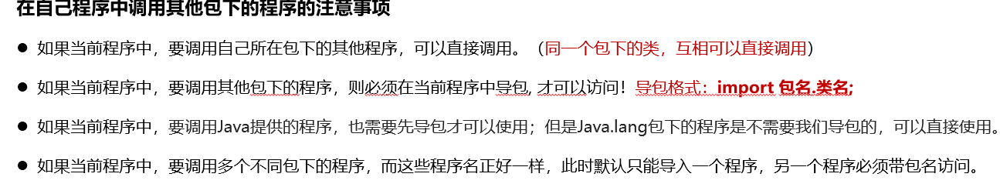

自动导包配置

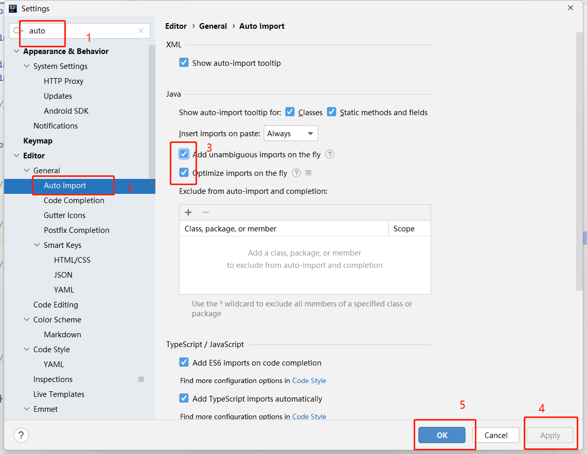

#### 三、String

##### 		1、string创建对象封装字符串数据的方式

​		（1）直接用英文双引号获取一个对象，封装字符串数据

```java
String a = "shiziz";
```

​		（2）使用构造器

```java
String a = new String();
sout(a);//空白字符串对象
String b = null;//null
//变量调用时之前必须赋值
String c = "";//空白字符串
//字符数组
 // public String(char[] chs)	根据字符数组的内容，来创建字符串对象
        char[] chs = {'a', 'b', 'c'};
        String str6 = new String(chs);
        System.out.println(str6);   // abc

        // public String(byte[] chs)	根据字节数组的内容，来创建字符串对象
        byte[] bytes = {65, 66, 67};
        String str7 = new String(bytes);
        System.out.println(str7);   // ABC


```

##### 	2、比较方法

​		（1）equals比较内容引用数据类型

​		（2）equalsIgnoreCase()忽略大小写比较

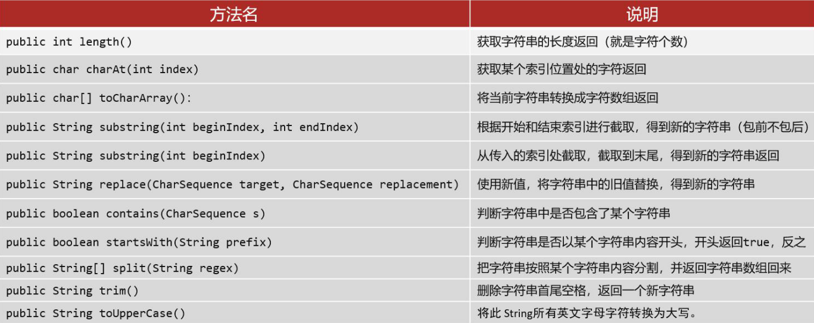

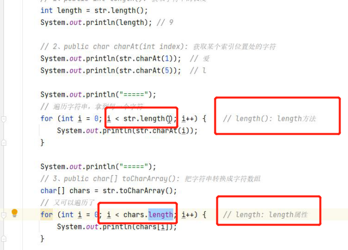

```java
package com.itheima.string;

public class Demo3 {
    public static void main(String[] args) {
        // 目标：快速熟悉String类为我们提供的常用方法
        String str = "我爱你中国love";
        // 1、public int length(): 获取字符串的长度
        int length = str.length();
        System.out.println(length); // 9

        // 2、public char charAt(int index): 获取某个索引位置处的字符
        System.out.println(str.charAt(1));  // 爱
        System.out.println(str.charAt(5));  // l

        System.out.println("=====");
        // 遍历字符串，拿到每一个字符
        for (int i = 0; i < str.length(); i++) {    // length(): length方法
            System.out.println(str.charAt(i));
        }

        System.out.println("=====");
        // 3、public char[] toCharArray(): 把字符串转换成字符数组
        char[] chars = str.toCharArray();
        // 又可以遍历了
        for (int i = 0; i < chars.length; i++) {    // length: length属性
            System.out.println(chars[i]);
        }

        // 4、public String substring(int beginIndex, int endIndex) ：截取内容，(包前不包后的)
        System.out.println(str.substring(0, 3));    // 我爱你
        System.out.println(str.substring(3, 5));    // 中国

        // 5、public String substring(int beginIndex):从当前索引一直截取到末尾
        System.out.println(str.substring(5));   // love

        // 6、public String replace(CharSequence target, CharSequence replacement)：使用新值，将字符串中的旧值替换，得到新的字符串
        String str1 = "垃圾电影，这个电影真垃圾，太垃圾了";
        String str2 = str1.replace("垃圾", "***");
        System.out.println(str2);  // ***电影，这个电影真***，太***了
        System.out.println(str1);   // 垃圾电影，这个电影真垃圾，太垃圾了

        // 7、public boolean contains(CharSequence s)：判断字符串中是否包含了某个字符串
        System.out.println(str1.contains("垃圾"));    // true
        System.out.println(str2.contains("垃圾"));    // false

        // 8、public boolean startsWith(String prefix)：判断字符串是否以某个字符串内容开头
        System.out.println(str1.startsWith("垃圾"));  // true
        System.out.println(str2.startsWith("垃圾"));  // false

        System.out.println(str1.startsWith("垃圾电影，这个电影真垃圾，太垃圾了"));   // true

        // 9、public String[] split(String s): 按照某个内容把字符串分割成字符串数组返回
        String str3 = "Angelababy,蔡徐坤,九组丁真,张歆艺";
        String[] names = str3.split(",");
        for (int i = 0; i < names.length; i++) {
            System.out.println(names[i]);
        }

        // 10、public String trim()：删除字符串首尾空格，返回一个新字符串
        String str4 = "   我爱你  中国  love   ";
        System.out.println(str4.trim());    // 我爱你  中国  love
        System.out.println(str4.replace(" ", ""));  // 我爱你中国love
        System.out.println(str4);   //    我爱你  中国  love

        // 11、public String toUpperCase()：将此 String所有字符转换为大写
        String str5 = "aB2cTgy";
        System.out.println(str5.toUpperCase()); // AB2CTGY
        System.out.println(str5.toLowerCase()); // ab2ctgy

        System.out.println(str5.isEmpty()); // false
    }
}

```


#### 四、执行原理

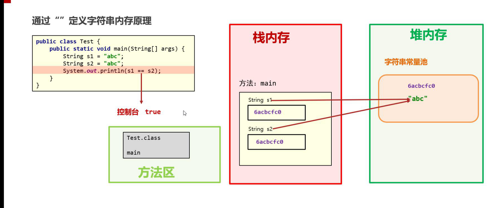

==**“ ”string产生对象存在方法区字符串常量池中**==

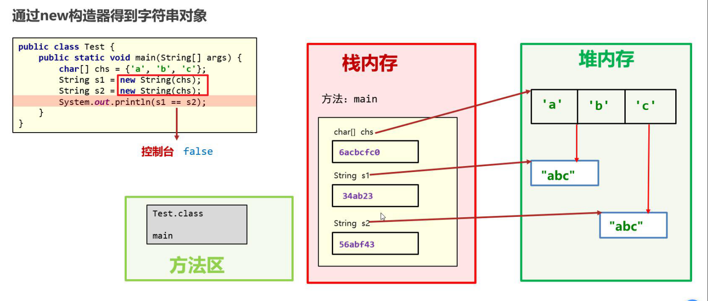

（2）String不可变性

string类的对象创建出来不可改变，以下代码变换的是内存地址值name

==只要经过运输算的字符串对象都会在内存中存储==

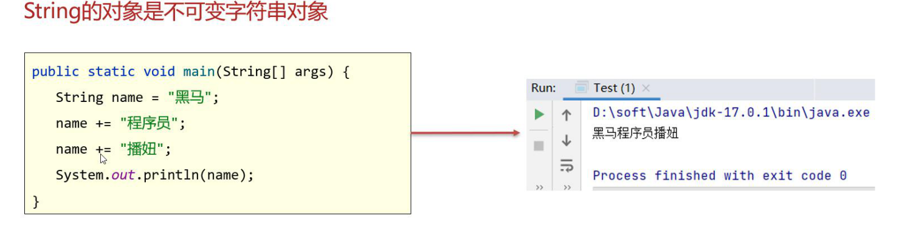

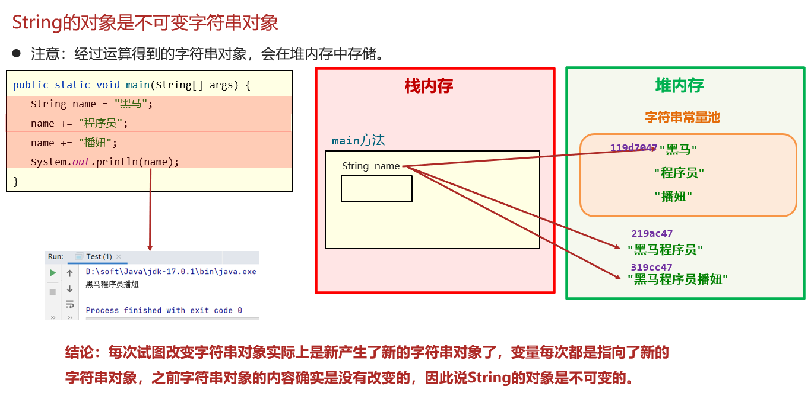

#### 五、面试题

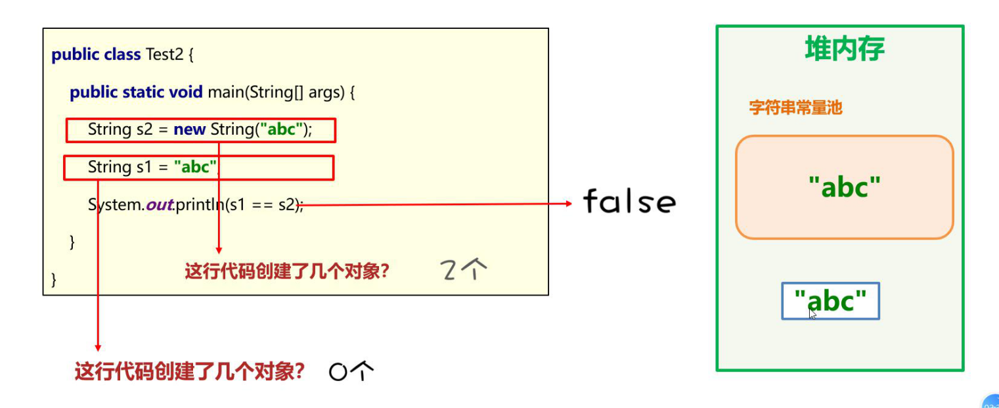

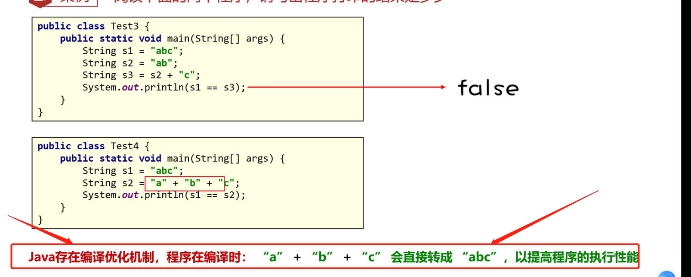

```java
String a = "abc";
String a = "a" + "b" + "c";//存在编译优化机制，预编译，确定值（变量的时候就不会）
```

#### 八、集合

集合大小可变

##### 	1、ArrayList集合的对象创建

```java
List<> list = new ArrayList<>();
```

```java
1、集合是什么？

l**集合与数组类似，也是一种容器，可以用来存储数据**

2、数组和集合的元素存储数据的类型和个数有什么特点?

l**数组定义后类型确定，长度固定**

l**集合类型可以不固定，大小是可变的**

3、数组和集合适合的场景 ？

l**数组适合做数据个数和类型确定的场景**

l**集合适合做数据个数不确定，且要做增删元素的场景**  
```


#####   2、泛型

泛型为引用类型，不支持基本类型

#####  3、常用API和遍历

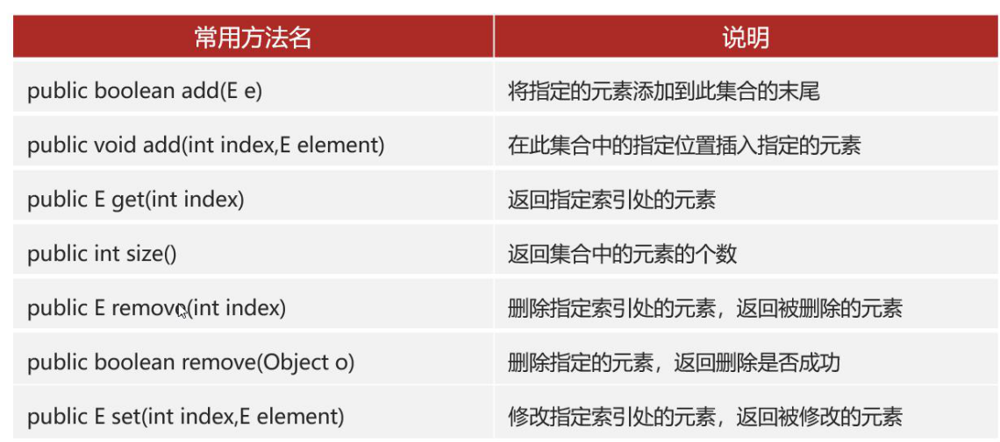
