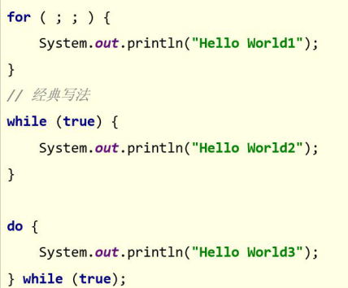
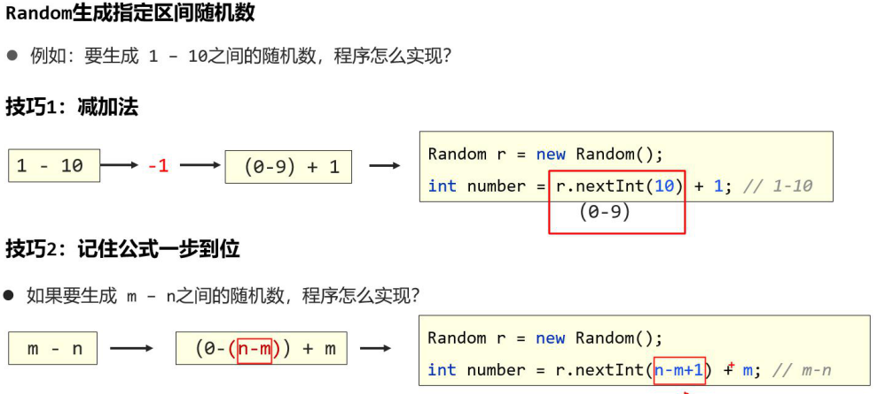
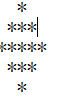

#### 一、if语句

##### 	1、格式

```java
if(条件表达式){

​	语句体；

}
```

```java
if(条件表达式){

​	语句体；

}else{

​	语句体2；

}
```

```java
if(条件表达式){

	语句体；

}else if(条件表达式2){

	语句体2；

}else{

​	语句体3;

}
```

#### 二、swith语句

##### 	1、格式

```java
switch(条件表达式){
    case 值1 : 语句1;break;
    case 值2 : 语句2;break;
    default : 语句最后;
}
```

​	2、注意事项

==①表达式类型只能是byte、short、int、char，JDK5开始支持枚举，JDK7开始支持String、**不支持double、float、long。**==

==②case给出的值不允许重复，且只能是字面量，不能是变量。==

==③正常使用switch的时候，不要忘记写break，否则会出现穿透现象。==

**ps:** double和float等精度问题用BigDecimal解决

#### 三、循环

#### 	1、for循环

##### 		1、1 格式

```java
for(初始化;条件表达式; 累加条件){
	循环体；
}
```

###### 		1、2 水仙花数	

```java
1、方法一
int count = 0;
for(int i = 100;i < 1000;i++){
    int a = i % 10;
    int b = i / 10 % 10;
    int c = i / 100 % 10;
    if(a * a * a + b * b * b + c * c * == i){
        System.out.println(i);
        count++;
    }
}
2、方法二
for(int i = 100; i < 1000; i++){
    int sum = 0;
    for(int j = i ;j != 0; j /= 10){
        int m = j % 10;
        sum += m * m * m;
    }
    if(sum == i){
         System.out.println(i);
    }
}
```


##### 2、while循环

```java
while(条件语句){
	循环体
}
```

##### 3、do while循环

```java
do{
	循环体;
}while(条件);
```

##### 4、死循环



#### 四、随机数

```java
Random r = new Random();
r.nextInt();
//只能生成0 ~ n-1之间的数

```

```java
方法一
//得到1~10之间的数字
//减加法（1,10）-1     (0,9)+1
r.nextInt() + 1;
//方法二
//m-n之间
//公式 (n-m+1) + m
```




