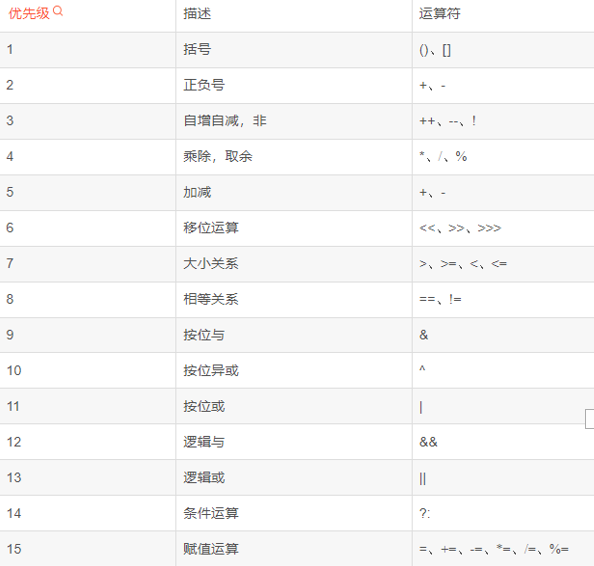

#### 一、进制

二进制：逢二进一；     0,1

十进制转二进制：初二取余

计算机中数据最小**单位**:字节，也是计算机中最组成**单元**


#### 二、ascii码

0 ：48

A: 65

a: 97

#### 三、八进制和十六进制


#### 四、类型转换

##### 	1、自动类型转换

类型范围小变量可直接赋值给类型范围大的变量


byte、char、short运行算自动转换为int类型

##### 	2、强制类型转换

###### 		2.1、表达格式

数据类型 变量名 = （数据类型）数据


###### 		2.2、 类型转规则

溢出出现后边负数 取反加1 保留符号位；


大数据类型强转转换为小数类型**向下取整**，**直接去除小数部分**


#### 五、运算符

##### 	1、算术运算符

"+"符号与字符串运算用作连接符

两个整数相除依旧是整数

##### 	2、自增自减运算符

10 + 12 - 4 - 5 +1 +12

11  5

##### 	3、赋值运算符

赋值运算符‘"=";

扩展赋值运算符"+=、-=、%=、+=、/="

扩展的赋值运算符自带**强制类型转换**

##### 	4、关系型运算符


##### 	5、逻辑运算符

短路与&&  短路或||；


***==补充==*：** **<< 左移 乘以2**

**》》右移位 除以2**

**无符号右移>>>忽略符号位，空位补0**

##### 	6、三元运算符

###### 		1、格式

条件表达式 ？ 值1 ：值2

###### 		2、升级

```java
int a = 10;
int b = 11;
int c = 12;
int max = a > b ? a > c ? a : c : b > c ? b : c 
```

##### 	7、运算符优先级

==优先级高的运算符会优先选择左右两边参与运算的表达式，并不是计算==



```java
int a = 10；
boolean a = (a > 3 || ++a > 3 && a < 3)
//a=10 true;
```

##### 	8、键盘打印

API：应用程序接口

a:9 b:8 c:7 d：6

1000 0000

1111 1101

1 000 0010

1111 11 01

​				1

1111 1110

#### 六、Java基本类型

**基本类型**

byte	8位整数bit	1字节byte  -2 ^ 7 ~ 2^7 - 1

short  16位整数	    2字节		-2 ^ 15 ~ 2^15 -1

int	   32位整数		4字节		-2 ^ 31 ~ 2 ^ 31 -1

long	64位整数		8字节		-2 ^ 63 ~ 2 ^ 63 -1

float	32位浮点数	4字节	 1位正负号 8位指数 23位尾数	约等于 3.40E38

double	64位浮点数	8字节	 1位正负号 11位指数 52位尾数 约等于1.79E308	

boolean	1字节	0 false 非0 true

char		2字节	1个字符   单引号包裹
