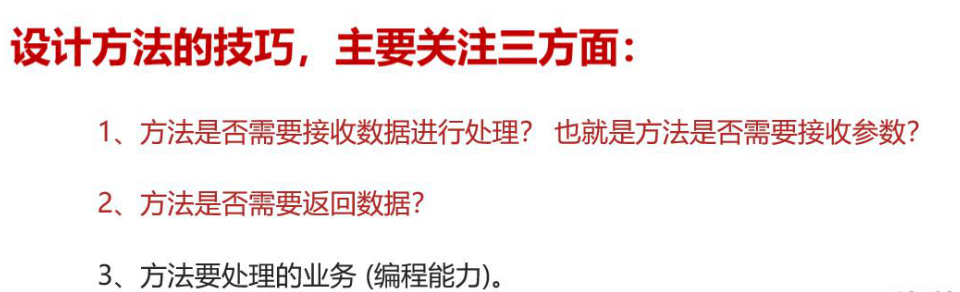
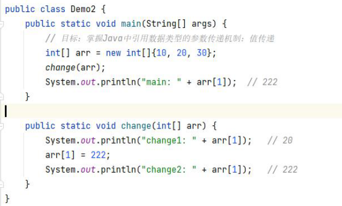

#### 一、定义

​	方法是一种语句结构，他可以吧一段代码封装成功，方便调用。

#### 二、格式

```java
访问修饰符 返回值类型 方法名（参数列表）{

		代码;

		return 返回值;

}
```

#### 三、返回值

返回值可以为void 或者其他数据类型



#### 四、执行执行原理

方法在占内存中运行，先进后出

##### 五、参数传递

##### 		1、基本类型

**java参数传递机制为值传递，**

值传递：传输实参给方法的形参时候，传输的是实参中存储的值是副本，==（**传输的是实参存储的值得副本**）==

实参：方法内部变量，

形参：以方法为例，方法定义时的变量

##### 		2、引用类型



**引用类型的时候传递参数的时候是地址；**

#### 六、方法调用

==有具体返回值的方法, 可以直接调用, 赋值调用以及输出调用
没有具体返回值的方法, 只能直接调用==

==方法没有返回值可以写return；，相当于程序执行，见到return结束==


#### 七、方法重载

一个类中多个方法名相同，形参列表不同；不考虑访问修饰符、返回值类型；

形参列表（参数类型、参数个数、顺序不同），不关心参数名称。

方法查分ctrl+alt+m提取