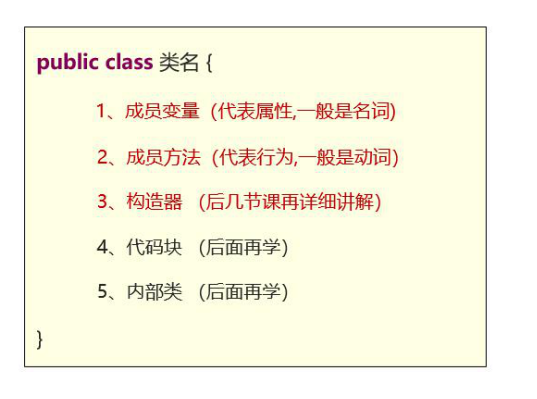
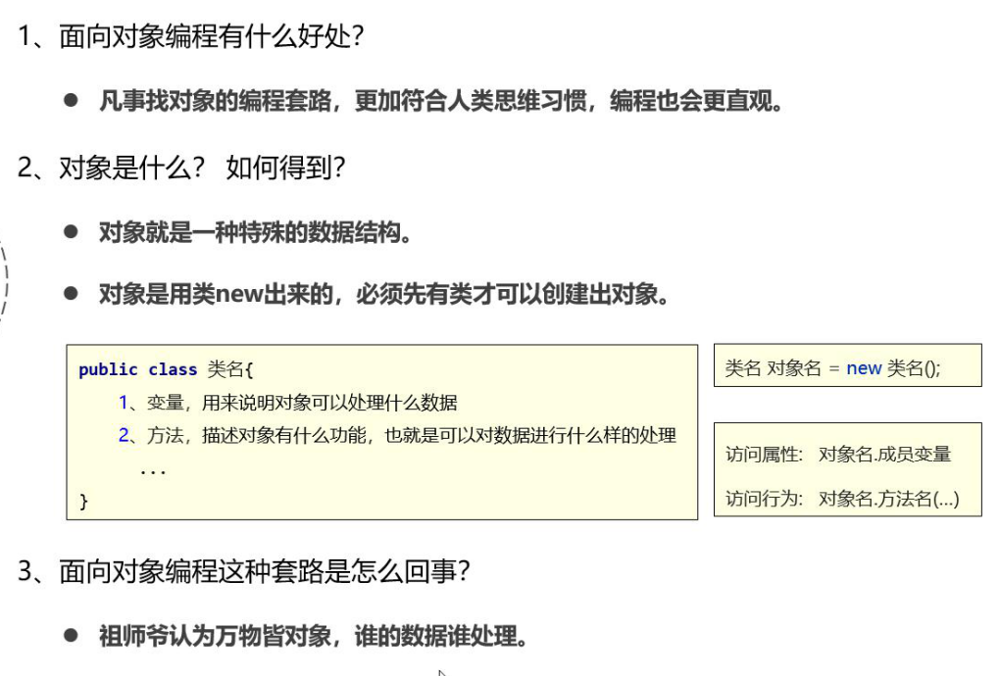
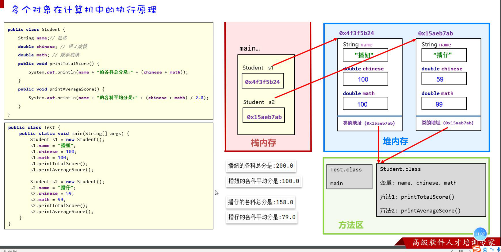
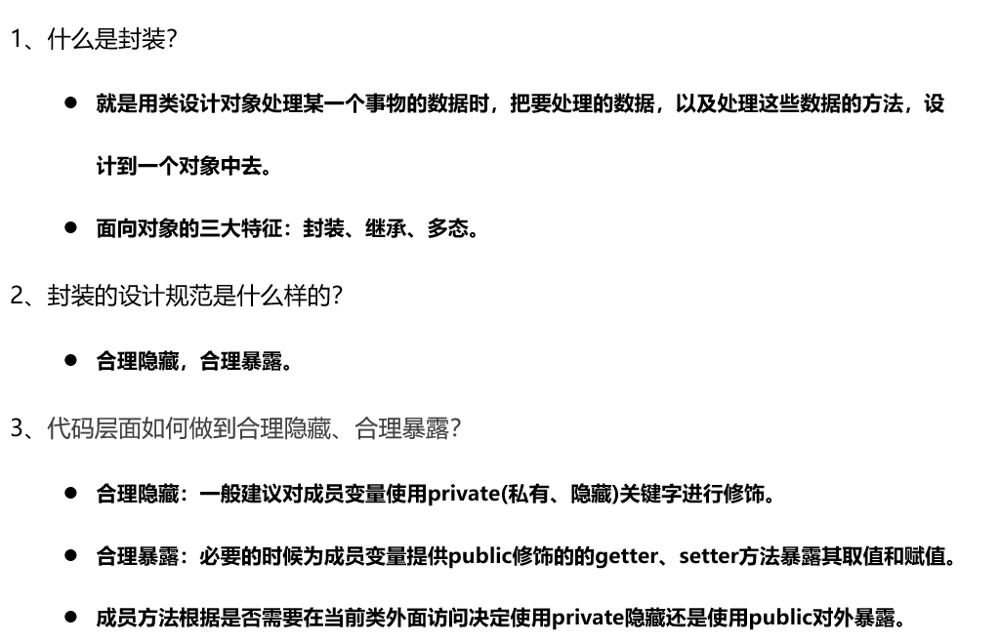
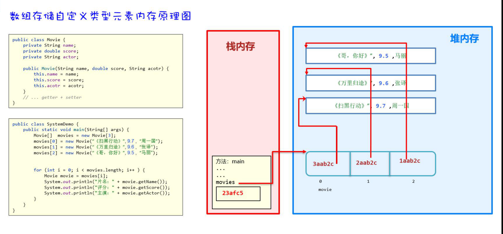
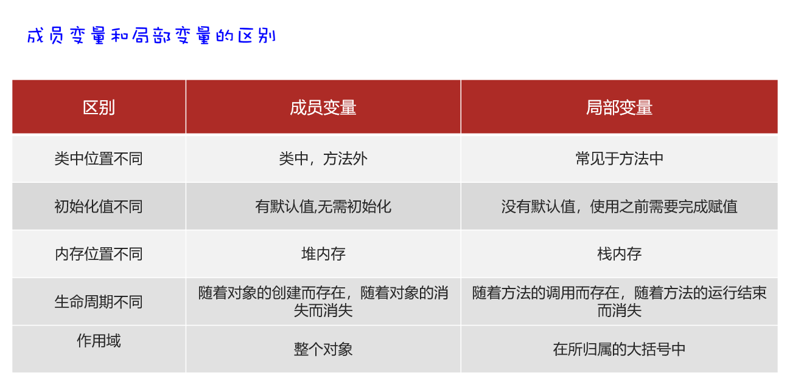

[TOC]


#### 一、类内容





#### 二、类的执行原理



数组也是引用类型对象

```java
Student s = new Student();
```

==（1）程序计数器在收到new得到执行时，先去方法区加载类所需的字节码文件，==

==（2）在堆内存开辟内存空间，加载变量；堆内存类方法引用的是方法区类的地址。==

#### 三、垃圾

自动垃圾回收机制，定期到堆内存中清理没有被引用的对象

#### 四、this用法

this就是一个变量，用在方法得到对象，当前是谁到用谁，

#### 五、构造器

1、初始化一个类的对象，并返回对象的地址。

格式：

```java
public 类名 (){
		
}
public 类名 (参数类型 参数名){
    this.属性名 = 参数名;
		
}
```

2、有参构造

有参构造定义之后，无参构造自动删除，如要使用需重新定义。

有参构造，无参构造定义是都不能声明返回值类型。

#### 六、封装

合理隐藏：将成员变量属性使用private修饰

合理隐藏：必要的时候提供了public修饰的get和set方法

```java
public int getAge(){
    return age;
}
public void setAge(){
    this.age = age;
}
```

封装：处理数据方法封装成对象，



实体类：成员变量必须私有，提供get set方法，更具需要有参无参构造，

#### 七、数组存储自定义类型元素原理



#### 八、成员变量和局部变量区别

