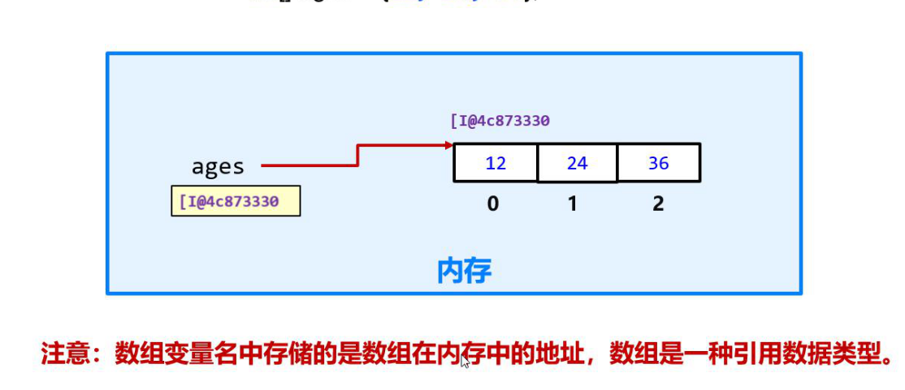
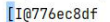
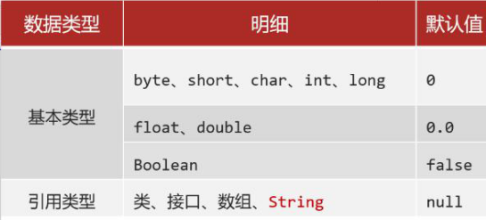
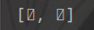
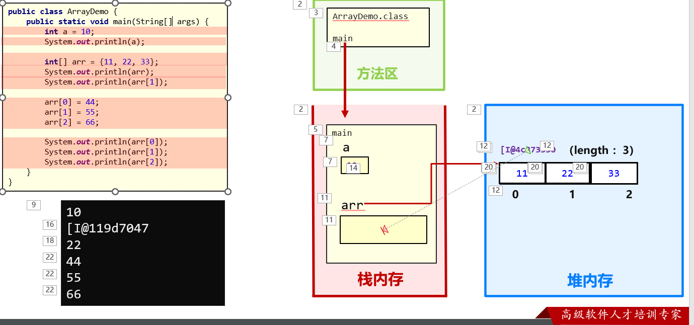
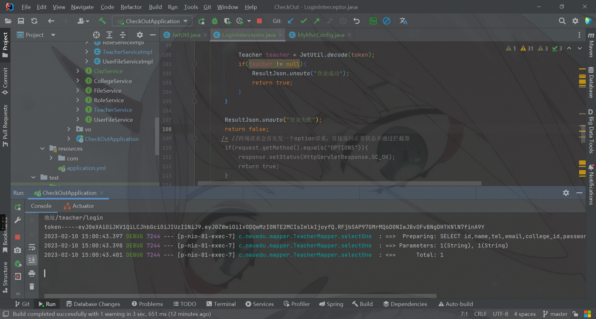

#### 一、数组定义

##### 	1.1 什么是数组

数组就是一个容器，用来存一批同宗类型的数据。

##### 	1.2 定义格式

静态初始化==数据类型[] 数组名 = new 数据类型[]{元素,元素}==

==数据类型[] 数据名 = {元素，元素....}==

动态初始化：数据类型[] 数组名 = new int[长度]

ps：数据类型 数组名[] = {元素，元素...}，c语言风格

​		数组==类型==应和里边元素内容一致，

​		数组定义完成，类型确定，长度固定，不可变

​		数组中既可以存储基本数据类型，也可存储 

##### 	1.3基本原理存储



**其实就是数组变量名为内存地址**，内存中连续存放。



$$
I是整型，@为位置，后边数据为地址
$$


##### 	1.4 数组访问

- 访问格式：数组名[索引]
- 数组元素个数：数组名.length
- 数组最大索引：数组名.length - 1（数组中至少有一个元素）

##### 二、动态初始化

##### 	2.1 默认类型



```java
char[] a = new char[2];
System.out.println(Arrays.toString(a));
//输出结果为0对应对应数值图标	
```



#### 三、经典案例(冒泡与选择排序)

##### 	3.1冒泡排序

1~n个数，相邻两个数两两比较

 

```java
for(int i = 0;i < n - 1;i++){
	for(int j = 0 ; j < n - i - 1 ; j++){
        if(a[j] > a[j + 1]){
            int t = a[j];
            a[j] = a[j + i];
            a[j + 1] = t;
        }
    }
}
//性能优化
for(int i = 0;i < n - 1;i++){
    int flag = true;
	for(int j = 0 ; j < n - i - 1 ; j++){
        if(a[j] > a[j + 1]){
            int t = a[j];
            a[j] = a[j + i];
            a[j + 1] = t;
            flag = false;
        }
    }
    if(flag)break;
}
```

##### 	3.2 选择排序

1~n个数，第一个和每位比较

```java
for(int i = 0;i < n - 1;i++){
    for(int j = i + 1;j < n;j++){
        if(a[j] > a[i]){
            int t = a[j];
            a[j] = a[i];
            a[i] = t;
        }
    }
}
//性能优化
for(int i = 0;i < n - 1;i++){
    int k = i;
    for(int j = i + 1;j < n;j++){
        if(a[j] > a[k])
            k = j;
    }
     if(k != i){
        int t = a[k];
        a[k] = a[i];
        a[i] = t;
     }
}
```

#### 四、内存区域

方法区：字节码文件，常量

栈内存：方法执行，变量

堆内存：new出来的



==执行过程：==jvm将字节码文件.class加载到方法区，方法最开始也在方法区；程序在栈区中执行main方法，同时方法中的变量也存放在栈区中，如果方法中含数组，在栈中开辟一块内存空间，左边定义数组变量在栈中，变量值为数组堆内存地址；右边new出来数组存在堆内存中存放，拿出数组中原元素，根据地址和索引，获取其中的值。

##### 	4.1 多个数组变量指向同一个数组

```java
int[] a = {1,2,3,4,5};
int[] b = a;
System.out.println(b);//a所在地址
b[0] = 56;
System.out.println(a[0]);//a[0] = 56
```

##### 	4.2 数组变量名称变成null

```java
int[] a = {1,2,3,4,5};
int[] b = a;
System.out.println(b);//a所在地址
b[0] = 56;
System.out.println(a[0]);//a[0] = 56
b = null;
System.out.println(b);//b = null
System.out.println(b[0]);//报错，空指针
System.out.println(b.length);//空指针，NullPointerExeception
```

